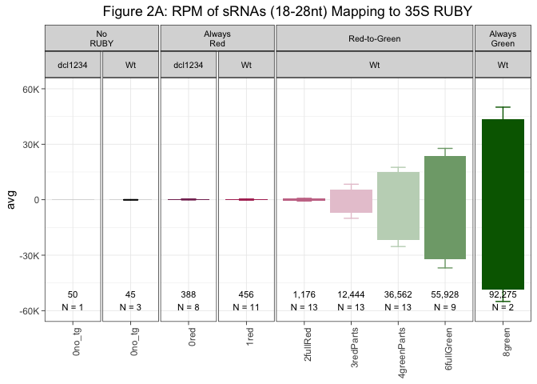
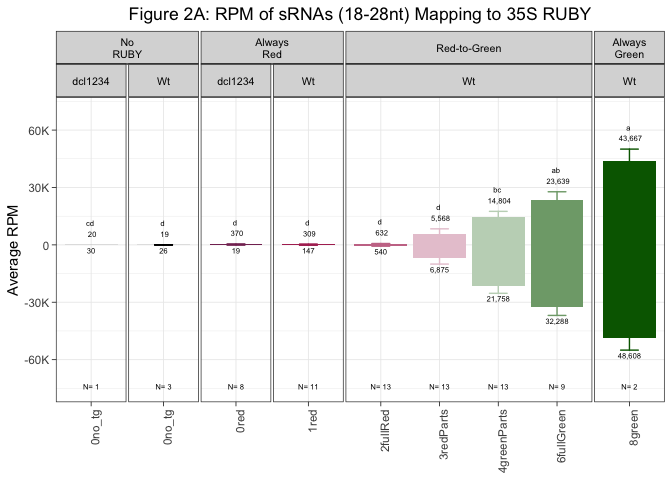
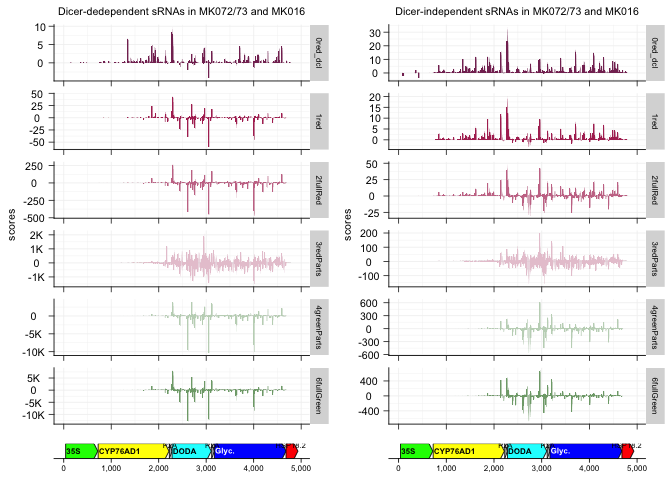
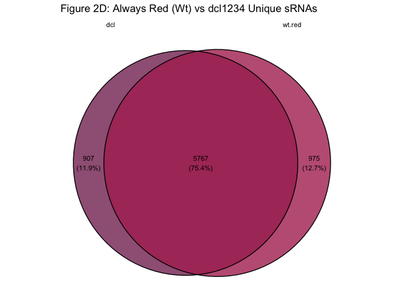
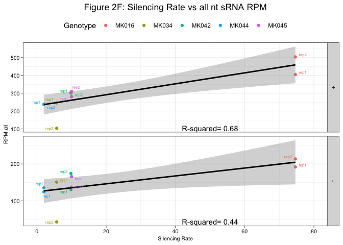
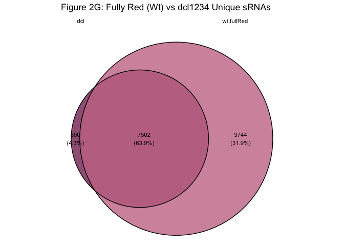
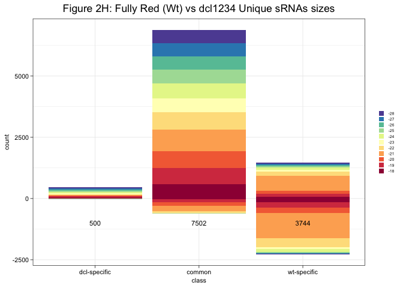

Figure_2
================

This is an [R Markdown](http://rmarkdown.rstudio.com) Notebook. When you
execute code within the notebook, the results appear beneath the code.

``` r
## Load relevant packages
library(tidyverse)
```

    ## ── Attaching core tidyverse packages ──────────────────────── tidyverse 2.0.0 ──
    ## ✔ dplyr     1.1.4     ✔ readr     2.1.5
    ## ✔ forcats   1.0.0     ✔ stringr   1.5.1
    ## ✔ ggplot2   3.5.1     ✔ tibble    3.2.1
    ## ✔ lubridate 1.9.3     ✔ tidyr     1.3.1
    ## ✔ purrr     1.0.2     
    ## ── Conflicts ────────────────────────────────────────── tidyverse_conflicts() ──
    ## ✖ dplyr::filter() masks stats::filter()
    ## ✖ dplyr::lag()    masks stats::lag()
    ## ℹ Use the conflicted package (<http://conflicted.r-lib.org/>) to force all conflicts to become errors

``` r
library(ggh4x)
```

    ## 
    ## Attaching package: 'ggh4x'
    ## 
    ## The following object is masked from 'package:ggplot2':
    ## 
    ##     guide_axis_logticks

``` r
library(scales)
```

    ## 
    ## Attaching package: 'scales'
    ## 
    ## The following object is masked from 'package:purrr':
    ## 
    ##     discard
    ## 
    ## The following object is masked from 'package:readr':
    ## 
    ##     col_factor

``` r
library(patchwork)
library(gggenes)
library(cowplot)
```

    ## 
    ## Attaching package: 'cowplot'
    ## 
    ## The following object is masked from 'package:patchwork':
    ## 
    ##     align_plots
    ## 
    ## The following object is masked from 'package:lubridate':
    ## 
    ##     stamp

``` r
library(ggVennDiagram)
```

    ## 
    ## Attaching package: 'ggVennDiagram'
    ## 
    ## The following object is masked from 'package:tidyr':
    ## 
    ##     unite

``` r
library("ggvenn")
```

    ## Loading required package: grid

``` r
library(eulerr)
options(bedtools.path = "/usr/local/bin")
library(bedtoolsr)
```

    ## Warning in fun(libname, pkgname): bedtoolsr was built with bedtools version 2.30.0 but you have version 2.31.1 installed. Function syntax may have changed and wrapper will not function correctly. To fix this, please install bedtools version 2.30.0 and either add it to your PATH or run:
    ## options(bedtools.path = \"[bedtools path]\")

``` r
library(ggpubr)
```

    ## 
    ## Attaching package: 'ggpubr'
    ## 
    ## The following object is masked from 'package:cowplot':
    ## 
    ##     get_legend

``` r
library(ggrepel)
```

    ## Warning: package 'ggrepel' was built under R version 4.3.3

``` r
## Figure 2A - total number of sRNAs
## Read in file containing the number of sRNAs of each size that map to RUBY in Wt
inWt <- read.table("/Users/mariannekramer/Google Drive/Kramer_et_al_AIO/Figures/ruby_srna/all_samples.ruby_round1_2.total_sRNA_counts.perSize.txt", col.names = c("count","target","size","strand", "sample","phenotype"), as.is = T)
## Read in number of reads per library for normalization for Wt samples
inNorm.R25 <- read.table("/Users/mariannekramer/Google Drive/Kramer_et_al_AIO/Figures/ruby_srna/number_mapped_reads.R25.txt", header=T, as.is = T)


## Read in file containing the number of sRNAs of each size that map to RUBY in dcl1234
indcl <- read.table("/Users/mariannekramer/Google Drive/Kramer_et_al_AIO/Figures/ruby_srna/all_samples.ruby_round5.total_sRNA_counts.perSize.txt",col.names=c("count","target","size","strand","sample","phenotype"))
## Read in number of reads per library for normalization for dcl1234 samples
inNorm.R26 <- read.table("/Users/mariannekramer/Google Drive/Slotkin_lab_projects/R26/number_mapped_reads.R26.txt",header=T)

## Create themes for plotting image preferences
themes <- theme(plot.title = element_text(hjust = 0.5),
                axis.text.x = element_text(angle = 90, vjust = 1, hjust=1),
                axis.title.x = element_blank(),
                line = element_line(color = 'black',linewidth=0.3,lineend="round"),
                axis.title.y = element_text(color = "black"),
                axis.title.y.right = element_text(color = "black"),
                strip.text.x = element_text(color = "black",size=8),
                legend.position = 'right')
## Modify normalizaiton df for merging downstream
inNorm.R25 <- inNorm.R25 %>% separate(Sample, into=c("Sample"),sep="[.]")
```

    ## Warning: Expected 1 pieces. Additional pieces discarded in 61 rows [8, 9, 10, 11, 12,
    ## 13, 14, 15, 16, 17, 18, 19, 20, 21, 22, 23, 24, 25, 26, 27, ...].

``` r
## Rename some samples, normalize by total number of reads, add genotypic background
inWt.mod <- inWt %>% mutate(sample=case_when(sample=="R1S02_MK017R_BR1"~"R1S02_MK017_BR1",
                                             sample=="R1S22_MK010R_BR1"~"R1S22_MK010_BR1",
                                             grepl("MK041A",sample) ~ str_replace(sample, "MK041A","MK041"),
                                             grepl("MK034R",sample) ~ str_replace(sample, "MK034R","MK034"), TRUE ~ sample)) %>% 
  left_join(inNorm.R25, by=c("sample"="Sample")) %>% 
  mutate(sample = str_replace(sample,"BR","rep"),
         background="Wt",phenotype = case_when(phenotype == "total_sRNA_counts"~ "0no_tg",TRUE ~ phenotype)) %>%
  mutate(sample = str_replace(sample,"R[0-9]S[0-9][0-9]_",""), phenotype = case_when(phenotype == "2reddish" ~ "1red",TRUE ~ phenotype))


## Modify normalizaiton df for merging downstream
inNorm.R26 <- inNorm.R26 %>% separate(Sample, into=c("Sample"),sep="[.]")
```

    ## Warning: Expected 1 pieces. Additional pieces discarded in 58 rows [1, 2, 3, 4, 5, 6, 7,
    ## 8, 9, 16, 17, 18, 19, 20, 21, 22, 23, 24, 25, 26, ...].

``` r
## Normalize by total number of reads, add genotypic background
indcl.mod <- indcl %>% left_join(inNorm.R26, by=c("sample"="Sample"))  %>% filter(!grepl("MK016",sample)) %>% 
  mutate(background = case_when(grepl("wt",sample) ~ "Wt",TRUE ~ "dcl1234"), 
         phenotype = case_when(phenotype == "perSize" ~ "0no_tg",TRUE ~ phenotype))

## Combine Wt and dcl1234 samples
inFile <- rbind(inWt.mod,indcl.mod)

## Average all replicates per phenotype for all sizes
toPlot.avgPheno <- inFile %>% mutate(RPM = (count/Num_Mapped_Reads)*1000000) %>%
  group_by(phenotype,background) %>% mutate(phenoTotal = sum(RPM))  %>%
  group_by(phenotype,size,strand,phenoTotal,background) %>%
  dplyr::summarize(RPM.mean = mean(RPM),N=n())   %>% 
  mutate(class = case_when(phenotype == "8green" ~ "Always Green", phenotype == "1red" ~ "Always Red", phenotype == "0no_tg" ~ "No RUBY", TRUE ~ "Red-to-Green"),
    phenotype = case_when(phenotype == "5fullRed" ~ "2fullRed",(background=="dcl1234" & phenotype == "1red") ~"0red",TRUE ~phenotype),
    RPM.mean = case_when(strand == "-" ~ RPM.mean * -1, TRUE ~ RPM.mean),
    size = size * -1) 
```

    ## `summarise()` has grouped output by 'phenotype', 'size', 'strand',
    ## 'phenoTotal'. You can override using the `.groups` argument.

``` r
## Average all replicates per phenotype for all sizes
toPlot.phenoSamples <- inFile %>% mutate(RPM = (count/Num_Mapped_Reads)*1000000) %>%
  group_by(phenotype,strand,background,sample) %>%
  dplyr::summarize(sampleTotal = sum(RPM))   %>% 
  mutate(class = case_when(phenotype == "8green" ~ "Always Green", phenotype == "1red" ~ "Always Red", phenotype == "0no_tg" ~ "No RUBY", TRUE ~ "Red-to-Green"),
    phenotype = case_when(phenotype == "5fullRed" ~ "2fullRed",(background=="dcl1234" & phenotype == "1red") ~"0red",TRUE ~phenotype),
    sampleTotal = case_when(strand == "-" ~ sampleTotal * -1, TRUE ~ sampleTotal)) 
```

    ## `summarise()` has grouped output by 'phenotype', 'strand', 'background'. You
    ## can override using the `.groups` argument.

``` r
## Summarize and calculate standard error of the mean for error bars
toPlot.avgPheno2<- toPlot.phenoSamples %>% group_by(phenotype,strand,background,class) %>%
  dplyr::summarize(avg = mean(sampleTotal),sem = sd(sampleTotal)/sqrt(n()), N=n())
```

    ## `summarise()` has grouped output by 'phenotype', 'strand', 'background'. You
    ## can override using the `.groups` argument.

``` r
## Create new df with sums of reads and Bio Reps to label plot
toLabel <- toPlot.avgPheno %>% mutate(RPM.mean = case_when(strand == "-" ~ RPM.mean * -1, TRUE ~ RPM.mean)) %>%
  group_by(phenotype,background)  %>% dplyr::summarize(total = sum(RPM.mean),N=max(N),class=class) %>% distinct()
```

    ## Warning: Returning more (or less) than 1 row per `summarise()` group was deprecated in
    ## dplyr 1.1.0.
    ## ℹ Please use `reframe()` instead.
    ## ℹ When switching from `summarise()` to `reframe()`, remember that `reframe()`
    ##   always returns an ungrouped data frame and adjust accordingly.
    ## Call `lifecycle::last_lifecycle_warnings()` to see where this warning was
    ## generated.

    ## `summarise()` has grouped output by 'phenotype', 'background'. You can override
    ## using the `.groups` argument.

``` r
## plot
ggplot(toPlot.avgPheno2, aes(x=phenotype,y=avg)) + 
  geom_bar(stat='identity',aes(fill=phenotype),color=NA) +
  facet_nested(~factor(class,levels=c("No RUBY","Always Red","Red-to-Green","Always Green"))+background,scales="free_x",space='free',labeller=label_wrap_gen(width = 5, multi_line = TRUE)) +
  geom_errorbar(aes(ymin=avg-sem,ymax=avg+sem,color=phenotype), width=0.3,lineend="round")+
  theme_bw()+ themes+ 
  scale_fill_manual(values=c("black", "#853061","#B03060","#C97795","#E8C8D4","#C2D5C0","#7FA779","#006400"))+
  scale_color_manual(values=c("black", "#853061","#B03060","#C97795","#E8C8D4","#C2D5C0","#7FA779","#006400"))+
  scale_y_continuous(limits=c(-60000,60000),labels=scales::label_number(scale_cut = cut_short_scale()))+ 
  ggtitle("Figure 2A: RPM of sRNAs (18-28nt) Mapping to 35S RUBY") + 
  geom_text(data=toLabel,y=-65000,aes(x=phenotype,label = paste(prettyNum(round(total,0),big.mark=",",scientific=F),"\nN = ",N,sep="")),size=3,vjust=-0.5)+
  theme(panel.spacing = unit(0.1,"lines"),legend.position="none" )
```

<!-- -->

``` r
## Figure 2B - percent of sRNAs in each size
## Calculate the percentage of sRNAs in each sample that are eachsize
toPlot.avgPheno.pct <- inFile %>% filter(grepl("MK",sample)) %>% mutate(RPM = (count/Num_Mapped_Reads)*1000000) %>%
  group_by(phenotype,background) %>% dplyr::mutate(phenoTotal = sum(RPM))  %>%
  group_by(phenotype,size,background,strand,phenoTotal) %>%
  dplyr::summarize(sizeSum = sum(RPM),N=n())   %>% 
  mutate(pct = sizeSum/phenoTotal*100) %>%
  mutate(class = case_when(phenotype == "8green" ~ "Always Green", phenotype == "1red" ~ "Always Red", TRUE ~ "Red-to-Green"),
         phenotype = case_when(phenotype == "5fullRed" ~ "2fullRed",background=="dcl1234" ~"0red",TRUE ~phenotype),
         pct = case_when(strand == "-" ~ pct * -1, TRUE ~ pct),
         size = size * -1) 
```

    ## `summarise()` has grouped output by 'phenotype', 'size', 'background',
    ## 'strand'. You can override using the `.groups` argument.

``` r
## Plot
ggplot(toPlot.avgPheno.pct, aes(x=phenotype,y=pct)) + geom_bar(stat='identity',aes(fill=factor(size)),color=NA) +
  facet_nested(~factor(class,levels=c("Always Red","Red-to-Green","Always Green"))+background,scales="free_x",space='free',labeller=label_wrap_gen(width = 5, multi_line = TRUE)) +
  theme_bw()+ themes+ scale_y_continuous(limits=c(-100,100))+
  ggtitle("Figure 2B: RPM of sRNAs (18-28nt) Mapping to 35S RUBY") + 
  scale_fill_brewer(palette="Spectral",direction=-1)+
  theme(panel.spacing = unit(0.1,"lines") )
```

<!-- -->

``` r
## Figure 2C - sRNA coverage plots
## Read in file containing information about the transgene coordinates for the gene model
infoFile <- "/Users/mariannekramer/Google Drive/Kramer_et_al_AIO/Figures/ruby_coverage_plots/35S_RUBY_transgene.bed"
geneInfo <-read.table(infoFile,col.names = c("molecule","Start","End","Name","Type","strand"))
target <- "35S_RUBY_transgene"

## Create df with appropriate information for plotting the transgene model
t<- geneInfo %>% rowwise() %>% transmute(molecule,Name,Type,Start=Start +1,End=End+1,Strand =ifelse(strand=="+","forward","reverse"),length=End-Start+1,orientation=ifelse(strand=="+",1, -1)) %>%filter(Name != "RB") %>% mutate(Name = case_when(Name == "CaMV_35S_promoter" ~ "35S",Name == "HSP18.2_terminator" ~ "HSP18.2",Name == "Glucosyltransferase" ~ "Glyc.",TRUE~Name))

## Plot the transgene model
tg <- ggplot(t,aes(xmin = Start, xmax = End, y = molecule,forward=orientation,label=Name)) +
  geom_gene_arrow(arrow_body_height = grid::unit(4, "mm"),arrowhead_height = unit(4, "mm"), arrowhead_width = unit(1, "mm"),
                  fill = dplyr::case_when(t$Type=="terminator"~ "red",t$Type=="promoter"~ "green",
                                          t$Name=="P2A"~ "gray",t$Name=="CYP76AD1"~ "yellow",
                                          t$Name=="DODA"~ "cyan1",t$Name=="Glyc."~ "blue",
                                          TRUE ~ "white"),color = "black") + 
  xlab("Relative position along transgene")+  
  geom_gene_label(fontface="bold", padding.y = grid::unit(0.01,"mm"), padding.x = grid::unit(0.2,"mm"),
                  align = "left",color=c("black","black","black","black","black","white","black"),grow=F,size=6)+
  theme(axis.ticks.y=element_blank(), axis.text.y= element_blank(),
        axis.text.x= element_text(color = 'black',size = 6),
        axis.title.y= element_blank(),axis.line.x=element_line(color = 'black',linewidth=0.3,lineend="round"),
        panel.background = element_blank(),axis.title.x=element_blank(),
        axis.ticks.x=element_line(color='black',linewidth=0.3,lineend="round"))+
  annotate(geom="text",x=2240,y=1.5,label="P2A",size=2)+
  annotate(geom="text",x=3130,y=1.5,label="P2A",size=2)+
  annotate(geom="text",x=4780,y=1.5,label="HSP18.2",size=2)+
  scale_x_continuous(labels=scales::label_comma())

## Define themes
themes<-theme(axis.ticks.length=unit(0.0516,"in"),axis.title.x=element_blank(),axis.text.x= element_blank(),axis.text.y= element_text(color = 'black',size = 8,hjust=0.5),axis.line=element_line(color='black',linewidth=0.3,lineend="round"),line = element_line(color = 'black',linewidth=0.3,lineend="round"),axis.title.y = element_text(color = 'black',size = 8),panel.background = element_blank(),panel.grid.major = element_line(color = 'grey95'),panel.grid.minor = element_line(color = 'grey95'),plot.title = element_text(size=8,color='black',hjust = 0.5),strip.text = element_text(size=6,color='black'))
```

``` r
############
## 'dcl-independent' (non 21 nt) sRNAs in each phenotypic class
############
## Always Red (dcl1234)
dclredPlusFiles.other <- c(list.files(path = "/Users/mariannekramer/Google Drive/Kramer_et_al_AIO/Figures/ruby_srna/coverage/bed12_files/dcl/",pattern = "*other_p.bed12",full.names=T),
                           list.files(path = "/Users/mariannekramer/Google Drive/Kramer_et_al_AIO/Figures/ruby_srna/coverage/bed12_files/dcl/",pattern = "*22_p.bed12",full.names=T),
                           list.files(path = "/Users/mariannekramer/Google Drive/Kramer_et_al_AIO/Figures/ruby_srna/coverage/bed12_files/dcl/",pattern = "*23-24_p.bed12",full.names=T))

dclredMinusFiles.other <- c(list.files(path = "/Users/mariannekramer/Google Drive/Kramer_et_al_AIO/Figures/ruby_srna/coverage/bed12_files/dcl/",pattern = "*other_m.bed12",full.names=T),
                           list.files(path = "/Users/mariannekramer/Google Drive/Kramer_et_al_AIO/Figures/ruby_srna/coverage/bed12_files/dcl/",pattern = "*22_m.bed12",full.names=T),
                           list.files(path = "/Users/mariannekramer/Google Drive/Kramer_et_al_AIO/Figures/ruby_srna/coverage/bed12_files/dcl/",pattern = "*23-24_m.bed12",full.names=T))

## Add column names to each file, join them, replace any NA values with 0
dclredPlus.other <- dclredPlusFiles.other %>% 
  map(~read.table(.,col.names = c("name","start","stop","txt","gene","strand","blockStart","blockStop",
                                  "foo2","blockNum","blockLen","relStart","scores"))) %>%
  purrr::reduce(left_join, by = c("name","start","stop","txt","gene","strand","blockStart","blockStop",
                                  "foo2","blockNum","blockLen","relStart")) %>%
  mutate_if(is.numeric,coalesce,0) 

dclredMinus.other <- dclredMinusFiles.other %>% 
  map(~read.table(.,col.names = c("name","start","stop","txt","gene","strand","blockStart","blockStop",
                                  "foo2","blockNum","blockLen","relStart","scores"))) %>%
  purrr::reduce(left_join, by = c("name","start","stop","txt","gene","strand","blockStart","blockStop",
                                  "foo2","blockNum","blockLen","relStart")) %>%
  mutate_if(is.numeric,coalesce,0) 

## Extract only information about RUBY, rename columns by replicate
dclcov.redPlus.other <- tibble(dclredPlus.other %>% filter(grepl(target,name))) %>%
  mutate(across(starts_with("scores"), ~ lapply(str_split(.x, ","), as.integer)))%>% 
  rowwise() %>%
  mutate(nts = list(seq.int(start,stop-1))) %>% unnest_longer(c(starts_with("scores"),nts)) %>% 
  rowwise() %>%
  mutate(size = "other",Phenotype="0red_dcl",scores=mean(c_across(starts_with("scores")), na.rm = TRUE)) %>% select(scores,nts,Phenotype,size) 

dclcov.redMinus.other <- tibble(dclredMinus.other %>% filter(grepl(target,name))) %>%
  mutate(across(starts_with("scores"), ~ lapply(str_split(.x, ","), as.integer)))%>% 
  rowwise() %>%
  mutate(nts = list(seq.int(start,stop-1))) %>% unnest_longer(c(starts_with("scores"),nts)) %>% 
  rowwise() %>%
  mutate(size = "other",Phenotype="0red_dcl",scores=mean(c_across(starts_with("scores")), na.rm = TRUE)*-1) %>% select(scores,nts,Phenotype,size)
```

``` r
# Always Red (Wt)
redPlusFiles.other <- c(list.files(path = "/Users/mariannekramer/Google Drive/Kramer_et_al_AIO/Figures/ruby_srna/coverage/bed12_files/", pattern = "*1red_trimmed.mito_chloroFree.sizeFilt.rRNA_tRNA_free_other_p.bed12",full.names=T),
                        list.files(path = "/Users/mariannekramer/Google Drive/Kramer_et_al_AIO/Figures/ruby_srna/coverage/bed12_files/", pattern = "*1red_trimmed.mito_chloroFree.sizeFilt.rRNA_tRNA_free_22_p.bed12",full.names=T),
                        list.files(path = "/Users/mariannekramer/Google Drive/Kramer_et_al_AIO/Figures/ruby_srna/coverage/bed12_files/", pattern = "*1red_trimmed.mito_chloroFree.sizeFilt.rRNA_tRNA_free_23-24_p.bed12",full.names=T))

redMinusFiles.other <- c(list.files(path = "/Users/mariannekramer/Google Drive/Kramer_et_al_AIO/Figures/ruby_srna/coverage/bed12_files/", pattern = "*1red_trimmed.mito_chloroFree.sizeFilt.rRNA_tRNA_free_other_m.bed12",full.names=T),
                        list.files(path = "/Users/mariannekramer/Google Drive/Kramer_et_al_AIO/Figures/ruby_srna/coverage/bed12_files/", pattern = "*1red_trimmed.mito_chloroFree.sizeFilt.rRNA_tRNA_free_22_m.bed12",full.names=T),
                        list.files(path = "/Users/mariannekramer/Google Drive/Kramer_et_al_AIO/Figures/ruby_srna/coverage/bed12_files/", pattern = "*1red_trimmed.mito_chloroFree.sizeFilt.rRNA_tRNA_free_23-24_m.bed12",full.names=T))

## Add column names to each file, join them, replace any NA values with 0
redPlus.other <- redPlusFiles.other %>% 
  map(~read.table(.,col.names = c("name","start","stop","txt","gene","strand","blockStart","blockStop",
                                  "foo2","blockNum","blockLen","relStart","scores"))) %>%
  purrr::reduce(left_join, by = c("name","start","stop","txt","gene","strand","blockStart","blockStop",
                                  "foo2","blockNum","blockLen","relStart")) %>%
  mutate_if(is.numeric,coalesce,0) 
redMinus.other <- redMinusFiles.other %>% 
  map(~read.table(.,col.names = c("name","start","stop","txt","gene","strand","blockStart","blockStop",
                                  "foo2","blockNum","blockLen","relStart","scores"))) %>%
  purrr::reduce(left_join, by = c("name","start","stop","txt","gene","strand","blockStart","blockStop",
                                  "foo2","blockNum","blockLen","relStart")) %>%
  mutate_if(is.numeric,coalesce,0) 

## Extract only information about RUBY, rename columns by replicate
cov.redPlus.other <-  tibble(redPlus.other %>% filter(grepl(target,name))) %>%
  mutate(across(starts_with("scores"), ~ lapply(str_split(.x, ","), as.integer)))%>% 
  rowwise() %>%
  mutate(nts = list(seq.int(start,stop-1))) %>% unnest_longer(c(starts_with("scores"),nts)) %>% 
  rowwise() %>%
  mutate(size = "other",Phenotype="1red",scores=mean(c_across(starts_with("scores")), na.rm = TRUE)) %>% 
  select(scores,nts,Phenotype,size)

cov.redMinus.other <-  tibble(redMinus.other %>% filter(grepl(target,name))) %>%
  mutate(across(starts_with("scores"), ~ lapply(str_split(.x, ","), as.integer)))%>% 
  rowwise() %>%
  mutate(nts = list(seq.int(start,stop-1))) %>% unnest_longer(c(starts_with("scores"),nts)) %>% 
  rowwise() %>%
  mutate(size = "other",Phenotype="1red",scores=mean(c_across(starts_with("scores")), na.rm = TRUE)*-1) %>% 
  select(scores,nts,Phenotype,size)
```

``` r
# Red Parts 
redPartsPlusFiles.other <- c(list.files(path = "/Users/mariannekramer/Google Drive/Kramer_et_al_AIO/Figures/ruby_srna/coverage/bed12_files/", pattern = "*3redParts_trimmed.mito_chloroFree.sizeFilt.rRNA_tRNA_free_other_p.bed12",full.names=T),
                        list.files(path = "/Users/mariannekramer/Google Drive/Kramer_et_al_AIO/Figures/ruby_srna/coverage/bed12_files/", pattern = "*3redParts_trimmed.mito_chloroFree.sizeFilt.rRNA_tRNA_free_22_p.bed12",full.names=T),
                        list.files(path = "/Users/mariannekramer/Google Drive/Kramer_et_al_AIO/Figures/ruby_srna/coverage/bed12_files/", pattern = "*3redParts_trimmed.mito_chloroFree.sizeFilt.rRNA_tRNA_free_23-24_p.bed12",full.names=T))

redPartsMinusFiles.other <- c(list.files(path = "/Users/mariannekramer/Google Drive/Kramer_et_al_AIO/Figures/ruby_srna/coverage/bed12_files/", pattern = "*3redParts_trimmed.mito_chloroFree.sizeFilt.rRNA_tRNA_free_other_m.bed12",full.names=T),
                        list.files(path = "/Users/mariannekramer/Google Drive/Kramer_et_al_AIO/Figures/ruby_srna/coverage/bed12_files/", pattern = "*3redParts_trimmed.mito_chloroFree.sizeFilt.rRNA_tRNA_free_22_m.bed12",full.names=T),
                        list.files(path = "/Users/mariannekramer/Google Drive/Kramer_et_al_AIO/Figures/ruby_srna/coverage/bed12_files/", pattern = "*3redParts_trimmed.mito_chloroFree.sizeFilt.rRNA_tRNA_free_23-24_m.bed12",full.names=T))

## Add column names to each file, join them, replace any NA values with 0
redPartsPlus.other <- redPartsPlusFiles.other %>% 
  map(~read.table(.,col.names = c("name","start","stop","txt","gene","strand","blockStart","blockStop",
                                  "foo2","blockNum","blockLen","relStart","scores"))) %>%
  purrr::reduce(left_join, by = c("name","start","stop","txt","gene","strand","blockStart","blockStop",
                                  "foo2","blockNum","blockLen","relStart")) %>%
  mutate_if(is.numeric,coalesce,0) 
redPartsMinus.other <- redPartsMinusFiles.other %>% 
  map(~read.table(.,col.names = c("name","start","stop","txt","gene","strand","blockStart","blockStop",
                                  "foo2","blockNum","blockLen","relStart","scores"))) %>%
  purrr::reduce(left_join, by = c("name","start","stop","txt","gene","strand","blockStart","blockStop",
                                  "foo2","blockNum","blockLen","relStart")) %>%
  mutate_if(is.numeric,coalesce,0) 

## Extract only information about RUBY, rename columns by replicate
cov.redPartsPlus.other <-  tibble(redPartsPlus.other %>% filter(grepl(target,name))) %>%
  mutate(across(starts_with("scores"), ~ lapply(str_split(.x, ","), as.integer)))%>% 
  rowwise() %>%
  mutate(nts = list(seq.int(start,stop-1))) %>% unnest_longer(c(starts_with("scores"),nts)) %>% 
  rowwise() %>%
  mutate(size = "other",Phenotype="3redParts",scores=mean(c_across(starts_with("scores")), na.rm = TRUE)) %>% 
  select(scores,nts,Phenotype,size)

cov.redPartsMinus.other <-  tibble(redPartsMinus.other %>% filter(grepl(target,name))) %>%
  mutate(across(starts_with("scores"), ~ lapply(str_split(.x, ","), as.integer)))%>% 
  rowwise() %>%
  mutate(nts = list(seq.int(start,stop-1))) %>% unnest_longer(c(starts_with("scores"),nts)) %>% 
  rowwise() %>%
  mutate(size = "other",Phenotype="3redParts",scores=mean(c_across(starts_with("scores")), na.rm = TRUE)*-1) %>% 
  select(scores,nts,Phenotype,size)
```

``` r
# Green Parts 
greenPartsPlusFiles.other <- c(list.files(path = "/Users/mariannekramer/Google Drive/Kramer_et_al_AIO/Figures/ruby_srna/coverage/bed12_files/", pattern = "4greenParts_trimmed.mito_chloroFree.sizeFilt.rRNA_tRNA_free_other_p.bed12",full.names=T),
                        list.files(path = "/Users/mariannekramer/Google Drive/Kramer_et_al_AIO/Figures/ruby_srna/coverage/bed12_files/", pattern = "*4greenParts_trimmed.mito_chloroFree.sizeFilt.rRNA_tRNA_free_22_p.bed12",full.names=T),
                        list.files(path = "/Users/mariannekramer/Google Drive/Kramer_et_al_AIO/Figures/ruby_srna/coverage/bed12_files/", pattern = "*4greenParts_trimmed.mito_chloroFree.sizeFilt.rRNA_tRNA_free_23-24_p.bed12",full.names=T))

greenPartsMinusFiles.other <- c(list.files(path = "/Users/mariannekramer/Google Drive/Kramer_et_al_AIO/Figures/ruby_srna/coverage/bed12_files/", pattern = "*4greenParts_trimmed.mito_chloroFree.sizeFilt.rRNA_tRNA_free_other_m.bed12",full.names=T),
                        list.files(path = "/Users/mariannekramer/Google Drive/Kramer_et_al_AIO/Figures/ruby_srna/coverage/bed12_files/", pattern = "*4greenParts_trimmed.mito_chloroFree.sizeFilt.rRNA_tRNA_free_22_m.bed12",full.names=T),
                        list.files(path = "/Users/mariannekramer/Google Drive/Kramer_et_al_AIO/Figures/ruby_srna/coverage/bed12_files/", pattern = "*4greenParts_trimmed.mito_chloroFree.sizeFilt.rRNA_tRNA_free_23-24_m.bed12",full.names=T))

## Add column names to each file, join them, replace any NA values with 0
greenPartsPlus.other <- greenPartsPlusFiles.other %>% 
  map(~read.table(.,col.names = c("name","start","stop","txt","gene","strand","blockStart","blockStop",
                                  "foo2","blockNum","blockLen","relStart","scores"))) %>%
  purrr::reduce(left_join, by = c("name","start","stop","txt","gene","strand","blockStart","blockStop",
                                  "foo2","blockNum","blockLen","relStart")) %>%
  mutate_if(is.numeric,coalesce,0) 
greenPartsMinus.other <- greenPartsMinusFiles.other %>% 
  map(~read.table(.,col.names = c("name","start","stop","txt","gene","strand","blockStart","blockStop",
                                  "foo2","blockNum","blockLen","relStart","scores"))) %>%
  purrr::reduce(left_join, by = c("name","start","stop","txt","gene","strand","blockStart","blockStop",
                                  "foo2","blockNum","blockLen","relStart")) %>%
  mutate_if(is.numeric,coalesce,0) 

## Extract only information about RUBY, rename columns by replicate
cov.greenPartsPlus.other <-  tibble(greenPartsPlus.other %>% filter(grepl(target,name))) %>%
  mutate(across(starts_with("scores"), ~ lapply(str_split(.x, ","), as.integer)))%>% 
  rowwise() %>%
  mutate(nts = list(seq.int(start,stop-1))) %>% unnest_longer(c(starts_with("scores"),nts)) %>% 
  rowwise() %>%
  mutate(size = "other",Phenotype="4greenParts",scores=mean(c_across(starts_with("scores")), na.rm = TRUE)) %>% 
  select(scores,nts,Phenotype,size)

cov.greenPartsMinus.other <-  tibble(greenPartsMinus.other %>% filter(grepl(target,name))) %>%
  mutate(across(starts_with("scores"), ~ lapply(str_split(.x, ","), as.integer)))%>% 
  rowwise() %>%
  mutate(nts = list(seq.int(start,stop-1))) %>% unnest_longer(c(starts_with("scores"),nts)) %>% 
  rowwise() %>%
  mutate(size = "other",Phenotype="4greenParts",scores=mean(c_across(starts_with("scores")), na.rm = TRUE)*-1) %>% 
  select(scores,nts,Phenotype,size)
```

``` r
# Full Red
fullRedPlusFiles.other <- c(list.files(path = "/Users/mariannekramer/Google Drive/Kramer_et_al_AIO/Figures/ruby_srna/coverage/bed12_files/", pattern = "*5fullRed_trimmed.mito_chloroFree.sizeFilt.rRNA_tRNA_free_other_p.bed12",full.names=T),
                        list.files(path = "/Users/mariannekramer/Google Drive/Kramer_et_al_AIO/Figures/ruby_srna/coverage/bed12_files/", pattern = "*5fullRed_trimmed.mito_chloroFree.sizeFilt.rRNA_tRNA_free_22_p.bed12",full.names=T),
                        list.files(path = "/Users/mariannekramer/Google Drive/Kramer_et_al_AIO/Figures/ruby_srna/coverage/bed12_files/", pattern = "*5fullRed_trimmed.mito_chloroFree.sizeFilt.rRNA_tRNA_free_23-24_p.bed12",full.names=T))

fullRedMinusFiles.other <- c(list.files(path = "/Users/mariannekramer/Google Drive/Kramer_et_al_AIO/Figures/ruby_srna/coverage/bed12_files/", pattern = "*5fullRed_trimmed.mito_chloroFree.sizeFilt.rRNA_tRNA_free_other_m.bed12",full.names=T),
                        list.files(path = "/Users/mariannekramer/Google Drive/Kramer_et_al_AIO/Figures/ruby_srna/coverage/bed12_files/", pattern = "*5fullRed_trimmed.mito_chloroFree.sizeFilt.rRNA_tRNA_free_22_m.bed12",full.names=T),
                        list.files(path = "/Users/mariannekramer/Google Drive/Kramer_et_al_AIO/Figures/ruby_srna/coverage/bed12_files/", pattern = "*5fullRed_trimmed.mito_chloroFree.sizeFilt.rRNA_tRNA_free_23-24_m.bed12",full.names=T))

## Add column names to each file, join them, replace any NA values with 0
fullRedPlus.other <- fullRedPlusFiles.other %>% 
  map(~read.table(.,col.names = c("name","start","stop","txt","gene","strand","blockStart","blockStop",
                                  "foo2","blockNum","blockLen","relStart","scores"))) %>%
  purrr::reduce(left_join, by = c("name","start","stop","txt","gene","strand","blockStart","blockStop",
                                  "foo2","blockNum","blockLen","relStart")) %>%
  mutate_if(is.numeric,coalesce,0) 
fullRedMinus.other <- fullRedMinusFiles.other %>% 
  map(~read.table(.,col.names = c("name","start","stop","txt","gene","strand","blockStart","blockStop",
                                  "foo2","blockNum","blockLen","relStart","scores"))) %>%
  purrr::reduce(left_join, by = c("name","start","stop","txt","gene","strand","blockStart","blockStop",
                                  "foo2","blockNum","blockLen","relStart")) %>%
  mutate_if(is.numeric,coalesce,0) 

## Extract only information about RUBY, rename columns by replicate
cov.fullRedPlus.other <-  tibble(fullRedPlus.other %>% filter(grepl(target,name))) %>%
  mutate(across(starts_with("scores"), ~ lapply(str_split(.x, ","), as.integer)))%>% 
  rowwise() %>%
  mutate(nts = list(seq.int(start,stop-1))) %>% unnest_longer(c(starts_with("scores"),nts)) %>% 
  rowwise() %>%
  mutate(size = "other",Phenotype="2fullRed",scores=mean(c_across(starts_with("scores")), na.rm = TRUE)) %>% 
  select(scores,nts,Phenotype,size)

cov.fullRedMinus.other <-  tibble(fullRedMinus.other %>% filter(grepl(target,name))) %>%
  mutate(across(starts_with("scores"), ~ lapply(str_split(.x, ","), as.integer)))%>% 
  rowwise() %>%
  mutate(nts = list(seq.int(start,stop-1))) %>% unnest_longer(c(starts_with("scores"),nts)) %>% 
  rowwise() %>%
  mutate(size = "other",Phenotype="2fullRed",scores=mean(c_across(starts_with("scores")), na.rm = TRUE)*-1) %>% 
  select(scores,nts,Phenotype,size)
```

``` r
# Full green
fullGreenPlusFiles.other <- c(list.files(path = "/Users/mariannekramer/Google Drive/Kramer_et_al_AIO/Figures/ruby_srna/coverage/bed12_files/", pattern = "*6fullGreen_trimmed.mito_chloroFree.sizeFilt.rRNA_tRNA_free_other_p.bed12",full.names=T),
                        list.files(path = "/Users/mariannekramer/Google Drive/Kramer_et_al_AIO/Figures/ruby_srna/coverage/bed12_files/", pattern = "*6fullGreen_trimmed.mito_chloroFree.sizeFilt.rRNA_tRNA_free_22_p.bed12",full.names=T),
                        list.files(path = "/Users/mariannekramer/Google Drive/Kramer_et_al_AIO/Figures/ruby_srna/coverage/bed12_files/", pattern = "*6fullGreen_trimmed.mito_chloroFree.sizeFilt.rRNA_tRNA_free_23-24_p.bed12",full.names=T))

fullGreenMinusFiles.other <- c(list.files(path = "/Users/mariannekramer/Google Drive/Kramer_et_al_AIO/Figures/ruby_srna/coverage/bed12_files/", pattern = "*6fullGreen_trimmed.mito_chloroFree.sizeFilt.rRNA_tRNA_free_other_m.bed12",full.names=T),
                        list.files(path = "/Users/mariannekramer/Google Drive/Kramer_et_al_AIO/Figures/ruby_srna/coverage/bed12_files/", pattern = "*6fullGreen_trimmed.mito_chloroFree.sizeFilt.rRNA_tRNA_free_22_m.bed12",full.names=T),
                        list.files(path = "/Users/mariannekramer/Google Drive/Kramer_et_al_AIO/Figures/ruby_srna/coverage/bed12_files/", pattern = "*6fullGreen_trimmed.mito_chloroFree.sizeFilt.rRNA_tRNA_free_23-24_m.bed12",full.names=T))

## Add column names to each file, join them, replace any NA values with 0
fullGreenPlus.other <- fullGreenPlusFiles.other %>% 
  map(~read.table(.,col.names = c("name","start","stop","txt","gene","strand","blockStart","blockStop",
                                  "foo2","blockNum","blockLen","relStart","scores"))) %>%
  purrr::reduce(left_join, by = c("name","start","stop","txt","gene","strand","blockStart","blockStop",
                                  "foo2","blockNum","blockLen","relStart")) %>%
  mutate_if(is.numeric,coalesce,0) 
fullGreenMinus.other <- fullGreenMinusFiles.other %>% 
  map(~read.table(.,col.names = c("name","start","stop","txt","gene","strand","blockStart","blockStop",
                                  "foo2","blockNum","blockLen","relStart","scores"))) %>%
  purrr::reduce(left_join, by = c("name","start","stop","txt","gene","strand","blockStart","blockStop",
                                  "foo2","blockNum","blockLen","relStart")) %>%
  mutate_if(is.numeric,coalesce,0) 

## Extract only information about RUBY, rename columns by replicate
cov.fullGreenPlus.other <-  tibble(fullGreenPlus.other %>% filter(grepl(target,name))) %>%
  mutate(across(starts_with("scores"), ~ lapply(str_split(.x, ","), as.integer)))%>% 
  rowwise() %>%
  mutate(nts = list(seq.int(start,stop-1))) %>% unnest_longer(c(starts_with("scores"),nts)) %>% 
  rowwise() %>%
  mutate(size = "other",Phenotype="6fullGreen",scores=mean(c_across(starts_with("scores")), na.rm = TRUE)) %>% 
  select(scores,nts,Phenotype,size)

cov.fullGreenMinus.other <-  tibble(fullGreenMinus.other %>% filter(grepl(target,name))) %>%
  mutate(across(starts_with("scores"), ~ lapply(str_split(.x, ","), as.integer)))%>% 
  rowwise() %>%
  mutate(nts = list(seq.int(start,stop-1))) %>% unnest_longer(c(starts_with("scores"),nts)) %>% 
  rowwise() %>%
  mutate(size = "other",Phenotype="6fullGreen",scores=mean(c_across(starts_with("scores")), na.rm = TRUE)*-1) %>% 
  select(scores,nts,Phenotype,size)
```

``` r
combined_df.other <- rbind(dclcov.redPlus.other, dclcov.redMinus.other,
                           cov.redPlus.other, cov.redMinus.other, 
                           cov.fullRedPlus.other, cov.fullRedMinus.other, 
                           cov.redPartsPlus.other, cov.redPartsMinus.other,
                           cov.greenPartsPlus.other,  cov.greenPartsMinus.other,
                           cov.fullGreenPlus.other, cov.fullGreenMinus.other)

 

mk16.all.other<- combined_df.other %>% ggplot(aes(x=nts,y=scores,fill=Phenotype))+ geom_col() +themes +
  scale_y_continuous(labels=scales::label_number(scale_cut = cut_short_scale())) +
  ggtitle("Dicer-independent sRNAs in MK072/73 and MK016") + scale_fill_manual(values=c(c("#853061","#B03060","#C97795","#E8C8D4","#C2D5C0","#7FA779")))+
  facet_wrap(~Phenotype,ncol=1,scales="free",strip.position="right") + theme(legend.position = "none") 

mk16.all.other<-plot_grid(mk16.all.other,tg,align="v",rel_heights = c(1,0.1),ncol=1,common.legend = T,nrow=2, axis="lr")
```

    ## Warning in as_grob.default(plot): Cannot convert object of class logical into a
    ## grob.

``` r
############
## 'dcl-dependent' (21 nt) sRNAs in each phenotypic class
############
## Always Red (dcl1234)
dclredPlusFiles.21 <- c(list.files(path = "/Users/mariannekramer/Google Drive/Kramer_et_al_AIO/Figures/ruby_srna/coverage/bed12_files/dcl/",pattern = "*21_p.bed12",full.names=T))

dclredMinusFiles.21 <- c(list.files(path = "/Users/mariannekramer/Google Drive/Kramer_et_al_AIO/Figures/ruby_srna/coverage/bed12_files/dcl/",pattern = "*21_m.bed12",full.names=T))

## Add column names to each file, join them, replace any NA values with 0
dclredPlus.21 <- dclredPlusFiles.21 %>% 
  map(~read.table(.,col.names = c("name","start","stop","txt","gene","strand","blockStart","blockStop",
                                  "foo2","blockNum","blockLen","relStart","scores"))) %>%
  purrr::reduce(left_join, by = c("name","start","stop","txt","gene","strand","blockStart","blockStop",
                                  "foo2","blockNum","blockLen","relStart")) %>%
  mutate_if(is.numeric,coalesce,0) 

dclredMinus.21 <- dclredMinusFiles.21 %>% 
  map(~read.table(.,col.names = c("name","start","stop","txt","gene","strand","blockStart","blockStop",
                                  "foo2","blockNum","blockLen","relStart","scores"))) %>%
  purrr::reduce(left_join, by = c("name","start","stop","txt","gene","strand","blockStart","blockStop",
                                  "foo2","blockNum","blockLen","relStart")) %>%
  mutate_if(is.numeric,coalesce,0) 

## Extract only information about RUBY, rename columns by replicate
dclcov.redPlus.21 <- tibble(dclredPlus.21 %>% filter(grepl(target,name))) %>%
  mutate(across(starts_with("scores"), ~ lapply(str_split(.x, ","), as.integer)))%>% 
  rowwise() %>%
  mutate(nts = list(seq.int(start,stop-1))) %>% unnest_longer(c(starts_with("scores"),nts)) %>% 
  rowwise() %>%
  mutate(size = "21",Phenotype="0red_dcl",scores=mean(c_across(starts_with("scores")), na.rm = TRUE)) %>% select(scores,nts,Phenotype,size) 

dclcov.redMinus.21 <- tibble(dclredMinus.21 %>% filter(grepl(target,name))) %>%
  mutate(across(starts_with("scores"), ~ lapply(str_split(.x, ","), as.integer)))%>% 
  rowwise() %>%
  mutate(nts = list(seq.int(start,stop-1))) %>% unnest_longer(c(starts_with("scores"),nts)) %>% 
  rowwise() %>%
  mutate(size = "21",Phenotype="0red_dcl",scores=mean(c_across(starts_with("scores")), na.rm = TRUE)*-1) %>% select(scores,nts,Phenotype,size)
```

``` r
# Always Red (Wt)
redPlusFiles.21 <- c(list.files(path = "/Users/mariannekramer/Google Drive/Kramer_et_al_AIO/Figures/ruby_srna/coverage/bed12_files/", pattern = "*1red_trimmed.mito_chloroFree.sizeFilt.rRNA_tRNA_free_21_p.bed12",full.names=T))

redMinusFiles.21 <- c(list.files(path = "/Users/mariannekramer/Google Drive/Kramer_et_al_AIO/Figures/ruby_srna/coverage/bed12_files/", pattern = "*1red_trimmed.mito_chloroFree.sizeFilt.rRNA_tRNA_free_21_m.bed12",full.names=T))

## Add column names to each file, join them, replace any NA values with 0
redPlus.21 <- redPlusFiles.21 %>% 
  map(~read.table(.,col.names = c("name","start","stop","txt","gene","strand","blockStart","blockStop",
                                  "foo2","blockNum","blockLen","relStart","scores"))) %>%
  purrr::reduce(left_join, by = c("name","start","stop","txt","gene","strand","blockStart","blockStop",
                                  "foo2","blockNum","blockLen","relStart")) %>%
  mutate_if(is.numeric,coalesce,0) 
redMinus.21 <- redMinusFiles.21 %>% 
  map(~read.table(.,col.names = c("name","start","stop","txt","gene","strand","blockStart","blockStop",
                                  "foo2","blockNum","blockLen","relStart","scores"))) %>%
  purrr::reduce(left_join, by = c("name","start","stop","txt","gene","strand","blockStart","blockStop",
                                  "foo2","blockNum","blockLen","relStart")) %>%
  mutate_if(is.numeric,coalesce,0) 

## Extract only information about RUBY, rename columns by replicate
cov.redPlus.21 <-  tibble(redPlus.21 %>% filter(grepl(target,name))) %>%
  mutate(across(starts_with("scores"), ~ lapply(str_split(.x, ","), as.integer)))%>% 
  rowwise() %>%
  mutate(nts = list(seq.int(start,stop-1))) %>% unnest_longer(c(starts_with("scores"),nts)) %>% 
  rowwise() %>%
  mutate(size = "21",Phenotype="1red",scores=mean(c_across(starts_with("scores")), na.rm = TRUE)) %>% 
  select(scores,nts,Phenotype,size)

cov.redMinus.21 <-  tibble(redMinus.21 %>% filter(grepl(target,name))) %>%
  mutate(across(starts_with("scores"), ~ lapply(str_split(.x, ","), as.integer)))%>% 
  rowwise() %>%
  mutate(nts = list(seq.int(start,stop-1))) %>% unnest_longer(c(starts_with("scores"),nts)) %>% 
  rowwise() %>%
  mutate(size = "21",Phenotype="1red",scores=mean(c_across(starts_with("scores")), na.rm = TRUE)*-1) %>% 
  select(scores,nts,Phenotype,size)
```

``` r
# Red Parts 
redPartsPlusFiles.21 <- c(list.files(path = "/Users/mariannekramer/Google Drive/Kramer_et_al_AIO/Figures/ruby_srna/coverage/bed12_files/", pattern = "*3redParts_trimmed.mito_chloroFree.sizeFilt.rRNA_tRNA_free_21_p.bed12",full.names=T))

redPartsMinusFiles.21 <- c(list.files(path = "/Users/mariannekramer/Google Drive/Kramer_et_al_AIO/Figures/ruby_srna/coverage/bed12_files/", pattern = "*3redParts_trimmed.mito_chloroFree.sizeFilt.rRNA_tRNA_free_21_m.bed12",full.names=T))

## Add column names to each file, join them, replace any NA values with 0
redPartsPlus.21 <- redPartsPlusFiles.21 %>% 
  map(~read.table(.,col.names = c("name","start","stop","txt","gene","strand","blockStart","blockStop",
                                  "foo2","blockNum","blockLen","relStart","scores"))) %>%
  purrr::reduce(left_join, by = c("name","start","stop","txt","gene","strand","blockStart","blockStop",
                                  "foo2","blockNum","blockLen","relStart")) %>%
  mutate_if(is.numeric,coalesce,0) 
redPartsMinus.21 <- redPartsMinusFiles.21 %>% 
  map(~read.table(.,col.names = c("name","start","stop","txt","gene","strand","blockStart","blockStop",
                                  "foo2","blockNum","blockLen","relStart","scores"))) %>%
  purrr::reduce(left_join, by = c("name","start","stop","txt","gene","strand","blockStart","blockStop",
                                  "foo2","blockNum","blockLen","relStart")) %>%
  mutate_if(is.numeric,coalesce,0) 

## Extract only information about RUBY, rename columns by replicate
cov.redPartsPlus.21 <-  tibble(redPartsPlus.21 %>% filter(grepl(target,name))) %>%
  mutate(across(starts_with("scores"), ~ lapply(str_split(.x, ","), as.integer)))%>% 
  rowwise() %>%
  mutate(nts = list(seq.int(start,stop-1))) %>% unnest_longer(c(starts_with("scores"),nts)) %>% 
  rowwise() %>%
  mutate(size = "21",Phenotype="3redParts",scores=mean(c_across(starts_with("scores")), na.rm = TRUE)) %>% 
  select(scores,nts,Phenotype,size)

cov.redPartsMinus.21 <-  tibble(redPartsMinus.21 %>% filter(grepl(target,name))) %>%
  mutate(across(starts_with("scores"), ~ lapply(str_split(.x, ","), as.integer)))%>% 
  rowwise() %>%
  mutate(nts = list(seq.int(start,stop-1))) %>% unnest_longer(c(starts_with("scores"),nts)) %>% 
  rowwise() %>%
  mutate(size = "21",Phenotype="3redParts",scores=mean(c_across(starts_with("scores")), na.rm = TRUE)*-1) %>% 
  select(scores,nts,Phenotype,size)
```

``` r
# Green Parts 
greenPartsPlusFiles.21 <- c(list.files(path = "/Users/mariannekramer/Google Drive/Kramer_et_al_AIO/Figures/ruby_srna/coverage/bed12_files/", pattern = "4greenParts_trimmed.mito_chloroFree.sizeFilt.rRNA_tRNA_free_21_p.bed12",full.names=T))

greenPartsMinusFiles.21 <- c(list.files(path = "/Users/mariannekramer/Google Drive/Kramer_et_al_AIO/Figures/ruby_srna/coverage/bed12_files/", pattern = "*4greenParts_trimmed.mito_chloroFree.sizeFilt.rRNA_tRNA_free_21_m.bed12",full.names=T))

## Add column names to each file, join them, replace any NA values with 0
greenPartsPlus.21 <- greenPartsPlusFiles.21 %>% 
  map(~read.table(.,col.names = c("name","start","stop","txt","gene","strand","blockStart","blockStop",
                                  "foo2","blockNum","blockLen","relStart","scores"))) %>%
  purrr::reduce(left_join, by = c("name","start","stop","txt","gene","strand","blockStart","blockStop",
                                  "foo2","blockNum","blockLen","relStart")) %>%
  mutate_if(is.numeric,coalesce,0) 
greenPartsMinus.21 <- greenPartsMinusFiles.21 %>% 
  map(~read.table(.,col.names = c("name","start","stop","txt","gene","strand","blockStart","blockStop",
                                  "foo2","blockNum","blockLen","relStart","scores"))) %>%
  purrr::reduce(left_join, by = c("name","start","stop","txt","gene","strand","blockStart","blockStop",
                                  "foo2","blockNum","blockLen","relStart")) %>%
  mutate_if(is.numeric,coalesce,0) 

## Extract only information about RUBY, rename columns by replicate
cov.greenPartsPlus.21 <-  tibble(greenPartsPlus.21 %>% filter(grepl(target,name))) %>%
  mutate(across(starts_with("scores"), ~ lapply(str_split(.x, ","), as.integer)))%>% 
  rowwise() %>%
  mutate(nts = list(seq.int(start,stop-1))) %>% unnest_longer(c(starts_with("scores"),nts)) %>% 
  rowwise() %>%
  mutate(size = "21",Phenotype="4greenParts",scores=mean(c_across(starts_with("scores")), na.rm = TRUE)) %>% 
  select(scores,nts,Phenotype,size)

cov.greenPartsMinus.21 <-  tibble(greenPartsMinus.21 %>% filter(grepl(target,name))) %>%
  mutate(across(starts_with("scores"), ~ lapply(str_split(.x, ","), as.integer)))%>% 
  rowwise() %>%
  mutate(nts = list(seq.int(start,stop-1))) %>% unnest_longer(c(starts_with("scores"),nts)) %>% 
  rowwise() %>%
  mutate(size = "21",Phenotype="4greenParts",scores=mean(c_across(starts_with("scores")), na.rm = TRUE)*-1) %>% 
  select(scores,nts,Phenotype,size)
```

``` r
# Full Red
fullRedPlusFiles.21 <- c(list.files(path = "/Users/mariannekramer/Google Drive/Kramer_et_al_AIO/Figures/ruby_srna/coverage/bed12_files/", pattern = "*5fullRed_trimmed.mito_chloroFree.sizeFilt.rRNA_tRNA_free_21_p.bed12",full.names=T))

fullRedMinusFiles.21 <- c(list.files(path = "/Users/mariannekramer/Google Drive/Kramer_et_al_AIO/Figures/ruby_srna/coverage/bed12_files/", pattern = "*5fullRed_trimmed.mito_chloroFree.sizeFilt.rRNA_tRNA_free_21_m.bed12",full.names=T))

## Add column names to each file, join them, replace any NA values with 0
fullRedPlus.21 <- fullRedPlusFiles.21 %>% 
  map(~read.table(.,col.names = c("name","start","stop","txt","gene","strand","blockStart","blockStop",
                                  "foo2","blockNum","blockLen","relStart","scores"))) %>%
  purrr::reduce(left_join, by = c("name","start","stop","txt","gene","strand","blockStart","blockStop",
                                  "foo2","blockNum","blockLen","relStart")) %>%
  mutate_if(is.numeric,coalesce,0) 
fullRedMinus.21 <- fullRedMinusFiles.21 %>% 
  map(~read.table(.,col.names = c("name","start","stop","txt","gene","strand","blockStart","blockStop",
                                  "foo2","blockNum","blockLen","relStart","scores"))) %>%
  purrr::reduce(left_join, by = c("name","start","stop","txt","gene","strand","blockStart","blockStop",
                                  "foo2","blockNum","blockLen","relStart")) %>%
  mutate_if(is.numeric,coalesce,0) 

## Extract only information about RUBY, rename columns by replicate
cov.fullRedPlus.21 <-  tibble(fullRedPlus.21 %>% filter(grepl(target,name))) %>%
  mutate(across(starts_with("scores"), ~ lapply(str_split(.x, ","), as.integer)))%>% 
  rowwise() %>%
  mutate(nts = list(seq.int(start,stop-1))) %>% unnest_longer(c(starts_with("scores"),nts)) %>% 
  rowwise() %>%
  mutate(size = "21",Phenotype="2fullRed",scores=mean(c_across(starts_with("scores")), na.rm = TRUE)) %>% 
  select(scores,nts,Phenotype,size)

cov.fullRedMinus.21 <-  tibble(fullRedMinus.21 %>% filter(grepl(target,name))) %>%
  mutate(across(starts_with("scores"), ~ lapply(str_split(.x, ","), as.integer)))%>% 
  rowwise() %>%
  mutate(nts = list(seq.int(start,stop-1))) %>% unnest_longer(c(starts_with("scores"),nts)) %>% 
  rowwise() %>%
  mutate(size = "21",Phenotype="2fullRed",scores=mean(c_across(starts_with("scores")), na.rm = TRUE)*-1) %>% 
  select(scores,nts,Phenotype,size)
```

``` r
# Full green
fullGreenPlusFiles.21 <- c(list.files(path = "/Users/mariannekramer/Google Drive/Kramer_et_al_AIO/Figures/ruby_srna/coverage/bed12_files/", pattern = "*6fullGreen_trimmed.mito_chloroFree.sizeFilt.rRNA_tRNA_free_21_p.bed12",full.names=T))

fullGreenMinusFiles.21 <- c(list.files(path = "/Users/mariannekramer/Google Drive/Kramer_et_al_AIO/Figures/ruby_srna/coverage/bed12_files/", pattern = "*6fullGreen_trimmed.mito_chloroFree.sizeFilt.rRNA_tRNA_free_21_m.bed12",full.names=T))

## Add column names to each file, join them, replace any NA values with 0
fullGreenPlus.21 <- fullGreenPlusFiles.21 %>% 
  map(~read.table(.,col.names = c("name","start","stop","txt","gene","strand","blockStart","blockStop",
                                  "foo2","blockNum","blockLen","relStart","scores"))) %>%
  purrr::reduce(left_join, by = c("name","start","stop","txt","gene","strand","blockStart","blockStop",
                                  "foo2","blockNum","blockLen","relStart")) %>%
  mutate_if(is.numeric,coalesce,0) 
fullGreenMinus.21 <- fullGreenMinusFiles.21 %>% 
  map(~read.table(.,col.names = c("name","start","stop","txt","gene","strand","blockStart","blockStop",
                                  "foo2","blockNum","blockLen","relStart","scores"))) %>%
  purrr::reduce(left_join, by = c("name","start","stop","txt","gene","strand","blockStart","blockStop",
                                  "foo2","blockNum","blockLen","relStart")) %>%
  mutate_if(is.numeric,coalesce,0) 

## Extract only information about RUBY, rename columns by replicate
cov.fullGreenPlus.21 <-  tibble(fullGreenPlus.21 %>% filter(grepl(target,name))) %>%
  mutate(across(starts_with("scores"), ~ lapply(str_split(.x, ","), as.integer)))%>% 
  rowwise() %>%
  mutate(nts = list(seq.int(start,stop-1))) %>% unnest_longer(c(starts_with("scores"),nts)) %>% 
  rowwise() %>%
  mutate(size = "21",Phenotype="6fullGreen",scores=mean(c_across(starts_with("scores")), na.rm = TRUE)) %>% 
  select(scores,nts,Phenotype,size)

cov.fullGreenMinus.21 <-  tibble(fullGreenMinus.21 %>% filter(grepl(target,name))) %>%
  mutate(across(starts_with("scores"), ~ lapply(str_split(.x, ","), as.integer)))%>% 
  rowwise() %>%
  mutate(nts = list(seq.int(start,stop-1))) %>% unnest_longer(c(starts_with("scores"),nts)) %>% 
  rowwise() %>%
  mutate(size = "21",Phenotype="6fullGreen",scores=mean(c_across(starts_with("scores")), na.rm = TRUE)*-1) %>% 
  select(scores,nts,Phenotype,size)
```

``` r
combined_df.21 <- rbind(dclcov.redPlus.21, dclcov.redMinus.21,
                           cov.redPlus.21, cov.redMinus.21, 
                           cov.fullRedPlus.21, cov.fullRedMinus.21, 
                           cov.redPartsPlus.21, cov.redPartsMinus.21,
                           cov.greenPartsPlus.21,  cov.greenPartsMinus.21,
                           cov.fullGreenPlus.21, cov.fullGreenMinus.21)

mk16.all.21<- combined_df.21 %>% ggplot(aes(x=nts,y=scores,fill=Phenotype))+ geom_col() +themes +
  scale_y_continuous(labels=scales::label_number(scale_cut = cut_short_scale())) +
  ggtitle("Dicer-dedependent sRNAs in MK072/73 and MK016") + scale_fill_manual(values=c(c("#853061","#B03060","#C97795","#E8C8D4","#C2D5C0","#7FA779")))+
  facet_wrap(~Phenotype,ncol=1,scales="free",strip.position="right") + theme(legend.position = "none") 

mk16.all.21<-plot_grid(mk16.all.21,tg,align="v",rel_heights = c(1,0.1),ncol=1,common.legend = T,nrow=2, axis="lr")
```

    ## Warning in as_grob.default(plot): Cannot convert object of class logical into a
    ## grob.

``` r
ggarrange(mk16.all.21,mk16.all.other,ncol=2,align = "hv")
```

<!-- -->

``` r
## Figure 2D -- Always Red wt vs dcl1234 venn diagram
## Read in files of unique sRNAs for Wt Always Red
wt.red <- c(list.files(path = "/Users/mariannekramer/Google Drive/Kramer_et_al_AIO/Figures/ruby_dcl_vs_wt", 
                       pattern = "*35S.1red.trimmed.mito_chloroFree.sizeFilt.rRNA_tRNA_free.final.RUBY.bed",full.names=T),
            list.files(path = "/Users/mariannekramer/Google Drive/Kramer_et_al_AIO/Figures/ruby_dcl_vs_wt", 
                       pattern = "*35S.2reddish.trimmed.mito_chloroFree.sizeFilt.rRNA_tRNA_free.final.RUBY.bed",full.names=T))

## Read in files of unique sRNAs for Wt Always Red
in.wt.red <- wt.red %>% 
  map_dfr(~read.table(.,col.names = c("transgene","start","stop","read","seq","strand")))  %>% select(!read) %>%
  mutate(size=nchar(seq)) %>% tidyr::unite("seq",start:size,sep="_") 

## Read in files of unique sRNAs for Wt Full Red
wt.fullRed <- c(list.files(path = "/Users/mariannekramer/Google Drive/Kramer_et_al_AIO/Figures/ruby_dcl_vs_wt", 
                       pattern = "*35S.5fullRed.trimmed.mito_chloroFree.sizeFilt.rRNA_tRNA_free.final.RUBY.bed",full.names=T))
in.wt.fullRed <- wt.fullRed %>% 
  map_dfr(~read.table(.,col.names = c("transgene","start","stop","read","seq","strand")))  %>% select(!read) %>%
  mutate(size=nchar(seq)) %>% tidyr::unite("seq",start:size,sep="_")

## Read in files of unique sRNAs for dcl Always Red
dcl.red <- c(list.files(path = "/Users/mariannekramer/Google Drive/Kramer_et_al_AIO/Figures/ruby_dcl_vs_wt", 
                       pattern = "*35S_dcl1234.1red.sRNA.filtered.rRNA_tRNA_free.final.RUBY.bed",full.names=T))
in.dcl.red <- dcl.red %>% 
  map_dfr(~read.table(.,col.names = c("transgene","start","stop","read","seq","strand")))  %>% select(!read) %>%
  mutate(size=nchar(seq)) %>% tidyr::unite("seq",start:size,sep="_") 

## Compare dcl and Wt Always Red
# List containing the vectors
wt_red_vs_dcl <- list(
  dcl = in.dcl.red$seq,
  wt.red = in.wt.red$seq 
)


# Function to filter sequences appearing more than 2 times
filter_sequences <- function(seq_list) {
  counts <- table(unlist(seq_list))
  filtered_items <- names(counts[counts > 2])
  lapply(seq_list, function(seq) seq[seq %in% filtered_items])
}

# Apply the function to the list x
filtered_wt_red_vs_dcl <- filter_sequences(wt_red_vs_dcl)

ggvenn(filtered_wt_red_vs_dcl, fill_color=c("#853061","#B03060"),
                        fill_alpha = 0.8,auto_scale = T,text_size = 3,set_name_size = 3,
                        stroke_size = 0.5) + ggtitle("Figure 2D: Always Red (Wt) vs dcl1234 Unique sRNAs")
```

<!-- -->

``` r
## Figure 2E - Always Red wt vs dcl1234 size distribution
themes <- theme(plot.title = element_text(hjust = 0.5),axis.ticks.length=unit(0.0516,"in"),
                axis.text = element_text(size=8,color="black"),
                axis.title.x = element_blank(),
                line = element_line(color = 'black',linewidth=0.3,lineend="round"),
                axis.title = element_text(color = "black"),
                strip.text = element_text(color = "black",size=8),
                legend.position = 'right')

# Get unique sequences in each filtered list
unique_dcl <- unique(filtered_wt_red_vs_dcl$dcl)
unique_wt_red <- unique(filtered_wt_red_vs_dcl$wt.red)

# Get unique sequences in dcl but not in wt.red
dcl.specific.list <- setdiff(unique_dcl, unique_wt_red)
dcl.specific <- as.data.frame(dcl.specific.list) %>% separate(dcl.specific.list,into = c("start","stop","seq","strand","length"),sep="_") %>% mutate(gene = "35S_RUBY_transgene",class = "dcl-specific") %>% relocate(gene,start,stop,seq,class,strand,length)

# Get unique sequences in wt but not in dcl
wt.specific.list <- setdiff(unique_wt_red,unique_dcl)
wt.specific <- as.data.frame(wt.specific.list) %>% separate(wt.specific.list,into = c("start","stop","seq","strand","length"),sep="_") %>% mutate(gene = "35S_RUBY_transgene",class = "wt-specific")%>% relocate(gene,start,stop,seq,class,strand,length)

# Get unique sequences present in both dcl and wt.red
com.specific.list <- intersect(unique_wt_red,unique_dcl)
common.srna <- as.data.frame(com.specific.list) %>% separate(com.specific.list,into = c("start","stop","seq","strand","length"),sep="_") %>% mutate(gene = "35S_RUBY_transgene",class = "common")%>% relocate(gene,start,stop,seq,class,strand,length)

## Combine df
wt_red_vs_dcl.toPlot.specifics <- rbind(wt.specific,dcl.specific,common.srna) %>% select(!seq) %>%
  group_by(strand,length,class) %>%
  dplyr::summarize(count=n()) %>% mutate(count = case_when(strand == "-" ~ count *-1, TRUE ~ count),
                                         length = as.numeric(length)*-1)
```

    ## `summarise()` has grouped output by 'strand', 'length'. You can override using
    ## the `.groups` argument.

``` r
## Order x-axis
wt_red_vs_dcl.toPlot.specifics$class <- factor(wt_red_vs_dcl.toPlot.specifics$class, levels = c("dcl-specific", "common", "wt-specific"))

## Create label df
toLabel <- wt_red_vs_dcl.toPlot.specifics %>% mutate(count = case_when(strand == "-" ~ count *-1, TRUE ~ count)) %>%
  group_by(class) %>% dplyr::summarize(total=sum(count))

ggplot(wt_red_vs_dcl.toPlot.specifics,aes(x=class,y=count,fill=as.factor(length))) +
  geom_col() + 
  theme_bw() + themes + scale_fill_brewer(palette="Spectral",direction=-1)+
  theme(legend.position = "right",legend.text = element_text(size=5),
        legend.key.size = unit(0.1,'in'),legend.title = element_blank() )+
  geom_text(inherit.aes = F, data=toLabel,aes(x=class,y=-1000,label = total),size=3,color="black")+
  scale_y_continuous(labels=scales::label_number(scale_cut = cut_short_scale()))+ 
  ggtitle("Figure 2E: Always Red (Wt) vs dcl1234 Unique sRNAs sizes")
```

<!-- -->

``` r
## Figure 2F - sRNA vs phenotyping 
## Read in file of sRNA per sample
inFile <- read.table("/Users/mariannekramer/Google Drive/Kramer_et_al_AIO/Figures/ruby_srna/all_samples.sRNA_count_per_casette.txt", col.names = c("Count","Transgene","Cassette","Size","Strand", "Sample","Phenotype"), as.is = T)

## Read in file to normalize data
inNorm <- read.table("/Users/mariannekramer/Google Drive/Kramer_et_al_AIO/Figures/ruby_srna/number_mapped_reads.R25.txt", header=T, as.is = T)
norm <- inNorm %>% separate(Sample, into=c("Sample"),sep="[.]")
```

    ## Warning: Expected 1 pieces. Additional pieces discarded in 61 rows [8, 9, 10, 11, 12,
    ## 13, 14, 15, 16, 17, 18, 19, 20, 21, 22, 23, 24, 25, 26, 27, ...].

``` r
## Format df for sRNA
sRNA.stranded <- inFile %>% filter(grepl("MK",Sample))  %>% 
  left_join(norm, by = "Sample") %>% mutate(RPM = (Count/Num_Mapped_Reads)*1000000) %>%
  mutate(Sample = case_when(grepl("R_",Sample) ~ str_replace(Sample,"R_","_"),grepl("A_",Sample) ~ str_replace(Sample,"A_","_"), TRUE~Sample),
         Transgene = "35S_RUBY_transgene", Phenotype = case_when(Phenotype=="5fullRed"~"2fullRed",TRUE~Phenotype)) %>% 
  separate(Sample,into=c("Round","Genotype","Rep"),sep="_")%>% select(!Cassette & !Round & !Num_Mapped_Reads & !Count)  %>% 
  mutate(Rep=str_replace(Rep,"BR","rep")) %>% tidyr::unite(Sample, c(Genotype,Rep),sep="_") %>%
  pivot_wider(names_from = Size, names_prefix = "RPM.", values_from = RPM) %>%
  dplyr::mutate(RPM.all = rowSums(across(starts_with("RPM")),na.rm=T))


#########################
## Compare sRNA and phenotyping data
#########################
## Read in phenotyping data
inT2 <- read.table("/Users/mariannekramer/Google Drive/Kramer_et_al_AIO/Figures/ruby_phenotypes/T2_plant_phenotyping.txt",header=T,sep="\t") 
inT2.2 <- read.table("/Users/mariannekramer/Google Drive/Kramer_et_al_AIO/Figures/ruby_phenotypes/T2_plant_phenotyping.notebook.txt",header=T,sep="\t") 

## Format phenotyping data
phenoT2 <- inT2 %>% select(Genotype,Phenotype) %>% rbind(inT2.2) %>% group_by(Genotype,Phenotype) %>% 
  dplyr::summarize(count=n()) %>% group_by(Genotype) %>%
  dplyr::mutate(sum=sum(count),pct=count/sum*100,
                Phenotype=case_when(Phenotype=="Red"~ "1Red", 
                                    Phenotype=="Red_to_Green"~"2Red_to_Green", 
                                    Phenotype=="Green"~"3Green"),
                Tg = case_when(Genotype == "MK048" ~ "UBQ:RUBY",
                               grepl("MK05",Genotype)~"UBQ:RUBY",TRUE~"35S:RUBY")) %>%
  filter(Genotype != "MK016")
```

    ## `summarise()` has grouped output by 'Genotype'. You can override using the
    ## `.groups` argument.

``` r
phenoData <- phenoT2 %>% filter(Tg == "35S:RUBY" & Phenotype == "2Red_to_Green") %>% 
  mutate(Genotype = case_when(Genotype == "MK063" ~ "MK016", TRUE ~ Genotype)) %>%
  select(Genotype,pct) %>% dplyr::rename(Silencing=pct)

## Combine sRNA and phenotypeing data
sRNA.stranded.pheno <- sRNA.stranded %>% separate(Sample,into=c("Genotype","rep"), sep="_")%>% 
  filter(Genotype != "MK010") %>%
  left_join(phenoData,by="Genotype") %>% filter(Phenotype == "1red" | Phenotype == "2reddish") %>% rowwise()

## Silencing vs all nt sizes
### Calculate R2 value and generate df to add to plot
# Extracting the linear model
lm_model.plus <- lm(RPM.all ~ Silencing, data = filter(sRNA.stranded.pheno,Strand =="+"))
lm_model.minus <- lm(RPM.all ~ Silencing, data = filter(sRNA.stranded.pheno,Strand =="-"))
# Extracting R-squared value
rsquared.plus <- summary(lm_model.plus)$r.squared
rsquared.minus <- summary(lm_model.minus)$r.squared
# Get val
yval.plus <- min(filter(sRNA.stranded.pheno,Strand == "+")$RPM.all)
yval.minus <-  min(filter(sRNA.stranded.pheno,Strand == "-")$RPM.all)

## Create table for Rsquared facets
rsquared.labels = data.frame(
  Strand = c("-","+"),
  rsquared = c(rsquared.minus,rsquared.plus),
  yval = c(yval.minus,yval.plus))


themes <- theme(plot.title = element_text(hjust = 0.5),
                axis.text = element_text(color='black',size=8),
                axis.title = element_text(color='black',size=8),
                line = element_line(color = 'black',linewidth=0.3,lineend="round"),
                strip.text.x = element_text(color = "black",size=8),
                legend.position = 'top') 

ggplot(sRNA.stranded.pheno,aes(x=Silencing,y=RPM.all,color=Genotype)) + geom_point() +
  xlab("Silencing Rate") +geom_smooth(aes(color=Phenotype),method="lm",se = T,color='black')+
  geom_text(inherit.aes = F, data =rsquared.labels, x=50,aes(y=yval,label=paste("R-squared= ", round(rsquared,2),sep="")))+
  facet_grid(factor(Strand,levels=c("+","-"))~.,scales="free") + ggtitle("Figure 2F: Silencing Rate vs all nt sRNA RPM")+ theme_bw() + themes + 
  geom_text_repel(inherit.aes=T,aes(label=rep),size=2)+ scale_x_continuous(limits=c(0,80))
```

    ## `geom_smooth()` using formula = 'y ~ x'

<!-- -->

``` r
#Figure 2G - Full Red wt vs dcl1234 venn diagram
## Compare sRNAs from dcl and Full Red
## Read in files of unique sRNAs for Wt Always Red
in.wt.red <- wt.red %>% 
  map_dfr(~read.table(.,col.names = c("transgene","start","stop","read","seq","strand")))  %>% select(!read) %>%
  mutate(size=nchar(seq)) %>% tidyr::unite("seq",start:size,sep="_") 

## Read in files of unique sRNAs for Wt Full Red
wt.fullRed <- c(list.files(path = "/Users/mariannekramer/Google Drive/Kramer_et_al_AIO/Figures/ruby_dcl_vs_wt", 
                       pattern = "*35S.5fullRed.trimmed.mito_chloroFree.sizeFilt.rRNA_tRNA_free.final.RUBY.bed",full.names=T))
in.wt.fullRed <- wt.fullRed %>% 
  map_dfr(~read.table(.,col.names = c("transgene","start","stop","read","seq","strand")))  %>% select(!read) %>%
  mutate(size=nchar(seq)) %>% tidyr::unite("seq",start:size,sep="_")

## Read in files of unique sRNAs for dcl Always Red
dcl.red <- c(list.files(path = "/Users/mariannekramer/Google Drive/Kramer_et_al_AIO/Figures/ruby_dcl_vs_wt", 
                       pattern = "*35S_dcl1234.1red.sRNA.filtered.rRNA_tRNA_free.final.RUBY.bed",full.names=T))
in.dcl.red <- dcl.red %>% 
  map_dfr(~read.table(.,col.names = c("transgene","start","stop","read","seq","strand")))  %>% select(!read) %>%
  mutate(size=nchar(seq)) %>% tidyr::unite("seq",start:size,sep="_") 

# List containing the vectors
wt_fullRed_vs_dcl <- list(
  dcl = in.dcl.red$seq,
  wt.fullRed = in.wt.fullRed$seq 
)

# Apply the function to the list x
filtered_wt_fullRed_vs_dcl <- filter_sequences(wt_fullRed_vs_dcl)

ggvenn(filtered_wt_fullRed_vs_dcl, fill_color=c("#853061","#C97795"),
                        fill_alpha = 0.8,auto_scale = T,text_size = 3,set_name_size = 3,
                        stroke_size = 0.5)+ ggtitle("Figure 2G: Fully Red (Wt) vs dcl1234 Unique sRNAs")
```

<!-- -->

``` r
# Figure 2H- Full Red wt vs dcl1234 size distribution
# Get unique sequences in each filtered list
unique_dcl <- unique(filtered_wt_fullRed_vs_dcl$dcl)
unique_wt_fullRed <- unique(filtered_wt_fullRed_vs_dcl$wt.fullRed)

# Get unique sequences in dcl but not in wt.fullRed
dcl.specific.list <- setdiff(unique_dcl, unique_wt_fullRed)
dcl.specific <- as.data.frame(dcl.specific.list) %>% separate(dcl.specific.list,into = c("start","stop","seq","strand","length"),sep="_")%>% mutate(gene = "35S_RUBY_transgene",class = "dcl-specific")%>% relocate(gene,start,stop,seq,class,strand,length)

# Get unique sequences in wt but not in dcl
wt.specific.list <- setdiff(unique_wt_fullRed,unique_dcl)
wt.specific <- as.data.frame(wt.specific.list) %>% separate(wt.specific.list,into = c("start","stop","seq","strand","length"),sep="_") %>% mutate(gene = "35S_RUBY_transgene",class = "wt-specific")%>% relocate(gene,start,stop,seq,class,strand,length)

# Get unique sequences present in both dcl and wt.red
com.specific.list <- intersect(unique_wt_fullRed,unique_dcl)
common.srna <- as.data.frame(com.specific.list) %>% separate(com.specific.list,into = c("start","stop","seq","strand","length"),sep="_") %>% mutate(gene = "35S_RUBY_transgene",class = "common")%>% relocate(gene,start,stop,seq,class,strand,length)

wt_fullRed_vs_dcl.toPlot.specifics <- rbind(wt.specific,dcl.specific,common.srna) %>% select(!seq) %>% group_by(strand,length,class) %>%
  dplyr::summarize(count=n()) %>% mutate(count = case_when(strand == "-" ~ count *-1, TRUE ~ count),length = as.numeric(length)*-1)
```

    ## `summarise()` has grouped output by 'strand', 'length'. You can override using
    ## the `.groups` argument.

``` r
wt_fullRed_vs_dcl.toPlot.specifics$class <- factor(wt_fullRed_vs_dcl.toPlot.specifics$class, levels = c("dcl-specific", "common", "wt-specific"))

toLabel <- wt_fullRed_vs_dcl.toPlot.specifics %>% mutate(count = case_when(strand == "-" ~ count *-1, TRUE ~ count)) %>%
  group_by(class) %>% dplyr::summarize(total=sum(count))
wt_fullRed_vs_dcl.toPlot.specifics <- na.omit(wt_fullRed_vs_dcl.toPlot.specifics)

ggplot(wt_fullRed_vs_dcl.toPlot.specifics,aes(x=class,y=count,fill=as.factor(length))) +
  geom_col() + 
  theme_bw() + themes + scale_fill_brewer(palette="Spectral",direction=-1)+
  theme(legend.position = "right",legend.text = element_text(size=5),legend.key.size = unit(0.1,'in'),legend.title = element_blank() )+
  geom_text(inherit.aes = F, data=toLabel,aes(x=class,y=-1000,label = total),size=3,color="black")+ ggtitle("Figure 2H: Fully Red (Wt) vs dcl1234 Unique sRNAs sizes")
```

<!-- -->
