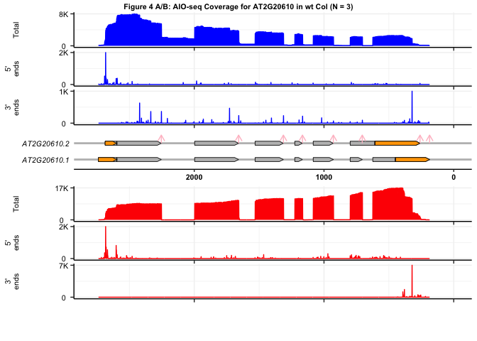
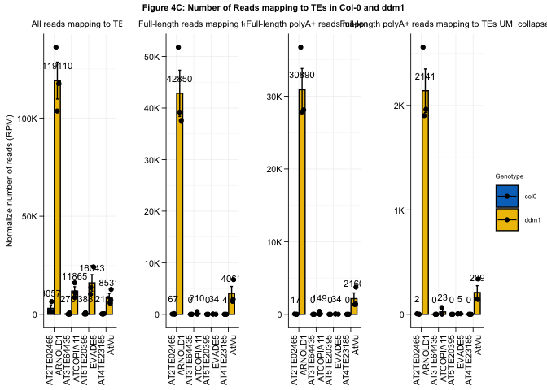
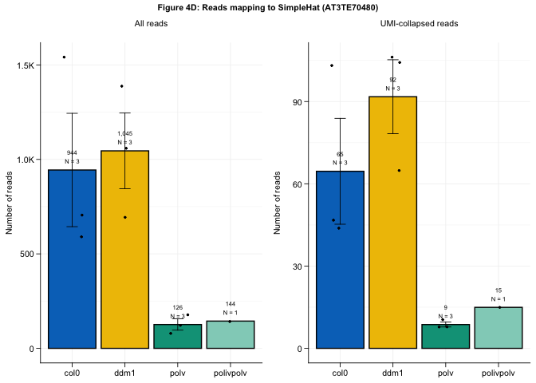
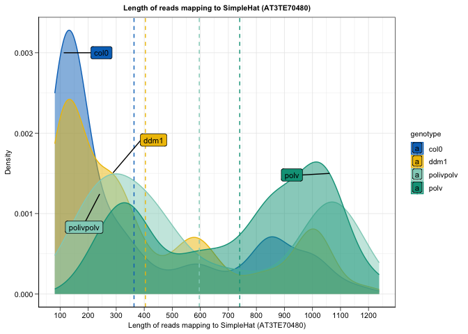

Figure_4
================

This is an [R Markdown](http://rmarkdown.rstudio.com) Notebook. When you
execute code within the notebook, the results appear beneath the code.

``` r
library(tidyverse)
```

    ## ── Attaching core tidyverse packages ──────────────────────── tidyverse 2.0.0 ──
    ## ✔ dplyr     1.1.4     ✔ readr     2.1.5
    ## ✔ forcats   1.0.0     ✔ stringr   1.5.1
    ## ✔ ggplot2   3.5.1     ✔ tibble    3.2.1
    ## ✔ lubridate 1.9.3     ✔ tidyr     1.3.1
    ## ✔ purrr     1.0.2     
    ## ── Conflicts ────────────────────────────────────────── tidyverse_conflicts() ──
    ## ✖ dplyr::filter() masks stats::filter()
    ## ✖ dplyr::lag()    masks stats::lag()
    ## ℹ Use the conflicted package (<http://conflicted.r-lib.org/>) to force all conflicts to become errors

``` r
library(plyr)
```

    ## ------------------------------------------------------------------------------
    ## You have loaded plyr after dplyr - this is likely to cause problems.
    ## If you need functions from both plyr and dplyr, please load plyr first, then dplyr:
    ## library(plyr); library(dplyr)
    ## ------------------------------------------------------------------------------
    ## 
    ## Attaching package: 'plyr'
    ## 
    ## The following objects are masked from 'package:dplyr':
    ## 
    ##     arrange, count, desc, failwith, id, mutate, rename, summarise,
    ##     summarize
    ## 
    ## The following object is masked from 'package:purrr':
    ## 
    ##     compact

``` r
library(ggrepel)
```

    ## Warning: package 'ggrepel' was built under R version 4.3.3

``` r
library(gggenes)
library(ggpubr)
```

    ## 
    ## Attaching package: 'ggpubr'
    ## 
    ## The following object is masked from 'package:plyr':
    ## 
    ##     mutate

``` r
library(stringr)
library(RColorBrewer)
library(patchwork)
library(scales)
```

    ## 
    ## Attaching package: 'scales'
    ## 
    ## The following object is masked from 'package:purrr':
    ## 
    ##     discard
    ## 
    ## The following object is masked from 'package:readr':
    ## 
    ##     col_factor

``` r
library(janitor)
```

    ## 
    ## Attaching package: 'janitor'
    ## 
    ## The following objects are masked from 'package:stats':
    ## 
    ##     chisq.test, fisher.test

``` r
library("ggsci")
```

    ## Warning: package 'ggsci' was built under R version 4.3.3

``` r
# Figure 4A-B - Endogenous genes coverage plots
## Get file name
fileName <- "/Users/mariannekramer/Google Drive/Kramer_et_al_AIO/Figures/endogenous_genes_coverage_plots/col0_rep123.non_pA.filtered.rRNA_free.mapped_to_targets"  

## load gtf for endogenous genes
infoFile <- "/Users/mariannekramer/Google Drive/Kramer_et_al_AIO/Figures/endogenous_genes_coverage_plots/At_array.v1.Arabidopsis_thaliana.TAIR10.56.targetChr.all.gtf" 
geneInfo <- read.table(infoFile,col.names=c("Target","Araport","type","start","stop","foo","strand","foo2","info"),sep="\t")#,skip=3 (when using full gff)

## Pull out information only for genes on target array
geneName <- "AT2G20610" ## Change to AT1G17370 for Figure 4B

diagramFile <- geneInfo %>% rowwise()%>% filter(grepl(geneName,info))  %>%  
  transmute(molecule = str_split(str_split(info,";")[[1]][2]," ")[[1]][3],
         Name=type,Type=type, Start = start, End = stop,Strand =ifelse(strand=="+","forward","reverse"),Length=stop-start,
         orientation=ifelse(strand=="+",1, 0)) 
  

##### Read in bed12 files for coverage
## non_pA
coverage <- read.table(paste(fileName,".bed12",sep=""),col.names = c("chr","start", "stop","txt","gene","strand","blockStart","blockStop","food2","blockNum","blockLen","relStart","scores"))
fivep <- read.table(paste(fileName,".5p.bed12",sep=""),col.names = c("chr","start", "stop","txt","gene","strand","blockStart","blockStop","food2","blockNum","blockLen","relStart","scores"))
threep <- read.table(paste(fileName,".3p.bed12",sep=""),col.names = c("chr","start", "stop","txt","gene","strand","blockStart","blockStop","food2","blockNum","blockLen","relStart","scores"))
## pA
coverage_pA <- read.table(paste(str_replace(fileName,"non_pA","pA"), ".bed12",sep=""),col.names = c("chr","start", "stop","txt","gene","strand","blockStart","blockStop","food2","blockNum","blockLen","relStart","scores"))
fivep_pA <- read.table(paste(str_replace(fileName,"non_pA","pA"), ".5p.bed12",sep=""),col.names = c("chr","start", "stop","txt","gene","strand","blockStart","blockStop","food2","blockNum","blockLen","relStart","scores"))
threep_pA <- read.table(paste(str_replace(fileName,"non_pA","pA"), ".3p.bed12",sep=""),col.names = c("chr","start", "stop","txt","gene","strand","blockStart","blockStop","food2","blockNum","blockLen","relStart","scores"))

## Filter bed12 to only contain gene of interest, and convert score list to lsit of integers
covScores <- tibble(coverage %>% filter(grepl(geneName,txt))) %>% mutate(scores = lapply(str_split(scores,","),as.integer)) %>% rowwise() %>% mutate(nts = list(seq.int(start,stop-1))) %>% select(txt,nts,scores) %>% unnest_longer(c(scores,nts)) %>% pivot_wider(names_from=txt,values_from=scores)
fivepScores <- tibble(fivep %>% filter(grepl(geneName,txt))) %>% mutate(scores = lapply(str_split(scores,","),as.integer)) %>% rowwise() %>% mutate(nts = list(seq.int(start,stop-1))) %>% select(txt,nts,scores) %>% unnest_longer(c(scores,nts))%>% pivot_wider(names_from=txt,values_from=scores)
threepScores <- tibble(threep %>% filter(grepl(geneName,txt))) %>% mutate(scores = lapply(str_split(scores,","),as.integer)) %>% rowwise() %>% mutate(nts = list(seq.int(start,stop-1))) %>% select(txt,nts,scores) %>% unnest_longer(c(scores,nts))%>% pivot_wider(names_from=txt,values_from=scores)

covScores_pA <- tibble(coverage_pA %>% filter(grepl(geneName,txt))) %>% mutate(scores = lapply(str_split(scores,","),as.integer)) %>% rowwise() %>% mutate(nts = list(seq.int(start,stop-1))) %>% select(txt,nts,scores) %>% unnest_longer(c(scores,nts))%>% pivot_wider(names_from=txt,values_from=scores)
fivepScores_pA <- tibble(fivep_pA %>% filter(grepl(geneName,txt))) %>% mutate(scores = lapply(str_split(scores,","),as.integer)) %>% rowwise() %>% mutate(nts = list(seq.int(start,stop-1))) %>% select(txt,nts,scores) %>% unnest_longer(c(scores,nts))%>% pivot_wider(names_from=txt,values_from=scores)
threepScores_pA <- tibble(threep_pA %>% filter(grepl(geneName,txt))) %>% mutate(scores = lapply(str_split(scores,","),as.integer)) %>% rowwise() %>% mutate(nts = list(seq.int(start,stop-1))) %>% select(txt,nts,scores) %>% unnest_longer(c(scores,nts))%>% pivot_wider(names_from=txt,values_from=scores)

## Get region for plotting
xMax <- max(covScores$nts)+50
xMin <- 0

## Convert to file to plot, 3 rows, txt, nt, and score

covScores$scores <- apply(covScores[,2:ncol(covScores)],1,mean,na.rm=TRUE)
fivepScores$scores <- apply(fivepScores[,2:ncol(fivepScores)],1,mean,na.rm=TRUE)
threepScores$scores <- apply(threepScores[,2:ncol(threepScores)],1,mean,na.rm=TRUE)

covScores_pA$scores <- apply(covScores_pA[,2:ncol(covScores_pA)],1,mean,na.rm=TRUE)
fivepScores_pA$scores <- apply(fivepScores_pA[,2:ncol(fivepScores_pA)],1,mean,na.rm=TRUE)
threepScores_pA$scores <- apply(threepScores_pA[,2:ncol(threepScores_pA)],1,mean,na.rm=TRUE)

## plot diagram
toPlot <- diagramFile %>% filter(Type != "CDS" & Type != "protein" & Type != "transcript" & Name != "gene") %>% 
  separate_rows(molecule) %>%
  arrange(by=Type)

## get positions of 5' splice sites to draw arrows
ss3 <- toPlot %>% filter(Name == "exon") %>% select(Start) %>% unique() %>% mutate(xend=Start,ystart=2,yend=2.5)

## Create gene diagram
diagram <- ggplot(toPlot ,aes(xmin = Start, xmax = End, y = molecule, forward=orientation, label=molecule)) +
  geom_gene_arrow(arrow_body_height = grid::unit(1.5, "mm"),arrowhead_height = unit(1.5, "mm"), arrowhead_width = unit(1.5, "mm"),fill = dplyr::case_when(toPlot$Type =="transcript"~ "white",toPlot$Type == "exon" ~ "gray", toPlot$Type == "five_prime_utr" ~ "orange",toPlot$Type == "three_prime_utr" ~ "orange",toPlot$Type == "start_codon" ~ "green",toPlot$Type == "stop_codon" ~"red",TRUE ~ "white"),color = "black") + 
  xlab("Chromosome location (bp)")+ theme_genes() +
  theme(axis.ticks.y=element_blank(), axis.text.y= element_text(color = 'black',size = 8, face = 'italic'),
        axis.text.x= element_text(color = 'black',size = 8, face = 'bold'),axis.title.y= element_blank(), axis.title.x= element_text(color = 'black',size = 8, face = 'bold'), axis.line.x=element_line(color = 'black'),panel.background = element_blank(),plot.title= element_text(color = 'black',size = 16, face = 'bold',hjust=0.5))+
  theme(axis.title.x=element_blank())  +xlim(xMin,xMax)+
  geom_segment(data=ss3, aes(x = Start, y = ystart,xend = xend, yend = yend),arrow = arrow(length=unit(0.1,"inches")),color="pink",inherit.aes = FALSE)

## plot non_pA
themes<-theme(axis.ticks.length.y=unit(0.0516,"in"),axis.ticks.length.x=unit(0.0516,"in"),
               axis.title.x=element_blank(),
               axis.text.x= element_blank(),
               axis.text.y= element_text(color = 'black',size = 8, hjust=0.5), 
               axis.line=element_line(color='black'),
               axis.title.y=element_text(color = 'black',size = 8),
              panel.background = element_blank(),
              panel.grid.major = element_line(color = 'grey95'),
               panel.grid.minor = element_line(color = 'grey95'),
              legend.text=element_text(color = 'black',size = 8),
              legend.key.size= unit(0.25,"cm"),
              legend.title = element_text(color = 'black',size = 5),
              plot.margin = margin(0, 0, 0, 0, "cm"))

maxCov <- max(covScores$scores)
covPlot<- ggplot(covScores, aes(x=nts,y=scores))+ geom_area(stat="identity",color="blue",fill="blue") + ylab("\nTotal")+
  themes + theme(strip.text.y = element_blank(),legend.position='none')+ 
  scale_y_continuous(breaks=seq(0,maxCov,maxCov),labels=scales::label_number(scale_cut = cut_short_scale())) +
  xlim(xMin,xMax)

maxfiveP <- max(fivepScores$scores)
fivepPlot <- ggplot(fivepScores, aes(x=nts,y=scores))+ geom_area(stat="identity",color="blue",fill="blue") + ylab("5'\nends")+
  themes + theme(strip.text.y = element_blank(),legend.position='none')+ 
  scale_y_continuous(breaks=seq(0,maxfiveP,maxfiveP),labels=scales::label_number(scale_cut = cut_short_scale())) +
  xlim(xMin,xMax)

maxthreeP <- max(threepScores$scores)
threepPlot <-ggplot(threepScores, aes(x=nts,y=scores))+ geom_area(stat="identity",color="blue",fill="blue") + ylab("3'\nends")+
  themes + theme(strip.text.y = element_blank(),legend.position='none')+ 
  scale_y_continuous(breaks=seq(0,maxthreeP,maxthreeP),labels=scales::label_number(scale_cut = cut_short_scale())) + xlim(xMin,xMax)

## plot pA
maxCov_pA <- max(covScores_pA$scores)
covPlot_pA <- ggplot(covScores_pA, aes(x=nts,y=scores))+ geom_area(stat="identity",color="red",fill="red") + ylab("\nTotal")+
  themes + theme(strip.text.y = element_blank(),legend.position='none')+ 
  scale_y_continuous(breaks=seq(0,maxCov_pA,maxCov_pA),labels=scales::label_number(scale_cut = cut_short_scale())) +
  xlim(xMin,xMax)

maxfiveP_pA <- max(fivepScores_pA$scores,na.rm=T)
fivepPlot_pA <-ggplot(fivepScores_pA, aes(x=nts,y=scores))+ geom_area(stat="identity",color="red",fill="red") + ylab("5'\nends")+
  themes + theme(strip.text.y = element_blank(),legend.position='none')+ 
  scale_y_continuous(breaks=seq(0,maxfiveP_pA,maxfiveP_pA),labels=scales::label_number(scale_cut = cut_short_scale())) +
  xlim(xMin,xMax)

maxthreeP_pA <- max(threepScores_pA$scores,na.rm=T)
threepPlot_pA <- ggplot(threepScores_pA, aes(x=nts,y=scores))+ geom_area(stat="identity",color="red",fill="red") + ylab("3'\nends")+
  themes + theme(strip.text.y = element_blank(),legend.position='none')+ 
  scale_y_continuous(breaks=seq(0,maxthreeP_pA,maxthreeP_pA),labels=scales::label_number(scale_cut = cut_short_scale())) +
  xlim(xMin,xMax)

if (toPlot$Strand[[1]][1] == "reverse"){
  covPlot <- covPlot + scale_x_reverse(limits=c(xMax,xMin))
  fivepPlot <- fivepPlot + scale_x_reverse(limits=c(xMax,xMin))
  threepPlot <- threepPlot + scale_x_reverse(limits=c(xMax,xMin))
  diagram <- diagram + scale_x_reverse(limits=c(xMax,xMin))
  covPlot_pA <- covPlot_pA + scale_x_reverse(limits=c(xMax,xMin))
  fivepPlot_pA <- fivepPlot_pA + scale_x_reverse(limits=c(xMax,xMin))
  threepPlot_pA <- threepPlot_pA + scale_x_reverse(limits=c(xMax,xMin))
}
```

    ## Scale for x is already present.
    ## Adding another scale for x, which will replace the existing scale.
    ## Scale for x is already present.
    ## Adding another scale for x, which will replace the existing scale.
    ## Scale for x is already present.
    ## Adding another scale for x, which will replace the existing scale.
    ## Scale for x is already present.
    ## Adding another scale for x, which will replace the existing scale.
    ## Scale for x is already present.
    ## Adding another scale for x, which will replace the existing scale.
    ## Scale for x is already present.
    ## Adding another scale for x, which will replace the existing scale.
    ## Scale for x is already present.
    ## Adding another scale for x, which will replace the existing scale.

``` r
outPlot <- ggarrange(covPlot,fivepPlot, threepPlot, 
                      diagram, 
                      covPlot_pA, fivepPlot_pA, threepPlot_pA,
                      ncol=1,nrow=8,heights=c(1,1,1,1.5,1,1,1),align="v")

annotate_figure(outPlot,top = text_grob(paste("Figure 4 A/B: AIO-seq Coverage for ",geneName," in wt Col (N = 3)",sep=""), 
                                        face = "bold", size = 8))
```

<!-- -->

``` r
## Figure 4C - number of reads mapping to TEs
## Define themes for visualizing preferences
themes <- theme(plot.title = element_text(size=8,color='black',hjust = 0.5),
                axis.text = element_text(size=8,color = 'black'),
                axis.title.x = element_blank(),
                axis.title.y = element_text(color = "black",size=8),
                strip.text = element_text(color = "black",size=8),
                legend.position = 'top',
                legend.key.size= unit(0.3,"in"),
                legend.text = element_text(color = "black",size=6),
                legend.title = element_text(color = "black",size=6),
                line = element_line(color = 'black',linewidth=0.3,lineend="round"),
                axis.line=element_line(color='black',linewidth=0.3,lineend="round"),
                axis.ticks.length=unit(0.0516,"in"),
                axis.ticks=element_line(color='black',linewidth=0.3,lineend="round"),
                panel.background = element_blank(),
                panel.grid.major = element_line(color = 'grey95'),
                panel.grid.minor = element_line(color = 'grey95'))
```

``` r
## Read in file with number of mapped reads per sample for normalization
inNorm <- read.table("/Users/mariannekramer/Google Drive/Kramer_et_al_AIO/Figures/at_mutants/number_reads_mapped.at_round2_3.txt",header = TRUE)
norm <- inNorm %>% transmute(sample, MapTotal = rRNA+Targets+Non.targets) 

## Read in file of the targets and their respective class (TE, protein-coding gene, transgene etc)
classes <- "/Users/mariannekramer/Google Drive/Kramer_et_al_AIO/Figures/at_mutants/At_array.v1.Arabidopsis_thaliana.TAIR10.56.Araport11_transposable_element.current.targetChr.construct.transgenes.targets_class.txt"
inClass <- read.table(classes, col.names = c("FaName","Gene","Class"), as.is = T)
inClass <- inClass %>% separate(FaName, into = c("faName"),sep="_")
```

    ## Warning: Expected 1 pieces. Additional pieces discarded in 67 rows [3, 4, 5, 6, 7, 8, 9,
    ## 10, 11, 12, 13, 14, 15, 16, 17, 18, 19, 20, 21, 22, ...].

``` r
########################################
#01# All reads
########################################
## Read in files from two independent experiments for the total amount of reads mapping to each target
round2.all <- read.table("/Users/mariannekramer/Google Drive/Kramer_et_al_AIO/Figures/at_mutants/all.combined_numReads_mapped_to_targets.strandedness.perpA.at_round2.txt", header = T, as.is = T)
round3.all <- read.table("/Users/mariannekramer/Google Drive/Kramer_et_al_AIO/Figures/at_mutants/all.combined_numReads_mapped_to_targets.strandedness.perpA.at_round3.txt", header = T, as.is = T)

# Combine all genotypes
mergeFile.all <- rbind(round2.all,round3.all) %>%
  tidyr::unite(Gene,c(Gene,Name,Class),sep="__") %>% 
  complete(Gene,Sample,fill=list(Sense_non_pA=0,Anti_non_pA=0,Sense_pA=0,Anti_pA=0,Total=0)) %>% 
  separate(Gene,into=c("Gene","Name","Class"),sep="__") 

# Normalize by sample size
norm.All <- norm %>% left_join(mergeFile.all,by=c("sample"="Sample")) %>% 
  transmute(Gene,Name,Class,sample,
            normSense_nonpA= (Sense_non_pA/MapTotal)*1000000,normAnti_nonpA= (Anti_non_pA/MapTotal)*1000000,
            normSense_pA= (Sense_pA/MapTotal)*1000000,normAnti_pA= (Anti_pA/MapTotal)*1000000) %>% 
  rowwise() %>% 
  mutate(normTotal=normSense_nonpA+normAnti_nonpA+normSense_pA+normAnti_pA) %>% 
  mutate(Name = case_when(Gene==Name ~ "", TRUE~ Name),
         pctSensepA = (normSense_pA/normTotal)*100, pctAntipA = (normAnti_pA/normTotal)*100,
         pctSensenonpA = (normSense_nonpA/normTotal)*100, pctAntinonpA = (normAnti_nonpA/normTotal)*100) %>%
  mutate_if(is.numeric, ~replace(.,is.nan(.), 0)) %>% 
  tidyr::unite(Name,c(Gene,Name),sep="\n") %>% 
  mutate(sample = case_when(sample =="1_col0" ~ "1_col0_rep1" ,
                            sample == "3_polv" ~ "3_polv_rep1", 
                            sample == "4_poliv_polv" ~ "4_polivpolv_rep1",
                            sample == "9_ddm1" ~ "9_ddm1_rep1", TRUE ~ sample))

commonNames <- mergeFile.all%>% select(Gene:Name) %>% distinct() 
```

``` r
########################################
#02# UMI Clustered all reads
########################################
## Input all UMI collapsed reads
round2.umi <- read.table("/Users/mariannekramer/Google Drive/Kramer_et_al_AIO/Figures/at_mutants/all.combined_numReads_mapped_to_targets.strandedness.perpA.at_round2.umi.txt", header = T, as.is = T)
round3.umi <- read.table("/Users/mariannekramer/Google Drive/Kramer_et_al_AIO/Figures/at_mutants/all.combined_numReads_mapped_to_targets.strandedness.perpA.at_round3.umi.txt", header = T, as.is = T)

## Format to combine
round2.umi <- round2.umi %>% 
  separate(Gene,into=c("Name","type","strand"), sep = "[.]") %>% 
  tidyr::unite(TxtType, c(type,strand),sep="_") %>%
  mutate(TxtType = case_when(TxtType == "non_pA_sense" ~ "Sense_non_pA",
                             TxtType == "non_pA_antisense" ~ "Anti_non_pA",
                             TxtType == "pA_sense" ~ "Sense_pA",
                             TxtType == "pA_antisense" ~ "Anti_pA", TRUE~"")) 

round3.umi <- round3.umi %>% 
  separate(Gene,into=c("Name","type","strand"), sep = "[.]") %>% 
  tidyr::unite(TxtType, c(type,strand),sep="_") %>%
  mutate(TxtType = case_when(TxtType == "non_pA_sense" ~ "Sense_non_pA",
                             TxtType == "non_pA_antisense" ~ "Anti_non_pA",
                             TxtType == "pA_sense" ~ "Sense_pA",
                             TxtType == "pA_antisense" ~ "Anti_pA", TRUE~"")) 


## Combine all genotypes
mergeFile.umi <- rbind(round2.umi,round3.umi) %>% 
  pivot_wider(names_from=TxtType,values_from = Count) %>% complete(Name,Sample)%>% 
  mutate_if(is.numeric, ~replace_na(., 0)) %>% 
  mutate(Total = Sense_non_pA + Anti_non_pA +Sense_pA + Anti_pA) %>%  
  left_join(inClass,by=c("Name" = "Gene")) %>% select(!faName) %>%  left_join(commonNames,by=c("Name" = "Gene")) %>% 
  relocate(where(is.character)) %>% dplyr::rename(Gene = Name, Name=Name.y) 

# Normalize by sample size
norm.umi<- norm %>% left_join(mergeFile.umi,by=c("sample"="Sample")) %>%
  transmute(Gene,Name,Class,sample,
            normSense_nonpA= (Sense_non_pA/MapTotal)*1000000,normAnti_nonpA= (Anti_non_pA/MapTotal)*1000000,
            normSense_pA= (Sense_pA/MapTotal)*1000000,normAnti_pA= (Anti_pA/MapTotal)*1000000) %>% 
  rowwise() %>% 
  mutate(normTotal=normSense_nonpA+normAnti_nonpA+normSense_pA+normAnti_pA) %>% 
  mutate(Name = case_when(Gene==Name ~ "", TRUE~ Name),
         pctSensepA = (normSense_pA/normTotal)*100, pctAntipA = (normAnti_pA/normTotal)*100,
         pctSensenonpA = (normSense_nonpA/normTotal)*100, pctAntinonpA = (normAnti_nonpA/normTotal)*100) %>% 
  mutate_if(is.numeric, ~replace(.,is.nan(.), 0)) %>% 
  tidyr::unite(Name,c(Gene,Name),sep="\n") %>%
  mutate(sample = case_when(sample =="1_col0" ~ "1_col0_rep1" , 
                            sample == "3_polv" ~ "3_polv_rep1", 
                            sample == "4_poliv_polv" ~ "4_polivpolv_rep1",
                            sample == "9_ddm1" ~ "9_ddm1_rep1", TRUE ~ sample))
```

``` r
########################################
#03 All full-length reads
########################################
## Read in files for reads that are full-length
round2.fl <- read.table("/Users/mariannekramer/Google Drive/Kramer_et_al_AIO/Figures/at_mutants/all.combined_numReads_mapped_to_targets.strandedness.perpA.at_round2.fl.txt", header = T, as.is = T)
round3.fl <- read.table("/Users/mariannekramer/Google Drive/Kramer_et_al_AIO/Figures/at_mutants/all.combined_numReads_mapped_to_targets.strandedness.perpA.at_round3.fl.txt", header = T, as.is = T)

# Combine all genotypes
mergeFile.fl <- rbind(round2.fl,round3.fl) %>%
  tidyr::unite(Gene,c(Gene,Name,Class),sep="__") %>% 
  complete(Gene,Sample,fill=list(Sense_non_pA=0,Anti_non_pA=0,Sense_pA=0,Anti_pA=0,Total=0)) %>% 
  separate(Gene,into=c("Gene","Name","Class"),sep="__") 

# Normalize by sample size
norm.fl <- norm %>% left_join(mergeFile.fl,by=c("sample"="Sample")) %>% 
  transmute(Gene,Name,Class,sample,
            normSense_nonpA= (Sense_non_pA/MapTotal)*1000000,normAnti_nonpA= (Anti_non_pA/MapTotal)*1000000,
            normSense_pA= (Sense_pA/MapTotal)*1000000,normAnti_pA= (Anti_pA/MapTotal)*1000000) %>% 
  rowwise() %>% mutate(normTotal=normSense_nonpA+normAnti_nonpA+normSense_pA+normAnti_pA) %>% 
  mutate(Name = case_when(Gene==Name ~ "", TRUE~ Name),
         pctSensepA = (normSense_pA/normTotal)*100, pctAntipA = (normAnti_pA/normTotal)*100,
         pctSensenonpA = (normSense_nonpA/normTotal)*100, 
         pctAntinonpA = (normAnti_nonpA/normTotal)*100) %>% 
  mutate_if(is.numeric, ~replace(.,is.nan(.), 0)) %>% 
  tidyr::unite(Name,c(Gene,Name),sep="\n") %>% 
  mutate(sample = case_when(sample =="1_col0" ~ "1_col0_rep1", sample == "3_polv" ~ "3_polv_rep1", 
                            sample == "4_poliv_polv" ~ "4_polivpolv_rep1",
                            sample == "9_ddm1" ~ "9_ddm1_rep1", TRUE ~ sample))
```

``` r
########################################
#04 UMI Clustered for full-length reads
########################################
## Input all UMI collapsed reads
round2.umiFL <- read.table("/Users/mariannekramer/Google Drive/Kramer_et_al_AIO/Figures/at_mutants/all.combined_numReads_mapped_to_targets.strandedness.perpA.at_round2.umi.fl.txt", header = T, as.is = T)
round3.umiFL <- read.table("/Users/mariannekramer/Google Drive/Kramer_et_al_AIO/Figures/at_mutants/all.combined_numReads_mapped_to_targets.strandedness.perpA.at_round3.umi.fl.txt", header = T, as.is = T)

## Format to combine
round2.umiFL <- round2.umiFL %>% separate(Gene,into=c("Name","type","strand"), sep = "[.]") %>% 
  tidyr::unite(TxtType, c(type,strand),sep="_") %>% 
  mutate(TxtType = case_when(TxtType == "non_pA_sense" ~ "Sense_non_pA",
                             TxtType == "non_pA_antisense" ~ "Anti_non_pA",TxtType == "pA_sense" ~ "Sense_pA",
                             TxtType == "pA_antisense" ~ "Anti_pA", TRUE~"")) 

round3.umiFL <- round3.umiFL %>% separate(Gene,into=c("Name","type","strand"), sep = "[.]") %>% 
  tidyr::unite(TxtType, c(type,strand),sep="_") %>% 
  mutate(TxtType = case_when(TxtType == "non_pA_sense" ~ "Sense_non_pA",
                             TxtType == "non_pA_antisense" ~ "Anti_non_pA",
                             TxtType == "pA_sense" ~ "Sense_pA",TxtType == "pA_antisense" ~ "Anti_pA", TRUE~"")) 

## Combine all genotypes
mergeFile.umiFL <- rbind(round2.umiFL,round3.umiFL) %>% 
  pivot_wider(names_from=TxtType,values_from = Count) %>% complete(Name,Sample)%>% 
  mutate_if(is.numeric, ~replace_na(., 0)) %>% 
  mutate(Total = Sense_non_pA + Anti_non_pA +Sense_pA + Anti_pA) %>%  
  left_join(inClass,by=c("Name" = "Gene")) %>% select(!faName) %>%  left_join(commonNames,by=c("Name" = "Gene")) %>% 
  relocate(where(is.character)) %>% dplyr::rename(Gene = Name, Name=Name.y)

# Normalize by sample size
norm.umiFL <- norm %>% left_join(mergeFile.umiFL,by=c("sample"="Sample")) %>%
  transmute(Gene,Name,Class,sample,
            normSense_nonpA= (Sense_non_pA/MapTotal)*1000000,normAnti_nonpA= (Anti_non_pA/MapTotal)*1000000,
            normSense_pA= (Sense_pA/MapTotal)*1000000,normAnti_pA= (Anti_pA/MapTotal)*1000000) %>% 
  rowwise() %>% 
  mutate(normTotal=normSense_nonpA+normAnti_nonpA+normSense_pA+normAnti_pA) %>% 
  mutate(Name = case_when(Gene==Name ~ "", TRUE~ Name),
         pctSensepA = (normSense_pA/normTotal)*100, pctAntipA = (normAnti_pA/normTotal)*100,
         pctSensenonpA = (normSense_nonpA/normTotal)*100, pctAntinonpA = (normAnti_nonpA/normTotal)*100) %>% 
  mutate_if(is.numeric, ~replace(.,is.nan(.), 0)) %>% 
  tidyr::unite(Name,c(Gene,Name),sep="\n") %>% 
  mutate(sample = case_when(sample =="1_col0" ~ "1_col0_rep1", 
                            sample == "3_polv" ~ "3_polv_rep1", sample == "4_poliv_polv" ~ "4_polivpolv_rep1",
                            sample == "9_ddm1" ~ "9_ddm1_rep1", TRUE ~ sample))


########################################
# END data input and formatting
########################################
```

``` r
#############
## Look at number of reads from TEs in Col-0 and ddm1
#############
## Filter df for only TEs of interest, and only in Col-0 and ddm1. calculate sum of replicates
all.TEs <- norm.All %>% 
  filter(Class == "Methylated_TE" & (grepl("col0",sample) | grepl("ddm1",sample)) & !grepl("AT4TE23185",Name)) %>% 
  separate(Name,into=c("Gene","Name"),sep="\n") %>% select(Gene:normTotal) %>%   
  group_by(Name,sample,Class) %>%  
  dplyr::summarize(normSense_nonpA=sum(normSense_nonpA),normAnti_nonpA=sum(normAnti_nonpA),
                   normSense_pA=sum(normSense_pA), normAnti_pA=sum(normAnti_pA)) %>% 
  rowwise() %>% 
  mutate(normTotal=normSense_nonpA+normAnti_nonpA+normSense_pA+normAnti_pA, 
         Name = case_when(Name == "AT2TE02465"~"AT2TE02465\nARNOLD1", 
                          Name == "AT3TE64435" ~"AT3TE64435\nATCOPIA11",
                          Name == "AT5TE20395" ~"AT5TE20395\nEVADE5", 
                          Name == "AtMu1" ~ "AT4TE23185\nAtMu"), Sample = "All") %>% filter(Name != "chr4tes") %>%
  separate(sample,into=c("Num","Genotype","rep"))
```

    ## `summarise()` has grouped output by 'Name', 'sample'. You can override using
    ## the `.groups` argument.

``` r
allFL.TEs <- norm.fl %>% 
  filter(Class == "Methylated_TE" & (grepl("col0",sample) | grepl("ddm1",sample)) & !grepl("AT4TE23185",Name)) %>% 
  separate(Name,into=c("Gene","Name"),sep="\n") %>% 
  select(Gene:normTotal) %>%   
  group_by(Name,sample,Class) %>%  
  dplyr::summarize(normSense_nonpA=sum(normSense_nonpA),normAnti_nonpA=sum(normAnti_nonpA),
                   normSense_pA=sum(normSense_pA), normAnti_pA=sum(normAnti_pA)) %>% 
  rowwise() %>%
  mutate(normTotal=normSense_nonpA+normAnti_nonpA+normSense_pA+normAnti_pA, 
         Name = case_when(Name == "AT2TE02465"~"AT2TE02465\nARNOLD1",
                          Name == "AT3TE64435" ~"AT3TE64435\nATCOPIA11",
                          Name == "AT5TE20395" ~"AT5TE20395\nEVADE5", 
                          Name == "AtMu1" ~ "AT4TE23185\nAtMu"), Sample = "FL") %>% 
  filter(Name != "chr4tes") %>% separate(sample,into=c("Num", "Genotype","rep"))
```

    ## `summarise()` has grouped output by 'Name', 'sample'. You can override using
    ## the `.groups` argument.

``` r
umiFL.TEs <-  norm.umiFL%>% 
  filter(Class == "Methylated_TE" & (grepl("col0",sample) | grepl("ddm1",sample)) & !grepl("AT4TE23185",Name)) %>% 
  separate(Name,into=c("Gene","Name"),sep="\n") %>% select(Gene:normTotal) %>%   
  group_by(Name,sample,Class) %>%  
  dplyr::summarize(normSense_nonpA=sum(normSense_nonpA),normAnti_nonpA=sum(normAnti_nonpA),
                   normSense_pA=sum(normSense_pA), normAnti_pA=sum(normAnti_pA)) %>% 
  rowwise() %>% 
  mutate(normTotal=normSense_nonpA+normAnti_nonpA+normSense_pA+normAnti_pA, 
         Name = case_when(Name == "AT2TE02465"~"AT2TE02465\nARNOLD1",
                          Name == "AT3TE64435" ~"AT3TE64435\nATCOPIA11",
                          Name == "AT5TE20395" ~"AT5TE20395\nEVADE5", 
                          Name == "AtMu1" ~ "AT4TE23185\nAtMu"), Sample = "UMIFL") %>% 
  filter(Name != "chr4tes") %>% separate(sample,into=c("Num","Genotype","rep"))
```

    ## `summarise()` has grouped output by 'Name', 'sample'. You can override using
    ## the `.groups` argument.

``` r
## Generate plots
## Define colors
col0Col <- "#0073C2FF"
ddm1Col <- "#EFC000FF"

## All Reads
teAllPlot <- ggbarplot(data = all.TEs, x="Name",y="normTotal",
                       fill="Genotype",color="Genotype",ylab = "Normalize number of reads (RPM)", xlab= FALSE,
                       position=position_dodge(0.75),
                       palette=c(col0Col,ddm1Col),
                       add = c("mean_se","jitter"),label = TRUE,lab.vjust=-1.8,
                       lab.nb.digits = 0,lab.size=3,lab.col='black',
                       title = "All reads mapping to TEs",
                       x.text.angle=90,ggtheme=themes,add.params = list(width = 0.3)) +
  scale_color_manual(values = c(col0 = "black", ddm1 = "black")) + 
  scale_y_continuous(labels=scales::label_number(scale_cut = cut_short_scale())) 
```

    ## Scale for colour is already present.
    ## Adding another scale for colour, which will replace the existing scale.

``` r
teAllFLPlot <- ggbarplot(data = allFL.TEs, x="Name",y="normTotal",
                         fill="Genotype",color="Genotype",ylab = FALSE, xlab= FALSE,
                         position=position_dodge(0.75),
                         palette=c(col0Col,ddm1Col),
                         add = c("mean_se","jitter"),label = TRUE,lab.vjust=-1.8,
                         lab.nb.digits = 0,lab.size=3,lab.col='black',
                         title = "Full-length reads mapping to TEs",
                         x.text.angle=90,ggtheme=themes,add.params = list(width = 0.3)) +
  scale_color_manual(values = c(col0 = "black", ddm1 = "black"))+
  scale_y_continuous(labels=scales::label_number(scale_cut = cut_short_scale())) 
```

    ## Scale for colour is already present.
    ## Adding another scale for colour, which will replace the existing scale.

``` r
teAllFLpAPlot <- ggbarplot(data = allFL.TEs, x="Name",y="normSense_pA",
                           fill="Genotype",color="Genotype",ylab = FALSE, xlab= FALSE,
                           position=position_dodge(0.75),
                           palette=c(col0Col,ddm1Col),
                           add = c("mean_se","jitter"),label = TRUE,lab.vjust=-1.8,
                           lab.nb.digits = 0,lab.size=3,lab.col='black',
                           title = "Full-length polyA+ reads mapping to TEs",
                           x.text.angle=90,ggtheme=themes,add.params = list(width = 0.3)) +
  scale_color_manual(values = c(col0 = "black", ddm1 = "black"))+
  scale_y_continuous(labels=scales::label_number(scale_cut = cut_short_scale())) 
```

    ## Scale for colour is already present.
    ## Adding another scale for colour, which will replace the existing scale.

``` r
teUMIFLpAPlot <- ggbarplot(data = umiFL.TEs, x="Name",y="normSense_pA",
                           fill="Genotype",color="Genotype",ylab = FALSE, xlab= FALSE,
                           position=position_dodge(),
                           palette=c(col0Col,ddm1Col),
                           add = c("mean_se","jitter"),label = TRUE,lab.vjust=-1.8,
                           lab.nb.digits = 0,lab.size=3,lab.col='black',
                           title = "Full-length polyA+ reads mapping to TEs UMI collapsed", 
                           x.text.angle=90,ggtheme=themes,add.params = list(width = 0.3)) +
  scale_color_manual(values = c(col0 = "black", ddm1 = "black"))+
  scale_y_continuous(labels=scales::label_number(scale_cut = cut_short_scale())) 
```

    ## Scale for colour is already present.
    ## Adding another scale for colour, which will replace the existing scale.

``` r
tesPlots <- ggarrange(teAllPlot , teAllFLPlot ,teAllFLpAPlot , teUMIFLpAPlot, ncol=4,nrow=1,align="v",common.legend = T,legend='right')

annotate_figure(tesPlots,top = text_grob("Figure 4C: Number of Reads mapping to TEs in Col-0 and ddm1", 
                                        face = "bold", size = 8))
```

<!-- -->

``` r
## Figure 4D
## Look at number of reads from SimpleHat AT3TE70480
all.SH <- norm.All %>% 
  filter(grepl("AT3TE70480",Name) &(grepl("col0",sample) | grepl("polv",sample) | grepl("ddm",sample))) %>% 
  mutate(ReadType = "All",Name = "AT3TE70480\nSimpleHat") %>% 
  separate(sample,into=c("num", "Genotype","Rep")) 

umi.SH <- norm.umi %>% 
  filter(grepl("AT3TE70480",Name) &(grepl("col0",sample) | grepl("polv",sample) | grepl("ddm",sample))) %>% 
  mutate(ReadType = "All_UMI_collapsed",Name = "AT3TE70480\nSimpleHat")  %>% 
  separate(sample,into=c("num","Genotype","Rep"))
```

``` r
## Calculate sum of replicates and standard error of the mean
toPlotsimpleHat.all.bar <- all.SH %>% 
  group_by(Name,Class,Genotype) %>%
  dplyr::summarize(normTotal.mean = mean(normTotal),normTotal.sem = sd(normTotal)/sqrt(n()), N=n()) 
```

    ## `summarise()` has grouped output by 'Name', 'Class'. You can override using the
    ## `.groups` argument.

``` r
toPlotsimpleHat.umi.bar <- umi.SH %>% group_by(Name,Class,Genotype) %>%
  dplyr::summarize(normTotal.mean = mean(normTotal), normTotal.sem = sd(normTotal)/sqrt(n()), N=n())
```

    ## `summarise()` has grouped output by 'Name', 'Class'. You can override using the
    ## `.groups` argument.

``` r
## Generate plots
## Define colors
col0Col <- "#0073C2FF"
pol5Col <- "#00A087FF"
pol45Col <-"#91D1C2FF"
ddm1Col <- "#EFC000FF"

simpleHat.all.bar<- 
  ggplot(toPlotsimpleHat.all.bar,aes(x=factor(Genotype,levels = c("col0","ddm1","polv","polivpolv")),
                                     y=normTotal.mean,fill=Genotype)) + 
  geom_bar(stat="identity",position=position_dodge(0.9),color='black')+ 
  geom_errorbar(aes(ymin=normTotal.mean-normTotal.sem, ymax=normTotal.mean+normTotal.sem),
                width=0.2,linewidth=0.3,lineend="round") +
  geom_jitter(data=all.SH, aes(x=factor(Genotype,levels = c("col0","ddm1","polv","polivpolv")),y=normTotal),
              width =0.2,size=0.5)+
  scale_y_continuous(labels=scales::label_number(scale_cut = cut_short_scale())) +
  geom_text(aes(label = paste(prettyNum(round(normTotal.mean,0),big.mark=",",scientific=F),"\n","N = ",N,sep="")), 
            size=2,vjust=-0.5) + 
  themes + 
  scale_fill_manual(values=c(col0Col,ddm1Col,pol45Col,pol5Col)) + 
  ggtitle("All reads\n") + ylab("Number of reads")

simpleHat.umi.bar<- 
  ggplot(toPlotsimpleHat.umi.bar,aes(x=factor(Genotype,levels = c("col0","ddm1","polv","polivpolv")), 
                                     y=normTotal.mean,fill=Genotype)) + 
  geom_bar(stat="identity",position=position_dodge(0.9),color='black')+ 
  geom_errorbar(aes(ymin=normTotal.mean-normTotal.sem, ymax=normTotal.mean+normTotal.sem),
                width=0.2,position=position_dodge(0.9),linewidth=0.3,lineend="round") +
  geom_jitter(data=umi.SH, aes(x=factor(Genotype,levels = c("col0","ddm1","polv","polivpolv")),y=normTotal),
              width =0.2,size=0.5)+
  scale_y_continuous(labels=scales::label_number(scale_cut = cut_short_scale())) +
  geom_text(aes(label = paste(prettyNum(round(normTotal.mean,0),big.mark=",",scientific=F),"\n","N = ",N,sep="")), 
            position=position_dodge(0.9),size=2,vjust=-0.5) + 
  themes + 
  scale_fill_manual(values=c(col0Col,ddm1Col,pol45Col,pol5Col)) + 
  ggtitle("UMI-collapsed reads\n") + ylab("Number of reads")

plotsSH <- ggarrange(simpleHat.all.bar , simpleHat.umi.bar, ncol=2,nrow=1,align="v",common.legend = T,legend='none')
annotate_figure(plotsSH, top=text_grob("Figure 4D: Reads mapping to SimpleHat (AT3TE70480)",face="bold", size=8))
```

<!-- -->

``` r
## Figure 4E: Read length of SimpleHat Reads
col0Col <- "#0073C2FF"
pol5Col <- "#00A087FF"
pol45Col <-"#91D1C2FF"
ddm1Col <- "#EFC000FF"

## Read in files with the length of reads mapping to SimpleHat in two independent experiments
inAtRnd2 <- read.table("/Users/mariannekramer/Google Drive/Kramer_et_al_AIO/Figures/sh_readLength/all_samples.readSize.mappedToSimpleHat.at_round2.txt",col.names=c("len","gene","sample"),sep="\t")
inAtRnd3 <- read.table("/Users/mariannekramer/Google Drive/Kramer_et_al_AIO/Figures/sh_readLength/all_samples.readSize.mappedToSimpleHat.at_round3.txt",col.names=c("len","gene","sample"),sep="\t")

## Modify sample names
inAtRnd2 <- inAtRnd2 %>% mutate(sample = case_when(sample == "4_poliv_polv_rep1.non_pA" ~ "4_polivpolv_rep1.non_pA", 
                                                   sample == "4_poliv_polv_rep1.pA" ~ "4_polivpolv_rep1.pA", TRUE ~ sample))
## Combine experiments and format
data <- rbind(inAtRnd2,inAtRnd3) %>% 
  filter(grepl("col0",sample) | grepl("polv",sample)|grepl("ddm",sample)) %>% 
  separate(sample,into=c("sample","class"),sep ='[.]') %>%
  separate(sample,into=c("num","genotype","rep"), sep="_")

## Calculate the mode of read lengths
mu <- ddply(data, "genotype", summarise, grp.mean=mean(len))

mode <- function(codes){
  which.max(tabulate(codes))
}

modes <- data %>% group_by(genotype) %>%
  dplyr::summarise(mode = mode(len))

## Set seed
set.seed(42)
## Define themes
themes <- theme(axis.ticks.length=unit(0.0516,"in"),
                line = element_line(color = 'black',linewidth=0.3,lineend="round"),
                plot.title=element_text(hjust=0.5, color = 'black', size = 8, face = 'bold'),
                axis.line=element_line(color = 'black'), 
                axis.text= element_text(color = 'black',size = 8),
                axis.title= element_text(color = 'black',size = 8),
                legend.text=element_text(color = 'black',size = 8),
                legend.key.size= unit(0.5,"cm"),
                legend.title = element_text(color = 'black',size = 8),
                strip.text=element_text(color='black',size=8))

ggplot(data,aes(x=len,fill=genotype,color=genotype)) + geom_density(kernel="gaussian",alpha=0.5) + 
  scale_x_continuous(limits=c(min(data$len),max(data$len)),n.breaks = 20)+
  geom_vline(data=mu, aes(xintercept=grp.mean, color=genotype),linetype="dashed")+
  theme_bw()+themes +
  xlab("Length of reads mapping to SimpleHat (AT3TE70480)") + 
  ylab("Density") +
  ggtitle("Length of reads mapping to SimpleHat (AT3TE70480)")+
  scale_fill_manual(values=c(col0Col,ddm1Col,pol45Col,pol5Col)) +
  scale_color_manual(values=c(col0Col,ddm1Col,pol45Col,pol5Col)) + 
  geom_label_repel(data=modes,
                   aes(label=genotype,x=mode,y=c(0.003,0.0015,0.00125,0.0015)),
                   color='black',size=3,box.padding = 2,nudge_x=-2)
```

<!-- -->
