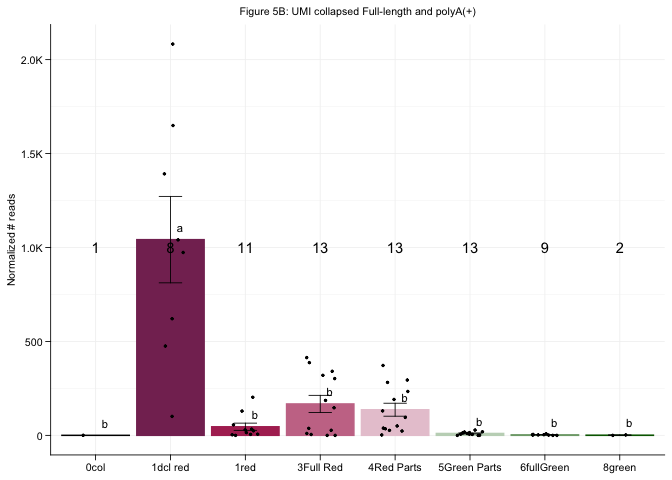
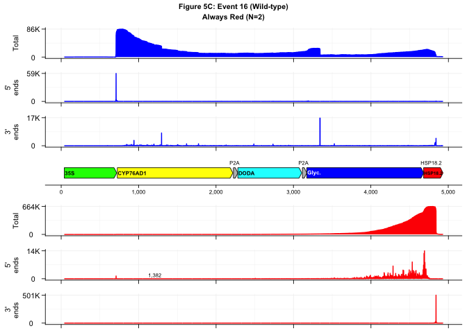
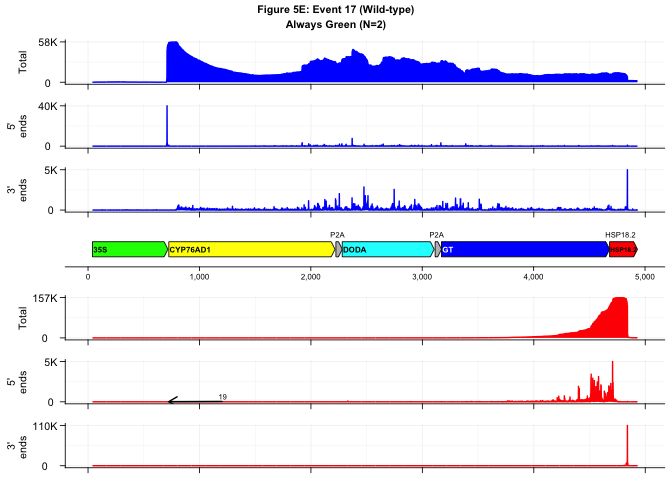
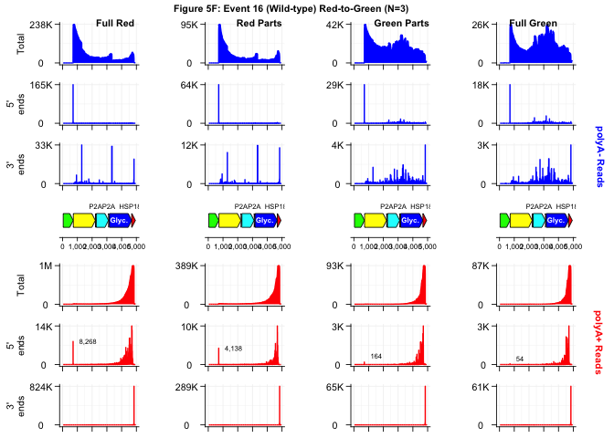
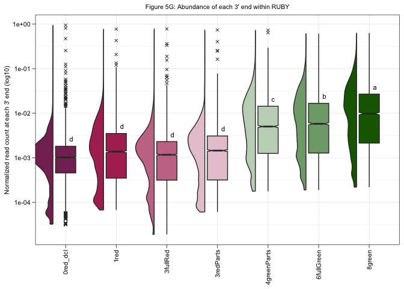

Figure_5
================

This is an [R Markdown](http://rmarkdown.rstudio.com) Notebook. When you
execute code within the notebook, the results appear beneath the code.

``` r
## Get Relevant Packages
library(tidyverse)
```

    ## ── Attaching core tidyverse packages ──────────────────────── tidyverse 2.0.0 ──
    ## ✔ dplyr     1.1.4     ✔ readr     2.1.5
    ## ✔ forcats   1.0.0     ✔ stringr   1.5.1
    ## ✔ ggplot2   3.5.1     ✔ tibble    3.2.1
    ## ✔ lubridate 1.9.3     ✔ tidyr     1.3.1
    ## ✔ purrr     1.0.2     
    ## ── Conflicts ────────────────────────────────────────── tidyverse_conflicts() ──
    ## ✖ dplyr::filter() masks stats::filter()
    ## ✖ dplyr::lag()    masks stats::lag()
    ## ℹ Use the conflicted package (<http://conflicted.r-lib.org/>) to force all conflicts to become errors

``` r
library(ggrepel)
```

    ## Warning: package 'ggrepel' was built under R version 4.3.3

``` r
library(ggpubr)
library(janitor)
```

    ## 
    ## Attaching package: 'janitor'
    ## 
    ## The following objects are masked from 'package:stats':
    ## 
    ##     chisq.test, fisher.test

``` r
library(RColorBrewer)
library(patchwork)
library("ggsci")
```

    ## Warning: package 'ggsci' was built under R version 4.3.3

``` r
library("scales")
```

    ## 
    ## Attaching package: 'scales'
    ## 
    ## The following object is masked from 'package:purrr':
    ## 
    ##     discard
    ## 
    ## The following object is masked from 'package:readr':
    ## 
    ##     col_factor

``` r
library(ggh4x)
```

    ## 
    ## Attaching package: 'ggh4x'
    ## 
    ## The following object is masked from 'package:ggplot2':
    ## 
    ##     guide_axis_logticks

``` r
library(multcompView)
library(gggenes)
library(see)
```

    ## Warning: package 'see' was built under R version 4.3.3

    ## 
    ## Attaching package: 'see'
    ## 
    ## The following objects are masked from 'package:ggsci':
    ## 
    ##     scale_color_material, scale_colour_material, scale_fill_material

``` r
# Function to perform pairwise ANOVA
pairwise_anova <- function(data, sample_col, value_col) {
  # Get unique samples
  samples <- unique(data[[sample_col]])
  results <- data.frame(Comparison = character(),
                         F_value = numeric(),
                         P_value = numeric(),
                         Significance = character(),
                         stringsAsFactors = FALSE)
  
  # Loop through each pair of samples
  for (i in 1:(length(samples) - 1)) {
    for (j in (i + 1):length(samples)) {
      sample1 <- samples[i]
      sample2 <- samples[j]
      
      # Filter data for the current pair
      data1 <- data %>% filter(!!sym(sample_col) == sample1)
      data2 <- data %>% filter(!!sym(sample_col) == sample2)
      
      # Perform ANOVA
      anova_result <- aov(as.formula(paste(value_col, "~", sample_col)), data = rbind(data1, data2))
      summary_result <- summary(anova_result)
      
      # Extract F-value and p-value
      f_value <- summary_result[[1]]$`F value`[1]
      p_value <- summary_result[[1]]$`Pr(>F)`[1]
      
      # Determine significance level
      if (p_value < 0.001) {
        significance <- "***"
      } else if (p_value < 0.01) {
        significance <- "**"
      } else if (p_value < 0.05) {
        significance <- "*"
      } else {
        significance <- "NS"
      }
      
      # Append results to the data frame
      results <- rbind(results, data.frame(Sample_1 = sample1,
                                           Sample_2 = sample2,
                                           F_value = f_value,
                                           P_value = p_value,
                                           Significance = significance,
                                           stringsAsFactors = FALSE))
    }
  }
  
  return(results)
}
```

``` r
## Figure 5A/B - Number of reads mapping to RUBY

## Input file with number of reads mapping per sample for normalization
inNorm <- read.table("/Users/mariannekramer/Google Drive/Kramer_et_al_AIO/Figures/ruby_aio_read_Count/number_reads_mapped.ruby_rounds1235.txt",header = TRUE)
norm <- inNorm %>% transmute(sample, MapTotal = rRNA+Targets+Non_targets)

## Read in file with classes for each target
classes <- "/Users/mariannekramer/Google Drive/Kramer_et_al_AIO/Figures/ruby_aio_read_Count/At_array.v2.Arabidopsis_thaliana.TAIR10.56.Araport11_transposable_element.current.targetChr.construct.transgenes.targets_class.txt"
inClass <- read.table(classes, col.names = c("FaName","Gene","Class"), as.is = T)
inClass <- inClass %>% separate(FaName, into = c("faName"),sep="_") %>% 
  mutate(faName = case_when(grepl("RUBY",Gene)~ Gene, TRUE ~faName ))
```

    ## Warning: Expected 1 pieces. Additional pieces discarded in 79 rows [1, 2, 3, 4, 5, 6, 7,
    ## 8, 9, 10, 11, 12, 13, 14, 15, 16, 17, 18, 19, 20, ...].

``` r
## Read in files of all reads mapping to RUBY for each sample, across three different experiments
round1.all <- read.table("/Users/mariannekramer/Google Drive/Kramer_et_al_AIO/Figures/ruby_aio_read_Count/all.combined_numReads_mapped_to_targets.strandedness.perpA.round1.txt", header = T, as.is = T)
round2.all <- read.table("/Users/mariannekramer/Google Drive/Kramer_et_al_AIO/Figures/ruby_aio_read_Count/all.combined_numReads_mapped_to_targets.strandedness.perpA.round2.txt", header = T, as.is = T)
round5.all <- read.table("/Users/mariannekramer/Google Drive/Kramer_et_al_AIO/Figures/ruby_aio_read_Count/all.combined_numReads_mapped_to_targets.strandedness.perpA.round5.txt", header = T, as.is = T)


# Combine all rounds
mergeFile.all <- rbind(round1.all,round2.all,round5.all) %>% 
  mutate(Name = case_when(grepl("RUBY",Gene) ~ "RUBY", TRUE ~ Name),
         Gene = case_when(grepl("RUBY",Gene) ~ "RUBY", TRUE ~ Gene)) %>%
  tidyr::unite(tmp,c(Gene,Name,Class),sep="__") %>% 
  complete(tmp,Sample,fill=list(Sense_non_pA=0,Anti_non_pA=0,Sense_pA=0,Anti_pA=0,Total=0)) %>% 
  separate(tmp,into=c("Gene","Name","Class"),sep="__") 

# Normalize by sample size
norm.All <- mergeFile.all %>% left_join(norm,by=c("Sample"="sample")) %>% 
  transmute(Gene,Name,Class,Sample,
            normSense_nonpA= round((Sense_non_pA/MapTotal)*1000000,2),
            normAnti_nonpA= round((Anti_non_pA/MapTotal)*1000000,2),
            normSense_pA= round((Sense_pA/MapTotal)*1000000,2),normAnti_pA= round((Anti_pA/MapTotal)*1000000,2)) %>% 
  rowwise() %>% 
  mutate(normTotal=normSense_nonpA+normAnti_nonpA+normSense_pA+normAnti_pA) %>% 
  mutate(Name = case_when(Gene==Name ~ "", TRUE~ Name),
         pctSensepA = round((normSense_pA/normTotal)*100,2), 
         pctAntipA = round((normAnti_pA/normTotal)*100,2),
         pctSensenonpA = round((normSense_nonpA/normTotal)*100,2), 
         pctAntinonpA = round((normAnti_nonpA/normTotal)*100,2)) %>% 
  mutate_if(is.numeric, ~replace(.,is.nan(.), 0)) %>% 
  tidyr::unite(Name,c(Gene,Name),sep="\n") %>% separate(Sample,into=c("genotype","promoter","phenotype"),sep="[.]") %>% 
  separate(genotype,into=c("num","plant","rep"),sep="_") %>% tidyr::unite(genotype, c(plant,rep),sep="_")

commonNames <- mergeFile.all%>% select(Gene,Name) %>% distinct() 
```

``` r
## Input all full-length UMI collapsed reads
round1.umiFL <- read.table("/Users/mariannekramer/Google Drive/Kramer_et_al_AIO/Figures/ruby_aio_read_Count/all.combined_numReads_mapped_to_targets.strandedness.perpA.ruby_round1.umi.FL.txt", header = T, as.is = T)
round2.umiFL <- read.table("/Users/mariannekramer/Google Drive/Kramer_et_al_AIO/Figures/ruby_aio_read_Count/all.combined_numReads_mapped_to_targets.strandedness.perpA.ruby_round2.umi.FL.txt", header = T, as.is = T)
round5.umiFL <- read.table("/Users/mariannekramer/Google Drive/Kramer_et_al_AIO/Figures/ruby_aio_read_Count/all.combined_numReads_mapped_to_targets.strandedness.perpA.ruby_round5.umi.FL.txt", header = T, as.is = T)

## Format to combine
round1.umiFL <- round1.umiFL %>% 
  separate(Gene,into=c("Name","type","strand"), sep = "[.]") %>%
  tidyr::unite(TxtType, c(type,strand),sep="_") %>% 
  mutate(TxtType = case_when(TxtType == "non_pA_sense" ~ "Sense_non_pA",TxtType == "non_pA_antisense" ~ "Anti_non_pA",
                             TxtType == "pA_sense" ~ "Sense_pA",TxtType == "pA_antisense" ~ "Anti_pA", TRUE~"")) 
round2.umiFL <- round2.umiFL %>% 
  separate(Gene,into=c("Name","type","strand"), sep = "[.]") %>%
  tidyr::unite(TxtType, c(type,strand),sep="_") %>%
  mutate(TxtType = case_when(TxtType == "non_pA_sense" ~ "Sense_non_pA",TxtType == "non_pA_antisense" ~ "Anti_non_pA",
                             TxtType == "pA_sense" ~ "Sense_pA",TxtType == "pA_antisense" ~ "Anti_pA", TRUE~""))
round5.umiFL <- round5.umiFL %>% 
  separate(Gene,into=c("Name","type","strand"), sep = "[.]") %>%
  tidyr::unite(TxtType, c(type,strand),sep="_") %>% 
  mutate(TxtType = case_when(TxtType == "non_pA_sense" ~ "Sense_non_pA",TxtType == "non_pA_antisense" ~ "Anti_non_pA",
                             TxtType == "pA_sense" ~ "Sense_pA",TxtType == "pA_antisense" ~ "Anti_pA", TRUE~""))


## Combine all genotypes
mergeFile.umiFL <- rbind(round1.umiFL,round2.umiFL,round5.umiFL)  %>% distinct() %>%
  pivot_wider(names_from=TxtType,values_from = Count) %>%  
  left_join(inClass,by=c("Name" = "Gene")) %>% select(!faName)  %>% 
  mutate(Name = case_when(grepl("RUBY",Name) ~ "RUBY", TRUE ~ Name))%>%  
  left_join(commonNames,by=c("Name" = "Gene")) %>% 
  relocate(where(is.character)) %>% dplyr::rename(Gene = Name, Name=Name.y) %>%
  complete(Name,Sample) %>% mutate_if(is.numeric, ~replace_na(., 0)) %>% 
  mutate(Total = Sense_non_pA + Anti_non_pA +Sense_pA + Anti_pA)  

# Normalize by sample size
norm.umiFL<- mergeFile.umiFL %>% left_join(norm,by=c("Sample"="sample")) %>% 
  transmute(Gene,Name,Class,Sample,
            normSense_nonpA= round((Sense_non_pA/MapTotal)*1000000,2),
            normAnti_nonpA= round((Anti_non_pA/MapTotal)*1000000,2),
            normSense_pA= round((Sense_pA/MapTotal)*1000000,2),normAnti_pA= round((Anti_pA/MapTotal)*1000000,2)) %>% 
  rowwise() %>%
  mutate(normTotal=normSense_nonpA+normAnti_nonpA+normSense_pA+normAnti_pA) %>% 
  mutate(Name = case_when(Gene==Name ~ "", TRUE~ Name),
         pctSensepA = round((normSense_pA/normTotal)*100,2), pctAntipA = round((normAnti_pA/normTotal)*100,2),
         pctSensenonpA = round((normSense_nonpA/normTotal)*100,2), pctAntinonpA = round(normAnti_nonpA/normTotal*100,2)) %>% 
  mutate_if(is.numeric, ~replace(.,is.nan(.), 0)) %>% 
  tidyr::unite(Name,c(Gene,Name),sep="\n")%>% separate(Sample,into=c("genotype","promoter","phenotype"),sep="[.]") %>% 
  separate(genotype,into=c("num","plant","rep"),sep="_") %>% tidyr::unite(genotype, c(plant,rep),sep="_")
```

``` r
#############
## Only look at reads that map to RUBY
#############
all.RUBY2 <- norm.All %>% 
  filter(grepl("RUBY",Name)&grepl("35S",promoter)) %>% 
  mutate(phenotype = case_when(phenotype == "3redParts" ~ "4Red Parts",phenotype == "4greenParts" ~ "5Green Parts",
                               phenotype == "5fullRed" ~ "3Full Red",phenotype == "7fullGreen" ~ "7greenRedCotyledons", 
                               phenotype == "2reddish" ~ "1red",phenotype == "7green" ~ "0col",TRUE ~ phenotype)) %>%   
  separate(genotype,into=c("Genotype","Rep")) %>% 
  mutate(Genotype = case_when(Genotype == "MK041A" ~ "MK041", TRUE ~ Genotype),
         class = case_when(phenotype == "1red" ~ "Always Red", phenotype == "8green" ~ "Always Green",
                           phenotype=="0col"~"No transgene",TRUE~ "Red-to-Green")) %>% 
  mutate(Genotype = str_replace(Genotype,"MK0",""),Rep = str_replace(Rep,"rep","Rep ")) %>%
  mutate(background=case_when(promoter!="35S"~"dcl1234",TRUE ~ "Wt"),
         phenotype=case_when(promoter== "35S_dcl1234" ~ "1dcl red",TRUE ~ phenotype))

umiFL.RUBY2 <- norm.umiFL %>% 
  filter(grepl("RUBY",Name)&grepl("35S",promoter)) %>% 
  mutate(phenotype = case_when(phenotype == "3redParts" ~ "4Red Parts",phenotype == "4greenParts" ~ "5Green Parts",
                               phenotype == "5fullRed" ~ "3Full Red",phenotype == "7fullGreen" ~ "7greenRedCotyledons",
                               phenotype == "2reddish" ~ "1red",phenotype == "7green" ~ "0col",TRUE ~ phenotype)) %>%
  separate(genotype,into=c("Genotype","Rep"))  %>% 
  mutate(Genotype = case_when(Genotype == "MK041A" ~ "MK041", TRUE ~ Genotype),
         class = case_when(phenotype == "1red" ~ "Always Red", phenotype == "8green" ~ "Always Green",
                           phenotype=="0col"~"No transgene",TRUE~ "Red-to-Green"))%>% 
  mutate(Genotype = str_replace(Genotype,"MK0",""),Rep = str_replace(Rep,"rep","Rep "))%>% 
  mutate(background=case_when(promoter!="35S"~"dcl1234",TRUE ~ "Wt"),
         phenotype=case_when(promoter== "35S_dcl1234" ~ "1dcl red",TRUE ~ phenotype))
```

``` r
## Plots
## Plot colors
phenoColors <- c("#853061","#B03060","#C97795","#E8C8D4","#C2D5C0","#7FA779","#006400")
## Set themes
themes <- theme(plot.title = element_text(size=8,color='black',hjust = 0.5),
                axis.text = element_text(size=8,color = 'black'),
                axis.title.x = element_blank(),
                axis.title.y = element_text(color = "black",size=8),
                strip.text = element_text(color = "black",size=8),
                legend.position = 'top',
                legend.key.size= unit(0.3,"cm"),
                legend.text = element_text(color = "black",size=6),
                legend.title = element_text(color = "black",size=6),
                line = element_line(color = 'black',linewidth=0.3,lineend="round"),
                axis.line=element_line(color='black',linewidth=0.3,lineend="round"),
                axis.ticks.length=unit(0.0516,"in"),
                axis.ticks=element_line(color='black',linewidth=0.3,lineend="round"),
                panel.background = element_blank(),
                panel.grid.major = element_line(color = 'grey95'),
                panel.grid.minor = element_line(color = 'grey95'))

## Figure 5A: All reads mapping to RUBY
## Perform ANOVA test

anova <- aov(normTotal ~ phenotype, data = all.RUBY2)
tukey <- TukeyHSD(anova)
tukey_df <- as.data.frame(tukey$phenotype)
tukey_df <- mutate(tukey_df, 
                   Sig = case_when(`p adj` < 0.001 ~ "***",
                                   `p adj` > 0.001 & `p adj` < 0.01 ~ "**",
                                   `p adj` > 0.01 & `p adj` < 0.05 ~ "*", TRUE ~ "NS"))
print(tukey_df)
```

    ##                                diff        lwr        upr        p adj Sig
    ## 1dcl red-0col            486991.662  246383.51  727599.81 7.753437e-07 ***
    ## 1red-0col                309380.755   72446.23  546315.28 2.956779e-03  **
    ## 3Full Red-0col           374551.679  139140.86  609962.50 1.343004e-04 ***
    ## 4Red Parts-0col          297477.458   62066.64  532888.28 4.521280e-03  **
    ## 5Green Parts-0col        119559.766 -115851.05  354970.58 7.525382e-01  NS
    ## 6fullGreen-0col          129309.736 -109808.57  368428.04 6.895429e-01  NS
    ## 8green-0col              327587.305   49756.94  605417.67 1.028664e-02   *
    ## 1red-1dcl red           -177610.907 -283017.93  -72203.89 4.550125e-05 ***
    ## 3Full Red-1dcl red      -112439.983 -214375.86  -10504.11 2.071860e-02   *
    ## 4Red Parts-1dcl red     -189514.204 -291450.08  -87578.33 5.768253e-06 ***
    ## 5Green Parts-1dcl red   -367431.896 -469367.77 -265496.02 1.893974e-11 ***
    ## 6fullGreen-1dcl red     -357681.927 -467910.02 -247453.84 1.917710e-11 ***
    ## 8green-1dcl red         -159404.357 -338743.08   19934.37 1.168425e-01  NS
    ## 3Full Red-1red            65170.924  -27762.44  158104.29 3.662276e-01  NS
    ## 4Red Parts-1red          -11903.297 -104836.67   81030.07 9.999124e-01  NS
    ## 5Green Parts-1red       -189820.989 -282754.36  -96887.62 6.172148e-07 ***
    ## 6fullGreen-1red         -180071.020 -282031.41  -78110.63 1.754015e-05 ***
    ## 8green-1red               18206.550 -156172.54  192585.64 9.999781e-01  NS
    ## 4Red Parts-3Full Red     -77074.221 -166051.15   11902.71 1.368738e-01  NS
    ## 5Green Parts-3Full Red  -254991.913 -343968.84 -166014.99 4.057354e-11 ***
    ## 6fullGreen-3Full Red    -245241.944 -343609.64 -146874.25 2.269677e-09 ***
    ## 8green-3Full Red         -46964.374 -219267.45  125338.70 9.888827e-01  NS
    ## 5Green Parts-4Red Parts -177917.692 -266894.62  -88940.77 1.046162e-06 ***
    ## 6fullGreen-4Red Parts   -168167.723 -266535.42  -69800.03 3.414020e-05 ***
    ## 8green-4Red Parts         30109.847 -142193.23  202412.92 9.993100e-01  NS
    ## 6fullGreen-5Green Parts    9749.969  -88617.72  108117.66 9.999847e-01  NS
    ## 8green-5Green Parts      208027.539   35724.46  380330.61 7.854498e-03  **
    ## 8green-6fullGreen        198277.569   20942.69  375612.45 1.809474e-02   *

``` r
#write.table(tukey_df, file = "reads_mapping_to_RUBY.all.avg.bygeno.plus_dcl.ANOVA.tukey.txt", quote=F, row.names = T, col.names=T, sep= "\t")

cld <- multcompLetters4(anova, tukey)

Tk <- group_by(all.RUBY2, phenotype) %>%
  dplyr::summarize(mean=mean(normTotal), quant = quantile(normTotal, probs = 0.75)) %>%
  arrange(desc(mean))

# extracting the compact letter display and adding to the Tk table
cld <- as.data.frame.list(cld$phenotype)
Tk$cld <- cld$Letters

all.RUBY2 %>% group_by(phenotype,class,promoter) %>% 
  dplyr::summarize(avg = mean(normTotal), numBR = n(), sem = sd(normTotal)/sqrt(n()))  %>% 
  ggplot(aes(x=phenotype,y=avg,fill=phenotype)) + 
  geom_col(position=position_dodge(0.9),aes(color=phenotype))+ 
  geom_jitter(data=all.RUBY2,aes(x=phenotype,y=normTotal),width =0.2,size=0.5)+
  scale_y_continuous(labels=scales::label_number(scale_cut = cut_short_scale())) +
  geom_errorbar(aes(ymin=avg-sem, ymax=avg+sem),color='black',
                width=0.3,position=position_dodge(0.9),linewidth=0.3,lineend="round")+
  themes + scale_fill_manual(values=c('black',phenoColors)) + 
  scale_color_manual(values=c('black',phenoColors)) + 
  ggtitle("Figure 5A: All Reads") + ylab("Normalized # reads") + 
  geom_text(aes(label=numBR),y = 10000) +theme(legend.position="none")+
  geom_text(data=Tk,aes(x=phenotype,y=mean,label=cld), size = 3, vjust=-1, hjust =-1)
```

    ## `summarise()` has grouped output by 'phenotype', 'class'. You can override
    ## using the `.groups` argument.

<!-- -->

``` r
## Figure 5B: UMI-collapsed full-length polyA+ reads
## Perform ANOVA test

anova <- aov(normSense_pA ~ phenotype, data = umiFL.RUBY2)
tukey <- TukeyHSD(anova)
tukey_df <- as.data.frame(tukey$phenotype)
tukey_df <- mutate(tukey_df, Sig = case_when(`p adj` < 0.001 ~ "***",`p adj` > 0.001 & `p adj` < 0.01 ~ "**",`p adj` > 0.01 & `p adj` < 0.05 ~ "*", TRUE ~ "NS"))
#write.table(tukey_df, file = "reads_mapping_to_RUBY.pA_sense.full_length.umi.avg.bygeno.plus_dcl.ANOVA.tukey.txt", quote=F, row.names = T, col.names=T, sep= "\t")
print(tukey_df)
```

    ##                                 diff        lwr       upr        p adj Sig
    ## 1dcl red-0col            1041.551250   249.2686 1833.8339 2.700904e-03  **
    ## 1red-0col                  45.521818  -734.6642  825.7078 9.999996e-01  NS
    ## 3Full Red-0col            167.013846  -608.1549  942.1825 9.973554e-01  NS
    ## 4Red Parts-0col           136.189231  -638.9795  911.3579 9.992854e-01  NS
    ## 5Green Parts-0col           9.974615  -765.1941  785.1433 1.000000e+00  NS
    ## 6fullGreen-0col             2.587778  -784.7891  789.9646 1.000000e+00  NS
    ## 8green-0col                 0.815000  -914.0342  915.6642 1.000000e+00  NS
    ## 1red-1dcl red            -996.029432 -1343.1172 -648.9416 3.956668e-11 ***
    ## 3Full Red-1dcl red       -874.537404 -1210.1953 -538.8795 5.709186e-10 ***
    ## 4Red Parts-1dcl red      -905.362019 -1241.0199 -569.7041 1.943338e-10 ***
    ## 5Green Parts-1dcl red   -1031.576635 -1367.2345 -695.9187 2.065259e-11 ***
    ## 6fullGreen-1dcl red     -1038.963472 -1401.9263 -676.0007 4.149414e-11 ***
    ## 8green-1dcl red         -1040.736250 -1631.2689 -450.2036 1.833037e-05 ***
    ## 3Full Red-1red            121.492028  -184.5221  427.5062 9.147587e-01  NS
    ## 4Red Parts-1red            90.667413  -215.3467  396.6815 9.819548e-01  NS
    ## 5Green Parts-1red         -35.547203  -341.5613  270.4669 9.999548e-01  NS
    ## 6fullGreen-1red           -42.934040  -378.6727  292.8046 9.999134e-01  NS
    ## 8green-1red               -44.706818  -618.9082  529.4946 9.999971e-01  NS
    ## 4Red Parts-3Full Red      -30.824615  -323.8108  262.1616 9.999770e-01  NS
    ## 5Green Parts-3Full Red   -157.039231  -450.0255  135.9470 6.989814e-01  NS
    ## 6fullGreen-3Full Red     -164.426068  -488.3345  159.4824 7.529897e-01  NS
    ## 8green-3Full Red         -166.198846  -733.5642  401.1665 9.830934e-01  NS
    ## 5Green Parts-4Red Parts  -126.214615  -419.2008  166.7716 8.751186e-01  NS
    ## 6fullGreen-4Red Parts    -133.601453  -457.5099  190.3070 8.977603e-01  NS
    ## 8green-4Red Parts        -135.374231  -702.7396  431.9912 9.950123e-01  NS
    ## 6fullGreen-5Green Parts    -7.386838  -331.2953  316.5216 1.000000e+00  NS
    ## 8green-5Green Parts        -9.159615  -576.5250  558.2058 1.000000e+00  NS
    ## 8green-6fullGreen          -1.772778  -585.7071  582.1615 1.000000e+00  NS

``` r
cld <- multcompLetters4(anova, tukey)

Tk <- group_by(umiFL.RUBY2, phenotype) %>%
  dplyr::summarize(mean=mean(normSense_pA), quant = quantile(normSense_pA, probs = 0.75)) %>%
  arrange(desc(mean))

# extracting the compact letter display and adding to the Tk table
cld <- as.data.frame.list(cld$phenotype)
Tk$cld <- cld$Letters


umiFL.RUBY2  %>% group_by(phenotype,class,promoter) %>% dplyr::summarize(avg = mean(normSense_pA), numBR = n(), sem = sd(normSense_pA)/sqrt(n())) %>% 
  ggplot(aes(x=phenotype,y=avg,fill=phenotype)) + geom_col(position=position_dodge(0.9),aes(color=phenotype))+ 
  geom_jitter(data=umiFL.RUBY2,aes(x=phenotype,y=normSense_pA),width =0.2,size=0.5)+
  scale_y_continuous(labels=scales::label_number(scale_cut = cut_short_scale())) +
  geom_errorbar(aes(ymin=avg-sem, ymax=avg+sem),color='black', width=0.3,position=position_dodge(0.9),linewidth=0.3,lineend="round")+
  themes + scale_fill_manual(values=c('black',phenoColors)) + scale_color_manual(values=c('black',phenoColors)) + 
  ggtitle("Figure 5B: UMI collapsed Full-length and polyA(+)") + ylab("Normalized # reads") + 
  geom_text(aes(label=numBR),y = 1000) +theme(legend.position="none")+
  geom_text(data=Tk,aes(x=phenotype,y=mean,label=cld), size = 3, vjust=-1, hjust =-1)
```

    ## `summarise()` has grouped output by 'phenotype', 'class'. You can override
    ## using the `.groups` argument.

<!-- -->

``` r
## Figure C-F: Coverage Plots

## Create model of transgene

## load gtf for transgene
infoFile <- "/Users/mariannekramer/Google Drive/Kramer_et_al_AIO/Figures/ruby_coverage_plots/35S_RUBY_transgene.bed"
geneInfo <-read.table(infoFile,col.names = c("molecule","Start","End","Name","Type","strand"))
target <- "35S_RUBY_transgene"
t<- geneInfo %>% rowwise() %>% transmute(molecule,Name,Type,Start=Start +1,End=End+1,
                                         Strand =ifelse(strand=="+","forward","reverse"),length=End-Start+1,
                                         orientation=ifelse(strand=="+",1, -1)) %>%
  filter(Name != "RB") %>% 
  mutate(Name = case_when(Name == "CaMV_35S_promoter" ~ "35S",Name == "HSP18.2_terminator" ~ "HSP18.2",
                          Name == "Glucosyltransferase" ~ "Glyc.",TRUE~Name))

tg <- ggplot(t,aes(xmin = Start, xmax = End, y = molecule,forward=orientation,label=Name)) +
  geom_gene_arrow(arrow_body_height = grid::unit(4, "mm"),arrowhead_height = unit(4, "mm"), arrowhead_width = unit(1, "mm"),
                  fill = dplyr::case_when(t$Type=="terminator"~ "red",
                                          t$Type=="promoter"~ "green",
                                          t$Name=="P2A"~ "gray",
                                          t$Name=="CYP76AD1"~ "yellow",
                                          t$Name=="DODA"~ "cyan1",
                                          t$Name=="Glyc."~ "blue",TRUE ~ "white"),color = "black") + 
  xlab("Relative position along transgene")+
  scale_x_continuous(label=scales::label_comma())+
  geom_gene_label(fontface="bold", padding.y = grid::unit(0.01,"mm"), padding.x = grid::unit(0.2,"mm"),align = "left",
                  color=c("black","black","black","black","black","white","black"),grow=F,size=6) +
  theme(axis.ticks.y=element_blank(), axis.text.y= element_blank(),
        axis.text.x= element_text(color = 'black',size = 6), axis.title.y= element_blank(), 
        axis.line.x=element_line(color = 'black',linewidth=0.3,lineend="round"),panel.background = element_blank(),
        axis.title.x=element_blank(),axis.ticks.x=element_line(color='black',linewidth=0.3,lineend="round"))+
  annotate(geom="text",x=2240,y=1.5,label="P2A",size=2)+
  annotate(geom="text",x=3130,y=1.5,label="P2A",size=2)+
  annotate(geom="text",x=4780,y=1.5,label="HSP18.2",size=2)

## Define themes for coverage plots
themes<-theme(axis.ticks.length=unit(0.0516,"in"),
              axis.title.x=element_blank(),
              axis.text.x= element_blank(),
              axis.text.y= element_text(color = 'black',size = 8,hjust=0.5),
              axis.ticks=element_line(color='black',linewidth=0.3,lineend="round"),
              axis.line=element_line(color='black',linewidth=0.3,lineend="round"),
              line = element_line(color = 'black',linewidth=0.3,lineend="round"),
              axis.title.y = element_text(color = 'black',size = 8),
              panel.background = element_blank(),
              panel.grid.major = element_line(color = 'grey95'),
              panel.grid.minor = element_line(color = 'grey95'))
```

``` r
## Figure 5C
## MK016
fileName <- "/Users/mariannekramer/Google Drive/Kramer_et_al_AIO/Figures/ruby_coverage_plots/bed12_files/MK016_rep12.35S.1red.rRNA_free.mapped_to_targets.non_pA"

coverage <- read.table(paste(fileName,".bed12",sep=""),
                       col.names = c("name","start", "stop","name2","foo","strand","blockStart","blockStop","foo2",
                                     "blockNum","blockLen","relStart","scores"))
fivep <- read.table(paste(fileName,".5p.bed12",sep=""),
                    col.names = c("name","start", "stop","name2","foo","strand","blockStart","blockStop","foo2",
                                  "blockNum","blockLen","relStart","scores"))
threep <- read.table(paste(fileName,".3p.bed12",sep=""),
                     col.names = c("name","start", "stop","name2","foo","strand","blockStart","blockStop","foo2",
                                   "blockNum","blockLen","relStart","scores"))

## pA
coverage_pA <- read.table(paste(str_replace(fileName,"non_pA","pA"), ".bed12",sep=""),
                          col.names = c("name","start", "stop","name2","foo","strand","blockStart","blockStop","foo2",
                                        "blockNum","blockLen","relStart","scores"))
fivep_pA <- read.table(paste(str_replace(fileName,"non_pA","pA"), ".5p.bed12",sep=""),
                       col.names = c("name","start", "stop","name2","foo","strand","blockStart","blockStop","foo2",
                                     "blockNum","blockLen","relStart","scores"))
threep_pA <- read.table(paste(str_replace(fileName,"non_pA","pA"), ".3p.bed12",sep=""),
                        col.names = c("name","start", "stop","name2","foo","strand","blockStart","blockStop","foo2",
                                      "blockNum","blockLen","relStart","scores"))

##### Filter bed12 to only contain gene of interest, and convert score list to list of integers
## Convert to file to plot, 3 rows, txt, nt, and score
covScores <- tibble(coverage %>% filter(grepl(target,name))) %>% 
  mutate(scores = lapply(str_split(scores,","),as.integer))%>% 
  rowwise() %>% mutate(nts = list(seq.int(start,stop-1))) %>% 
  select(name,nts,scores) %>% unnest_longer(c(scores,nts))
fivepScores <- tibble(fivep %>% filter(grepl(target,name))) %>% 
  mutate(scores = lapply(str_split(scores,","),as.integer))%>% 
  rowwise() %>% mutate(nts = list(seq.int(start,stop-1))) %>%
  select(name,nts,scores) %>% unnest_longer(c(scores,nts))
threepScores <- tibble(threep %>% filter(grepl(target,name))) %>% 
  mutate(scores = lapply(str_split(scores,","),as.integer))%>% 
  rowwise() %>% mutate(nts = list(seq.int(start,stop-1))) %>% 
  select(name,nts,scores) %>% unnest_longer(c(scores,nts))

covScores_pA <- tibble(coverage_pA %>% filter(grepl(target,name))) %>% 
  mutate(scores = lapply(str_split(scores,","),as.integer))%>% rowwise() %>% 
  mutate(nts = list(seq.int(start,stop-1))) %>% select(name,nts,scores) %>% unnest_longer(c(scores,nts))
fivepScores_pA <- tibble(fivep_pA %>% filter(grepl(target,name))) %>% 
  mutate(scores = lapply(str_split(scores,","),as.integer))%>% rowwise() %>% 
  mutate(nts = list(seq.int(start,stop-1))) %>% select(name,nts,scores) %>% unnest_longer(c(scores,nts))
threepScores_pA <- tibble(threep_pA %>% filter(grepl(target,name))) %>% 
  mutate(scores = lapply(str_split(scores,","),as.integer))%>% rowwise() %>% 
  mutate(nts = list(seq.int(start,stop-1))) %>% select(name,nts,scores) %>% unnest_longer(c(scores,nts))

## Create plots for Total, 5' and 3' coverage for polyA- and polyA+
## Define max value
maxCov <- max(covScores$scores)
covPlot.16<- ggplot(covScores, aes(x=nts,y=scores))+ 
  geom_area(stat="identity",linewidth=0.5,color="blue",fill="blue") + 
  ylab("\nTotal") + themes + 
  scale_y_continuous(breaks=seq(0,maxCov,maxCov),labels=scales::label_number(scale_cut = cut_short_scale()))
maxfiveP <- max(fivepScores$scores)
fivepPlot.16 <-ggplot(fivepScores, aes(x=nts,y=scores))+ 
  geom_area(stat="identity",linewidth=0.5,color="blue",fill="blue")+ 
  ylab("5'\nends")+  themes+   
  scale_y_continuous(breaks=seq(0,maxfiveP,maxfiveP),labels=scales::label_number(scale_cut = cut_short_scale()))
maxthreeP <- max(threepScores$scores)
threepPlot.16 <-ggplot(threepScores, aes(x=nts,y=scores))  + 
  geom_area(stat="identity",linewidth=0.5,color="blue",fill="blue")+ 
  ylab("3'\nends")+  themes+
  scale_y_continuous(breaks=seq(0,maxthreeP,maxthreeP),labels=scales::label_number(scale_cut = cut_short_scale()))

## plot pA
## Get the number of reads at the TSS for labeling
TSS <- filter(fivepScores_pA,nts == 709)

maxCov_pA <- max(covScores_pA$scores)
covPlot_pA.16 <- ggplot(covScores_pA, aes(x=nts,y=scores))+ 
  geom_area(stat="identity",linewidth=0.5,color="red",fill="red") +
  ylab("\nTotal")+  themes+  
  scale_y_continuous(breaks=seq(0,maxCov_pA,maxCov_pA),labels=scales::label_number(scale_cut = cut_short_scale()))
maxfiveP_pA <- max(fivepScores_pA$scores)
fivepPlot_pA.16 <-ggplot(fivepScores_pA, aes(x=nts,y=scores))+
  geom_area(stat="identity",linewidth=0.5,color="red",fill="red")+ 
  ylab("5'\nends")+  themes+  
  scale_y_continuous(breaks=seq(0,maxfiveP_pA,maxfiveP_pA),labels=scales::label_number(scale_cut = cut_short_scale()))+ 
  geom_text_repel(data=TSS,seed=1234,inherit.aes = F, 
                  aes(x=nts, y=scores,label=scales::comma(scores)),size=2,
                  nudge_x = 500,arrow=arrow(ends="last",type="open",length = unit(0.1,"in")))
maxthreeP_pA <- max(threepScores_pA$scores)
threepPlot_pA.16 <-ggplot(threepScores_pA, aes(x=nts,y=scores))+
  geom_area(stat="identity",linewidth=0.5,color="red",fill="red")+ 
  ylab("3'\nends ")+  themes+  
  scale_y_continuous(breaks=seq(0,maxthreeP_pA,maxthreeP_pA),labels=scales::label_number(scale_cut = cut_short_scale()))

event16.red <- ggarrange(covPlot.16,
          fivepPlot.16,
          threepPlot.16,
          tg,
          covPlot_pA.16,
          fivepPlot_pA.16,
          threepPlot_pA.16,
          ncol=1,nrow=7,align="v")

annotate_figure(event16.red,top = text_grob("Figure 5C: Event 16 (Wild-type)\nAlways Red (N=2)", 
                                        face = "bold", size = 8))
```

<!-- -->

``` r
## Figure 5D
## MK073 (dcl)
fileName <- "/Users/mariannekramer/Google Drive/Kramer_et_al_AIO/Figures/ruby_coverage_plots.dcl/bed12_files/MK073_rep12345.35S_dcl1234.1red.rRNA_free.mapped_to_targets.non_pA"

coverage <- read.table(paste(fileName,".bed12",sep=""),
                       col.names = c("name","start", "stop","name2","foo","strand","blockStart","blockStop","foo2",
                                     "blockNum","blockLen","relStart","scores"))
fivep <- read.table(paste(fileName,".5p.bed12",sep=""),
                    col.names = c("name","start", "stop","name2","foo","strand","blockStart","blockStop","foo2",
                                  "blockNum","blockLen","relStart","scores"))
threep <- read.table(paste(fileName,".3p.bed12",sep=""),
                     col.names = c("name","start", "stop","name2","foo","strand","blockStart","blockStop","foo2",
                                   "blockNum","blockLen","relStart","scores"))

## pA
coverage_pA <- read.table(paste(str_replace(fileName,"non_pA","pA"), ".bed12",sep=""),
                          col.names = c("name","start", "stop","name2","foo","strand","blockStart","blockStop","foo2",
                                        "blockNum","blockLen","relStart","scores"))
fivep_pA <- read.table(paste(str_replace(fileName,"non_pA","pA"), ".5p.bed12",sep=""),
                       col.names = c("name","start", "stop","name2","foo","strand","blockStart","blockStop","foo2",
                                     "blockNum","blockLen","relStart","scores"))
threep_pA <- read.table(paste(str_replace(fileName,"non_pA","pA"), ".3p.bed12",sep=""),
                        col.names = c("name","start", "stop","name2","foo","strand","blockStart","blockStop","foo2",
                                      "blockNum","blockLen","relStart","scores"))
##### Filter bed12 to only contain gene of interest, and convert score list to lsit of integers
## Convert to file to plot, 3 rows, txt, nt, and score
covScores <- tibble(coverage %>% filter(grepl(target,name))) %>% 
  mutate(scores = lapply(str_split(scores,","),as.integer))%>% rowwise() %>% 
  mutate(nts = list(seq.int(start,stop-1))) %>% select(name,nts,scores) %>% unnest_longer(c(scores,nts))
fivepScores <- tibble(fivep %>% filter(grepl(target,name))) %>% 
  mutate(scores = lapply(str_split(scores,","),as.integer))%>% rowwise() %>% 
  mutate(nts = list(seq.int(start,stop-1))) %>% select(name,nts,scores) %>% unnest_longer(c(scores,nts))
threepScores <- tibble(threep %>% filter(grepl(target,name))) %>% 
  mutate(scores = lapply(str_split(scores,","),as.integer))%>% rowwise() %>% 
  mutate(nts = list(seq.int(start,stop-1))) %>% select(name,nts,scores) %>% unnest_longer(c(scores,nts))

covScores_pA <- tibble(coverage_pA %>% filter(grepl(target,name))) %>% 
  mutate(scores = lapply(str_split(scores,","),as.integer))%>% rowwise() %>%
  mutate(nts = list(seq.int(start,stop-1))) %>% select(name,nts,scores) %>% unnest_longer(c(scores,nts))
fivepScores_pA <- tibble(fivep_pA %>% filter(grepl(target,name))) %>% 
  mutate(scores = lapply(str_split(scores,","),as.integer))%>% rowwise() %>%
  mutate(nts = list(seq.int(start,stop-1))) %>% select(name,nts,scores) %>% unnest_longer(c(scores,nts))
threepScores_pA <- tibble(threep_pA %>% filter(grepl(target,name))) %>% 
  mutate(scores = lapply(str_split(scores,","),as.integer))%>% rowwise() %>%
  mutate(nts = list(seq.int(start,stop-1))) %>% select(name,nts,scores) %>% unnest_longer(c(scores,nts))

## Plots 

maxCov <- max(covScores$scores)
covPlot.73<- ggplot(covScores, aes(x=nts,y=scores)) + 
  geom_area(stat="identity",linewidth=0.5,color="blue",fill="blue") + 
  ylab("\nTotal")+  themes +   
  scale_y_continuous(breaks=seq(0,maxCov,maxCov),labels=scales::label_number(scale_cut = cut_short_scale()))
maxfiveP <- max(fivepScores$scores)
fivepPlot.73 <-ggplot(fivepScores, aes(x=nts,y=scores)) + 
  geom_area(stat="identity",linewidth=0.5,color="blue",fill="blue")+
  ylab("5'\nends")+  themes+   
  scale_y_continuous(breaks=seq(0,maxfiveP,maxfiveP),labels=scales::label_number(scale_cut = cut_short_scale()))
maxthreeP <- max(threepScores$scores)
threepPlot.73 <-ggplot(threepScores, aes(x=nts,y=scores))+ 
  geom_area(stat="identity",linewidth=0.5,color="blue",fill="blue")+ 
  ylab("3'\nends")+  themes+
  scale_y_continuous(breaks=seq(0,maxthreeP,maxthreeP),labels=scales::label_number(scale_cut = cut_short_scale()))

## plot pA
TSS <- filter(fivepScores_pA,nts == 709)

maxCov_pA <- max(covScores_pA$scores)
covPlot_pA.73 <- ggplot(covScores_pA, aes(x=nts,y=scores))  +
  geom_area(stat="identity",linewidth=0.5,color="red",fill="red") + 
  ylab("\nTotal")+  themes+ 
  scale_y_continuous(breaks=seq(0,maxCov_pA,maxCov_pA),labels=scales::label_number(scale_cut = cut_short_scale()))

maxfiveP_pA <- max(fivepScores_pA$scores)
fivepPlot_pA.73 <-ggplot(fivepScores_pA, aes(x=nts,y=scores))  +
  geom_area(stat="identity",linewidth=0.5,color="red",fill="red")+ 
  ylab("5'\nends")+  themes+  
  scale_y_continuous(breaks=seq(0,maxfiveP_pA,maxfiveP_pA),labels=scales::label_number(scale_cut = cut_short_scale()))+
  geom_text_repel(data=TSS,seed=1234,inherit.aes = F, aes(x=nts, y=scores,label=scales::comma(scores)),size=2,
                  nudge_x = 500,arrow=arrow(ends="last",type="open",length = unit(0.1,"in")))

maxthreeP_pA <- max(threepScores_pA$scores)
threepPlot_pA.73 <-ggplot(threepScores_pA, aes(x=nts,y=scores)) + 
  geom_area(stat="identity",linewidth=0.5,color="red",fill="red")+ 
  ylab("3'\nends ")+  themes+  
  scale_y_continuous(breaks=seq(0,maxthreeP_pA,maxthreeP_pA),labels=scales::label_number(scale_cut = cut_short_scale()))

event73.red <- ggarrange(covPlot.73,
          fivepPlot.73,
          threepPlot.73,
          tg,
          covPlot_pA.73,
          fivepPlot_pA.73,
          threepPlot_pA.73,
          ncol=1,nrow=7,align="v")

annotate_figure(event73.red,top = text_grob("Figure 5D: Event 73 (dcl1234)\nAlways Red (N=5)", 
                                        face = "bold", size = 8))
```

<!-- -->

``` r
# Figure 5E
## MK017
fileName <- "/Users/mariannekramer/Google Drive/Kramer_et_al_AIO/Figures/ruby_coverage_plots/bed12_files/MK017_rep12.35S.8green.rRNA_free.mapped_to_targets.non_pA"

coverage <- read.table(paste(fileName,".bed12",sep=""),
                       col.names = c("name","start", "stop","name2","foo","strand","blockStart","blockStop","foo2",
                                     "blockNum","blockLen","relStart","scores"))
fivep <- read.table(paste(fileName,".5p.bed12",sep=""),
                    col.names = c("name","start", "stop","name2","foo","strand","blockStart","blockStop","foo2",
                                  "blockNum","blockLen","relStart","scores"))
threep <- read.table(paste(fileName,".3p.bed12",sep=""),
                     col.names = c("name","start", "stop","name2","foo","strand","blockStart","blockStop","foo2",
                                   "blockNum","blockLen","relStart","scores"))

## pA
coverage_pA <- read.table(paste(str_replace(fileName,"non_pA","pA"), ".bed12",sep=""),
                          col.names = c("name","start", "stop","name2","foo","strand","blockStart","blockStop","foo2",
                                        "blockNum","blockLen","relStart","scores"))
fivep_pA <- read.table(paste(str_replace(fileName,"non_pA","pA"), ".5p.bed12",sep=""),
                       col.names = c("name","start", "stop","name2","foo","strand","blockStart","blockStop","foo2",
                                     "blockNum","blockLen","relStart","scores"))
threep_pA <- read.table(paste(str_replace(fileName,"non_pA","pA"), ".3p.bed12",sep=""),
                        col.names = c("name","start", "stop","name2","foo","strand","blockStart","blockStop","foo2",
                                      "blockNum","blockLen","relStart","scores"))

##### Filter bed12 to only contain gene of interest, and convert score list to lsit of integers
## Convert to file to plot, 3 rows, txt, nt, and score
covScores <- tibble(coverage %>% filter(grepl(target,name))) %>% 
  mutate(scores = lapply(str_split(scores,","),as.integer))%>% 
  rowwise() %>% mutate(nts = list(seq.int(start,stop-1))) %>% 
  select(name,nts,scores) %>% unnest_longer(c(scores,nts))
fivepScores <- tibble(fivep %>% filter(grepl(target,name))) %>% 
  mutate(scores = lapply(str_split(scores,","),as.integer))%>% rowwise() %>% 
  mutate(nts = list(seq.int(start,stop-1))) %>% select(name,nts,scores) %>% unnest_longer(c(scores,nts))
threepScores <- tibble(threep %>% filter(grepl(target,name))) %>% 
  mutate(scores = lapply(str_split(scores,","),as.integer))%>% rowwise() %>% 
  mutate(nts = list(seq.int(start,stop-1))) %>% select(name,nts,scores) %>% unnest_longer(c(scores,nts))

covScores_pA <- tibble(coverage_pA %>% filter(grepl(target,name))) %>% 
  mutate(scores = lapply(str_split(scores,","),as.integer))%>% rowwise() %>% 
  mutate(nts = list(seq.int(start,stop-1))) %>% select(name,nts,scores) %>% unnest_longer(c(scores,nts))
fivepScores_pA <- tibble(fivep_pA %>% filter(grepl(target,name))) %>% 
  mutate(scores = lapply(str_split(scores,","),as.integer))%>% rowwise() %>%
  mutate(nts = list(seq.int(start,stop-1))) %>% select(name,nts,scores) %>% unnest_longer(c(scores,nts))
threepScores_pA <- tibble(threep_pA %>% filter(grepl(target,name))) %>% 
  mutate(scores = lapply(str_split(scores,","),as.integer))%>% rowwise() %>% 
  mutate(nts = list(seq.int(start,stop-1))) %>% select(name,nts,scores) %>% unnest_longer(c(scores,nts))

maxCov <- max(covScores$scores)
covPlot.17<- ggplot(covScores, aes(x=nts,y=scores)) + 
  geom_area(stat="identity",linewidth=0.5,color="blue",fill="blue") + 
  ylab("\nTotal")+  themes +
  scale_y_continuous(breaks=seq(0,maxCov,maxCov),labels=scales::label_number(scale_cut = cut_short_scale()))
maxfiveP <- max(fivepScores$scores)
fivepPlot.17 <-ggplot(fivepScores, aes(x=nts,y=scores)) + 
  geom_area(stat="identity",linewidth=0.5,color="blue",fill="blue")+ 
  ylab("5'\nends")+  themes+   
  scale_y_continuous(breaks=seq(0,maxfiveP,maxfiveP),labels=scales::label_number(scale_cut = cut_short_scale()))
maxthreeP <- max(threepScores$scores)
threepPlot.17 <-ggplot(threepScores, aes(x=nts,y=scores))+  geom_area(stat="identity",linewidth=0.5,color="blue",fill="blue")+ 
  ylab("3'\nends")+  themes+
  scale_y_continuous(breaks=seq(0,maxthreeP,maxthreeP),labels=scales::label_number(scale_cut = cut_short_scale()))

## plot pA
TSS <- filter(fivepScores_pA,nts == 709)

maxCov_pA <- max(covScores_pA$scores)
covPlot_pA.17 <- ggplot(covScores_pA, aes(x=nts,y=scores))  + 
  geom_area(stat="identity",linewidth=0.5,color="red",fill="red") +
  ylab("\nTotal")+  themes+  
  scale_y_continuous(breaks=seq(0,maxCov_pA,maxCov_pA),labels=scales::label_number(scale_cut = cut_short_scale()))
maxfiveP_pA <- max(fivepScores_pA$scores)
fivepPlot_pA.17 <-ggplot(fivepScores_pA, aes(x=nts,y=scores))  + geom_area(stat="identity",linewidth=0.5,color="red",fill="red")+ 
  ylab("5'\nends")+  themes+  
  scale_y_continuous(breaks=seq(0,maxfiveP_pA,maxfiveP_pA),labels=scales::label_number(scale_cut = cut_short_scale()))+
  geom_text_repel(data=TSS,seed=1234,inherit.aes = F, 
                  aes(x=nts, y=scores,label=scales::comma(scores)),size=2,
                  nudge_x = 500,arrow=arrow(ends="last",type="open",length = unit(0.1,"in")))
maxthreeP_pA <- max(threepScores_pA$scores)
threepPlot_pA.17 <-ggplot(threepScores_pA, aes(x=nts,y=scores)) + 
  geom_area(stat="identity",linewidth=0.5,color="red",fill="red")+ 
  ylab("3'\nends ")+  themes+  
  scale_y_continuous(breaks=seq(0,maxthreeP_pA,maxthreeP_pA),labels=scales::label_number(scale_cut = cut_short_scale()))

event17.red <- ggarrange(covPlot.17,
          fivepPlot.17,
          threepPlot.17,
          tg,
          covPlot_pA.17,
          fivepPlot_pA.17,
          threepPlot_pA.17,
          ncol=1,nrow=7,align="v")

annotate_figure(event17.red,top = text_grob("Figure 5E: Event 17 (Wild-type)\nAlways Green (N=2)", 
                                        face = "bold", size = 8))
```

<!-- -->

``` r
## Figure 5F: coverage plots of red-to-green plant
## Define file name
fileName <- "/Users/mariannekramer/Google Drive/Kramer_et_al_AIO/Figures/ruby_coverage_plots/bed12_files/MK016_rep345.35S" 

## redParts
coverage.redParts <- read.table(paste(fileName,".3redParts.rRNA_free.mapped_to_targets.non_pA.bed12",sep=""),col.names = c("name","start", "stop","name2","foo","strand","blockStart","blockStop","foo2","blockNum","blockLen","relStart","scores"))
fivep.redParts <-  read.table(paste(fileName,".3redParts.rRNA_free.mapped_to_targets.non_pA.5p.bed12",sep=""),col.names = c("name","start", "stop","name2","foo","strand","blockStart","blockStop","foo2","blockNum","blockLen","relStart","scores"))
threep.redParts <- read.table(paste(fileName,".3redParts.rRNA_free.mapped_to_targets.non_pA.3p.bed12",sep=""),col.names = c("name","start", "stop","name2","foo","strand","blockStart","blockStop","foo2","blockNum","blockLen","relStart","scores"))
coverage_pA.redParts <- read.table(paste(fileName,".3redParts.rRNA_free.mapped_to_targets.pA.bed12",sep=""),col.names = c("name","start", "stop","name2","foo","strand","blockStart","blockStop","foo2","blockNum","blockLen","relStart","scores"))
fivep_pA.redParts <-  read.table(paste(fileName,".3redParts.rRNA_free.mapped_to_targets.pA.5p.bed12",sep=""),col.names = c("name","start", "stop","name2","foo","strand","blockStart","blockStop","foo2","blockNum","blockLen","relStart","scores"))
threep_pA.redParts <- read.table(paste(fileName,".3redParts.rRNA_free.mapped_to_targets.pA.3p.bed12",sep=""),col.names = c("name","start", "stop","name2","foo","strand","blockStart","blockStop","foo2","blockNum","blockLen","relStart","scores"))

## full red
coverage.fullRed <- read.table(paste(fileName,".5fullRed.rRNA_free.mapped_to_targets.non_pA.bed12",sep=""),col.names = c("name","start", "stop","name2","foo","strand","blockStart","blockStop","foo2","blockNum","blockLen","relStart","scores"))
fivep.fullRed <-  read.table(paste(fileName,".5fullRed.rRNA_free.mapped_to_targets.non_pA.5p.bed12",sep=""),col.names = c("name","start", "stop","name2","foo","strand","blockStart","blockStop","foo2","blockNum","blockLen","relStart","scores"))
threep.fullRed <- read.table(paste(fileName,".5fullRed.rRNA_free.mapped_to_targets.non_pA.3p.bed12",sep=""),col.names = c("name","start", "stop","name2","foo","strand","blockStart","blockStop","foo2","blockNum","blockLen","relStart","scores"))
coverage_pA.fullRed <- read.table(paste(fileName,".5fullRed.rRNA_free.mapped_to_targets.pA.bed12",sep=""),col.names = c("name","start", "stop","name2","foo","strand","blockStart","blockStop","foo2","blockNum","blockLen","relStart","scores"))
fivep_pA.fullRed <-  read.table(paste(fileName,".5fullRed.rRNA_free.mapped_to_targets.pA.5p.bed12",sep=""),col.names = c("name","start", "stop","name2","foo","strand","blockStart","blockStop","foo2","blockNum","blockLen","relStart","scores"))
threep_pA.fullRed <- read.table(paste(fileName,".5fullRed.rRNA_free.mapped_to_targets.pA.3p.bed12",sep=""),col.names = c("name","start", "stop","name2","foo","strand","blockStart","blockStop","foo2","blockNum","blockLen","relStart","scores"))

## green Parts
coverage.greenParts <- read.table(paste(fileName,".4greenParts.rRNA_free.mapped_to_targets.non_pA.bed12",sep=""),col.names = c("name","start", "stop","name2","foo","strand","blockStart","blockStop","foo2","blockNum","blockLen","relStart","scores"))
fivep.greenParts <-  read.table(paste(fileName,".4greenParts.rRNA_free.mapped_to_targets.non_pA.5p.bed12",sep=""),col.names = c("name","start", "stop","name2","foo","strand","blockStart","blockStop","foo2","blockNum","blockLen","relStart","scores"))
threep.greenParts <- read.table(paste(fileName,".4greenParts.rRNA_free.mapped_to_targets.non_pA.3p.bed12",sep=""),col.names = c("name","start", "stop","name2","foo","strand","blockStart","blockStop","foo2","blockNum","blockLen","relStart","scores"))
coverage_pA.greenParts <- read.table(paste(fileName,".4greenParts.rRNA_free.mapped_to_targets.pA.bed12",sep=""),col.names = c("name","start", "stop","name2","foo","strand","blockStart","blockStop","foo2","blockNum","blockLen","relStart","scores"))
fivep_pA.greenParts <-  read.table(paste(fileName,".4greenParts.rRNA_free.mapped_to_targets.pA.5p.bed12",sep=""),col.names = c("name","start", "stop","name2","foo","strand","blockStart","blockStop","foo2","blockNum","blockLen","relStart","scores"))
threep_pA.greenParts <- read.table(paste(fileName,".4greenParts.rRNA_free.mapped_to_targets.pA.3p.bed12",sep=""),col.names = c("name","start", "stop","name2","foo","strand","blockStart","blockStop","foo2","blockNum","blockLen","relStart","scores"))

## full green
coverage.fullGreen <- read.table(paste(fileName,".6fullGreen.rRNA_free.mapped_to_targets.non_pA.bed12",sep=""),col.names = c("name","start", "stop","name2","foo","strand","blockStart","blockStop","foo2","blockNum","blockLen","relStart","scores"))
fivep.fullGreen <-  read.table(paste(fileName,".6fullGreen.rRNA_free.mapped_to_targets.non_pA.5p.bed12",sep=""),col.names = c("name","start", "stop","name2","foo","strand","blockStart","blockStop","foo2","blockNum","blockLen","relStart","scores"))
threep.fullGreen <- read.table(paste(fileName,".6fullGreen.rRNA_free.mapped_to_targets.non_pA.3p.bed12",sep=""),col.names = c("name","start", "stop","name2","foo","strand","blockStart","blockStop","foo2","blockNum","blockLen","relStart","scores"))
coverage_pA.fullGreen <- read.table(paste(fileName,".6fullGreen.rRNA_free.mapped_to_targets.pA.bed12",sep=""),col.names = c("name","start", "stop","name2","foo","strand","blockStart","blockStop","foo2","blockNum","blockLen","relStart","scores"))
fivep_pA.fullGreen <-  read.table(paste(fileName,".6fullGreen.rRNA_free.mapped_to_targets.pA.5p.bed12",sep=""),col.names = c("name","start", "stop","name2","foo","strand","blockStart","blockStop","foo2","blockNum","blockLen","relStart","scores"))
threep_pA.fullGreen <- read.table(paste(fileName,".6fullGreen.rRNA_free.mapped_to_targets.pA.3p.bed12",sep=""),col.names = c("name","start", "stop","name2","foo","strand","blockStart","blockStop","foo2","blockNum","blockLen","relStart","scores"))

##### Filter bed12 to only contain gene of interest, and convert score list to lsit of integers
## Convert to file to plot, 3 rows, txt, nt, and score
covScores.redParts <- tibble(coverage.redParts %>% filter(grepl(target,name))) %>% mutate(scores = lapply(str_split(scores,","),as.integer))%>% rowwise() %>% mutate(nts = list(seq.int(start,stop-1))) %>% select(name,nts,scores) %>% unnest_longer(c(scores,nts))
fivepScores.redParts <- tibble(fivep.redParts %>% filter(grepl(target,name))) %>% mutate(scores = lapply(str_split(scores,","),as.integer))%>% rowwise() %>% mutate(nts = list(seq.int(start,stop-1))) %>% select(name,nts,scores) %>% unnest_longer(c(scores,nts))
threepScores.redParts <- tibble(threep.redParts %>% filter(grepl(target,name))) %>% mutate(scores = lapply(str_split(scores,","),as.integer))%>% rowwise() %>% mutate(nts = list(seq.int(start,stop-1))) %>% select(name,nts,scores) %>% unnest_longer(c(scores,nts))
covScores_pA.redParts <- tibble(coverage_pA.redParts %>% filter(grepl(target,name))) %>% mutate(scores = lapply(str_split(scores,","),as.integer))%>% rowwise() %>% mutate(nts = list(seq.int(start,stop-1))) %>% select(name,nts,scores) %>% unnest_longer(c(scores,nts))
fivepScores_pA.redParts <- tibble(fivep_pA.redParts %>% filter(grepl(target,name))) %>% mutate(scores = lapply(str_split(scores,","),as.integer))%>% rowwise() %>% mutate(nts = list(seq.int(start,stop-1))) %>% select(name,nts,scores) %>% unnest_longer(c(scores,nts))
threepScores_pA.redParts <- tibble(threep_pA.redParts %>% filter(grepl(target,name))) %>% mutate(scores = lapply(str_split(scores,","),as.integer))%>% rowwise() %>% mutate(nts = list(seq.int(start,stop-1))) %>% select(name,nts,scores) %>% unnest_longer(c(scores,nts))

covScores.fullRed <- tibble(coverage.fullRed %>% filter(grepl(target,name))) %>% mutate(scores = lapply(str_split(scores,","),as.integer))%>% rowwise() %>% mutate(nts = list(seq.int(start,stop-1))) %>% select(name,nts,scores) %>% unnest_longer(c(scores,nts))
fivepScores.fullRed <- tibble(fivep.fullRed %>% filter(grepl(target,name))) %>% mutate(scores = lapply(str_split(scores,","),as.integer))%>% rowwise() %>% mutate(nts = list(seq.int(start,stop-1))) %>% select(name,nts,scores) %>% unnest_longer(c(scores,nts))
threepScores.fullRed <- tibble(threep.fullRed %>% filter(grepl(target,name))) %>% mutate(scores = lapply(str_split(scores,","),as.integer))%>% rowwise() %>% mutate(nts = list(seq.int(start,stop-1))) %>% select(name,nts,scores) %>% unnest_longer(c(scores,nts))
covScores_pA.fullRed <- tibble(coverage_pA.fullRed %>% filter(grepl(target,name))) %>% mutate(scores = lapply(str_split(scores,","),as.integer))%>% rowwise() %>% mutate(nts = list(seq.int(start,stop-1))) %>% select(name,nts,scores) %>% unnest_longer(c(scores,nts))
fivepScores_pA.fullRed <- tibble(fivep_pA.fullRed %>% filter(grepl(target,name))) %>% mutate(scores = lapply(str_split(scores,","),as.integer))%>% rowwise() %>% mutate(nts = list(seq.int(start,stop-1))) %>% select(name,nts,scores) %>% unnest_longer(c(scores,nts)) 
threepScores_pA.fullRed <- tibble(threep_pA.fullRed %>% filter(grepl(target,name))) %>% mutate(scores = lapply(str_split(scores,","),as.integer))%>% rowwise() %>% mutate(nts = list(seq.int(start,stop-1))) %>% select(name,nts,scores) %>% unnest_longer(c(scores,nts))

covScores.greenParts <- tibble(coverage.greenParts %>% filter(grepl(target,name))) %>% mutate(scores = lapply(str_split(scores,","),as.integer))%>% rowwise() %>% mutate(nts = list(seq.int(start,stop-1))) %>% select(name,nts,scores) %>% unnest_longer(c(scores,nts))
fivepScores.greenParts <- tibble(fivep.greenParts %>% filter(grepl(target,name))) %>% mutate(scores = lapply(str_split(scores,","),as.integer))%>% rowwise() %>% mutate(nts = list(seq.int(start,stop-1))) %>% select(name,nts,scores) %>% unnest_longer(c(scores,nts))
threepScores.greenParts <- tibble(threep.greenParts %>% filter(grepl(target,name))) %>% mutate(scores = lapply(str_split(scores,","),as.integer))%>% rowwise() %>% mutate(nts = list(seq.int(start,stop-1))) %>% select(name,nts,scores) %>% unnest_longer(c(scores,nts))
covScores_pA.greenParts <- tibble(coverage_pA.greenParts %>% filter(grepl(target,name))) %>% mutate(scores = lapply(str_split(scores,","),as.integer))%>% rowwise() %>% mutate(nts = list(seq.int(start,stop-1))) %>% select(name,nts,scores) %>% unnest_longer(c(scores,nts))
fivepScores_pA.greenParts <- tibble(fivep_pA.greenParts %>% filter(grepl(target,name))) %>% mutate(scores = lapply(str_split(scores,","),as.integer))%>% rowwise() %>% mutate(nts = list(seq.int(start,stop-1))) %>% select(name,nts,scores) %>% unnest_longer(c(scores,nts))
threepScores_pA.greenParts <- tibble(threep_pA.greenParts %>% filter(grepl(target,name))) %>% mutate(scores = lapply(str_split(scores,","),as.integer))%>% rowwise() %>% mutate(nts = list(seq.int(start,stop-1))) %>% select(name,nts,scores) %>% unnest_longer(c(scores,nts))

covScores.fullGreen <- tibble(coverage.fullGreen %>% filter(grepl(target,name))) %>% mutate(scores = lapply(str_split(scores,","),as.integer))%>% rowwise() %>% mutate(nts = list(seq.int(start,stop-1))) %>% select(name,nts,scores) %>% unnest_longer(c(scores,nts))
fivepScores.fullGreen <- tibble(fivep.fullGreen %>% filter(grepl(target,name))) %>% mutate(scores = lapply(str_split(scores,","),as.integer))%>% rowwise() %>% mutate(nts = list(seq.int(start,stop-1))) %>% select(name,nts,scores) %>% unnest_longer(c(scores,nts))
threepScores.fullGreen <- tibble(threep.fullGreen %>% filter(grepl(target,name))) %>% mutate(scores = lapply(str_split(scores,","),as.integer))%>% rowwise() %>% mutate(nts = list(seq.int(start,stop-1))) %>% select(name,nts,scores) %>% unnest_longer(c(scores,nts))
covScores_pA.fullGreen <- tibble(coverage_pA.fullGreen %>% filter(grepl(target,name))) %>% mutate(scores = lapply(str_split(scores,","),as.integer))%>% rowwise() %>% mutate(nts = list(seq.int(start,stop-1))) %>% select(name,nts,scores) %>% unnest_longer(c(scores,nts))
fivepScores_pA.fullGreen <- tibble(fivep_pA.fullGreen %>% filter(grepl(target,name))) %>% mutate(scores = lapply(str_split(scores,","),as.integer))%>% rowwise() %>% mutate(nts = list(seq.int(start,stop-1))) %>% select(name,nts,scores) %>% unnest_longer(c(scores,nts))
threepScores_pA.fullGreen <- tibble(threep_pA.fullGreen %>% filter(grepl(target,name))) %>% mutate(scores = lapply(str_split(scores,","),as.integer))%>% rowwise() %>% mutate(nts = list(seq.int(start,stop-1))) %>% select(name,nts,scores) %>% unnest_longer(c(scores,nts))


## Full Red 
## plot non pA
maxCov.fullRed <- max(covScores.fullRed$scores)
covPlot.fullRed <- ggplot(covScores.fullRed, aes(x=nts,y=scores))+ geom_area(stat="identity",linewidth=0.5,color="blue",fill="blue") + ylab("\nTotal") + themes + scale_y_continuous(breaks=seq(0,maxCov.fullRed,maxCov.fullRed),labels=scales::label_number(scale_cut = cut_short_scale())) 
maxfiveP.fullRed <- max(fivepScores.fullRed$scores)
fivepPlot.fullRed <-ggplot(fivepScores.fullRed, aes(x=nts,y=scores))+ geom_area(stat="identity",linewidth=0.5,color="blue",fill="blue")+ ylab("5'\nends")+themes+ scale_y_continuous(breaks=seq(0,maxfiveP.fullRed,maxfiveP.fullRed),labels=scales::label_number(scale_cut = cut_short_scale()))
maxthreeP.fullRed <- max(threepScores.fullRed$scores)
threepPlot.fullRed <-ggplot(threepScores.fullRed, aes(x=nts,y=scores))+ geom_area(stat="identity",linewidth=0.5,color="blue",fill="blue")+ ylab("3'\nends")+themes + scale_y_continuous(breaks=seq(0,maxthreeP.fullRed,maxthreeP.fullRed),labels=scales::label_number(scale_cut = cut_short_scale()))
## plot pA
fullRed_TSS <- filter(fivepScores_pA.fullRed,nts == 709)

maxCov_pA.fullRed <- max(covScores_pA.fullRed$scores)
covPlot_pA.fullRed <- ggplot(covScores_pA.fullRed, aes(x=nts,y=scores))+ geom_area(stat="identity",linewidth=0.5,color="red",fill="red") + ylab("\nTotal")+themes+scale_y_continuous(breaks=seq(0,maxCov_pA.fullRed,maxCov_pA.fullRed),labels=scales::label_number(scale_cut = cut_short_scale())) 
maxfiveP_pA.fullRed <- max(fivepScores_pA.fullRed$scores)
fivepPlot_pA.fullRed <-ggplot(fivepScores_pA.fullRed, aes(x=nts,y=scores))+ geom_area(stat="identity",linewidth=0.5,color="red",fill="red")+ ylab("5'\nends")+themes+scale_y_continuous(breaks=seq(0,maxfiveP_pA.fullRed,maxfiveP_pA.fullRed),labels=scales::label_number(scale_cut = cut_short_scale())) + geom_text_repel(data=fullRed_TSS,seed=1234,inherit.aes = F, aes(x=nts, y=scores,label=scales::comma(scores)),size=2,nudge_x = 500,arrow=arrow(ends="last",type="open",length = unit(0.1,"in")))
maxthreeP_pA.fullRed <- max(threepScores_pA.fullRed$scores)
threepPlot_pA.fullRed <-ggplot(threepScores_pA.fullRed, aes(x=nts,y=scores))+ geom_area(stat="identity",linewidth=0.5,color="red",fill="red")+ ylab("3'\nends")+themes+scale_y_continuous(breaks=seq(0,maxthreeP_pA.fullRed,maxthreeP_pA.fullRed),labels=scales::label_number(scale_cut = cut_short_scale()))

## Red Parts
## plot non pA
maxCov.redParts <- max(covScores.redParts$scores)
covPlot.redParts <- ggplot(covScores.redParts, aes(x=nts,y=scores))+ geom_area(stat="identity",linewidth=0.5,color="blue",fill="blue") + ylab("\nTotal") +themes + scale_y_continuous(breaks=seq(0,maxCov.redParts,maxCov.redParts),labels=scales::label_number(scale_cut = cut_short_scale())) + theme(axis.title.y=element_blank())
maxfiveP.redParts <- max(fivepScores.redParts$scores)
fivepPlot.redParts <-ggplot(fivepScores.redParts, aes(x=nts,y=scores))+ geom_area(stat="identity",linewidth=0.5,color="blue",fill="blue")+ ylab("5'\nends")+themes+ scale_y_continuous(breaks=seq(0,maxfiveP.redParts,maxfiveP.redParts),labels=scales::label_number(scale_cut = cut_short_scale()))+ theme(axis.title.y=element_blank())
maxthreeP.redParts <- max(threepScores.redParts$scores)
threepPlot.redParts <-ggplot(threepScores.redParts, aes(x=nts,y=scores))+ geom_area(stat="identity",linewidth=0.5,color="blue",fill="blue")+ ylab("5'\nends")+themes + scale_y_continuous(breaks=seq(0,maxthreeP.redParts,maxthreeP.redParts),labels=scales::label_number(scale_cut = cut_short_scale()))+ theme(axis.title.y=element_blank())
## plot pA
redParts_TSS <- filter(fivepScores_pA.redParts,nts == 709)

maxCov_pA.redParts <- max(covScores_pA.redParts$scores)
covPlot_pA.redParts <- ggplot(covScores_pA.redParts, aes(x=nts,y=scores))+ geom_area(stat="identity",linewidth=0.5,color="red",fill="red") + ylab("Total pA(+)\nRead Coverage")+themes+scale_y_continuous(breaks=seq(0,maxCov_pA.redParts,maxCov_pA.redParts),labels=scales::label_number(scale_cut = cut_short_scale()))+ theme(axis.title.y=element_blank())
maxfiveP_pA.redParts <- max(fivepScores_pA.redParts$scores)
fivepPlot_pA.redParts <-ggplot(fivepScores_pA.redParts, aes(x=nts,y=scores))+ geom_area(stat="identity",linewidth=0.5,color="red",fill="red")+ ylab("5'\nends")+themes+scale_y_continuous(breaks=seq(0,maxfiveP_pA.redParts,maxfiveP_pA.redParts),labels=scales::label_number(scale_cut = cut_short_scale()))+ theme(axis.title.y=element_blank())+ geom_text_repel(data=redParts_TSS,seed=1234,inherit.aes = F, aes(x=nts, y=scores,label=scales::comma(scores)),size=2,nudge_x = 500,arrow=arrow(ends="last",type="open",length = unit(0.1,"in")))
maxthreeP_pA.redParts <- max(threepScores_pA.redParts$scores)
threepPlot_pA.redParts <-ggplot(threepScores_pA.redParts, aes(x=nts,y=scores))+ geom_area(stat="identity",linewidth=0.5,color="red",fill="red")+ ylab("5'\nends")+themes+scale_y_continuous(breaks=seq(0,maxthreeP_pA.redParts,maxthreeP_pA.redParts),labels=scales::label_number(scale_cut = cut_short_scale()))+ theme(axis.title.y=element_blank())


## Green Parts
## plot non pA
maxCov.greenParts <- max(covScores.greenParts$scores)
covPlot.greenParts <- ggplot(covScores.greenParts, aes(x=nts,y=scores))+ geom_area(stat="identity",linewidth=0.5,color="blue",fill="blue") + ylab("\nTotal") +themes + scale_y_continuous(breaks=seq(0,maxCov.greenParts,maxCov.greenParts),labels=scales::label_number(scale_cut = cut_short_scale()))+ theme(axis.title.y=element_blank())
maxfiveP.greenParts <- max(fivepScores.greenParts$scores)
fivepPlot.greenParts <-ggplot(fivepScores.greenParts, aes(x=nts,y=scores))+ geom_area(stat="identity",linewidth=0.5,color="blue",fill="blue")+ ylab("5'\nends")+themes+ scale_y_continuous(breaks=seq(0,maxfiveP.greenParts,maxfiveP.greenParts),labels=scales::label_number(scale_cut = cut_short_scale()))+ theme(axis.title.y=element_blank())
maxthreeP.greenParts <- max(threepScores.greenParts$scores)
threepPlot.greenParts <-ggplot(threepScores.greenParts, aes(x=nts,y=scores))+ geom_area(stat="identity",linewidth=0.5,color="blue",fill="blue")+ ylab("5'\nends")+themes + scale_y_continuous(breaks=seq(0,maxthreeP.greenParts,maxthreeP.greenParts),labels=scales::label_number(scale_cut = cut_short_scale()))+ theme(axis.title.y=element_blank())
## plot pA
greenParts_TSS <- filter(fivepScores_pA.greenParts,nts == 709)

maxCov_pA.greenParts <- max(covScores_pA.greenParts$scores)
covPlot_pA.greenParts <- ggplot(covScores_pA.greenParts, aes(x=nts,y=scores))+ geom_area(stat="identity",linewidth=0.5,color="red",fill="red") + ylab("Total pA(+)\nRead Coverage")+themes+scale_y_continuous(breaks=seq(0,maxCov_pA.greenParts,maxCov_pA.greenParts),labels=scales::label_number(scale_cut = cut_short_scale()))+ theme(axis.title.y=element_blank())
maxfiveP_pA.greenParts <- max(fivepScores_pA.greenParts$scores)
fivepPlot_pA.greenParts <-ggplot(fivepScores_pA.greenParts, aes(x=nts,y=scores))+ geom_area(stat="identity",linewidth=0.5,color="red",fill="red")+ ylab("5'\nends")+themes+scale_y_continuous(breaks=seq(0,maxfiveP_pA.greenParts,maxfiveP_pA.greenParts),labels=scales::label_number(scale_cut = cut_short_scale()))+ theme(axis.title.y=element_blank())+ geom_text_repel(data=greenParts_TSS,seed=1234,inherit.aes = F, aes(x=nts, y=scores,label=scales::comma(scores)),size=2,nudge_x = 500,arrow=arrow(ends="last",type="open",length = unit(0.1,"in")))
maxthreeP_pA.greenParts <- max(threepScores_pA.greenParts$scores)
threepPlot_pA.greenParts <-ggplot(threepScores_pA.greenParts, aes(x=nts,y=scores))+ geom_area(stat="identity",linewidth=0.5,color="red",fill="red")+ ylab("5'\nends")+themes+scale_y_continuous(breaks=seq(0,maxthreeP_pA.greenParts,maxthreeP_pA.greenParts),labels=scales::label_number(scale_cut = cut_short_scale()))+ theme(axis.title.y=element_blank())

## Full Green 
## plot non pA
maxCov.fullGreen <- max(covScores.fullGreen$scores)
covPlot.fullGreen <- ggplot(covScores.fullGreen, aes(x=nts,y=scores))+ geom_area(stat="identity",linewidth=0.5,color="blue",fill="blue") + ylab("\nTotal") +themes + scale_y_continuous(breaks=seq(0,maxCov.fullGreen,maxCov.fullGreen),labels=scales::label_number(scale_cut = cut_short_scale()))+ theme(axis.title.y=element_blank())
maxfiveP.fullGreen <- max(fivepScores.fullGreen$scores)
fivepPlot.fullGreen <-ggplot(fivepScores.fullGreen, aes(x=nts,y=scores))+ geom_area(stat="identity",linewidth=0.5,color="blue",fill="blue")+ ylab("5'\nends")+themes+ scale_y_continuous(breaks=seq(0,maxfiveP.fullGreen,maxfiveP.fullGreen),labels=scales::label_number(scale_cut = cut_short_scale()))+ theme(axis.title.y=element_blank())
maxthreeP.fullGreen <- max(threepScores.fullGreen$scores)
threepPlot.fullGreen <-ggplot(threepScores.fullGreen, aes(x=nts,y=scores))+ geom_area(stat="identity",linewidth=0.5,color="blue",fill="blue")+ ylab("5'\nends")+themes + scale_y_continuous(breaks=seq(0,maxthreeP.fullGreen,maxthreeP.fullGreen),labels=scales::label_number(scale_cut = cut_short_scale()))+ theme(axis.title.y=element_blank())
# plot pA
fullGreen_TSS <- filter(fivepScores_pA.fullGreen,nts == 709)

maxCov_pA.fullGreen <- max(covScores_pA.fullGreen$scores)
covPlot_pA.fullGreen <- ggplot(covScores_pA.fullGreen, aes(x=nts,y=scores))+ geom_area(stat="identity",linewidth=0.5,color="red",fill="red") + ylab("Total pA(+)\nRead Coverage")+themes+scale_y_continuous(breaks=seq(0,maxCov_pA.fullGreen,maxCov_pA.fullGreen),labels=scales::label_number(scale_cut = cut_short_scale())) + theme(axis.title.y=element_blank())
maxfiveP_pA.fullGreen <- max(fivepScores_pA.fullGreen$scores)
fivepPlot_pA.fullGreen <-ggplot(fivepScores_pA.fullGreen, aes(x=nts,y=scores))+ geom_area(stat="identity",linewidth=0.5,color="red",fill="red")+ ylab("5'\nends")+themes+scale_y_continuous(breaks=seq(0,maxfiveP_pA.fullGreen,maxfiveP_pA.fullGreen),labels=scales::label_number(scale_cut = cut_short_scale()))+ theme(axis.title.y=element_blank())+ geom_text_repel(data=fullGreen_TSS,seed=1234,inherit.aes = F, aes(x=nts, y=scores,label=scales::comma(scores)),size=2,nudge_x = 500,arrow=arrow(ends="last",type="open",length = unit(0.1,"in")))
maxthreeP_pA.fullGreen <- max(threepScores_pA.fullGreen$scores)
threepPlot_pA.fullGreen <-ggplot(threepScores_pA.fullGreen, aes(x=nts,y=scores))+ geom_area(stat="identity",linewidth=0.5,color="red",fill="red")+ ylab("5'\nends")+themes+scale_y_continuous(breaks=seq(0,maxthreeP_pA.fullGreen,maxthreeP_pA.fullGreen),labels=scales::label_number(scale_cut = cut_short_scale()))+ theme(axis.title.y=element_blank())

##All 
all <- ggarrange(covPlot.fullRed,covPlot.redParts,covPlot.greenParts,covPlot.fullGreen,
                fivepPlot.fullRed,fivepPlot.redParts,fivepPlot.greenParts,fivepPlot.fullGreen,
                threepPlot.fullRed,threepPlot.redParts,threepPlot.greenParts,threepPlot.fullGreen,
                tg,tg,tg,tg,
                covPlot_pA.fullRed,covPlot_pA.redParts,covPlot_pA.greenParts,covPlot_pA.fullGreen,
                fivepPlot_pA.fullRed,fivepPlot_pA.redParts,fivepPlot_pA.greenParts,fivepPlot_pA.fullGreen,
                threepPlot_pA.fullRed,threepPlot_pA.redParts, threepPlot_pA.greenParts,threepPlot_pA.fullGreen,
                nrow=7,ncol=4,align="v",labels=c("Full Red","Red Parts","Green Parts","Full Green"),
                heights=c(1,1,1,1,1,1,1,1,1,1,1,1,0.5,0.5,0.5,0.5,1,1,1,1,1,1,1,1,1,1,1,1),
                hjust=c(-2.5,-2,-1.5,-1.5), font.label = list(size=8,face="bold"))

allFinal <- annotate_figure(all, 
                            right = text_grob("polyA- Reads",color='blue',face="bold",rot=270,vjust=-1,hjust=1.5,size=8),
                            top = text_grob("Figure 5F: Event 16 (Wild-type) Red-to-Green (N=3)", 
                                            color="black",face="bold",size=8))

annotate_figure(allFinal,right = text_grob("polyA+ Reads",color='red',face="bold",rot=270,hjust=-1.4,vjust=1.5,size=8))
```

<!-- -->

``` r
## Figure 5G - 3' ends

## Read in the data with number of reads ending at each 3' end
inFile1 <- read.table("/Users/mariannekramer/Google Drive/Kramer_et_al_AIO/Figures/ruby_3p_end_num/all.combined_normalized_3p_read_count.ruby_round1.txt",header=T)
inFile2 <- read.table("/Users/mariannekramer/Google Drive/Kramer_et_al_AIO/Figures/ruby_3p_end_num/all.combined_normalized_3p_read_count.ruby_round2.txt",header=T)
inFile5 <- read.table("/Users/mariannekramer/Google Drive/Kramer_et_al_AIO/Figures/ruby_3p_end_num/all.combined_normalized_3p_read_count.ruby_round5.txt",header=T)

## Define theme
themes <- theme(plot.title = element_text(size=8,color='black',hjust = 0.5),
                axis.text.x = element_text(size=8,color = 'black',angle = 90, vjust = 0.5, hjust=1),
                axis.text.y = element_text(size=8,color = 'black'),
                line = element_line(color = 'black',linewidth=0.3,lineend="round"),
                axis.title.x = element_blank(),
                axis.title.y = element_text(color = "black",size=8),
                strip.text = element_text(color = "black",size=8),
                legend.position = 'top',
                legend.key.size= unit(0.3,"cm"),
                legend.text = element_text(color = "black",size=6),
                legend.title = element_text(color = "black",size=6),
                axis.ticks.length=unit(0.0516,"in"))

## Merge and format data sets
data3 <- rbind(inFile1,inFile2,inFile5) %>% filter(grepl("RUBY",name) & pheno !="01_MK001_rep1.35S.7green") %>% 
  separate(pheno, into=c("sample","prom","pheno"),sep = "[.]") %>%
  mutate(pheno = case_when(pheno == "5fullRed" ~ "3fullRed",
                           pheno == "2reddish" ~ "1red",
                           prom == "35S_dcl1234" ~ "0red_dcl", TRUE~pheno),
         prom = case_when(prom == "35S_dcl1234" ~ "35S", TRUE~prom))%>%
  group_by(start,stop,prom,pheno) %>% 
  dplyr::summarize(merge_count = mean(count),merge_normScore = mean(normScore),if_merge=n()) 
```

    ## `summarise()` has grouped output by 'start', 'stop', 'prom'. You can override
    ## using the `.groups` argument.

``` r
## Perform ANOVA test
anova <- aov(merge_normScore ~ pheno, data = data3)
tukey <- TukeyHSD(anova)
tukey_df <- as.data.frame(tukey$pheno)
tukey_df <- mutate(tukey_df, Sig = case_when(`p adj` < 0.001 ~ "***",`p adj` > 0.001 & `p adj` < 0.01 ~ "**",`p adj` > 0.01 & `p adj` < 0.05 ~ "*", TRUE ~ "NS"))

print(tukey_df)
```

    ##                                 diff           lwr          upr        p adj
    ## 1red-0red_dcl           1.033092e-03 -0.0001801362 0.0022463194 1.553187e-01
    ## 3fullRed-0red_dcl       9.520219e-05 -0.0011074632 0.0012978676 9.999867e-01
    ## 3redParts-0red_dcl      4.804500e-04 -0.0007239607 0.0016848607 9.032926e-01
    ## 4greenParts-0red_dcl    9.553035e-03  0.0083359519 0.0107701171 0.000000e+00
    ## 6fullGreen-0red_dcl     1.170046e-02  0.0104628322 0.0129380915 0.000000e+00
    ## 8green-0red_dcl         1.962656e-02  0.0183102726 0.0209428542 0.000000e+00
    ## 3fullRed-1red          -9.378894e-04 -0.0021094934 0.0002337147 2.157208e-01
    ## 3redParts-1red         -5.526416e-04 -0.0017260372 0.0006207540 8.082113e-01
    ## 4greenParts-1red        8.519943e-03  0.0073335441 0.0097063417 0.000000e+00
    ## 6fullGreen-1red         1.066737e-02  0.0094599022 0.0118748384 0.000000e+00
    ## 8green-1red             1.859347e-02  0.0173054992 0.0198814444 0.000000e+00
    ## 3redParts-3fullRed      3.852478e-04 -0.0007772235 0.0015477191 9.590103e-01
    ## 4greenParts-3fullRed    9.457832e-03  0.0082822369 0.0106334277 0.000000e+00
    ## 6fullGreen-3fullRed     1.160526e-02  0.0104084048 0.0128021145 0.000000e+00
    ## 8green-3fullRed         1.953136e-02  0.0182533331 0.0208093893 0.000000e+00
    ## 4greenParts-3redParts   9.072585e-03  0.0078952037 0.0102499653 0.000000e+00
    ## 6fullGreen-3redParts    1.122001e-02  0.0100214033 0.0124186205 0.000000e+00
    ## 8green-3redParts        1.914611e-02  0.0178664428 0.0204257840 0.000000e+00
    ## 6fullGreen-4greenParts  2.147427e-03  0.0009360861 0.0033587686 3.591087e-06
    ## 8green-4greenParts      1.007353e-02  0.0087819245 0.0113651333 0.000000e+00
    ## 8green-6fullGreen       7.926102e-03  0.0066151176 0.0092370855 0.000000e+00
    ##                        Sig
    ## 1red-0red_dcl           NS
    ## 3fullRed-0red_dcl       NS
    ## 3redParts-0red_dcl      NS
    ## 4greenParts-0red_dcl   ***
    ## 6fullGreen-0red_dcl    ***
    ## 8green-0red_dcl        ***
    ## 3fullRed-1red           NS
    ## 3redParts-1red          NS
    ## 4greenParts-1red       ***
    ## 6fullGreen-1red        ***
    ## 8green-1red            ***
    ## 3redParts-3fullRed      NS
    ## 4greenParts-3fullRed   ***
    ## 6fullGreen-3fullRed    ***
    ## 8green-3fullRed        ***
    ## 4greenParts-3redParts  ***
    ## 6fullGreen-3redParts   ***
    ## 8green-3redParts       ***
    ## 6fullGreen-4greenParts ***
    ## 8green-4greenParts     ***
    ## 8green-6fullGreen      ***

``` r
cld <- multcompLetters4(anova, tukey)

Tk <- group_by(data3, pheno) %>%
  dplyr::summarise(mean=mean(merge_normScore), quant = quantile(merge_normScore, probs = 0.75)) %>%
  arrange(desc(mean))

# extracting the compact letter display and adding to the Tk table
cld <- as.data.frame.list(cld$pheno)
Tk$cld <- cld$Letters

ggplot(data3,aes(x=pheno,y=merge_normScore,fill=pheno))   +
  geom_violinhalf(position = position_nudge(x = -0.25, y = 0),flip=T) +
  geom_boxplot(notch = T,outlier.shape=4,width = 0.4)+  
  theme_bw()+themes +
  scale_fill_manual(values=c("#853061","#B03060","#C97795","#E8C8D4","#C2D5C0","#7FA779","#196400"))+
  scale_color_manual(values=c("#853061","#B03060","#C97795","#E8C8D4","#C2D5C0","#7FA779","#196400"))+
  scale_y_log10()+ ylab("Normalized read count at each 3' end (log10)") + theme(legend.position= "none")+
  geom_text(data=Tk,aes(x=pheno,y=quant,label=cld), size = 3, vjust=-1, hjust =-1) +
  ggtitle("Figure 5G: Abundance of each 3' end within RUBY")
```

<!-- -->
