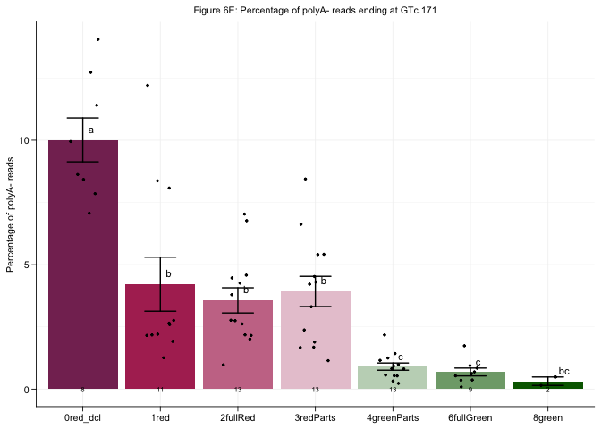
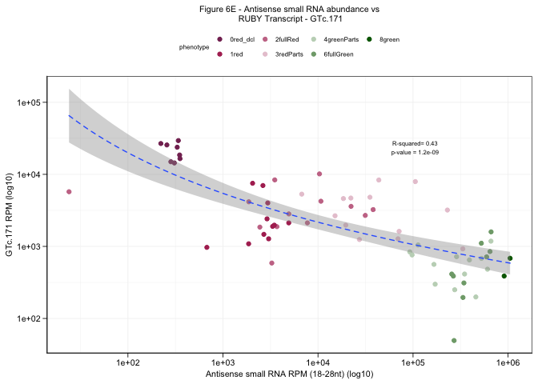

Figure_6
================

This is an [R Markdown](http://rmarkdown.rstudio.com) Notebook. When you
execute code within the notebook, the results appear beneath the code.

``` r
library(tidyverse)
```

    ## ── Attaching core tidyverse packages ──────────────────────── tidyverse 2.0.0 ──
    ## ✔ dplyr     1.1.4     ✔ readr     2.1.5
    ## ✔ forcats   1.0.0     ✔ stringr   1.5.1
    ## ✔ ggplot2   3.5.1     ✔ tibble    3.2.1
    ## ✔ lubridate 1.9.3     ✔ tidyr     1.3.1
    ## ✔ purrr     1.0.2     
    ## ── Conflicts ────────────────────────────────────────── tidyverse_conflicts() ──
    ## ✖ dplyr::filter() masks stats::filter()
    ## ✖ dplyr::lag()    masks stats::lag()
    ## ℹ Use the conflicted package (<http://conflicted.r-lib.org/>) to force all conflicts to become errors

``` r
library(ggrepel)
```

    ## Warning: package 'ggrepel' was built under R version 4.3.3

``` r
library(ggpubr)
library(janitor)
```

    ## 
    ## Attaching package: 'janitor'
    ## 
    ## The following objects are masked from 'package:stats':
    ## 
    ##     chisq.test, fisher.test

``` r
library(RColorBrewer)
library(patchwork)
library("ggsci")
```

    ## Warning: package 'ggsci' was built under R version 4.3.3

``` r
library("scales")
```

    ## 
    ## Attaching package: 'scales'
    ## 
    ## The following object is masked from 'package:purrr':
    ## 
    ##     discard
    ## 
    ## The following object is masked from 'package:readr':
    ## 
    ##     col_factor

``` r
library(ggh4x)
```

    ## 
    ## Attaching package: 'ggh4x'
    ## 
    ## The following object is masked from 'package:ggplot2':
    ## 
    ##     guide_axis_logticks

``` r
library(multcompView)
```

``` r
## Set themes
themes <- theme(plot.title = element_text(size=8,color='black',hjust = 0.5),
                axis.text = element_text(size=8,color = 'black'),
                axis.title.x = element_text(color = "black",size=8),
                axis.title.y = element_text(color = "black",size=8),
                strip.text = element_text(color = "black",size=8),
                legend.position = 'top',
                legend.key.size= unit(0.3,"cm"),
                legend.text = element_text(color = "black",size=6),
                legend.title = element_text(color = "black",size=6),
                line = element_line(color = 'black',linewidth=0.3,lineend="round"),
                axis.line=element_line(color='black',linewidth=0.3,lineend="round"),
                axis.ticks.length=unit(0.0516,"in"),
                axis.ticks=element_line(color='black',linewidth=0.3,lineend="round"),
                panel.background = element_blank(),
                panel.grid.major = element_line(color = 'grey95'),
                panel.grid.minor = element_line(color = 'grey95'))
```

``` r
## Figure 6D- look at the percentage of reads ending at Gluc-171

inNorm <- read.table("/Users/mariannekramer/Google Drive/Kramer_et_al_AIO/Figures/ruby_aio_read_Count/number_reads_mapped.ruby_rounds1235.txt",header = TRUE)
norm <- inNorm %>% transmute(sample, MapTotal = rRNA+Targets+Non_targets)

```

    ## Warning: Expected 1 pieces. Additional pieces discarded in 79 rows [1, 2, 3, 4, 5, 6, 7,
    ## 8, 9, 10, 11, 12, 13, 14, 15, 16, 17, 18, 19, 20, ...].

``` r
phenoColors <- c("#853061","#B03060","#C97795","#E8C8D4","#C2D5C0","#7FA779","#006400")

## Read files with the number of reads ending at Gluc.-171 or not
round1.3343.all <- read.table("/Users/mariannekramer/Google Drive/Kramer_et_al_AIO/Figures/ruby_aio_read_Count/end_at_3343/all.non_pA.filtered.rRNA_free.mapped_to_targets.RUBY_end_at_3343.counts.ruby_round1.final.txt", col.names=c("Count","Gene","Sample"), as.is = T)
round2.3343.all <- read.table("/Users/mariannekramer/Google Drive/Kramer_et_al_AIO/Figures/ruby_aio_read_Count/end_at_3343/all.non_pA.filtered.rRNA_free.mapped_to_targets.RUBY_end_at_3343.counts.ruby_round2.final.txt", col.names=c("Count","Gene","Sample"), as.is = T)
round5.3343.all <- read.table("/Users/mariannekramer/Google Drive/Kramer_et_al_AIO/Figures/ruby_aio_read_Count/end_at_3343/all.non_pA.filtered.rRNA_free.mapped_to_targets.RUBY_end_at_3343.counts.ruby_round5.final.txt", col.names=c("Count","Gene","Sample"), as.is = T)

round1.not3343.all <- read.table("/Users/mariannekramer/Google Drive/Kramer_et_al_AIO/Figures/ruby_aio_read_Count/end_at_3343/all.non_pA.filtered.rRNA_free.mapped_to_targets.RUBY_not_end_at_3343.counts.ruby_round1.final.txt", col.names=c("Count","Gene","Sample"), as.is = T)
round2.not3343.all <- read.table("/Users/mariannekramer/Google Drive/Kramer_et_al_AIO/Figures/ruby_aio_read_Count/end_at_3343/all.non_pA.filtered.rRNA_free.mapped_to_targets.RUBY_not_end_at_3343.counts.ruby_round2.final.txt", col.names=c("Count","Gene","Sample"), as.is = T)
round5.not3343.all <- read.table("/Users/mariannekramer/Google Drive/Kramer_et_al_AIO/Figures/ruby_aio_read_Count/end_at_3343/all.non_pA.filtered.rRNA_free.mapped_to_targets.RUBY_not_end_at_3343.counts.ruby_round5.final.txt", col.names=c("Count","Gene","Sample"), as.is = T)

## Add Round to df
round1.3343.all <- round1.3343.all %>% mutate(Round = "Round 1")
round2.3343.all <- round2.3343.all %>% mutate(Round = "Round 2")
round5.3343.all <- round5.3343.all %>% mutate(Round = "Round 5")

round1.not3343.all <- round1.not3343.all %>% mutate(Round = "Round 1")
round2.not3343.all <- round2.not3343.all %>% mutate(Round = "Round 2")
round5.not3343.all <- round5.not3343.all %>% mutate(Round = "Round 5")

## Combine rounds and normalize 
norm.merge.3343 <- rbind(round1.3343.all,round2.3343.all,round5.3343.all)  %>% 
  left_join(norm,by=c("Sample"="sample")) %>%
  transmute(Gene,Sample,Round, normCount = round(Count / MapTotal*1000000,2)) %>%
  separate(Sample, into=c("Genotype","Promoter","Phenotype"),sep="[.]") %>% 
  filter(Phenotype != "7green" ) %>% 
  mutate(Phenotype = case_when(Phenotype == "2reddish" ~ "1red", TRUE ~ Phenotype)) %>%
  separate(Genotype, into=c("Num","Event","Rep"),sep="_") %>% 
  mutate(background = case_when(Promoter == "35S_dcl1234" ~ "dcl1234", TRUE ~ "Wt")) %>%
  mutate(Event = str_replace(Event,"MK0",""),Rep = str_replace(Rep,"rep","Rep ")) %>% select(!Num) %>%
  mutate(Phenotype = case_when(background == "dcl1234" ~ "0red_dcl",Phenotype == "5fullRed" ~"2fullRed", TRUE ~ Phenotype),
         class = "end_at_3343")

norm.merge.not3343 <- rbind(round1.not3343.all,round2.not3343.all,round5.not3343.all)  %>% left_join(norm,by=c("Sample"="sample")) %>%
  transmute(Gene,Sample, Round,normCount = round(Count / MapTotal*1000000,2)) %>%
  separate(Sample, into=c("Genotype","Promoter","Phenotype"),sep="[.]") %>% 
  filter(Phenotype != "7green" ) %>%
  mutate(Phenotype = case_when(Phenotype == "2reddish" ~ "1red", TRUE ~ Phenotype)) %>%
  separate(Genotype, into=c("Num","Event","Rep"),sep="_") %>% 
  mutate(background = case_when(Promoter == "35S_dcl1234" ~ "dcl1234", TRUE ~ "Wt")) %>%
  mutate(Event = str_replace(Event,"MK0",""),Rep = str_replace(Rep,"rep","Rep ")) %>% select(!Num) %>%
  mutate(Phenotype = case_when(background == "dcl1234" ~ "0red_dcl",Phenotype == "5fullRed" ~"2fullRed", TRUE ~ Phenotype),
         class = "other")


## Generate bar plot for percentage of reads mapping to 3343 in each phenotype
## Calculate the percentage of reads ending at Gluc-181
pctReads <- norm.merge.3343 %>% 
  left_join(norm.merge.not3343,by=c("Gene","Event","Rep","Promoter","Phenotype","background")) %>% 
  mutate(normTotal = normCount.x + normCount.y, pct3343 = (normCount.x/normTotal) * 100,
         pctnot3343 = (normCount.y/normTotal) * 100)


## Perform ANOVA test
anova <- aov(pct3343 ~ Phenotype, data = pctReads)
tukey <- TukeyHSD(anova)
tukey_df <- as.data.frame(tukey$Phenotype)
tukey_df <- mutate(tukey_df, Sig = case_when(`p adj` < 0.001 ~ "***",`p adj` > 0.001 & `p adj` < 0.01 ~ "**",
                                             `p adj` > 0.01 & `p adj` < 0.05 ~ "*", TRUE ~ "NS"))
#write.table(tukey_df, file = "~/Google Drive/Kramer_et_al_AIO/Figures/ruby_aio_read_Count/end_at_3343/number_reads_ending_at_3343.all.pct.ANOVA.tukey.txt", quote=F, row.names = T, col.names=T, sep= "\t")
print(tukey_df)
```

    ##                              diff        lwr         upr        p adj Sig
    ## 1red-0red_dcl          -5.7969805  -8.782368 -2.81159309 3.132385e-06 ***
    ## 2fullRed-0red_dcl      -6.4471162  -9.334192 -3.56004026 9.671372e-08 ***
    ## 3redParts-0red_dcl     -6.0890202  -8.976096 -3.20194423 4.298940e-07 ***
    ## 4greenParts-0red_dcl   -9.1088311 -11.995907 -6.22175512 2.036038e-11 ***
    ## 6fullGreen-0red_dcl    -9.3255168 -12.447449 -6.20358479 2.934808e-11 ***
    ## 8green-0red_dcl        -9.6948906 -14.774207 -4.61557446 4.617641e-06 ***
    ## 2fullRed-1red          -0.6501357  -3.282238  1.98196701 9.884433e-01  NS
    ## 3redParts-1red         -0.2920397  -2.924142  2.34006304 9.998707e-01  NS
    ## 4greenParts-1red       -3.3118506  -5.943953 -0.67974785 5.247257e-03  **
    ## 6fullGreen-1red        -3.5285363  -6.416307 -0.64076611 7.393507e-03  **
    ## 8green-1red            -3.8979101  -8.836757  1.04093689 2.140542e-01  NS
    ## 3redParts-2fullRed      0.3580960  -2.161950  2.87814253 9.994579e-01  NS
    ## 4greenParts-2fullRed   -2.6617149  -5.181761 -0.14166835 3.182234e-02   *
    ## 6fullGreen-2fullRed    -2.8784006  -5.664417 -0.09238437 3.841306e-02   *
    ## 8green-2fullRed        -3.2477744  -8.127823  1.63227472 4.080770e-01  NS
    ## 4greenParts-3redParts  -3.0198109  -5.539857 -0.49976438 9.196903e-03  **
    ## 6fullGreen-3redParts   -3.2364966  -6.022513 -0.45048040 1.282425e-02   *
    ## 8green-3redParts       -3.6058704  -8.485919  1.27417869 2.840769e-01  NS
    ## 6fullGreen-4greenParts -0.2166858  -3.002702  2.56933048 9.999840e-01  NS
    ## 8green-4greenParts     -0.5860595  -5.466109  4.29398958 9.997950e-01  NS
    ## 8green-6fullGreen      -0.3693737  -5.391936  4.65318846 9.999885e-01  NS

``` r
## Assign letters for plot
cld <- multcompLetters4(anova, tukey)
Tk <- group_by(pctReads, Phenotype) %>%
  summarise(mean=mean(pct3343), quant = quantile(pct3343, probs = 0.75)) %>%
  arrange(desc(mean))

# extracting the compact letter display and adding to the Tk table
cld <- as.data.frame.list(cld$Phenotype)
Tk$cld <- cld$Letters

pctReads  %>% group_by(Promoter,Phenotype,background) %>% 
  dplyr::summarize(avg.pct3343 = mean(pct3343), sem.pct3343 = sd(pct3343)/sqrt(n()),numBR=n()) %>%
  ggplot(aes(x=Phenotype,y=avg.pct3343,fill=Phenotype)) + 
  geom_col(position=position_dodge(0.9))+ 
  geom_jitter(data=pctReads, aes(x=Phenotype,y=pct3343),inherit.aes=F,width =0.2,size=0.5)+ 
  geom_errorbar(aes(ymin=avg.pct3343-sem.pct3343, ymax=avg.pct3343+sem.pct3343),
                width=0.4,position=position_dodge(0.9),lineend="round")+
  geom_text(aes(label=numBR,y=0),size=2)+
  scale_y_continuous(labels=scales::label_number(scale_cut = cut_short_scale())) +
  themes + scale_fill_manual(values=phenoColors)  + 
  ggtitle("Figure 6D: Percentage of polyA- reads ending at Gluc.-171") + 
  ylab("Percentage of polyA- reads") +
  theme(axis.title.x=element_blank(),legend.position="none")+
  geom_text(data=Tk,aes(x=Phenotype,y=mean,label=cld), size = 3, vjust=-1, hjust =-1)
```

    ## `summarise()` has grouped output by 'Promoter', 'Phenotype'. You can override
    ## using the `.groups` argument.

<!-- -->

``` r
## Figure 6E - compare the number of reads ending at Gluc-171 and sRNA levels
## Read in sRNA data
# Wt samples
inWt <- read.table("/Users/mariannekramer/Google Drive/Kramer_et_al_AIO/Figures/ruby_srna/all_samples.ruby_round1_2.total_sRNA_counts.perSize.txt", col.names = c("count","target","size","strand", "sample","phenotype"), as.is = T)
# Read files to normalize sRNA data and format
inNorm.R25 <- read.table("/Users/mariannekramer/Google Drive/Kramer_et_al_AIO/Figures/ruby_srna/number_mapped_reads.R25.txt", 
                         header=T, as.is = T)
inNorm.R25 <- inNorm.R25 %>% separate(Sample, into=c("Sample"),sep="[.]")
```

    ## Warning: Expected 1 pieces. Additional pieces discarded in 61 rows [8, 9, 10, 11, 12,
    ## 13, 14, 15, 16, 17, 18, 19, 20, 21, 22, 23, 24, 25, 26, 27, ...].

``` r
# dcl1234 samples
indcl <- read.table("/Users/mariannekramer/Google Drive/Kramer_et_al_AIO/Figures/ruby_srna/all_samples.ruby_round5.total_sRNA_counts.perSize.txt",col.names=c("count","target","size","strand","sample","phenotype"))
# Read files to normalize sRNA data and format
inNorm.R26 <- read.table("/Users/mariannekramer/Google Drive/Slotkin_lab_projects/R26/number_mapped_reads.R26.txt",header=T)
inNorm.R26 <- inNorm.R26 %>% separate(Sample, into=c("Sample"),sep="[.]")
```

    ## Warning: Expected 1 pieces. Additional pieces discarded in 58 rows [1, 2, 3, 4, 5, 6, 7,
    ## 8, 9, 16, 17, 18, 19, 20, 21, 22, 23, 24, 25, 26, ...].

``` r
## Format wt samples
inWt.mod <- inWt %>% mutate(sample=case_when(sample=="R1S02_MK017R_BR1"~"R1S02_MK017_BR1",
                                             sample=="R1S22_MK010R_BR1"~"R1S22_MK010_BR1",
                                             grepl("MK041A",sample) ~ str_replace(sample, "MK041A","MK041"),
                                             grepl("MK034R",sample) ~ str_replace(sample, "MK034R","MK034"),TRUE ~ sample)) %>% 
  left_join(inNorm.R25, by=c("sample"="Sample")) %>% 
  mutate(sample = str_replace(sample,"BR","rep"),
         background="Wt",phenotype = case_when(phenotype == "total_sRNA_counts"~ "0no_tg",TRUE ~ phenotype)) %>%
  separate(sample,into=c("foo","geno","rep")) %>% tidyr::unite("sample",geno:rep,sep="_") %>% select(!foo)
```

    ## Warning: Expected 3 pieces. Additional pieces discarded in 21 rows [1335, 1336, 1337,
    ## 1338, 1339, 1340, 1341, 1342, 1343, 1344, 1345, 1346, 1347, 1348, 1349, 1350,
    ## 1351, 1352, 1353, 1354, ...].

``` r
## Format dcl samples
indcl.mod <- indcl %>% left_join(inNorm.R26, by=c("sample"="Sample"))  %>% filter(!grepl("MK016",sample)) %>% 
  mutate(background = case_when(grepl("wt",sample) ~ "Wt",TRUE ~ "dcl1234"), 
         phenotype = case_when(phenotype == "perSize" ~ "0no_tg",TRUE ~ phenotype))

## Combine wt and dcl data and normalize
data.srna <- rbind(inWt.mod,indcl.mod) %>% tidyr::unite("sample",c(sample:phenotype),sep=".")%>% 
  group_by(target,sample,strand,Num_Mapped_Reads,background) %>% dplyr::summarize(sRNA.Count = sum(count)) %>%
  mutate(normsRNA = (sRNA.Count / Num_Mapped_Reads)*1000000) %>% filter(grepl("MK",sample))
```

    ## `summarise()` has grouped output by 'target', 'sample', 'strand',
    ## 'Num_Mapped_Reads'. You can override using the `.groups` argument.

``` r
# Merge 3343 reads and other reads
# Modify df so I can merge with sRNA
data.aio.norm <- rbind(norm.merge.3343,norm.merge.not3343) %>% 
  mutate(Event = paste("MK0",Event,sep=""),Rep = str_replace(Rep,"Rep ","rep"),
         Phenotype = case_when(Phenotype == "0red_dcl"~ "1red",
                               Phenotype=="2fullRed"~"5fullRed",grepl("MK034",Event)~"2reddish",TRUE ~ Phenotype),
         Event = str_replace(Event,"MK041A","MK041")) %>% 
  tidyr::unite("sample",Event:Rep,sep="_") %>% tidyr::unite("sample",c(sample,Phenotype),sep=".") 

## Combine sRNA df and AIO df
sRNA.3343 <- data.srna   %>%
  left_join(data.aio.norm,by=c("sample","background","target"="Gene"),relationship = "many-to-many") %>%
  separate(sample, into=c("genotype","phenotype"), sep = "[.]") %>% filter(phenotype!="0no_tg") %>% 
  mutate(phenotype = case_when(background=="dcl1234"~"0red_dcl",phenotype == "5fullRed"~"2fullRed",
                               phenotype=="2reddish"~"1red",TRUE ~ phenotype))

### Calculate R2 value and generate df to add to plot
# Extracting the linear model
lm_model.plus.3343 <- lm(normCount ~ log(sRNA.Count), data = filter(sRNA.3343,strand =="+" & class == "end_at_3343"))
lm_model.minus.3343 <- lm(normCount ~ log(sRNA.Count), data = filter(sRNA.3343,strand =="-"& class == "end_at_3343"))
lm_model.plus.not3343 <- lm(normCount ~ log(sRNA.Count), data = filter(sRNA.3343,strand =="+"& class == "other"))
lm_model.minus.not3343 <- lm(normCount ~ log(sRNA.Count), data = filter(sRNA.3343,strand =="-"& class == "other"))

# Extracting R-squared value
rsquared.plus.3343 <- summary(lm_model.plus.3343)$r.squared
rsquared.minus.3343  <- summary(lm_model.minus.3343)$r.squared
rsquared.plus.not3343 <- summary(lm_model.plus.not3343)$r.squared
rsquared.minus.not3343  <- summary(lm_model.minus.not3343)$r.squared

# Extracting p-value value
pval.plus.3343 <- summary(lm_model.plus.3343)$fstatistic
pval.plus.3343 <- pf(pval.plus.3343[1], pval.plus.3343[2], pval.plus.3343[3], lower.tail = FALSE)

pval.minus.3343 <- summary(lm_model.minus.3343)$fstatistic
pval.minus.3343 <- pf(pval.minus.3343[1], pval.minus.3343[2], pval.minus.3343[3], lower.tail = FALSE)

pval.plus.not3343 <- summary(lm_model.plus.not3343)$fstatistic
pval.plus.not3343 <- pf(pval.plus.not3343[1], pval.plus.not3343[2], pval.plus.not3343[3], lower.tail = FALSE)

pval.minus.not3343 <- summary(lm_model.minus.not3343)$fstatistic
pval.minus.not3343 <- pf(pval.minus.not3343[1], pval.minus.not3343[2], pval.minus.not3343[3], lower.tail = FALSE)

# Get val
yval.plus.3343 <- max(filter(sRNA.3343,strand == "+"& class == "end_at_3343")$normCount)
yval.minus.3343 <-  max(filter(sRNA.3343,strand == "-"& class == "end_at_3343")$normCount)
yval.plus.not3343 <- max(filter(sRNA.3343,strand == "+"& class == "other")$normCount)
yval.minus.not3343 <-  max(filter(sRNA.3343,strand == "-"& class == "other")$normCount)

## Create table for Rsquared facets
rsquared.labels = data.frame(
  strand = c("-","+","-","+"),
  class = c("end_at_3343","end_at_3343","other","other"),
  rsquared = c(rsquared.minus.3343,rsquared.plus.3343,rsquared.minus.not3343,rsquared.plus.not3343),
  yval = c(yval.minus.3343,yval.plus.3343,yval.minus.not3343,yval.plus.not3343),
  pval=c(pval.minus.3343,round(pval.plus.3343,7),round(pval.minus.not3343,4),round(pval.plus.not3343,4)))

rsquared.labels<- rsquared.labels %>% 
  mutate(x_pos = case_when(class=="end_at_3343"~ max(sRNA.3343$sRNA.Count)*0.1,
                           class=="other"~ min(sRNA.3343$sRNA.Count)*3000),
         y_pos = yval*0.8)%>% 
  filter(class=="end_at_3343" & strand == "-")

sRNA.3343 %>% filter(class=="end_at_3343" & strand == "-") %>% 
  ggplot(aes(y=normCount,x=sRNA.Count)) + geom_point(aes(color=phenotype)) + 
  geom_smooth(method="lm",formula = y ~ log(x),linetype="dashed",linewidth=0.5,lineend="round")+
  geom_text(inherit.aes = F, data =rsquared.labels, 
            aes(x=x_pos,y=y_pos,label=paste("R-squared= ", round(rsquared,2),"\n","p-value = ",round(pval,10),sep="")),size=2)+
  scale_x_log10() + scale_y_log10()+
  scale_color_manual(values=phenoColors)+ 
  ylab("Gluc.-171 RPM (log10)") + xlab("Antisense small RNA RPM (18-28nt) (log10)")+
  theme_bw()+themes+
  ggtitle("Figure 6E - Antisense small RNA abundance vs\n RUBY Transcript - Gluc.-171")+
  guides(color = guide_legend(nrow = 2))
```

<!-- -->
