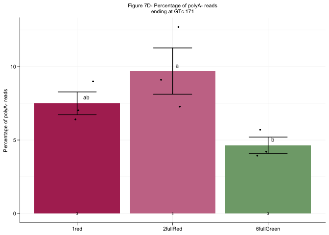
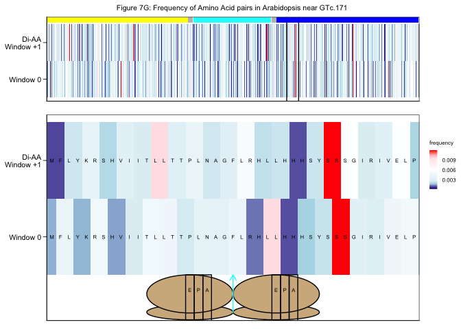

Figure_7
================

This is an [R Markdown](http://rmarkdown.rstudio.com) Notebook. When you
execute code within the notebook, the results appear beneath the code.

``` r
## Get Relevant Packages
library(tidyverse)
```

    ## ── Attaching core tidyverse packages ──────────────────────── tidyverse 2.0.0 ──
    ## ✔ dplyr     1.1.4     ✔ readr     2.1.5
    ## ✔ forcats   1.0.0     ✔ stringr   1.5.1
    ## ✔ ggplot2   3.5.1     ✔ tibble    3.2.1
    ## ✔ lubridate 1.9.4     ✔ tidyr     1.3.1
    ## ✔ purrr     1.0.4     
    ## ── Conflicts ────────────────────────────────────────── tidyverse_conflicts() ──
    ## ✖ dplyr::filter() masks stats::filter()
    ## ✖ dplyr::lag()    masks stats::lag()
    ## ℹ Use the conflicted package (<http://conflicted.r-lib.org/>) to force all conflicts to become errors

``` r
library(ggrepel)
library(ggpubr)
library(janitor)
```

    ## 
    ## Attaching package: 'janitor'
    ## 
    ## The following objects are masked from 'package:stats':
    ## 
    ##     chisq.test, fisher.test

``` r
library(RColorBrewer)
library(patchwork)
library("ggsci")
library("scales")
```

    ## 
    ## Attaching package: 'scales'
    ## 
    ## The following object is masked from 'package:purrr':
    ## 
    ##     discard
    ## 
    ## The following object is masked from 'package:readr':
    ## 
    ##     col_factor

``` r
library(ggh4x)
library(see)
```

    ## 
    ## Attaching package: 'see'
    ## 
    ## The following objects are masked from 'package:ggsci':
    ## 
    ##     scale_color_material, scale_colour_material, scale_fill_material

``` r
library(gggenes)
library(multcompView)
library(Biostrings)
```

    ## Loading required package: BiocGenerics
    ## 
    ## Attaching package: 'BiocGenerics'
    ## 
    ## The following objects are masked from 'package:lubridate':
    ## 
    ##     intersect, setdiff, union
    ## 
    ## The following objects are masked from 'package:dplyr':
    ## 
    ##     combine, intersect, setdiff, union
    ## 
    ## The following objects are masked from 'package:stats':
    ## 
    ##     IQR, mad, sd, var, xtabs
    ## 
    ## The following objects are masked from 'package:base':
    ## 
    ##     anyDuplicated, aperm, append, as.data.frame, basename, cbind,
    ##     colnames, dirname, do.call, duplicated, eval, evalq, Filter, Find,
    ##     get, grep, grepl, intersect, is.unsorted, lapply, Map, mapply,
    ##     match, mget, order, paste, pmax, pmax.int, pmin, pmin.int,
    ##     Position, rank, rbind, Reduce, rownames, sapply, saveRDS, setdiff,
    ##     table, tapply, union, unique, unsplit, which.max, which.min
    ## 
    ## Loading required package: S4Vectors
    ## Loading required package: stats4
    ## 
    ## Attaching package: 'S4Vectors'
    ## 
    ## The following objects are masked from 'package:lubridate':
    ## 
    ##     second, second<-
    ## 
    ## The following objects are masked from 'package:dplyr':
    ## 
    ##     first, rename
    ## 
    ## The following object is masked from 'package:tidyr':
    ## 
    ##     expand
    ## 
    ## The following object is masked from 'package:utils':
    ## 
    ##     findMatches
    ## 
    ## The following objects are masked from 'package:base':
    ## 
    ##     expand.grid, I, unname
    ## 
    ## Loading required package: IRanges
    ## 
    ## Attaching package: 'IRanges'
    ## 
    ## The following object is masked from 'package:lubridate':
    ## 
    ##     %within%
    ## 
    ## The following objects are masked from 'package:dplyr':
    ## 
    ##     collapse, desc, slice
    ## 
    ## The following object is masked from 'package:purrr':
    ## 
    ##     reduce
    ## 
    ## Loading required package: XVector
    ## 
    ## Attaching package: 'XVector'
    ## 
    ## The following object is masked from 'package:purrr':
    ## 
    ##     compact
    ## 
    ## Loading required package: GenomeInfoDb
    ## 
    ## Attaching package: 'Biostrings'
    ## 
    ## The following object is masked from 'package:base':
    ## 
    ##     strsplit

``` r
library(zoo)
```

    ## 
    ## Attaching package: 'zoo'
    ## 
    ## The following objects are masked from 'package:base':
    ## 
    ##     as.Date, as.Date.numeric

``` r
library(ggforce)
```

``` r
## Set themes
themes <- theme(plot.title = element_text(size=8,color='black',hjust = 0.5),
                axis.text = element_text(size=8,color = 'black'),
                axis.title.x = element_blank(),
                axis.title.y = element_text(color = "black",size=8),
                strip.text = element_text(color = "black",size=8),
                legend.position = 'top',
                legend.key.size= unit(0.3,"cm"),
                legend.text = element_text(color = "black",size=6),
                legend.title = element_text(color = "black",size=6),
                line = element_line(color = 'black',linewidth=0.3,lineend="round"),
                axis.line=element_line(color='black',linewidth=0.3,lineend="round"),
                axis.ticks.length=unit(0.0516,"in"),
                axis.ticks=element_line(color='black',linewidth=0.3,lineend="round"),
                panel.background = element_blank(),
                panel.grid.major = element_line(color = 'grey95'),
                panel.grid.minor = element_line(color = 'grey95'))
```

## Figure 7B - All Reads mapping to RUBY

``` r
# Read in file to normalize
inNorm <- read.table("/Users/mariannekramer/Google Drive/Kramer_et_al_AIO/Figures/ruby_aio_read_Count/lettuce/number_reads_mapped.ruby_round4.txt",header = TRUE)
norm <- inNorm %>% transmute(sample, MapTotal = rRNA+Targets+Non.targets)

## Read in file with all reads mapping to RUBY per sample
round4.all <- read.table("/Users/mariannekramer/Google Drive/Kramer_et_al_AIO/Figures/ruby_aio_read_Count/lettuce/all.combined_numReads_mapped_to_targets.strandedness.perpA.round4.txt", header = T, as.is = T)


# Format df
mergeFile.all <- round4.all %>% 
  mutate(Name = case_when(grepl("RUBY",Gene) ~ "RUBY", TRUE ~ Name),Gene = case_when(grepl("RUBY",Gene) ~ "RUBY", TRUE ~ Gene)) %>%
  tidyr::unite(tmp,c(Gene,Name,Class),sep="__") %>% 
  complete(tmp,Sample,fill=list(Sense_non_pA=0,Sense_pA=0,Total=0)) %>% 
  separate(tmp,into=c("Gene","Name","Class"),sep="__") 

# Normalize by sample size
norm.All <- mergeFile.all %>% left_join(norm,by=c("Sample"="sample")) %>% 
  transmute(Gene,Name,Class,Sample,
            normSense_nonpA= round((Sense_non_pA/MapTotal)*1000000,2),
            normSense_pA= round((Sense_pA/MapTotal)*1000000,2)) %>% 
  rowwise() %>% mutate(normTotal=normSense_nonpA+normSense_pA) %>% 
  mutate(Name = case_when(Gene==Name ~ "", TRUE~ Name),
         pctSensepA = round((normSense_pA/normTotal)*100,2), 
         pctSensenonpA = round((normSense_nonpA/normTotal)*100,2)) %>% 
  mutate_if(is.numeric, ~replace(.,is.nan(.), 0)) %>% 
  tidyr::unite(Name,c(Gene,Name),sep="\n") %>% separate(Sample,into=c("genotype","promoter","phenotype"),sep="[.]") %>% 
  separate(genotype,into=c("num","plant","rep"),sep="_") %>% tidyr::unite(genotype, c(plant,rep),sep="_")

## Dfine Colors
phenoColors <- c("#B03060","#C97795","#E8C8D4","#C2D5C0","#7FA779","#006400")

## Filter and format df for plotting
all.RUBY2 <- norm.All %>% filter(grepl("RUBY",Name)) %>%  separate(genotype,into=c("Genotype","Rep")) %>% mutate(class = case_when(phenotype == "1red" ~ "Always Red", phenotype == "8green" ~ "Always Green",TRUE~ "Red-to-Green"),phenotype = case_when(phenotype == "5fullRed"~"2fullRed",TRUE ~ phenotype)) %>% mutate(Rep = str_replace(Rep,"rep","Rep "),phenotype = case_when((promoter == "LsUBQ" & phenotype=="3redParts")~"2fullRed",(promoter == "LsUBQ" & phenotype=="4greenParts")~"6fullGreen",TRUE ~ phenotype)) %>% filter(!(promoter == "35S" & phenotype=="3redParts")) %>% mutate(stats=paste(promoter,phenotype,sep="_"))


## Perform ANOVA test
anova <- aov(normTotal ~ stats, data = all.RUBY2)
tukey <- TukeyHSD(anova)
tukey_df <- as.data.frame(tukey$stats)
tukey_df <- mutate(tukey_df, Sig = case_when(`p adj` < 0.001 ~ "***",`p adj` > 0.001 & `p adj` < 0.01 ~ "**",
                                             `p adj` > 0.01 & `p adj` < 0.05 ~ "*", TRUE ~ "NS"))
write.table(tukey_df, file = "~/Google Drive/Kramer_et_al_AIO/Figures/ruby_aio_read_Count/lettuce/reads_mapping_to_RUBY.all.avg.bypheno.ANOVA.tukey.txt", quote=F, row.names = T, col.names=T, sep= "\t")
print(tukey_df)
```

    ##                                             diff        lwr        upr
    ## 35S_2fullRed-35S_1red               17384.880000  -31974.50  66744.258
    ## 35S_6fullGreen-35S_1red            -54410.490000 -103769.87  -5051.112
    ## 35S_8green-35S_1red                -56719.483333 -106078.86  -7360.105
    ## AtUBQ_1red-35S_1red                -47478.653333  -96838.03   1880.725
    ## AtUBQ_3redParts-35S_1red           -51850.813333 -101210.19  -2491.435
    ## AtUBQ_4greenParts-35S_1red         -56164.430000 -105523.81  -6805.052
    ## AtUBQ_8green-35S_1red              -56597.126667 -105956.50  -7237.749
    ## LsUBQ_1red-35S_1red                -45013.720000  -94373.10   4345.658
    ## LsUBQ_2fullRed-35S_1red            -44043.420000  -93402.80   5315.958
    ## LsUBQ_6fullGreen-35S_1red          -56251.496667 -105610.87  -6892.119
    ## LsUBQ_8green-35S_1red              -56723.866667 -106083.24  -7364.489
    ## 35S_6fullGreen-35S_2fullRed        -71795.370000 -121154.75 -22435.992
    ## 35S_8green-35S_2fullRed            -74104.363333 -123463.74 -24744.985
    ## AtUBQ_1red-35S_2fullRed            -64863.533333 -114222.91 -15504.155
    ## AtUBQ_3redParts-35S_2fullRed       -69235.693333 -118595.07 -19876.315
    ## AtUBQ_4greenParts-35S_2fullRed     -73549.310000 -122908.69 -24189.932
    ## AtUBQ_8green-35S_2fullRed          -73982.006667 -123341.38 -24622.629
    ## LsUBQ_1red-35S_2fullRed            -62398.600000 -111757.98 -13039.222
    ## LsUBQ_2fullRed-35S_2fullRed        -61428.300000 -110787.68 -12068.922
    ## LsUBQ_6fullGreen-35S_2fullRed      -73636.376667 -122995.75 -24276.999
    ## LsUBQ_8green-35S_2fullRed          -74108.746667 -123468.12 -24749.369
    ## 35S_8green-35S_6fullGreen           -2308.993333  -51668.37  47050.385
    ## AtUBQ_1red-35S_6fullGreen            6931.836667  -42427.54  56291.215
    ## AtUBQ_3redParts-35S_6fullGreen       2559.676667  -46799.70  51919.055
    ## AtUBQ_4greenParts-35S_6fullGreen    -1753.940000  -51113.32  47605.438
    ## AtUBQ_8green-35S_6fullGreen         -2186.636667  -51546.01  47172.741
    ## LsUBQ_1red-35S_6fullGreen            9396.770000  -39962.61  58756.148
    ## LsUBQ_2fullRed-35S_6fullGreen       10367.070000  -38992.31  59726.448
    ## LsUBQ_6fullGreen-35S_6fullGreen     -1841.006667  -51200.38  47518.371
    ## LsUBQ_8green-35S_6fullGreen         -2313.376667  -51672.75  47046.001
    ## AtUBQ_1red-35S_8green                9240.830000  -40118.55  58600.208
    ## AtUBQ_3redParts-35S_8green           4868.670000  -44490.71  54228.048
    ## AtUBQ_4greenParts-35S_8green          555.053333  -48804.32  49914.431
    ## AtUBQ_8green-35S_8green               122.356667  -49237.02  49481.735
    ## LsUBQ_1red-35S_8green               11705.763333  -37653.61  61065.141
    ## LsUBQ_2fullRed-35S_8green           12676.063333  -36683.31  62035.441
    ## LsUBQ_6fullGreen-35S_8green           467.986667  -48891.39  49827.365
    ## LsUBQ_8green-35S_8green                -4.383333  -49363.76  49354.995
    ## AtUBQ_3redParts-AtUBQ_1red          -4372.160000  -53731.54  44987.218
    ## AtUBQ_4greenParts-AtUBQ_1red        -8685.776667  -58045.15  40673.601
    ## AtUBQ_8green-AtUBQ_1red             -9118.473333  -58477.85  40240.905
    ## LsUBQ_1red-AtUBQ_1red                2464.933333  -46894.44  51824.311
    ## LsUBQ_2fullRed-AtUBQ_1red            3435.233333  -45924.14  52794.611
    ## LsUBQ_6fullGreen-AtUBQ_1red         -8772.843333  -58132.22  40586.535
    ## LsUBQ_8green-AtUBQ_1red             -9245.213333  -58604.59  40114.165
    ## AtUBQ_4greenParts-AtUBQ_3redParts   -4313.616667  -53672.99  45045.761
    ## AtUBQ_8green-AtUBQ_3redParts        -4746.313333  -54105.69  44613.065
    ## LsUBQ_1red-AtUBQ_3redParts           6837.093333  -42522.28  56196.471
    ## LsUBQ_2fullRed-AtUBQ_3redParts       7807.393333  -41551.98  57166.771
    ## LsUBQ_6fullGreen-AtUBQ_3redParts    -4400.683333  -53760.06  44958.695
    ## LsUBQ_8green-AtUBQ_3redParts        -4873.053333  -54232.43  44486.325
    ## AtUBQ_8green-AtUBQ_4greenParts       -432.696667  -49792.07  48926.681
    ## LsUBQ_1red-AtUBQ_4greenParts        11150.710000  -38208.67  60510.088
    ## LsUBQ_2fullRed-AtUBQ_4greenParts    12121.010000  -37238.37  61480.388
    ## LsUBQ_6fullGreen-AtUBQ_4greenParts    -87.066667  -49446.44  49272.311
    ## LsUBQ_8green-AtUBQ_4greenParts       -559.436667  -49918.81  48799.941
    ## LsUBQ_1red-AtUBQ_8green             11583.406667  -37775.97  60942.785
    ## LsUBQ_2fullRed-AtUBQ_8green         12553.706667  -36805.67  61913.085
    ## LsUBQ_6fullGreen-AtUBQ_8green         345.630000  -49013.75  49705.008
    ## LsUBQ_8green-AtUBQ_8green            -126.740000  -49486.12  49232.638
    ## LsUBQ_2fullRed-LsUBQ_1red             970.300000  -48389.08  50329.678
    ## LsUBQ_6fullGreen-LsUBQ_1red        -11237.776667  -60597.15  38121.601
    ## LsUBQ_8green-LsUBQ_1red            -11710.146667  -61069.52  37649.231
    ## LsUBQ_6fullGreen-LsUBQ_2fullRed    -12208.076667  -61567.45  37151.301
    ## LsUBQ_8green-LsUBQ_2fullRed        -12680.446667  -62039.82  36678.931
    ## LsUBQ_8green-LsUBQ_6fullGreen        -472.370000  -49831.75  48887.008
    ##                                           p adj Sig
    ## 35S_2fullRed-35S_1red              0.9755579153  NS
    ## 35S_6fullGreen-35S_1red            0.0220673925   *
    ## 35S_8green-35S_1red                0.0149916882   *
    ## AtUBQ_1red-35S_1red                0.0669616891  NS
    ## AtUBQ_3redParts-35S_1red           0.0335828038   *
    ## AtUBQ_4greenParts-35S_1red         0.0164615362   *
    ## AtUBQ_8green-35S_1red              0.0153044587   *
    ## LsUBQ_1red-35S_1red                0.0969436591  NS
    ## LsUBQ_2fullRed-35S_1red            0.1116396629  NS
    ## LsUBQ_6fullGreen-35S_1red          0.0162221679   *
    ## LsUBQ_8green-35S_1red              0.0149805981   *
    ## 35S_6fullGreen-35S_2fullRed        0.0010885538  **
    ## 35S_8green-35S_2fullRed            0.0007243919 ***
    ## AtUBQ_1red-35S_2fullRed            0.0036839553  **
    ## AtUBQ_3redParts-35S_2fullRed       0.0017093630  **
    ## AtUBQ_4greenParts-35S_2fullRed     0.0007988882 ***
    ## AtUBQ_8green-35S_2fullRed          0.0007401919 ***
    ## LsUBQ_1red-35S_2fullRed            0.0056612986  **
    ## LsUBQ_2fullRed-35S_2fullRed        0.0066982345  **
    ## LsUBQ_6fullGreen-35S_2fullRed      0.0007867140 ***
    ## LsUBQ_8green-35S_2fullRed          0.0007238322 ***
    ## 35S_8green-35S_6fullGreen          1.0000000000  NS
    ## AtUBQ_1red-35S_6fullGreen          0.9999939647  NS
    ## AtUBQ_3redParts-35S_6fullGreen     0.9999999999  NS
    ## AtUBQ_4greenParts-35S_6fullGreen   1.0000000000  NS
    ## AtUBQ_8green-35S_6fullGreen        1.0000000000  NS
    ## LsUBQ_1red-35S_6fullGreen          0.9998747095  NS
    ## LsUBQ_2fullRed-35S_6fullGreen      0.9996806790  NS
    ## LsUBQ_6fullGreen-35S_6fullGreen    1.0000000000  NS
    ## LsUBQ_8green-35S_6fullGreen        1.0000000000  NS
    ## AtUBQ_1red-35S_8green              0.9998934286  NS
    ## AtUBQ_3redParts-35S_8green         0.9999998494  NS
    ## AtUBQ_4greenParts-35S_8green       1.0000000000  NS
    ## AtUBQ_8green-35S_8green            1.0000000000  NS
    ## LsUBQ_1red-35S_8green              0.9990245247  NS
    ## LsUBQ_2fullRed-35S_8green          0.9980266976  NS
    ## LsUBQ_6fullGreen-35S_8green        1.0000000000  NS
    ## LsUBQ_8green-35S_8green            1.0000000000  NS
    ## AtUBQ_3redParts-AtUBQ_1red         0.9999999521  NS
    ## AtUBQ_4greenParts-AtUBQ_1red       0.9999417890  NS
    ## AtUBQ_8green-AtUBQ_1red            0.9999063620  NS
    ## LsUBQ_1red-AtUBQ_1red              0.9999999999  NS
    ## LsUBQ_2fullRed-AtUBQ_1red          0.9999999964  NS
    ## LsUBQ_6fullGreen-AtUBQ_1red        0.9999357980  NS
    ## LsUBQ_8green-AtUBQ_1red            0.9998929378  NS
    ## AtUBQ_4greenParts-AtUBQ_3redParts  0.9999999585  NS
    ## AtUBQ_8green-AtUBQ_3redParts       0.9999998851  NS
    ## LsUBQ_1red-AtUBQ_3redParts         0.9999947585  NS
    ## LsUBQ_2fullRed-AtUBQ_3redParts     0.9999798303  NS
    ## LsUBQ_6fullGreen-AtUBQ_3redParts   0.9999999487  NS
    ## LsUBQ_8green-AtUBQ_3redParts       0.9999998480  NS
    ## AtUBQ_8green-AtUBQ_4greenParts     1.0000000000  NS
    ## LsUBQ_1red-AtUBQ_4greenParts       0.9993723588  NS
    ## LsUBQ_2fullRed-AtUBQ_4greenParts   0.9986682512  NS
    ## LsUBQ_6fullGreen-AtUBQ_4greenParts 1.0000000000  NS
    ## LsUBQ_8green-AtUBQ_4greenParts     1.0000000000  NS
    ## LsUBQ_1red-AtUBQ_8green            0.9991126591  NS
    ## LsUBQ_2fullRed-AtUBQ_8green        0.9981866315  NS
    ## LsUBQ_6fullGreen-AtUBQ_8green      1.0000000000  NS
    ## LsUBQ_8green-AtUBQ_8green          1.0000000000  NS
    ## LsUBQ_2fullRed-LsUBQ_1red          1.0000000000  NS
    ## LsUBQ_6fullGreen-LsUBQ_1red        0.9993260840  NS
    ## LsUBQ_8green-LsUBQ_1red            0.9990212349  NS
    ## LsUBQ_6fullGreen-LsUBQ_2fullRed    0.9985811258  NS
    ## LsUBQ_8green-LsUBQ_2fullRed        0.9980207571  NS
    ## LsUBQ_8green-LsUBQ_6fullGreen      1.0000000000  NS

``` r
## Assign letters for plot
cld <- multcompLetters4(anova, tukey)
Tk <- group_by(all.RUBY2,stats, phenotype,class,promoter) %>%
  summarise(mean=mean(normTotal), quant = quantile(normTotal, probs = 0.75)) %>%
  arrange(desc(mean))
```

    ## `summarise()` has grouped output by 'stats', 'phenotype', 'class'. You can
    ## override using the `.groups` argument.

``` r
# extracting the compact letter display and adding to the Tk table
cld <- as.data.frame.list(cld$stats)
Tk$cld <- cld$Letters

all.RUBY2 %>% group_by(phenotype,class,promoter) %>% 
  dplyr::summarize(avg = mean(normTotal), numBR = n(), sem = sd(normTotal)/sqrt(n()))  %>% 
  ggplot(aes(x=phenotype,y=avg,fill=phenotype)) + 
  geom_col(position=position_dodge(0.9),aes(color=phenotype))+ 
  geom_jitter(data=all.RUBY2,aes(x=phenotype,y=normTotal),width =0.2,size=0.5)+
  scale_y_continuous(labels=scales::label_number(scale_cut = cut_short_scale())) +
  geom_errorbar(aes(ymin=avg-sem, ymax=avg+sem),color='black', width=0.3,position=position_dodge(0.9),linewidth=0.3,lineend="round")+
  themes + scale_fill_manual(values=c(phenoColors)) + scale_color_manual(values=c(phenoColors)) + 
  ggtitle("Number of reads ") + ylab("Normalized # reads") + 
  geom_text(aes(label=numBR),y = 0) +theme(legend.position="none")+
  geom_text(data=Tk,aes(x=phenotype,y=quant,label=cld), size = 3, vjust=-1, hjust =-1)+
  facet_nested(~promoter,scales="free_x",space="free",labeller=label_wrap_gen(width = 5, multi_line = TRUE))+
  ggtitle("Figure 7B: Number of RUBY reads in Lettuce")
```

    ## `summarise()` has grouped output by 'phenotype', 'class'. You can override
    ## using the `.groups` argument.

<!-- -->

## Figure 7C - Number of 3’ ends in lettuce

``` r
# Read in file
inFile1 <- read.table("/Users/mariannekramer/Google Drive/Kramer_et_al_AIO/Figures/ruby_3p_end_num/lettuce/all.combined_normalized_3p_read_count.ruby_round4.txt",header=T)

# Format df
data3 <- inFile1 %>% filter(grepl("35S_RUBY",name)& !grepl("3redParts",pheno) ) %>% 
  separate(pheno, into=c("sample","prom","pheno"),sep = "[.]") %>%
  mutate(pheno = case_when(pheno == "5fullRed" ~ "2fullRed",
                           pheno == "2reddish" ~ "9reddish",
                           prom == "35S_dcl1234" ~ "0red_dcl", TRUE~pheno),
         prom = case_when(prom == "35S_dcl1234" ~ "35S", TRUE~prom))%>%
  group_by(start,stop,prom,pheno) %>% 
  dplyr::summarize(merge_count = mean(count),merge_normScore = mean(normScore),if_merge=n()) %>%
  filter(pheno != "8green")
```

    ## `summarise()` has grouped output by 'start', 'stop', 'prom'. You can override
    ## using the `.groups` argument.

``` r
## Perform ANOVA test
anova <- aov(merge_normScore ~ pheno, data = data3)
tukey <- TukeyHSD(anova)
tukey_df <- as.data.frame(tukey$pheno)
tukey_df <- mutate(tukey_df, Sig = case_when(`p adj` < 0.001 ~ "***",`p adj` > 0.001 & `p adj` < 0.01 ~ "**",
                                             `p adj` > 0.01 & `p adj` < 0.05 ~ "*", TRUE ~ "NS"))
print(tukey_df)
```

    ##                             diff          lwr           upr      p adj Sig
    ## 2fullRed-1red       -0.002401697 -0.004526167 -0.0002772273 0.02198107   *
    ## 6fullGreen-1red      0.163470514  0.156586643  0.1703543848 0.00000000 ***
    ## 6fullGreen-2fullRed  0.165872211  0.159000349  0.1727440726 0.00000000 ***

``` r
#write.table(tukey_df, file = "normalized_3p_end_density.ruby.violin.lettuce.ANOVA.tukey.txt", quote=F, row.names = T, col.names=T, sep= "\t")

cld <- multcompLetters4(anova, tukey)

Tk <- group_by(data3, pheno) %>%
  dplyr::summarize(mean=mean(merge_normScore), quant = quantile(merge_normScore, probs = 0.75)) %>%
  arrange(desc(mean))

# extracting the compact letter display and adding to the Tk table
cld <- as.data.frame.list(cld$pheno)
Tk$cld <- cld$Letters

ggplot(data3,aes(x=pheno,y=merge_normScore,fill=pheno))   +
  geom_violinhalf(position = position_nudge(x = -0.25, y = 0),flip=T) +
  geom_boxplot(notch = F,outlier.shape=4,width = 0.3)+  
  theme_bw() + themes +
  scale_fill_manual(values=c("#B03060","#C97795","#7FA779"))+
  scale_color_manual(values=c("#B03060","#C97795","#7FA779"))+
  scale_y_log10()+ ylab("Normalized read count (log10)") + 
  ggtitle("Figure 7C - Normalized reads count at each\n3' end within RUBY") +
  theme(legend.position= "none",axis.text.x = element_text(size=8,color = 'black',angle = 90, vjust = 0.5, hjust=1),
        axis.text.y = element_text(size=8,color = 'black'))+
  geom_text(data=Tk,aes(x=pheno,y=quant,label=cld), size = 3, vjust=-1, hjust =-1) 
```

<!-- -->

## Figure 7D - Reads ending at GTc.171 in lettuce

``` r
inNorm <- read.table("/Users/mariannekramer/Google Drive/Kramer_et_al_AIO/Figures/ruby_aio_read_Count/lettuce/number_reads_mapped.ruby_round4.txt",header = TRUE)
norm <- inNorm %>% transmute(sample, MapTotal = rRNA+Targets+Non.targets)

phenoColors <- c("#B03060","#C97795","#7FA779")

## Read in number of reads ending or not ending at GTc.171
round4.3343.all <- read.table("/Users/mariannekramer/Google Drive/Kramer_et_al_AIO/Figures/ruby_aio_read_Count/end_at_3343/lettuce/all.non_pA.filtered.rRNA_free.mapped_to_targets.RUBY_end_at_3343.counts.ruby_round4.final.txt", col.names=c("Count","Gene","Sample"), as.is = T)

round4.not3343.all <- read.table("/Users/mariannekramer/Google Drive/Kramer_et_al_AIO/Figures/ruby_aio_read_Count/end_at_3343/lettuce/all.non_pA.filtered.rRNA_free.mapped_to_targets.RUBY_not_end_at_3343.counts.ruby_round4.final.txt", col.names=c("Count","Gene","Sample"), as.is = T)


norm.merge.3343 <- round4.3343.all  %>% left_join(norm,by=c("Sample"="sample")) %>%
  transmute(Gene,Sample, normCount = round(Count / MapTotal*1000000,2)) %>%
  separate(Sample, into=c("Genotype","Promoter","Phenotype"),sep="[.]") %>% 
  mutate(Phenotype = case_when(Phenotype == "5fullRed" ~ "2fullRed", TRUE ~ Phenotype)) %>%filter(Phenotype != "3redParts") %>%
  separate(Genotype, into=c("Num","Event","Rep"),sep="_") %>% 
  mutate(Rep = str_replace(Rep,"rep","Rep "),class = "end_at_3343") %>% select(!Num) %>% 
  filter(Promoter == "35S")


norm.merge.not3343 <- round4.not3343.all  %>% left_join(norm,by=c("Sample"="sample")) %>%
  transmute(Gene,Sample, normCount = round(Count / MapTotal*1000000,2)) %>%
  separate(Sample, into=c("Genotype","Promoter","Phenotype"),sep="[.]") %>% 
  mutate(Phenotype = case_when(Phenotype == "5fullRed" ~ "2fullRed", TRUE ~ Phenotype)) %>%filter(Phenotype != "3redParts") %>%
  separate(Genotype, into=c("Num","Event","Rep"),sep="_") %>% 
  mutate(Rep = str_replace(Rep,"rep","Rep "),class = "end_at_3343") %>% select(!Num) %>% 
  filter(Promoter == "35S")

## Generate bar plot for percentage of reads mapping to 3343 in each phenotype
pctReads <- norm.merge.3343 %>% left_join(norm.merge.not3343,by=c("Gene","Event","Rep","Promoter","Phenotype")) %>% 
  mutate(normTotal = normCount.x + normCount.y, pct3343 = (normCount.x/normTotal) * 100,pctnot3343 = (normCount.y/normTotal) * 100) %>% filter(Phenotype != "8green")

## Perform ANOVA test
anova <- aov(pct3343 ~ Phenotype, data = pctReads)
tukey <- TukeyHSD(anova)
tukey_df <- as.data.frame(tukey$Phenotype)
tukey_df <- mutate(tukey_df, Sig = case_when(`p adj` < 0.001 ~ "***",`p adj` > 0.001 & `p adj` < 0.01 ~ "**",`p adj` > 0.01 & `p adj` < 0.05 ~ "*", TRUE ~ "NS"))
print(tukey_df)
```

    ##                          diff       lwr        upr      p adj Sig
    ## 2fullRed-1red        2.196718 -2.420000  6.8134373 0.37230006  NS
    ## 6fullGreen-1red     -2.850980 -7.467699  1.7657384 0.22022897  NS
    ## 6fullGreen-2fullRed -5.047699 -9.664418 -0.4309801 0.03530311   *

``` r
#write.table(tukey_df, file = "~/Google Drive/Kramer_et_al_AIO/Figures/ruby_aio_read_Count/end_at_3343/lettuce/number_reads_ending_at_3343.all.pct.lettuce.ANOVA.tukey.txt", quote=F, row.names = T, col.names=T, sep= "\t")

cld <- multcompLetters4(anova, tukey)

Tk <- group_by(pctReads, Phenotype) %>%
  summarise(mean=mean(pct3343), quant = quantile(pct3343, probs = 0.75)) %>%
  arrange(desc(mean))

# extracting the compact letter display and adding to the Tk table
cld <- as.data.frame.list(cld$Phenotype)
Tk$cld <- cld$Letters


pctReads  %>% group_by(Promoter,Phenotype) %>% 
  dplyr::summarize(avg.pct3343 = mean(pct3343), sem.pct3343 = sd(pct3343)/sqrt(n()),numBR=n()) %>%
  ggplot(aes(x=Phenotype,y=avg.pct3343,fill=Phenotype)) + 
  geom_col(position=position_dodge(0.9))+ 
  geom_jitter(data=pctReads, aes(x=Phenotype,y=pct3343),inherit.aes=F,width =0.2,size=0.5)+ 
  geom_errorbar(aes(ymin=avg.pct3343-sem.pct3343, ymax=avg.pct3343+sem.pct3343), width=0.4,position=position_dodge(0.9),lineend="round")+
  geom_text(aes(label=numBR,y=0),size=2)+
  scale_y_continuous(labels=scales::label_number(scale_cut = cut_short_scale())) +
  themes + scale_fill_manual(values=phenoColors)  + 
  ggtitle("Figure 7D- Percentage of polyA- reads\nending at GTc.171") + ylab("Percentage of polyA- reads") + theme(axis.title.x=element_blank(),legend.position="none")+
  geom_text(data=Tk,aes(x=Phenotype,y=mean,label=cld), size = 3, vjust=-1, hjust =-1)
```

    ## `summarise()` has grouped output by 'Promoter'. You can override using the
    ## `.groups` argument.

<!-- -->

## Figure 7F - number of reads beginning before/after GTc.171

``` r
## Set themes
themes <- theme(plot.title = element_text(size=8,color='black',hjust = 0.5),
                axis.text = element_text(size=8,color = 'black'),
                axis.title.x = element_blank(),
                axis.title.y = element_text(color = "black",size=8),
                strip.text = element_text(color = "black",size=8),
                legend.position = 'top',
                legend.key.size= unit(0.3,"cm"),
                legend.text = element_text(color = "black",size=6),
                legend.title = element_text(color = "black",size=6),
                line = element_line(color = 'black',linewidth=0.3,lineend="round"),
                axis.line=element_line(color='black',linewidth=0.3,lineend="round"),
                axis.ticks.length=unit(0.0516,"in"),
                axis.ticks=element_line(color='black',linewidth=0.3,lineend="round"),
                panel.background = element_blank(),
                panel.grid.major = element_line(color = 'grey95'),
                panel.grid.minor = element_line(color = 'grey95'))


inNorm <- read.table("/Users/mariannekramer/Google Drive/Kramer_et_al_AIO/Figures/ruby_aio_read_Count/number_reads_mapped.ruby_rounds1235.txt",header = TRUE)
norm <- inNorm %>% transmute(sample, MapTotal = rRNA+Targets+Non_targets) 

## Read in data
inFile.round1 <- read.table("/Users/mariannekramer/Google Drive/Kramer_et_al_AIO/Figures/ruby_5p_counts_around_3343/all_samples.ruby_round1.reads_up_dnstream_3343.txt",col.names=c("Count","Sample","ReadType","Location"))
inFile.round2 <- read.table("/Users/mariannekramer/Google Drive/Kramer_et_al_AIO/Figures/ruby_5p_counts_around_3343/all_samples.ruby_round2.reads_up_dnstream_3343.txt",col.names=c("Count","Sample","ReadType","Location"))
inFile.round5 <- read.table("/Users/mariannekramer/Google Drive/Kramer_et_al_AIO/Figures/ruby_5p_counts_around_3343/all_samples.ruby_round5.reads_up_dnstream_3343.txt",col.names=c("Count","Sample","ReadType","Location"))


toPlot <- rbind(inFile.round1,inFile.round2,inFile.round5) %>% left_join(norm,by=c("Sample"="sample")) %>%
  mutate(normCount = case_when(Location == "dnstream"~ (Count / (MapTotal*1338))*1000000, Location == "upstream" ~ (Count / (MapTotal*2618))*1000000)) %>%
  separate(Sample, into=c("Genotype","Promoter","Phenotype"),sep="[.]") %>% filter(Phenotype != "7green") %>%
  mutate(Phenotype = case_when(Promoter == "35S_dcl1234" ~ "0red",Phenotype == "2reddish" ~ "1red", Phenotype == "5fullRed" ~ "2fullRed", TRUE ~ Phenotype),
         Location = case_when(Location=="upstream" ~ "1upstream",TRUE ~ "2dnstream")) 

toPlot.pA<-toPlot %>% filter(ReadType =="pA") %>% mutate(ReadType="polyA+")
toPlot.nonpA<-toPlot %>% filter(ReadType =="non_pA")%>% mutate(ReadType="polyA-")

# Function to perform t-tests between normCount in 2dnstream and 1upstream for each ReadType and Phenotype
perform_t_tests <- function(data) {
  # Group the data by ReadType and Phenotype
  results <- data %>%
    group_by(ReadType, Phenotype) %>%
    do({
      # Subset the data for 2dnstream and 1upstream locations
      upstream <- filter(., Location == "1upstream")$normCount
      downstream <- filter(., Location == "2dnstream")$normCount
      
      # Perform t-test
      t_test_result <- t.test(upstream, downstream)
      
      # Return the test statistics
      data.frame(
        ReadType = unique(.$ReadType),
        Phenotype = unique(.$Phenotype),
        Location1="1upstream",
        Location2="2dnstream",
        t_statistic = t_test_result$statistic,
        p_value = t_test_result$p.value,
        mean_upstream = mean(upstream, na.rm = TRUE),
        mean_downstream = mean(downstream, na.rm = TRUE)
      )
    })
  
  return(results)
}

# Calculate t-tests for each pair
t_test_results <- perform_t_tests(toPlot)
print(t_test_results)
```

    ## # A tibble: 14 × 8
    ## # Groups:   ReadType, Phenotype [14]
    ##    ReadType Phenotype   Location1 Location2 t_statistic    p_value mean_upstream
    ##    <chr>    <chr>       <chr>     <chr>           <dbl>      <dbl>         <dbl>
    ##  1 non_pA   0red        1upstream 2dnstream     -0.0377    9.71e-1       28.1   
    ##  2 non_pA   1red        1upstream 2dnstream     -4.55      7.22e-4        7.51  
    ##  3 non_pA   2fullRed    1upstream 2dnstream     -5.12      5.34e-5       11.5   
    ##  4 non_pA   3redParts   1upstream 2dnstream     -6.19      2.50e-6       10.1   
    ##  5 non_pA   4greenParts 1upstream 2dnstream     -1.17      2.58e-1       13.8   
    ##  6 non_pA   6fullGreen  1upstream 2dnstream      1.01      3.38e-1       19.5   
    ##  7 non_pA   8green      1upstream 2dnstream      0.816     5.06e-1       42.9   
    ##  8 pA       0red        1upstream 2dnstream    -14.5       1.69e-6        4.40  
    ##  9 pA       1red        1upstream 2dnstream    -13.5       9.31e-8        0.540 
    ## 10 pA       2fullRed    1upstream 2dnstream    -11.4       8.38e-8        1.26  
    ## 11 pA       3redParts   1upstream 2dnstream    -11.8       5.98e-8        0.974 
    ## 12 pA       4greenParts 1upstream 2dnstream     -9.80      4.46e-7        0.0880
    ## 13 pA       6fullGreen  1upstream 2dnstream    -10.8       4.83e-6        0.0827
    ## 14 pA       8green      1upstream 2dnstream     -2.07      2.87e-1        0.201 
    ## # ℹ 1 more variable: mean_downstream <dbl>

``` r
sigBars <- t_test_results %>% group_by(ReadType) %>% 
  dplyr::mutate(row_num = row_number(),ypos=pmax(mean_upstream,mean_downstream)+20,xmin=row_num-0.2,xmax=row_num+0.2,
                sig = case_when(p_value <= 0.05 & p_value >0.01~"*",
                                p_value <= 0.01 & p_value >0.001~"**",
                                p_value <= 0.001~"***",
                                TRUE~"NS"))
sigBars.pA <- sigBars %>%  filter(ReadType =="pA") %>% mutate(ReadType="polyA+")
sigBars.nonpA <- sigBars %>%filter(ReadType =="non_pA") %>% mutate(ReadType="polyA-")

plot.pa<-toPlot.pA %>%
  group_by(Phenotype,ReadType,Location) %>% dplyr::summarize(avg = mean(normCount),sem = sd(normCount)/sqrt(n())) %>%
  ggplot(aes(x=Phenotype,y=avg)) + geom_col(aes(fill = Location),position=position_dodge(0.9)) + 
  geom_errorbar(aes(ymin=avg-sem,ymax=avg+sem,group=Location),width=0.4,position=position_dodge(0.9),lineend='round',color='black')+
  geom_jitter(data = toPlot.pA, aes(x=Phenotype,y=normCount,fill=Location),position=position_jitterdodge(0.9,jitter.width=0.1),inherit.aes = F,size=0.5)+
  scale_fill_manual(values=c("#E99F45","#0078A4")) + theme_bw() + themes + 
  ylab("Number of reads (RPKM)") + 
  facet_grid(~ReadType,scales='free')+
  geom_signif(y_position = sigBars.pA$ypos, xmin = sigBars.pA$xmin, 
              xmax = sigBars.pA$xmax, annotation = sigBars.pA$sig,
              tip_length = 0,textsize = 3) + ylim(0,260)
```

    ## `summarise()` has grouped output by 'Phenotype', 'ReadType'. You can override
    ## using the `.groups` argument.

``` r
plot.nonpa<-toPlot.nonpA %>%
  group_by(Phenotype,ReadType,Location) %>% dplyr::summarize(avg = mean(normCount),sem = sd(normCount)/sqrt(n())) %>%
  ggplot(aes(x=Phenotype,y=avg)) + geom_col(aes(fill = Location),position=position_dodge(0.9)) + 
  geom_errorbar(aes(ymin=avg-sem,ymax=avg+sem,group=Location),width=0.4,position=position_dodge(0.9),lineend='round',color='black')+
  geom_jitter(data = toPlot.nonpA, aes(x=Phenotype,y=normCount,fill=Location),position=position_jitterdodge(0.9,jitter.width=0.1),inherit.aes = F,size=0.5)+
  scale_fill_manual(values=c("#E99F45","#0078A4")) + theme_bw() + themes + 
  ylab("Number of Reads (RPKM)") + 
  facet_grid(~ReadType,scales='free')+
  geom_signif(y_position = sigBars.nonpA$ypos, xmin = sigBars.nonpA$xmin, 
              xmax = sigBars.nonpA$xmax, annotation = sigBars.nonpA$sig,
              tip_length = 0,textsize = 3) + ylim(0,260)
```

    ## `summarise()` has grouped output by 'Phenotype', 'ReadType'. You can override
    ## using the `.groups` argument.

``` r
annotate_figure(ggarrange(plot.pa,plot.nonpa,common.legend = T,ncol=2,align='v',legend='top'),top="Figure 7F: Number of pA+ and pA- reads that start up- and downstream of GTc.171")
```

    ## Warning: Removed 23 rows containing missing values or values outside the scale range
    ## (`geom_point()`).
    ## Removed 23 rows containing missing values or values outside the scale range
    ## (`geom_point()`).

<!-- -->

``` r
#ggsave("/Users/mariannekramer/Google Drive/Kramer_et_al_AIO/Figures/ruby_5p_counts_around_3343/number_5p_ends_up_dnstream_3343.norm.sideBySide.pdf",plot = last_plot(),height = 2.5, width = 4, units='in')
```

## Figure 7G - Di-AA prevalence

``` r
# Function to get N-amino acids from a single sequence
get_amino_acids <- function(sequence,N) {
  # Split the sequence into overlapping regions
  amino_acid <- substring(sequence, 1:(nchar(sequence)-(N-1)), N:nchar(sequence))
  # Return the triplet counts as a data frame
  as.data.frame(table(amino_acid))
}

# Function to process a FASTA file and count tri-amino acids across all entries
count_amino_acids <- function(fasta_file) {
  # Initialize an empty data frame for storing results
  total_counts <- data.frame(amino_acid = character(), Freq = numeric())
  
  # Loop through each sequence in the FASTA file
  for (i in seq_along(fasta_file)) {
    sequence <- as.character(fasta_file[i])
    
    # Get tri-amino acid counts for the current sequence
    counts <- get_amino_acids(sequence,N)
    
    # Aggregate counts with the total counts
    total_counts <- total_counts %>%
      full_join(counts, by = "amino_acid") %>%
      mutate(Freq = coalesce(Freq.x, 0) + coalesce(Freq.y, 0)) %>%
      select(amino_acid, Freq)
  }
  
  return(total_counts)
}

## Input TAIR10 peptide file
fasta_file <- readAAStringSet("/Users/mariannekramer/Downloads/Arabidopsis_thaliana.TAIR10.pep.all.fa")
## get all di-AA and count prevalence
N=2
#proteome_counts <- count_amino_acids(fasta_file)
## Write to output file
#write.table(proteome_counts,file="Arabidopsis_thaliana.TAIR10.pep.all.10AA.txt",quote=F,row.names = F,col.names = T,sep="\t")


## Read in 2AA txt files
inAt.2 <- read.table("/Users/mariannekramer/Google Drive/Kramer_et_al_AIO/Figures/ruby_codon_usage/Arabidopsis_thaliana.TAIR10.pep.all.2AA.txt",header=T, na.strings = c(""))

## Get Di nts for RUBY
cyp <- "MDHATLAMILAIWFISFHFIKLLFSQQTTKLLPPGPKPLPIIGNILEVGKKPHRSFANLAKIHGPLISLRLGSVTTIVVSSADVAKEMFLKKDHPLSNRTIPNSVTAGDHHKLTMSWLPVSPKWRNFRKITAVHLLSPQRLDACQTFRHAKVQQLYEYVQECAQKGQAVDIGKAAFTTSLNLLSKLFFSVELAHHKSHTSQEFKELIWNIMEDIGKPNYADYFPILGCVDPSGIRRRLACSFDKLIAVFQGIICERLAPDSSTTTTTTTDDVLDVLLQLFKQNELTMGEINHLLVDIFDAGTDTTSSTFEWVMTELIRNPEMMEKAQEEIKQVLGKDKQIQESDIINLPYLQAIIKETLRLHPPTVFLLPRKADTDVELYGYIVPKDAQILVNLWAIGRDPNAWQNADIFSPERFIGCEIDVKGRDFGLLPFGAGRRICPGMNLAIRMLTLMLATLLQFFNWKLEGDISPKDLDMDEKFGIALQKTKPLKLIPIPRY"
p2a1<-"ATNFSLLKQAGDVEENPGP"
doda <- "MKMMNGEDANDQMIKESFFITHGNPILTVEDTHPLRPFFETWREKIFSKKPKAILIISGHWETVKPTVNAVHINDTIHDFDDYPAAMYQFKYPAPGEPELARKVEEILKKSGFETAETDQKRGLDHGAWVPLMLMYPEADIPVCQLSVQPHLDGTYHYNLGRALAPLKNDGVLIIGSGSATHPLDETPHYFDGVAPWAAAFDSWLRKALINGRFEEVNIYESKAPNWKLAHPFPEHFYPLHVVLGAAGEKWKAELIHSSWDHGTLCHGSYKFTSA"
p2a2<-"ATNFSLLKQAGDVEENPGP"
gt<-"MTAIKMNTNGEGETQHILMIPFMAQGHLRPFLELAMFLYKRSHVIITLLTTPLNAGFLRHLLHHHSYSSSGIRIVELPFNSTNHGLPPGIENTDKLTLPLVVSLFHSTISLDPHLRDYISRHFSPARPPLCVIHDVFLGWVDQVAKDVGSTGVVFTTGGAYGTSAYVSIWNDLPHQNYSDDQEFPLPGFPENHKFRRSQLHRFLRYADGSDDWSKYFQPQLRQSMKSFGWLCNSVEEIETLGFSILRNYTKLPIWGIGPLIASPVQHSSSDNNSTGAEFVQWLSLKEPDSVLYISFGSQNTISPTQMMELAAGLESSEKPFLWVIRAPFGFDINEEMRPEWLPEGFEERMKVKKQGKLVYKLGPQLEILNHESIGGFLTHCGWNSILESLREGVPMLGWPLAAEQAYNLKYLEDEMGVAVELARGLEGEISKEKVKRIVEMILERNEGSKGWEMKNRAVEMGKKLKDAVNEEKELKGSSVKAIDDFLDAVMQAKLEPSLQ***"
full_cds <- paste(cyp,p2a1,doda,p2a2,gt,sep="")

full_cds.di <- substring(full_cds, 1:(nchar(full_cds)-(2-1)), 2:nchar(full_cds))
full_cds.di.df <- data.frame(Amino_acid = unlist(full_cds.di)) 
full_cds.di.df$Group <- rep(c("Window 0", "Di-AA\nWindow +1"), length.out = nrow(full_cds.di.df))

# Look at occurrence in RUBY - At
total_inAt.2 <- sum(inAt.2$Freq[!grepl("X", inAt.2$amino_acid)])
inAt.2_freq <- inAt.2 %>% mutate(frequency = Freq/total_inAt.2) %>% filter(!grepl("X",amino_acid)) %>% arrange(desc(Freq)) %>%
  dplyr::mutate(rank = row_number()) #%>% dplyr::slice(c(1:80, (n() - 79):n()))

frame1.2AA <- full_cds.di.df %>% filter(Group == "Window 0") %>% left_join(inAt.2_freq, by=c("Amino_acid"="amino_acid")) %>% 
  separate(Amino_acid,into=c("x","aa1","aa2"),sep="") %>% select(!x ) %>%
  pivot_longer(cols=c(aa1:aa2),values_to = "AA") %>% rownames_to_column('num') %>% mutate(AAx = paste(num,AA,sep="\n"))
frame2.2AA <- full_cds.di.df %>% filter(Group == "Di-AA\nWindow +1") %>% left_join(inAt.2_freq, by=c("Amino_acid"="amino_acid")) %>% 
  separate(Amino_acid,into=c("x","aa1","aa2"),sep="") %>% select(!x) %>%
  pivot_longer(cols=c(aa1:aa2),values_to = "AA") %>% rownames_to_column('num') %>% mutate(num=as.integer(num)+1,AAx = paste(num,AA,sep="\n"))

toPlot.At.2AA <- rbind(frame1.2AA,frame2.2AA)%>%
  mutate(num_part = as.numeric(sub("\n.*", "", AAx))) %>%
  arrange(num_part) %>% mutate(organism="At")

# Set levels of AA to unique values in the sorted order
toPlot.At.2AA$AAx <- factor(toPlot.At.2AA$AAx, levels = unique(toPlot.At.2AA$AAx))
toPlot.At.2AA$Group <- factor(toPlot.At.2AA$Group, levels = c("Window 0","Di-AA\nWindow +1"))
min_val <- min(toPlot.At.2AA$frequency, na.rm = TRUE)
max_val <- max(toPlot.At.2AA$frequency, na.rm = TRUE)

# Define color breaks for the bottom 10%,20% middle 60%, and top 10% and 20%

zoomIn <- ggplot() + geom_tile(data=toPlot.At.2AA,aes(x=AAx,y=Group,fill=frequency)) + geom_text(data=toPlot.At.2AA,aes(x=AAx,y=Group,label=AA),size=2)+
  scale_fill_gradientn(
    colors = c("navy","lightblue", "white","pink", "red"),  # Colors for bottom, middle, top
    values = rescale(c(min_val, 
                       min_val + 0.10 * (max_val - min_val),
                       min_val + 0.20 * (max_val - min_val), 
                       min_val + 0.80 * (max_val - min_val),  
                       min_val + 0.90 * (max_val - min_val),
                       max_val)), 
    limits = c(min_val, max_val))  +
  theme_bw()+themes +
  theme(axis.text.x = element_blank(),panel.grid.major = element_blank(),axis.ticks.x = element_blank(),axis.title.y=element_blank())+
  coord_cartesian(xlim=c(846,888))  +
  geom_ellipse(aes(x0 = 846+26, y0 = 0.01, a = 5, b = 0.10, angle = 0),fill='tan',color='black')+
  geom_ellipse(aes(x0 = 846+26, y0 = 0.25, a = 5, b = 0.25, angle = 0),fill='tan',color='black') +
  geom_rect(aes(xmin=846+25.5,xmax=846+26.5,ymin=-0.1,ymax=0.5),color='black',fill=NA)+geom_text(aes(x=846+26,y=0.3,label="E"),color='black',size=2)+
  geom_rect(aes(xmin=846+26.5,xmax=846+27.5,ymin=-0.1,ymax=0.5),color='black',fill=NA)+geom_text(aes(x=846+27,y=0.3,label="P"),color='black',size=2)+
  geom_rect(aes(xmin=846+27.5,xmax=846+28.5,ymin=-0.1,ymax=0.5),color='black',fill=NA)+geom_text(aes(x=846+28,y=0.3,label="A"),color='black',size=2)+
  geom_ellipse(aes(x0 = 846+16, y0 = 0.01, a = 5, b = 0.10, angle = 0),fill='tan',color='black')+
  geom_ellipse(aes(x0 = 846+16, y0 = 0.25, a = 5, b = 0.25, angle = 0),fill='tan',color='black') +
  geom_rect(aes(xmin=846+15.5,xmax=846+16.5,ymin=-0.1,ymax=0.5),color='black',fill=NA)+geom_text(aes(x=846+16,y=0.3,label="E"),color='black',size=2)+
  geom_rect(aes(xmin=846+16.5,xmax=846+17.5,ymin=-0.1,ymax=0.5),color='black',fill=NA)+geom_text(aes(x=846+17,y=0.3,label="P"),color='black',size=2)+
  geom_rect(aes(xmin=846+17.5,xmax=846+18.5,ymin=-0.1,ymax=0.5),color='black',fill=NA)+geom_text(aes(x=846+18,y=0.3,label="A"),color='black',size=2)+
  geom_segment(aes(x= 846+21,y=0,yend=0.5),color = 'cyan',arrow=arrow(ends="last",type="open",length = unit(0.1,"in"))) 

fullCDSplot<- ggplot() + geom_tile(data=toPlot.At.2AA,aes(x=AAx,y=Group,fill=frequency)) +
  scale_fill_gradientn(
    colors = c("navy","lightblue", "white","pink", "red"),  # Colors for bottom, middle, top
    values = rescale(c(min_val, 
                       min_val + 0.10 * (max_val - min_val),
                       min_val + 0.20 * (max_val - min_val), 
                       min_val + 0.80 * (max_val - min_val),  
                       min_val + 0.90 * (max_val - min_val),
                       max_val)), 
    limits = c(min_val, max_val))  +
  theme_bw()+themes+
  theme(axis.text.x = element_blank(),panel.grid.major = element_blank(),axis.ticks.x = element_blank(),axis.title.y=element_blank())+
  ggtitle("Figure 7G: Frequency of Amino Acid pairs in Arabidopsis near GTc.171 ") + geom_vline(xintercept = 846)+ geom_vline(xintercept = 888)+
  geom_rect(aes(xmin=1,xmax=497,ymin=2.55,ymax=2.7),fill='yellow')+
  geom_rect(aes(xmin=498,xmax=516,ymin=2.55,ymax=2.7),fill='gray')+
  geom_rect(aes(xmin=517,xmax=791,ymin=2.55,ymax=2.7),fill='cyan')+
  geom_rect(aes(xmin=792,xmax=810,ymin=2.55,ymax=2.7),fill='gray')+
  geom_rect(aes(xmin=811,xmax=1310,ymin=2.55,ymax=2.7),fill='blue')

  
ggarrange(fullCDSplot,zoomIn,ncol=1,heights = c(0.3,0.6),common.legend = T,legend = 'right')
```

<!-- -->
