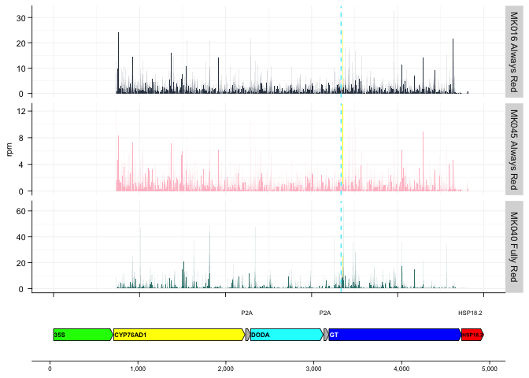
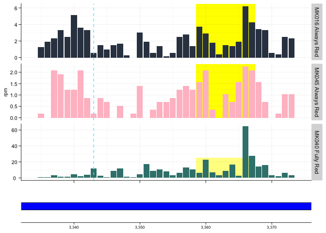
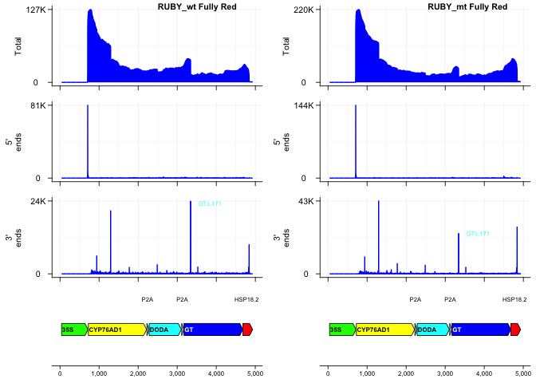
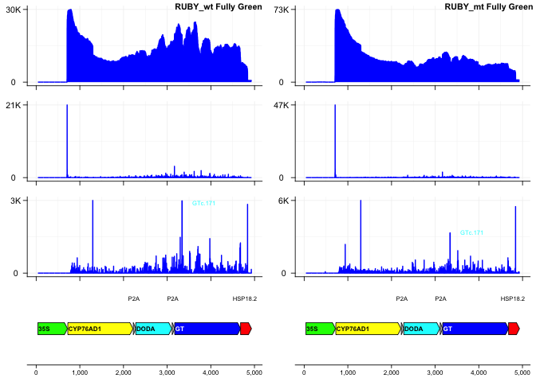
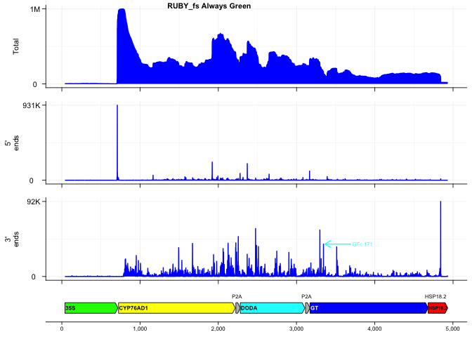
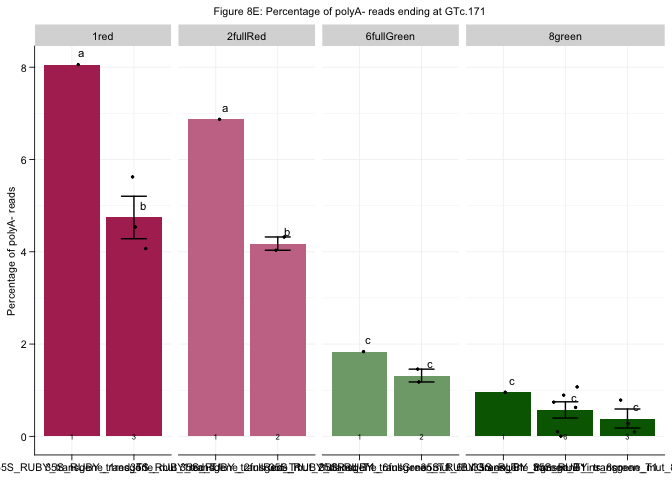
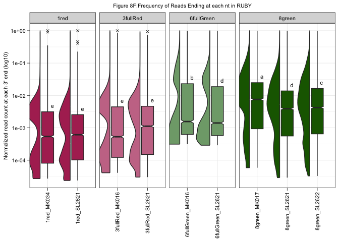

Figure_8
================
2025-05-02

## Figure 8A: 3 nt periodicity for coding genes

``` r
## **** See Ribo_seq_analysis/6_riboWaltz_nuclear_pcg.R in https://github.com/SlotkinLab/AIO_paper for generation of txbd and psites
```

## Figure 8B : Ribo-seq P-sites along RUBY

``` r
library(tidyverse)
```

    ## ── Attaching core tidyverse packages ──────────────────────── tidyverse 2.0.0 ──
    ## ✔ dplyr     1.1.4     ✔ readr     2.1.5
    ## ✔ forcats   1.0.0     ✔ stringr   1.5.1
    ## ✔ ggplot2   3.5.1     ✔ tibble    3.2.1
    ## ✔ lubridate 1.9.4     ✔ tidyr     1.3.1
    ## ✔ purrr     1.0.4     
    ## ── Conflicts ────────────────────────────────────────── tidyverse_conflicts() ──
    ## ✖ dplyr::filter() masks stats::filter()
    ## ✖ dplyr::lag()    masks stats::lag()
    ## ℹ Use the conflicted package (<http://conflicted.r-lib.org/>) to force all conflicts to become errors

``` r
library(gggenes)
library(ggpubr)
library(cowplot)
```

    ## 
    ## Attaching package: 'cowplot'
    ## 
    ## The following object is masked from 'package:ggpubr':
    ## 
    ##     get_legend
    ## 
    ## The following object is masked from 'package:lubridate':
    ## 
    ##     stamp

``` r
library(ggrepel)
## Get file name, extract transgene and sample number
setwd("/Users/mariannekramer/Google Drive/Kramer_et_al_AIO/Figures/ruby_ribo/")

## load gtf for transgene
infoFile <- "/Users/mariannekramer/Google Drive/Kramer_et_al_AIO/Figures/ruby_ribo/Arabidopsis_thaliana.TAIR10.56.35S_ruby_transgene.noMtPt.pcg_only.gtf.txdb"
geneInfo <-read.table(infoFile,header = TRUE)

target <- "35S_RUBY_transgene"

toPlot_gene <- geneInfo %>% filter(transcript == target) %>%
  pivot_longer(cols = c(l_utr5:l_utr3),names_to = c("foo","type"),values_to = "length",names_sep="_") %>% 
  dplyr::select("transcript","type","length") %>%
  left_join(geneInfo,by="transcript") %>%
  mutate(start=case_when(type == "utr5" ~ 1, type == "cds" ~ l_utr5+1, type == "utr3" ~ l_utr5+l_cds+1),
         end = (start + length)-1,
         orientation = 1,Strand = "forward") %>%
  dplyr::select(!l_tr,!l_utr5,!l_utr3,!l_cds)

gene<-ggplot(toPlot_gene,aes(xmin = start, xmax = end, y = transcript,forward=orientation,label=type)) +
  geom_gene_arrow(arrow_body_height = grid::unit(4, "mm"),arrowhead_height = unit(4, "mm"), arrowhead_width = unit(1, "mm"),
                  fill = dplyr::case_when(toPlot_gene$type=="utr5"~ "white",
                                          toPlot_gene$type=="utr3"~ "red",
                                          toPlot_gene$type=="cds"~ "gray",
                                          TRUE ~ "white"),
                  color = "black") + 
  xlab("Relative position along transgene")+scale_x_continuous(label=scales::label_comma())+
  geom_gene_label(fontface="bold", padding.y = grid::unit(0.01,"mm"), padding.x = grid::unit(0.2,"mm"),align = "left",
                  color="black",grow=F,size=6) +
  theme(axis.ticks.y=element_blank(), axis.text.y= element_blank(),
        axis.text.x= element_text(color = 'black',size = 6),
        axis.title.y= element_blank(), 
        axis.line.x=element_line(color = 'black',linewidth=0.3,lineend="round"),panel.background = element_blank(),
        axis.title.x=element_blank(),axis.ticks.x=element_line(color='black',linewidth=0.3,lineend="round"))

infoFile <- "/Users/mariannekramer/Google Drive/Kramer_et_al_AIO/Figures/ruby_coverage_plots/35S_RUBY_transgene.bed"
geneInfo <-read.table(infoFile,col.names = c("molecule","Start","End","Name","Type","strand"))
target <- "35S_RUBY_transgene"
t<- geneInfo %>% rowwise() %>% transmute(molecule,Name,Type,Start=Start +1,End=End+1,
                                         Strand =ifelse(strand=="+","forward","reverse"),length=End-Start+1,
                                         orientation=ifelse(strand=="+",1, -1)) %>%
  filter(Name != "RB") %>% mutate(Name = case_when(Name == "CaMV_35S_promoter" ~ "35S",Name == "HSP18.2_terminator" ~ "HSP18.2",Name == "Glucosyltransferase" ~ "GT",TRUE~Name))

tg <- ggplot(t,aes(xmin = Start, xmax = End, y = molecule,forward=orientation,label=Name)) +
  geom_gene_arrow(arrow_body_height = grid::unit(4, "mm"),arrowhead_height = unit(4, "mm"), arrowhead_width = unit(1, "mm"),
                  fill = dplyr::case_when(t$Type=="terminator"~ "red",
                                          t$Type=="promoter"~ "green",
                                          t$Name=="P2A"~ "gray",
                                          t$Name=="CYP76AD1"~ "yellow",
                                          t$Name=="DODA"~ "cyan1",
                                          t$Name=="GT"~ "blue",TRUE ~ "white"),
                  color = "black") + 
  xlab("Relative position along transgene")+scale_x_continuous(label=scales::label_comma())+
  geom_gene_label(fontface="bold", padding.y = grid::unit(0.01,"mm"), padding.x = grid::unit(0.2,"mm"),align = "left",
                  color=c("black","black","black","black","black","white","black"),grow=F,size=6) +
  theme(axis.ticks.y=element_blank(), axis.text.y= element_blank(),
        axis.text.x= element_text(color = 'black',size = 6),
        axis.title.y= element_blank(), 
        axis.line.x=element_line(color = 'black',linewidth=0.3,lineend="round"),panel.background = element_blank(),
        axis.title.x=element_blank(),axis.ticks.x=element_line(color='black',linewidth=0.3,lineend="round"))+
  annotate(geom="text",x=2240,y=1.5,label="P2A",size=2)+annotate(geom="text",x=3130,y=1.5,label="P2A",size=2)+annotate(geom="text",x=4780,y=1.5,label="HSP18.2",size=2)

## Define themes
themes<-theme(axis.ticks.length=unit(0.0516,"in"),
              axis.title.x=element_blank(),
              axis.text.x= element_blank(),
              axis.text.y= element_text(color = 'black',size = 8,hjust=0.5),
              axis.ticks=element_line(color='black',linewidth=0.3,lineend="round"),
              axis.line=element_line(color='black',linewidth=0.3,lineend="round"),
              line = element_line(color = 'black',linewidth=0.3,lineend="round"),
              axis.title.y = element_text(color = 'black',size = 8),
              legend.position ="none",
              panel.background = element_blank(),
              panel.grid.major = element_line(color = 'grey95'),
              panel.grid.minor = element_line(color = 'grey95'))

## NUmber of reads mapped (from transcriptome bam files)
norm.mk16 = 7243216/1000000
norm.mk40 = 12913575/1000000
norm.mk45 = 5742706/1000000


psites.mk16 <- read.table("/Users/mariannekramer/Google Drive/Kramer_et_al_AIO/Figures/ruby_ribo/RIBO-MK016_Rep_1_trimmedAligned.toTranscriptome.out_reads_psite_list.sizeFiltered.txt",header=T)
psites.mk40 <- read.table("/Users/mariannekramer/Google Drive/Kramer_et_al_AIO/Figures/ruby_ribo/RIBO-MK040_Rep_1_trimmedAligned.toTranscriptome.out_reads_psite_list.sizeFiltered.txt",header=T)
psites.mk45 <- read.table("/Users/mariannekramer/Google Drive/Kramer_et_al_AIO/Figures/ruby_ribo/RIBO-MK045_Rep_1_trimmedAligned.toTranscriptome.out_reads_psite_list.sizeFiltered.txt",header=T)

toPlot.mk16 <- psites.mk16 %>% filter(transcript == target) %>% mutate(frame=psite_from_start %% 3)%>%
  dplyr::select(transcript,psite,frame) %>% group_by(transcript,psite,frame) %>%
  dplyr::summarize(count = n()) %>% mutate(rpm = count/norm.mk16, sample="MK016 Always Red",psite=psite+708) 
```

    ## `summarise()` has grouped output by 'transcript', 'psite'. You can override
    ## using the `.groups` argument.

``` r
toPlot.mk40 <- psites.mk40 %>% filter(transcript == target) %>% mutate(frame=psite_from_start %% 3)%>%
  dplyr::select(transcript,psite,frame) %>% group_by(transcript,psite,frame) %>%
  dplyr::summarize(count = n()) %>% mutate(rpm = count/norm.mk40, sample="MK040 Fully Red",psite=psite+708)
```

    ## `summarise()` has grouped output by 'transcript', 'psite'. You can override
    ## using the `.groups` argument.

``` r
toPlot.mk45 <- psites.mk45 %>% filter(transcript == target) %>% mutate(frame=psite_from_start %% 3)%>%
  dplyr::select(transcript,psite,frame) %>% group_by(transcript,psite,frame) %>%
  dplyr::summarize(count = n()) %>% mutate(rpm = count/norm.mk45, sample="MK045 Always Red",psite=psite+708)
```

    ## `summarise()` has grouped output by 'transcript', 'psite'. You can override
    ## using the `.groups` argument.

``` r
psitePlot <- rbind(toPlot.mk16,toPlot.mk40,toPlot.mk45) %>%
  ggplot(aes(x=psite,y=rpm,fill=sample))+
  geom_rect(xmin = 3358.5, xmax = 3367.5, ymin=0,ymax = 25,alpha=0.005,inherit.aes=F,fill = "yellow")+ themes+
  geom_bar(stat="identity")+scale_fill_manual(values=c("#333f50","#39827c","pink")) +
  facet_grid(factor(sample,levels=c("MK016 Always Red","MK045 Always Red","MK040 Fully Red"))~.,scales='free_y')+
  geom_vline(xintercept = 3343, color='#52ebfd',linetype='dashed',linewidth=0.5)+xlim(0,5000) 
  
plot_grid(psitePlot,tg,align="v",rel_heights = c(1,0.25),ncol=1,common.legend = T,nrow=2, axis="lr")
```

    ## Warning in as_grob.default(plot): Cannot convert object of class logical into a
    ## grob.

<!-- -->

``` r
#ggsave("ribo_seq_coverage_MK16_MK40_MK45.psites.pdf",plot=last_plot(),width=3,height=2)

psitePlot.zoom <- rbind(toPlot.mk16,toPlot.mk40,toPlot.mk45) %>%
  ggplot(aes(x=psite,y=rpm,fill=sample))+
  geom_rect(xmin = 3358.5, xmax = 3367.5, ymin=0,ymax = 25,alpha=0.005,inherit.aes=F,fill = "yellow")+ themes+
  geom_bar(stat="identity")+scale_fill_manual(values=c("#333f50","#39827c","pink")) +
  facet_grid(factor(sample,levels=c("MK016 Always Red","MK045 Always Red","MK040 Fully Red"))~.,scales='free_y')+
  geom_vline(xintercept = 3343, color='#52ebfd',linetype='dashed',linewidth=0.5)+ xlim(3334,3374) #+ coord_cartesian(xlim=c(3335,3375))

tg_zoom<-tg + coord_cartesian(xlim=c(3334,3374))
plot_grid(psitePlot.zoom,tg_zoom,align="v",rel_heights = c(1,0.25),ncol=1,common.legend = T,nrow=2, axis="lr")
```

    ## Warning: Removed 9488 rows containing missing values or values outside the scale range
    ## (`geom_bar()`).
    ## Cannot convert object of class logical into a grob.

<!-- -->

``` r
#ggsave("ribo_seq_coverage_MK16_MK40_MK45.psites.zoom.pdf",plot=last_plot(),width=3,height=2)
```

## Figre 8D: Coverage Plots in mutants

``` r
library(tidyverse)
library(gggenes)
library(ggpubr)
library(scales)
```

    ## 
    ## Attaching package: 'scales'

    ## The following object is masked from 'package:purrr':
    ## 
    ##     discard

    ## The following object is masked from 'package:readr':
    ## 
    ##     col_factor

``` r
args <- commandArgs(T)
setwd("/Users/mariannekramer/Google Drive/Kramer_et_al_AIO/Figures/ruby_mutants/coverage/bed12_files")

## Wt RUBY
## load gtf for transgene
infoFile <- "/Users/mariannekramer/Google Drive/Kramer_et_al_AIO/Figures/ruby_mutants/coverage/bed12_files/35S_RUBY_transgene.bed"
geneInfo <-read.table(infoFile,col.names = c("molecule","Start","End","Name","Type","strand"))
target <- "35S_RUBY_transgene"
t<- geneInfo %>% rowwise() %>% transmute(molecule,Name,Type,Start=Start +1,End=End+1,
                                         Strand =ifelse(strand=="+","forward","reverse"),length=End-Start+1,
                                         orientation=ifelse(strand=="+",1, -1)) %>%
  filter(Name != "RB") %>% mutate(Name = case_when(Name == "CaMV_35S_promoter" ~ "35S",Name == "HSP18.2_terminator" ~ "HSP18.2",
                                                   Name == "Glucosyltransferase" ~ "GT",TRUE~Name))

tg <- ggplot(t,aes(xmin = Start, xmax = End, y = molecule,forward=orientation,label=Name)) +
  geom_gene_arrow(arrow_body_height = grid::unit(4, "mm"),arrowhead_height = unit(4, "mm"), arrowhead_width = unit(1, "mm"),
                  fill = dplyr::case_when(t$Type=="terminator"~ "red",
                                          t$Type=="promoter"~ "green",
                                          t$Name=="P2A"~ "gray",
                                          t$Name=="CYP76AD1"~ "yellow",
                                          t$Name=="DODA"~ "cyan1",
                                          t$Name=="GT"~ "blue",TRUE ~ "white"),
                  color = "black") + 
  xlab("Relative position along transgene")+scale_x_continuous(label=scales::label_comma())+
  geom_gene_label(fontface="bold", padding.y = grid::unit(0.01,"mm"), padding.x = grid::unit(0.2,"mm"),align = "left",
                  color=c("black","black","black","black","black","white","black"),grow=F,size=6) +
  theme(axis.ticks.y=element_blank(), axis.text.y= element_blank(),
        axis.text.x= element_text(color = 'black',size = 6),
        axis.title.y= element_blank(), 
        axis.line.x=element_line(color = 'black',linewidth=0.3,lineend="round"),panel.background = element_blank(),
        axis.title.x=element_blank(),axis.ticks.x=element_line(color='black',linewidth=0.3,lineend="round"))+
  annotate(geom="text",x=2240,y=1.5,label="P2A",size=2)+annotate(geom="text",x=3130,y=1.5,label="P2A",size=2)+annotate(geom="text",x=4780,y=1.5,label="HSP18.2",size=2)

## Red-to-Green - MK016
## full green
fileName.fullGreen <- "18_MK016_T1_rep1.35S.6fullGreen" 

coverage.fullGreen <- read.table(paste("/Users/mariannekramer/Google Drive/Kramer_et_al_AIO/Figures/ruby_mutants/coverage/bed12_files/",fileName.fullGreen,".rRNA_free.mapped_to_targets.non_pA.bed12",sep=""),col.names = c("name","start", "stop","name2","foo","strand","blockStart","blockStop","food2","blockNum","blockLen","relStart","scores"))
fivep.fullGreen <-  read.table(paste("/Users/mariannekramer/Google Drive/Kramer_et_al_AIO/Figures/ruby_mutants/coverage/bed12_files/",fileName.fullGreen,".rRNA_free.mapped_to_targets.non_pA.5p.bed12",sep=""),col.names = c("name","start", "stop","name2","foo","strand","blockStart","blockStop","food2","blockNum","blockLen","relStart","scores"))
threep.fullGreen <- read.table(paste("/Users/mariannekramer/Google Drive/Kramer_et_al_AIO/Figures/ruby_mutants/coverage/bed12_files/",fileName.fullGreen,".rRNA_free.mapped_to_targets.non_pA.3p.bed12",sep=""),col.names = c("name","start", "stop","name2","foo","strand","blockStart","blockStop","food2","blockNum","blockLen","relStart","scores"))
coverage_pA.fullGreen <- read.table(paste("/Users/mariannekramer/Google Drive/Kramer_et_al_AIO/Figures/ruby_mutants/coverage/bed12_files/",fileName.fullGreen,".rRNA_free.mapped_to_targets.pA.bed12",sep=""),col.names = c("name","start", "stop","name2","foo","strand","blockStart","blockStop","food2","blockNum","blockLen","relStart","scores"))
fivep_pA.fullGreen <-  read.table(paste("/Users/mariannekramer/Google Drive/Kramer_et_al_AIO/Figures/ruby_mutants/coverage/bed12_files/",fileName.fullGreen,".rRNA_free.mapped_to_targets.pA.5p.bed12",sep=""),col.names = c("name","start", "stop","name2","foo","strand","blockStart","blockStop","food2","blockNum","blockLen","relStart","scores"))
threep_pA.fullGreen <- read.table(paste("/Users/mariannekramer/Google Drive/Kramer_et_al_AIO/Figures/ruby_mutants/coverage/bed12_files/",fileName.fullGreen,".rRNA_free.mapped_to_targets.pA.3p.bed12",sep=""),col.names = c("name","start", "stop","name2","foo","strand","blockStart","blockStop","food2","blockNum","blockLen","relStart","scores"))


## full red
fileName.fullRed <- "19_MK016_T1_rep1.35S.5fullRed" 

coverage.fullRed <- read.table(paste("/Users/mariannekramer/Google Drive/Kramer_et_al_AIO/Figures/ruby_mutants/coverage/bed12_files/",fileName.fullRed,".rRNA_free.mapped_to_targets.non_pA.bed12",sep=""),col.names = c("name","start", "stop","name2","foo","strand","blockStart","blockStop","food2","blockNum","blockLen","relStart","scores"))
fivep.fullRed <-  read.table(paste("/Users/mariannekramer/Google Drive/Kramer_et_al_AIO/Figures/ruby_mutants/coverage/bed12_files/",fileName.fullRed,".rRNA_free.mapped_to_targets.non_pA.5p.bed12",sep=""),col.names = c("name","start", "stop","name2","foo","strand","blockStart","blockStop","food2","blockNum","blockLen","relStart","scores"))
threep.fullRed <- read.table(paste("/Users/mariannekramer/Google Drive/Kramer_et_al_AIO/Figures/ruby_mutants/coverage/bed12_files/",fileName.fullRed,".rRNA_free.mapped_to_targets.non_pA.3p.bed12",sep=""),col.names = c("name","start", "stop","name2","foo","strand","blockStart","blockStop","food2","blockNum","blockLen","relStart","scores"))
coverage_pA.fullRed <- read.table(paste("/Users/mariannekramer/Google Drive/Kramer_et_al_AIO/Figures/ruby_mutants/coverage/bed12_files/",fileName.fullRed,".rRNA_free.mapped_to_targets.pA.bed12",sep=""),col.names = c("name","start", "stop","name2","foo","strand","blockStart","blockStop","food2","blockNum","blockLen","relStart","scores"))
fivep_pA.fullRed <-  read.table(paste("/Users/mariannekramer/Google Drive/Kramer_et_al_AIO/Figures/ruby_mutants/coverage/bed12_files/",fileName.fullRed,".rRNA_free.mapped_to_targets.pA.5p.bed12",sep=""),col.names = c("name","start", "stop","name2","foo","strand","blockStart","blockStop","food2","blockNum","blockLen","relStart","scores"))
threep_pA.fullRed <- read.table(paste("/Users/mariannekramer/Google Drive/Kramer_et_al_AIO/Figures/ruby_mutants/coverage/bed12_files/",fileName.fullRed,".rRNA_free.mapped_to_targets.pA.3p.bed12",sep=""),col.names = c("name","start", "stop","name2","foo","strand","blockStart","blockStop","food2","blockNum","blockLen","relStart","scores"))


##### Filter bed12 to only contain gene of interest, and convert score list to lsit of integers
## Convert to file to plot, 3 rows, txt, nt, and score
covScores.fullGreen <- tibble(coverage.fullGreen %>% filter(grepl(target,name))) %>% mutate(scores = lapply(str_split(scores,","),as.integer))%>% rowwise() %>% mutate(nts = list(seq.int(start,stop-1))) %>% select(name,nts,scores) %>% unnest_longer(c(scores,nts))
fivepScores.fullGreen <- tibble(fivep.fullGreen %>% filter(grepl(target,name))) %>% mutate(scores = lapply(str_split(scores,","),as.integer))%>% rowwise() %>% mutate(nts = list(seq.int(start,stop-1))) %>% select(name,nts,scores) %>% unnest_longer(c(scores,nts))
threepScores.fullGreen <- tibble(threep.fullGreen %>% filter(grepl(target,name))) %>% mutate(scores = lapply(str_split(scores,","),as.integer))%>% rowwise() %>% mutate(nts = list(seq.int(start,stop-1))) %>% select(name,nts,scores) %>% unnest_longer(c(scores,nts))


covScores.fullRed <- tibble(coverage.fullRed %>% filter(grepl(target,name))) %>% mutate(scores = lapply(str_split(scores,","),as.integer))%>% rowwise() %>% mutate(nts = list(seq.int(start,stop-1))) %>% select(name,nts,scores) %>% unnest_longer(c(scores,nts))
fivepScores.fullRed <- tibble(fivep.fullRed %>% filter(grepl(target,name))) %>% mutate(scores = lapply(str_split(scores,","),as.integer))%>% rowwise() %>% mutate(nts = list(seq.int(start,stop-1))) %>% select(name,nts,scores) %>% unnest_longer(c(scores,nts))
threepScores.fullRed <- tibble(threep.fullRed %>% filter(grepl(target,name))) %>% mutate(scores = lapply(str_split(scores,","),as.integer))%>% rowwise() %>% mutate(nts = list(seq.int(start,stop-1))) %>% select(name,nts,scores) %>% unnest_longer(c(scores,nts))


## plot non_pA
themes<-theme(axis.ticks.length=unit(0.0516,"in"),
               axis.title.x=element_blank(),
               axis.text.x= element_blank(),
               axis.text.y= element_text(color = 'black',size = 8,hjust=0.5),
              axis.line=element_line(color='black',linewidth=0.3,lineend="round"),
              axis.ticks=element_line(color='black',linewidth=0.3,lineend="round"),
              line = element_line(color = 'black',linewidth=0.3,lineend="round"),
              axis.title.y = element_text(color = 'black',size = 8),
              panel.background = element_blank(),
              panel.grid.major = element_line(color = 'grey95'),
              panel.grid.minor = element_line(color = 'grey95'))

## Full Green - wt
## plot non pA
maxCov.fullGreen <- max(covScores.fullGreen$scores)
covPlot.fullGreen <- ggplot(covScores.fullGreen, aes(x=nts,y=scores))+ geom_area(stat="identity",linewidth=0.5,color="blue",fill="blue") + ylab("\nTotal") +themes + scale_y_continuous(breaks=seq(0,maxCov.fullGreen,maxCov.fullGreen),labels=scales::label_number(scale_cut = cut_short_scale()))+ theme(axis.title.y=element_blank())
maxfiveP.fullGreen <- max(fivepScores.fullGreen$scores)
fivepPlot.fullGreen <-ggplot(fivepScores.fullGreen, aes(x=nts,y=scores))+ geom_area(stat="identity",linewidth=0.5,color="blue",fill="blue")+ ylab("5'\nends")+themes+ scale_y_continuous(breaks=seq(0,maxfiveP.fullGreen,maxfiveP.fullGreen),labels=scales::label_number(scale_cut = cut_short_scale()))+ theme(axis.title.y=element_blank())

maxthreeP.fullGreen <- max(threepScores.fullGreen$scores)
fullGreen_GTc171 <- filter(threepScores.fullGreen,nts == 3342)
threepPlot.fullGreen <-ggplot(threepScores.fullGreen, aes(x=nts,y=scores))+ geom_area(stat="identity",linewidth=0.5,color="blue",fill="blue")+ ylab("5'\nends")+themes + scale_y_continuous(breaks=seq(0,maxthreeP.fullGreen,maxthreeP.fullGreen),labels=scales::label_number(scale_cut = cut_short_scale()))+ theme(axis.title.y=element_blank()) + geom_text_repel(data=fullGreen_GTc171,seed=1234,inherit.aes = F, aes(x=nts, y=scores),label="GTc.171",size=2,nudge_x = 500,arrow=arrow(ends="last",type="open",length = unit(0.1,"in")),colour = 'cyan1')

## Full Red -wt
## plot non pA
maxCov.fullRed <- max(covScores.fullRed$scores)
covPlot.fullRed <- ggplot(covScores.fullRed, aes(x=nts,y=scores))+ geom_area(stat="identity",linewidth=0.5,color="blue",fill="blue") + ylab("\nTotal") + themes + scale_y_continuous(breaks=seq(0,maxCov.fullRed,maxCov.fullRed),labels=scales::label_number(scale_cut = cut_short_scale())) 
maxfiveP.fullRed <- max(fivepScores.fullRed$scores)
fivepPlot.fullRed <-ggplot(fivepScores.fullRed, aes(x=nts,y=scores))+ geom_area(stat="identity",linewidth=0.5,color="blue",fill="blue")+ ylab("5'\nends")+themes+ scale_y_continuous(breaks=seq(0,maxfiveP.fullRed,maxfiveP.fullRed),labels=scales::label_number(scale_cut = cut_short_scale()))

maxthreeP.fullRed <- max(threepScores.fullRed$scores)
fullRed_GTc171 <- filter(threepScores.fullRed,nts == 3342)
threepPlot.fullRed <-ggplot(threepScores.fullRed, aes(x=nts,y=scores))+ geom_area(stat="identity",linewidth=0.5,color="blue",fill="blue")+ ylab("3'\nends")+themes + scale_y_continuous(breaks=seq(0,maxthreeP.fullRed,maxthreeP.fullRed),labels=scales::label_number(scale_cut = cut_short_scale()))+ geom_text_repel(data=fullRed_GTc171,seed=1234,inherit.aes = F, aes(x=nts, y=scores),label="GTc.171",size=2,nudge_x = 500,arrow=arrow(ends="last",type="open",length = unit(0.1,"in")),colour = 'cyan1')


##----------------------------------------------------------------------------------------------------------------------------------------
##----------------------------------------------------------------------------------------------------------------------------------------
##----------------------------------------------------------------------------------------------------------------------------------------


## Mutant RUBY
## load gtf for transgene
infoFile.mt <- "/Users/mariannekramer/Google Drive/Kramer_et_al_AIO/Figures/ruby_mutants/coverage/bed12_files/35S_RUBY_transgene_mut.bed"
geneInfo.mt <-read.table(infoFile.mt,col.names = c("molecule","Start","End","Name","Type","strand"))
target <- "35S_RUBY_transgene_mut"
t.mt<- geneInfo.mt %>% rowwise() %>% transmute(molecule,Name,Type,Start=Start +1,End=End+1,
                                         Strand =ifelse(strand=="+","forward","reverse"),length=End-Start+1,
                                         orientation=ifelse(strand=="+",1, -1)) %>%
  filter(Name != "RB") %>% mutate(Name = case_when(Name == "CaMV_35S_promoter" ~ "35S",Name == "HSP18.2_terminator" ~ "HSP18.2",
                                                   Name == "Glucosyltransferase" ~ "GT",TRUE~Name))

tg.mt <- ggplot(t.mt,aes(xmin = Start, xmax = End, y = molecule,forward=orientation,label=Name)) +
  geom_gene_arrow(arrow_body_height = grid::unit(4, "mm"),arrowhead_height = unit(4, "mm"), arrowhead_width = unit(1, "mm"),
                  fill = dplyr::case_when(t$Type=="terminator"~ "red",
                                          t$Type=="promoter"~ "green",
                                          t$Name=="P2A"~ "gray",
                                          t$Name=="CYP76AD1"~ "yellow",
                                          t$Name=="DODA"~ "cyan1",
                                          t$Name=="GT"~ "blue",TRUE ~ "white"),
                  color = "black") + 
  xlab("Relative position along transgene")+scale_x_continuous(label=scales::label_comma())+
  geom_gene_label(fontface="bold", padding.y = grid::unit(0.01,"mm"), padding.x = grid::unit(0.2,"mm"),align = "left",
                  color=c("black","black","black","black","black","white","black"),grow=F,size=6) +
  theme(axis.ticks.y=element_blank(), axis.text.y= element_blank(),
        axis.text.x= element_text(color = 'black',size = 6),
        axis.title.y= element_blank(), 
        axis.line.x=element_line(color = 'black',linewidth=0.3,lineend="round"),panel.background = element_blank(),
        axis.title.x=element_blank(),axis.ticks.x=element_line(color='black',linewidth=0.3,lineend="round"))+
  annotate(geom="text",x=2240,y=1.5,label="P2A",size=2)+annotate(geom="text",x=3130,y=1.5,label="P2A",size=2)+annotate(geom="text",x=4780,y=1.5,label="HSP18.2",size=2)

## Full Green - SL2621 3Q mutant
fileName.fullGreen.mt <- "SL2621_mergedReps.35S.6fullGreen" 

coverage.fullGreen.mt <- read.table(paste("/Users/mariannekramer/Google Drive/Kramer_et_al_AIO/Figures/ruby_mutants/coverage/bed12_files/",fileName.fullGreen.mt,".rRNA_free.mapped_to_targets.non_pA.bed12",sep=""),col.names = c("name","start", "stop","name2","foo","strand","blockStart","blockStop","food2","blockNum","blockLen","relStart","scores"))
fivep.fullGreen.mt <-  read.table(paste("/Users/mariannekramer/Google Drive/Kramer_et_al_AIO/Figures/ruby_mutants/coverage/bed12_files/",fileName.fullGreen.mt,".rRNA_free.mapped_to_targets.non_pA.5p.bed12",sep=""),col.names = c("name","start", "stop","name2","foo","strand","blockStart","blockStop","food2","blockNum","blockLen","relStart","scores"))
threep.fullGreen.mt <- read.table(paste("/Users/mariannekramer/Google Drive/Kramer_et_al_AIO/Figures/ruby_mutants/coverage/bed12_files/",fileName.fullGreen.mt,".rRNA_free.mapped_to_targets.non_pA.3p.bed12",sep=""),col.names = c("name","start", "stop","name2","foo","strand","blockStart","blockStop","food2","blockNum","blockLen","relStart","scores"))

## Full Red - SL2621 3Q mutant
fileName.fullRed.mt <- "SL2621_mergedReps.35S.5fullRed" 

coverage.fullRed.mt <- read.table(paste("/Users/mariannekramer/Google Drive/Kramer_et_al_AIO/Figures/ruby_mutants/coverage/bed12_files/",fileName.fullRed.mt,".rRNA_free.mapped_to_targets.non_pA.bed12",sep=""),col.names = c("name","start", "stop","name2","foo","strand","blockStart","blockStop","food2","blockNum","blockLen","relStart","scores"))
fivep.fullRed.mt <-  read.table(paste("/Users/mariannekramer/Google Drive/Kramer_et_al_AIO/Figures/ruby_mutants/coverage/bed12_files/",fileName.fullRed.mt,".rRNA_free.mapped_to_targets.non_pA.5p.bed12",sep=""),col.names = c("name","start", "stop","name2","foo","strand","blockStart","blockStop","food2","blockNum","blockLen","relStart","scores"))
threep.fullRed.mt <- read.table(paste("/Users/mariannekramer/Google Drive/Kramer_et_al_AIO/Figures/ruby_mutants/coverage/bed12_files/",fileName.fullRed.mt,".rRNA_free.mapped_to_targets.non_pA.3p.bed12",sep=""),col.names = c("name","start", "stop","name2","foo","strand","blockStart","blockStop","food2","blockNum","blockLen","relStart","scores"))


##### Filter bed12 to only contain gene of interest, and convert score list to lsit of integers
## Convert to file to plot, 3 rows, txt, nt, and score
covScores.fullGreen.mt <- tibble(coverage.fullGreen.mt %>% filter(grepl(target,name))) %>% mutate(scores = lapply(str_split(scores,","),as.integer))%>% rowwise() %>% mutate(nts = list(seq.int(start,stop-1))) %>% select(name,nts,scores) %>% unnest_longer(c(scores,nts))
fivepScores.fullGreen.mt <- tibble(fivep.fullGreen.mt %>% filter(grepl(target,name))) %>% mutate(scores = lapply(str_split(scores,","),as.integer))%>% rowwise() %>% mutate(nts = list(seq.int(start,stop-1))) %>% select(name,nts,scores) %>% unnest_longer(c(scores,nts))
threepScores.fullGreen.mt <- tibble(threep.fullGreen.mt %>% filter(grepl(target,name))) %>% mutate(scores = lapply(str_split(scores,","),as.integer))%>% rowwise() %>% mutate(nts = list(seq.int(start,stop-1))) %>% select(name,nts,scores) %>% unnest_longer(c(scores,nts))


covScores.fullRed.mt <- tibble(coverage.fullRed.mt %>% filter(grepl(target,name))) %>% mutate(scores = lapply(str_split(scores,","),as.integer))%>% rowwise() %>% mutate(nts = list(seq.int(start,stop-1))) %>% select(name,nts,scores) %>% unnest_longer(c(scores,nts))
fivepScores.fullRed.mt <- tibble(fivep.fullRed.mt %>% filter(grepl(target,name))) %>% mutate(scores = lapply(str_split(scores,","),as.integer))%>% rowwise() %>% mutate(nts = list(seq.int(start,stop-1))) %>% select(name,nts,scores) %>% unnest_longer(c(scores,nts))
threepScores.fullRed.mt <- tibble(threep.fullRed.mt %>% filter(grepl(target,name))) %>% mutate(scores = lapply(str_split(scores,","),as.integer))%>% rowwise() %>% mutate(nts = list(seq.int(start,stop-1))) %>% select(name,nts,scores) %>% unnest_longer(c(scores,nts))

## plot non_pA
themes<-theme(axis.ticks.length=unit(0.0516,"in"),
              axis.title.x=element_blank(),
              axis.text.x= element_blank(),
              axis.text.y= element_text(color = 'black',size = 8,hjust=0.5),
              axis.line=element_line(color='black',linewidth=0.3,lineend="round"),
              axis.ticks=element_line(color='black',linewidth=0.3,lineend="round"),
              line = element_line(color = 'black',linewidth=0.3,lineend="round"),
              axis.title.y = element_text(color = 'black',size = 8),
              panel.background = element_blank(),
              panel.grid.major = element_line(color = 'grey95'),
              panel.grid.minor = element_line(color = 'grey95'))

## Full Green - 3Q
## plot non pA
maxCov.fullGreen.mt <- max(covScores.fullGreen.mt$scores)
covPlot.fullGreen.mt <- ggplot(covScores.fullGreen.mt, aes(x=nts,y=scores))+ geom_area(stat="identity",linewidth=0.5,color="blue",fill="blue") + ylab("\nTotal") +themes + scale_y_continuous(breaks=seq(0,maxCov.fullGreen.mt,maxCov.fullGreen.mt),labels=scales::label_number(scale_cut = cut_short_scale()))+ theme(axis.title.y=element_blank())
maxfiveP.fullGreen.mt <- max(fivepScores.fullGreen.mt$scores)
fivepPlot.fullGreen.mt <-ggplot(fivepScores.fullGreen.mt, aes(x=nts,y=scores))+ geom_area(stat="identity",linewidth=0.5,color="blue",fill="blue")+ ylab("5'\nends")+themes+ scale_y_continuous(breaks=seq(0,maxfiveP.fullGreen.mt,maxfiveP.fullGreen.mt),labels=scales::label_number(scale_cut = cut_short_scale()))+ theme(axis.title.y=element_blank())

maxthreeP.fullGreen.mt <- max(threepScores.fullGreen.mt$scores)
fullGreen.mt_GTc171 <- filter(threepScores.fullGreen.mt,nts == 3342)
threepPlot.fullGreen.mt <-ggplot(threepScores.fullGreen.mt, aes(x=nts,y=scores))+ geom_area(stat="identity",linewidth=0.5,color="blue",fill="blue")+ ylab("5'\nends")+themes + scale_y_continuous(breaks=seq(0,maxthreeP.fullGreen.mt,maxthreeP.fullGreen.mt),labels=scales::label_number(scale_cut = cut_short_scale()))+ theme(axis.title.y=element_blank()) + geom_text_repel(data=fullGreen.mt_GTc171,seed=1234,inherit.aes = F, aes(x=nts, y=scores),label="GTc.171",size=2,nudge_x = 500,arrow=arrow(ends="last",type="open",length = unit(0.1,"in")),colour = 'cyan1')

## Full Red - 3Q
## plot non pA
maxCov.fullRed.mt <- max(covScores.fullRed.mt$scores)
covPlot.fullRed.mt <- ggplot(covScores.fullRed.mt, aes(x=nts,y=scores))+ geom_area(stat="identity",linewidth=0.5,color="blue",fill="blue") + ylab("\nTotal") + themes + scale_y_continuous(breaks=seq(0,maxCov.fullRed.mt,maxCov.fullRed.mt),labels=scales::label_number(scale_cut = cut_short_scale())) 
maxfiveP.fullRed.mt <- max(fivepScores.fullRed.mt$scores)
fivepPlot.fullRed.mt <-ggplot(fivepScores.fullRed.mt, aes(x=nts,y=scores))+ geom_area(stat="identity",linewidth=0.5,color="blue",fill="blue")+ ylab("5'\nends")+themes+ scale_y_continuous(breaks=seq(0,maxfiveP.fullRed.mt,maxfiveP.fullRed.mt),labels=scales::label_number(scale_cut = cut_short_scale()))

maxthreeP.fullRed.mt <- max(threepScores.fullRed.mt$scores)
fullRed.mt_GTc171 <- filter(threepScores.fullRed.mt,nts == 3342)
threepPlot.fullRed.mt <-ggplot(threepScores.fullRed.mt, aes(x=nts,y=scores))+ geom_area(stat="identity",linewidth=0.5,color="blue",fill="blue")+ ylab("3'\nends")+themes + scale_y_continuous(breaks=seq(0,maxthreeP.fullRed.mt,maxthreeP.fullRed.mt),labels=scales::label_number(scale_cut = cut_short_scale()))+ geom_text_repel(data=fullRed.mt_GTc171,seed=1234,inherit.aes = F, aes(x=nts, y=scores),label="GTc.171",size=2,nudge_x = 500,arrow=arrow(ends="last",type="open",length = unit(0.1,"in")),colour = 'cyan1')


##----------------------------------------------------------------------------------------------------------------------------------------
##----------------------------------------------------------------------------------------------------------------------------------------
##----------------------------------------------------------------------------------------------------------------------------------------


## Insertion RUBY
## load gtf for transgene
infoFile.fs <- "/Users/mariannekramer/Google Drive/Kramer_et_al_AIO/Figures/ruby_mutants/coverage/bed12_files/35S_RUBY_transgene_ins.bed"
geneInfo.fs <-read.table(infoFile.fs,col.names = c("molecule","Start","End","Name","Type","strand"))
target <- "35S_RUBY_transgene_ins"
t.fs<- geneInfo.fs %>% rowwise() %>% transmute(molecule,Name,Type,Start=Start +1,End=End+1,
                                         Strand =ifelse(strand=="+","forward","reverse"),length=End-Start+1,
                                         orientation=ifelse(strand=="+",1, -1)) %>%
  filter(Name != "RB") %>% mutate(Name = case_when(Name == "CaMV_35S_promoter" ~ "35S",Name == "HSP18.2_terminator" ~ "HSP18.2",
                                                   Name == "Glucosyltransferase" ~ "GT",TRUE~Name))

tg.fs <- ggplot(t.fs,aes(xmin = Start, xmax = End, y = molecule,forward=orientation,label=Name)) +
  geom_gene_arrow(arrow_body_height = grid::unit(4, "mm"),arrowhead_height = unit(4, "mm"), arrowhead_width = unit(1, "mm"),
                  fill = dplyr::case_when(t$Type=="terminator"~ "red",
                                          t$Type=="promoter"~ "green",
                                          t$Name=="P2A"~ "gray",
                                          t$Name=="CYP76AD1"~ "yellow",
                                          t$Name=="DODA"~ "cyan1",
                                          t$Name=="GT"~ "blue",TRUE ~ "white"),
                  color = "black") + 
  xlab("Relative position along transgene")+scale_x_continuous(label=scales::label_comma())+
  geom_gene_label(fontface="bold", padding.y = grid::unit(0.01,"mm"), padding.x = grid::unit(0.2,"mm"),align = "left",
                  color=c("black","black","black","black","black","white","black"),grow=F,size=6) +
  theme(axis.ticks.y=element_blank(), axis.text.y= element_blank(),
        axis.text.x= element_text(color = 'black',size = 6),
        axis.title.y= element_blank(), 
        axis.line.x=element_line(color = 'black',linewidth=0.3,lineend="round"),panel.background = element_blank(),
        axis.title.x=element_blank(),axis.ticks.x=element_line(color='black',linewidth=0.3,lineend="round"))+
  annotate(geom="text",x=2240,y=1.5,label="P2A",size=2)+annotate(geom="text",x=3130,y=1.5,label="P2A",size=2)+annotate(geom="text",x=4780,y=1.5,label="HSP18.2",size=2)

## Green - SL2622
fileName.green.ins <- "SL2622_mergedReps.35S.8green" 

coverage.green.ins <- read.table(paste("/Users/mariannekramer/Google Drive/Kramer_et_al_AIO/Figures/ruby_mutants/coverage/bed12_files/",fileName.green.ins,".rRNA_free.mapped_to_targets.non_pA.bed12",sep=""),col.names = c("name","start", "stop","name2","foo","strand","blockStart","blockStop","food2","blockNum","blockLen","relStart","scores"))
fivep.green.ins <-  read.table(paste("/Users/mariannekramer/Google Drive/Kramer_et_al_AIO/Figures/ruby_mutants/coverage/bed12_files/",fileName.green.ins,".rRNA_free.mapped_to_targets.non_pA.5p.bed12",sep=""),col.names = c("name","start", "stop","name2","foo","strand","blockStart","blockStop","food2","blockNum","blockLen","relStart","scores"))
threep.green.ins <- read.table(paste("/Users/mariannekramer/Google Drive/Kramer_et_al_AIO/Figures/ruby_mutants/coverage/bed12_files/",fileName.green.ins,".rRNA_free.mapped_to_targets.non_pA.3p.bed12",sep=""),col.names = c("name","start", "stop","name2","foo","strand","blockStart","blockStop","food2","blockNum","blockLen","relStart","scores"))

##### Filter bed12 to only contain gene of interest, and convert score list to lsit of integers
## Convert to file to plot, 3 rows, txt, nt, and score

covScores.green.ins <- tibble(coverage.green.ins %>% filter(grepl(target,name))) %>% mutate(scores = lapply(str_split(scores,","),as.integer))%>% rowwise() %>% mutate(nts = list(seq.int(start,stop-1))) %>% select(name,nts,scores) %>% unnest_longer(c(scores,nts))
fivepScores.green.ins <- tibble(fivep.green.ins %>% filter(grepl(target,name))) %>% mutate(scores = lapply(str_split(scores,","),as.integer))%>% rowwise() %>% mutate(nts = list(seq.int(start,stop-1))) %>% select(name,nts,scores) %>% unnest_longer(c(scores,nts))
threepScores.green.ins <- tibble(threep.green.ins %>% filter(grepl(target,name))) %>% mutate(scores = lapply(str_split(scores,","),as.integer))%>% rowwise() %>% mutate(nts = list(seq.int(start,stop-1))) %>% select(name,nts,scores) %>% unnest_longer(c(scores,nts))

## plot non_pA
themes<-theme(axis.ticks.length=unit(0.0516,"in"),
              axis.title.x=element_blank(),
              axis.text.x= element_blank(),
              axis.text.y= element_text(color = 'black',size = 8,hjust=0.5),
              axis.line=element_line(color='black',linewidth=0.3,lineend="round"),
              axis.ticks=element_line(color='black',linewidth=0.3,lineend="round"),
              line = element_line(color = 'black',linewidth=0.3,lineend="round"),
              axis.title.y = element_text(color = 'black',size = 8),
              panel.background = element_blank(),
              panel.grid.major = element_line(color = 'grey95'),
              panel.grid.minor = element_line(color = 'grey95'))


## Green 
## plot non pA
maxCov.green.ins <- max(covScores.green.ins$scores)
covPlot.green.ins <- ggplot(covScores.green.ins, aes(x=nts,y=scores))+ geom_area(stat="identity",linewidth=0.5,color="blue",fill="blue") + ylab("\nTotal") +themes + scale_y_continuous(breaks=seq(0,maxCov.green.ins,maxCov.green.ins),labels=scales::label_number(scale_cut = cut_short_scale()))
maxfiveP.green.ins <- max(fivepScores.green.ins$scores)
fivepPlot.green.ins <-ggplot(fivepScores.green.ins, aes(x=nts,y=scores))+ geom_area(stat="identity",linewidth=0.5,color="blue",fill="blue")+ ylab("5'\nends")+themes+ scale_y_continuous(breaks=seq(0,maxfiveP.green.ins,maxfiveP.green.ins),labels=scales::label_number(scale_cut = cut_short_scale()))

maxthreeP.green.ins <- max(threepScores.green.ins$scores)
green.ins_GTc171 <- filter(threepScores.green.ins,nts == 3344)
threepPlot.green.ins <-ggplot(threepScores.green.ins, aes(x=nts,y=scores))+ geom_area(stat="identity",linewidth=0.5,color="blue",fill="blue")+ ylab("3'\nends")+themes + scale_y_continuous(breaks=seq(0,maxthreeP.green.ins,maxthreeP.green.ins),labels=scales::label_number(scale_cut = cut_short_scale()))+ geom_text_repel(data=green.ins_GTc171,seed=1234,inherit.aes = F, aes(x=nts, y=scores),label="GTc.171",size=2,nudge_x = 500,arrow=arrow(ends="last",type="open",length = unit(0.1,"in")),colour = 'cyan1')

##  
ggarrange(covPlot.fullRed,covPlot.fullRed.mt,
                    fivepPlot.fullRed,fivepPlot.fullRed.mt,
                    threepPlot.fullRed,threepPlot.fullRed.mt,
                    tg,tg.mt,
                    nrow=4,ncol=2,align="v",
                    labels=c("RUBY_wt Fully Red","RUBY_mt Fully Red"),
                    heights=c(rep(1, 6), rep(0.5, 2)),
                    hjust=-2, font.label = list(size=8,face="bold"))
```

<!-- -->

``` r
ggarrange(covPlot.fullGreen,covPlot.fullGreen.mt,
                    fivepPlot.fullGreen,fivepPlot.fullGreen.mt,
                    threepPlot.fullGreen,threepPlot.fullGreen.mt,
                    tg,tg.mt,
                    nrow=4,ncol=2,align="v",
                    labels=c("RUBY_wt Fully Green","RUBY_mt Fully Green"),
                    heights=c(rep(1, 6), rep(0.5, 2)),
                    hjust=-2, font.label = list(size=8,face="bold"))
```

<!-- -->

``` r
ggarrange(covPlot.green.ins,
                    fivepPlot.green.ins,
                    threepPlot.green.ins,
                    tg.fs,
                    nrow=4,ncol=1,align="v",
                    labels=c("RUBY_fs Always Green"),
                    heights=c(rep(1, 3), rep(0.5, 1)),
                    hjust=-2, font.label = list(size=8,face="bold"))
```

<!-- -->

## Figre 8E: polyA- reads ending at GTc.171 in mutants

``` r
library(tidyverse)
library(ggplot2)
library(ggrepel)
library(ggpubr)
library(janitor)
```

    ## 
    ## Attaching package: 'janitor'

    ## The following objects are masked from 'package:stats':
    ## 
    ##     chisq.test, fisher.test

``` r
library(RColorBrewer)
library(patchwork)
```

    ## 
    ## Attaching package: 'patchwork'

    ## The following object is masked from 'package:cowplot':
    ## 
    ##     align_plots

``` r
library("ggsci")
library("scales")
library(ggh4x)
library(multcompView)

themes <- theme(plot.title = element_text(size=8,color='black',hjust = 0.5),
                axis.text = element_text(size=8,color = 'black'),
                axis.title.x = element_text(color = "black",size=8),
                axis.title.y = element_text(color = "black",size=8),
                strip.text = element_text(color = "black",size=8),
                legend.position = 'top',
                legend.key.size= unit(0.3,"cm"),
                legend.text = element_text(color = "black",size=6),
                legend.title = element_text(color = "black",size=6),
                line = element_line(color = 'black',linewidth=0.3,lineend="round"),
                axis.line=element_line(color='black',linewidth=0.3,lineend="round"),
                axis.ticks.length=unit(0.0516,"in"),
                axis.ticks=element_line(color='black',linewidth=0.3,lineend="round"),
                panel.background = element_blank(),
                panel.grid.major = element_line(color = 'grey95'),
                panel.grid.minor = element_line(color = 'grey95'))


inNorm6 <- read.table("/Users/mariannekramer/Google Drive/Kramer_et_al_AIO/Figures/ruby_mutants/aio_counts/number_reads_mapped.ruby_round6.txt",header = TRUE) 
norm <-inNorm6 %>% transmute(sample, MapTotal = rRNA+Targets+Non.targets)

phenoColors <- c("1red"= "#B03060","2fullRed"= "#C97795","3redParts"= "#E8C8D4","5greenParts"= "#C2D5C0","6fullGreen"= "#7FA779","8green"= "#006400")


########################################
#01# All reads
########################################
round6.3343.all <- read.table("/Users/mariannekramer/Google Drive/Kramer_et_al_AIO/Figures/ruby_mutants/aio_counts/end_at_GTc171/all.non_pA.filtered.rRNA_free.mapped_to_targets.RUBY_end_at_GTc171.counts.ruby_round6.final.txt", col.names=c("Count","Gene","Sample"), as.is = T)

round6.not3343.all <- read.table("/Users/mariannekramer/Google Drive/Kramer_et_al_AIO/Figures/ruby_mutants/aio_counts/end_at_GTc171/all.non_pA.filtered.rRNA_free.mapped_to_targets.RUBY_not_end_at_GTc171.counts.ruby_round6.final.txt", col.names=c("Count","Gene","Sample"), as.is = T)

round6.3343.all <- round6.3343.all %>% mutate(Round = "Round 6") %>% filter(!grepl("rep9",Sample))

round6.not3343.all <- round6.not3343.all %>% mutate(Round = "Round 6") %>% filter(!grepl("rep9",Sample))

norm.merge.3343 <-  round6.3343.all %>% left_join(norm,by=c("Sample"="sample")) %>%
  transmute(Gene,Sample,Round, normCount = round(Count / MapTotal*1000000,2)) %>%
  separate(Sample, into=c("Genotype","Promoter","Phenotype"),sep="[.]")  %>% 
  separate(Genotype, into=c("Num","Event","Rep"),sep="_") %>% 
  mutate(Event = case_when(Rep == "T1" ~ paste(Rep,Event),TRUE ~ Event),
         Generation = case_when(Rep == "T1" ~ Rep,grepl("SL26",Event) ~ "T1",TRUE ~ "T2"),
         Event = str_replace(Event,"MK0","Event"),Rep = str_replace(Rep,"rep","Rep ")) %>% dplyr::select(!Num) %>%
  mutate(Phenotype = case_when(Phenotype == "5fullRed" ~"2fullRed",Phenotype== "2reddish" ~ "1red", TRUE ~ Phenotype),class = "end_at_3343",
         stats=paste(Gene,Phenotype,Generation,sep="_"))%>% filter(Generation=="T1")
```

    ## Warning: Expected 3 pieces. Additional pieces discarded in 4 rows [17, 18, 19,
    ## 20].

``` r
norm.merge.not3343 <- round6.not3343.all  %>% left_join(norm,by=c("Sample"="sample")) %>%
  transmute(Gene,Sample, Round,normCount = round(Count / MapTotal*1000000,2)) %>%
  separate(Sample, into=c("Genotype","Promoter","Phenotype"),sep="[.]") %>% 
  separate(Genotype, into=c("Num","Event","Rep"),sep="_") %>% 
  mutate(Event = case_when(Rep == "T1" ~ paste(Rep,Event),TRUE ~ Event),
         Generation = case_when(Rep == "T1" ~ Rep,grepl("SL26",Event) ~ "T1",TRUE ~ "T2"),
         Event = str_replace(Event,"MK0","Event"),Rep = str_replace(Rep,"rep","Rep ")) %>% dplyr::select(!Num) %>%
  mutate(Phenotype = case_when(Phenotype == "5fullRed" ~"2fullRed",Phenotype== "2reddish" ~ "1red", TRUE ~ Phenotype),class = "other",
         stats=paste(Gene,Phenotype,Generation,sep="_")) %>% filter(Generation=="T1")
```

    ## Warning: Expected 3 pieces. Additional pieces discarded in 4 rows [17, 18, 19,
    ## 20].

``` r
## Generate bar plot for percentage of reads mapping to 3343 in each phenotype
pctReads <- norm.merge.3343 %>% left_join(norm.merge.not3343,by=c("Gene","Event","Rep","Promoter","Phenotype","Round","stats","Generation"),suffix=c(".gtc",".other")) %>% 
  mutate(normTotal = normCount.gtc + normCount.other, pct3343 = (normCount.gtc/normTotal) * 100,pctnot3343 = (normCount.other/normTotal) * 100)


## Perform ANOVA test
anova <- aov(pct3343 ~ stats, data = pctReads)
tukey <- TukeyHSD(anova)
tukey_df <- as.data.frame(tukey$stats)
tukey_df <- mutate(tukey_df, Sig = case_when(`p adj` < 0.001 ~ "***",`p adj` > 0.001 & `p adj` < 0.01 ~ "**",`p adj` > 0.01 & `p adj` < 0.05 ~ "*", TRUE ~ "NS"))
#write.table(tukey_df, file = "number_reads_ending_at_GTc171.all.pct.ANOVA.tukey.round6", quote=F, row.names = T, col.names=T, sep= "\t")

cld <- multcompLetters4(anova, tukey)

Tk <- group_by(pctReads, stats,Gene,Phenotype,Generation) %>%
  summarise(mean=mean(pct3343), quant = quantile(pct3343, probs = 0.75)) %>%
  arrange(desc(mean))
```

    ## `summarise()` has grouped output by 'stats', 'Gene', 'Phenotype'. You can
    ## override using the `.groups` argument.

``` r
# extracting the compact letter display and adding to the Tk table
cld <- as.data.frame.list(cld$stats)
Tk$cld <- cld$Letters


pctReads  %>% group_by(Phenotype,Gene, stats,Generation) %>% 
  dplyr::summarize(avg.pct3343 = mean(pct3343), sem.pct3343 = sd(pct3343)/sqrt(n()),numBR=n()) %>%
  ggplot(aes(x=stats,y=avg.pct3343,fill=Phenotype)) + 
  geom_col(position=position_dodge(0.9))+ 
  geom_jitter(data=pctReads, aes(x=stats,y=pct3343),inherit.aes=F,width =0.2,size=0.5)+ 
  geom_errorbar(aes(ymin=avg.pct3343-sem.pct3343, ymax=avg.pct3343+sem.pct3343), width=0.4,position=position_dodge(0.9),lineend="round")+
  geom_text(aes(label=numBR,y=0),size=2)+
  scale_y_continuous(labels=scales::label_number(scale_cut = cut_short_scale())) +
  themes + scale_fill_manual(values=phenoColors)  + 
  ggtitle("Figure 8E: Percentage of polyA- reads ending at GTc.171") + ylab("Percentage of polyA- reads") + theme(axis.title.x=element_blank(),legend.position="none")+
  geom_text(data=Tk,aes(x=stats,y=mean,label=cld), size = 3, vjust=-1, hjust =-1,inherit.aes = F)+
  facet_nested(~Phenotype,space='free',scales='free')
```

    ## `summarise()` has grouped output by 'Phenotype', 'Gene', 'stats'. You can
    ## override using the `.groups` argument.

<!-- -->

## Figre 8F: Number of 3’ ends in mutants

``` r
library(tidyverse)
library(ggplot2)
library(dplyr)
library(scales)
library(ggh4x)
library(see)
```

    ## 
    ## Attaching package: 'see'

    ## The following objects are masked from 'package:ggsci':
    ## 
    ##     scale_color_material, scale_colour_material, scale_fill_material

``` r
library(multcompView)

## Read in the data with number of reads ending at each 3' end
inFile1 <- read.table("/Users/mariannekramer/Google Drive/Kramer_et_al_AIO/Figures/ruby_mutants/3p_ends/all.combined_normalized_3p_read_count.ruby_round6.txt",header=T)

## Define theme
themes <- theme(plot.title = element_text(size=8,color='black',hjust = 0.5),
                axis.text.x = element_text(size=8,color = 'black',angle = 90, vjust = 0.5, hjust=1),
                axis.text.y = element_text(size=8,color = 'black'),
                line = element_line(color = 'black',linewidth=0.3,lineend="round"),
                axis.title.x = element_blank(),
                axis.title.y = element_text(color = "black",size=8),
                strip.text = element_text(color = "black",size=8),
                legend.position = 'top',
                legend.key.size= unit(0.3,"cm"),
                legend.text = element_text(color = "black",size=6),
                legend.title = element_text(color = "black",size=6),
                axis.ticks.length=unit(0.0516,"in"))

## Merge and format data sets
data3 <- inFile1 %>% filter(grepl("RUBY",name) & !grepl("rep9",pheno)) %>% 
  separate(pheno, into=c("sample","prom","pheno"),sep = "[.]") %>%
  separate(sample, into=c("num","geno","rep"),sep = "_") %>%
  mutate(pheno = case_when(pheno == "5fullRed" ~ "3fullRed", TRUE~pheno),
         stats=paste(pheno,geno,sep="_")) %>%
  group_by(start,stop,prom,pheno,stats) %>% 
  dplyr::summarize(merge_count = mean(count),merge_normScore = mean(normScore),if_merge=n()) %>% 
  mutate(transgene = case_when(grepl("SL2622",stats)~"RUBY_fs",grepl("SL2621",stats)~"1RUBY_3Q",TRUE~"0RUBY_wt"))
```

    ## Warning: Expected 3 pieces. Additional pieces discarded in 13826 rows [54562, 54563,
    ## 54564, 54565, 54566, 54567, 54568, 54569, 54570, 54571, 54572, 54573, 54574,
    ## 54575, 54576, 54577, 54578, 54579, 54580, 54581, ...].

    ## `summarise()` has grouped output by 'start', 'stop', 'prom', 'pheno'. You can
    ## override using the `.groups` argument.

``` r
## Perform ANOVA test
anova <- aov(merge_normScore ~ stats, data = data3)
tukey <- TukeyHSD(anova)
tukey_df <- as.data.frame(tukey$stats)
tukey_df <- mutate(tukey_df, Sig = case_when(`p adj` < 0.001 ~ "***",`p adj` > 0.001 & `p adj` < 0.01 ~ "**",`p adj` > 0.01 & `p adj` < 0.05 ~ "*", TRUE ~ "NS"))
#write.table(tukey_df, file = "normalized_3p_end_density.ruby.violin.mutants.ANOVA.tukey.txt", quote=F, row.names = T, col.names=T, sep= "\t")

print(tukey_df)
```

    ##                                             diff           lwr           upr
    ## 1red_SL2621-1red_MK034             -5.432755e-04 -0.0030916005  0.0020050495
    ## 3fullRed_MK016-1red_MK034           9.895827e-04 -0.0017084196  0.0036875850
    ## 3fullRed_SL2621-1red_MK034          9.551754e-04 -0.0016431722  0.0035535230
    ## 6fullGreen_MK016-1red_MK034         1.767455e-02  0.0147547098  0.0205943811
    ## 6fullGreen_SL2621-1red_MK034        1.179569e-02  0.0090710530  0.0145203284
    ## 8green_MK017-1red_MK034             2.131629e-02  0.0187455527  0.0238870368
    ## 8green_SL2621-1red_MK034            1.075581e-02  0.0082473504  0.0132642754
    ## 8green_SL2622-1red_MK034            1.439083e-02  0.0119333053  0.0168483461
    ## 3fullRed_MK016-1red_SL2621          1.532858e-03 -0.0010222093  0.0040879258
    ## 3fullRed_SL2621-1red_SL2621         1.498451e-03 -0.0009511539  0.0039480558
    ## 6fullGreen_MK016-1red_SL2621        1.821782e-02  0.0154295251  0.0210061168
    ## 6fullGreen_SL2621-1red_SL2621       1.233897e-02  0.0097557890  0.0149221434
    ## 8green_MK017-1red_SL2621            2.185957e-02  0.0194392669  0.0242798736
    ## 8green_SL2621-1red_SL2621           1.129909e-02  0.0089450413  0.0136531356
    ## 8green_SL2622-1red_SL2621           1.493410e-02  0.0126344142  0.0172337882
    ## 3fullRed_SL2621-3fullRed_MK016     -3.440731e-05 -0.0026393680  0.0025705533
    ## 6fullGreen_MK016-3fullRed_MK016     1.668496e-02  0.0137592406  0.0196106848
    ## 6fullGreen_SL2621-3fullRed_MK016    1.080611e-02  0.0080751630  0.0135370529
    ## 8green_MK017-3fullRed_MK016         2.032671e-02  0.0177492861  0.0229041379
    ## 8green_SL2621-3fullRed_MK016        9.766230e-03  0.0072509183  0.0122815421
    ## 8green_SL2622-3fullRed_MK016        1.340124e-02  0.0109367316  0.0158657543
    ## 6fullGreen_MK016-3fullRed_SL2621    1.671937e-02  0.0138852840  0.0195534561
    ## 6fullGreen_SL2621-3fullRed_SL2621   1.084052e-02  0.0082079776  0.0134730529
    ## 8green_MK017-3fullRed_SL2621        2.036112e-02  0.0178882023  0.0228340363
    ## 8green_SL2621-3fullRed_SL2621       9.800638e-03  0.0073925288  0.0122087463
    ## 8green_SL2622-3fullRed_SL2621       1.343565e-02  0.0110806534  0.0157906471
    ## 6fullGreen_SL2621-6fullGreen_MK016 -5.878855e-03 -0.0088291572 -0.0029285524
    ## 8green_MK017-6fullGreen_MK016       3.641749e-03  0.0008329509  0.0064505476
    ## 8green_SL2621-6fullGreen_MK016     -6.918733e-03 -0.0096706441 -0.0041668209
    ## 8green_SL2622-6fullGreen_MK016     -3.283720e-03 -0.0059892770 -0.0005781625
    ## 8green_MK017-6fullGreen_SL2621      9.520604e-03  0.0069153097  0.0121258984
    ## 8green_SL2621-6fullGreen_SL2621    -1.039878e-03 -0.0035837386  0.0015039831
    ## 8green_SL2622-6fullGreen_SL2621     2.595135e-03  0.0001014930  0.0050887770
    ## 8green_SL2621-8green_MK017         -1.056048e-02 -0.0129387778 -0.0081821858
    ## 8green_SL2622-8green_MK017         -6.925469e-03 -0.0092499721 -0.0046009660
    ## 8green_SL2622-8green_SL2621         3.635013e-03  0.0013795784  0.0058904470
    ##                                           p adj Sig
    ## 1red_SL2621-1red_MK034             9.992076e-01  NS
    ## 3fullRed_MK016-1red_MK034          9.685430e-01  NS
    ## 3fullRed_SL2621-1red_MK034         9.681115e-01  NS
    ## 6fullGreen_MK016-1red_MK034        0.000000e+00 ***
    ## 6fullGreen_SL2621-1red_MK034       0.000000e+00 ***
    ## 8green_MK017-1red_MK034            0.000000e+00 ***
    ## 8green_SL2621-1red_MK034           0.000000e+00 ***
    ## 8green_SL2622-1red_MK034           0.000000e+00 ***
    ## 3fullRed_MK016-1red_SL2621         6.409729e-01  NS
    ## 3fullRed_SL2621-1red_SL2621        6.155971e-01  NS
    ## 6fullGreen_MK016-1red_SL2621       0.000000e+00 ***
    ## 6fullGreen_SL2621-1red_SL2621      0.000000e+00 ***
    ## 8green_MK017-1red_SL2621           0.000000e+00 ***
    ## 8green_SL2621-1red_SL2621          0.000000e+00 ***
    ## 8green_SL2622-1red_SL2621          0.000000e+00 ***
    ## 3fullRed_SL2621-3fullRed_MK016     1.000000e+00  NS
    ## 6fullGreen_MK016-3fullRed_MK016    0.000000e+00 ***
    ## 6fullGreen_SL2621-3fullRed_MK016   0.000000e+00 ***
    ## 8green_MK017-3fullRed_MK016        0.000000e+00 ***
    ## 8green_SL2621-3fullRed_MK016       0.000000e+00 ***
    ## 8green_SL2622-3fullRed_MK016       0.000000e+00 ***
    ## 6fullGreen_MK016-3fullRed_SL2621   0.000000e+00 ***
    ## 6fullGreen_SL2621-3fullRed_SL2621  0.000000e+00 ***
    ## 8green_MK017-3fullRed_SL2621       0.000000e+00 ***
    ## 8green_SL2621-3fullRed_SL2621      0.000000e+00 ***
    ## 8green_SL2622-3fullRed_SL2621      0.000000e+00 ***
    ## 6fullGreen_SL2621-6fullGreen_MK016 2.294775e-08 ***
    ## 8green_MK017-6fullGreen_MK016      1.894855e-03  **
    ## 8green_SL2621-6fullGreen_MK016     2.775558e-13 ***
    ## 8green_SL2622-6fullGreen_MK016     5.242688e-03  **
    ## 8green_MK017-6fullGreen_SL2621     0.000000e+00 ***
    ## 8green_SL2621-6fullGreen_SL2621    9.406035e-01  NS
    ## 8green_SL2622-6fullGreen_SL2621    3.397919e-02   *
    ## 8green_SL2621-8green_MK017         0.000000e+00 ***
    ## 8green_SL2622-8green_MK017         9.903189e-14 ***
    ## 8green_SL2622-8green_SL2621        2.035796e-05 ***

``` r
cld <- multcompLetters4(anova, tukey)

Tk <- group_by(data3, pheno,stats,transgene) %>%
  dplyr::summarise(mean=mean(merge_normScore), quant = quantile(merge_normScore, probs = 0.75)) %>%
  arrange(desc(mean))
```

    ## `summarise()` has grouped output by 'pheno', 'stats'. You can override using
    ## the `.groups` argument.

``` r
# extracting the compact letter display and adding to the Tk table
cld <- as.data.frame.list(cld$stats)
Tk$cld <- cld$Letters

ggplot(data3,aes(x=stats,y=merge_normScore,fill=pheno))   +
  geom_violinhalf(position = position_nudge(x = -0.25, y = 0),flip=T) +
  geom_boxplot(notch = T,outlier.shape=4,width = 0.4)+  
  theme_bw()+themes +
  scale_fill_manual(values=c("#B03060","#C97795","#7FA779","#196400"))+
  scale_color_manual(values=c("#B03060","#C97795","#7FA779","#196400"))+
  scale_y_log10()+ ylab("Normalized read count at each 3' end (log10)") + theme(legend.position= "none")+
  geom_text(data=Tk,aes(x=stats,y=quant,label=cld), size = 3, vjust=-1, hjust =-1) + facet_grid(~pheno,space='free',scale="free_x")+
  ggtitle("Figure 8F:Frequency of Reads Ending at each nt in RUBY")
```

<!-- -->

``` r
#ggsave("normalized_3p_end_density.ruby.violin.mutants.pdf",plot=last_plot(),width=3,height=3)
```
