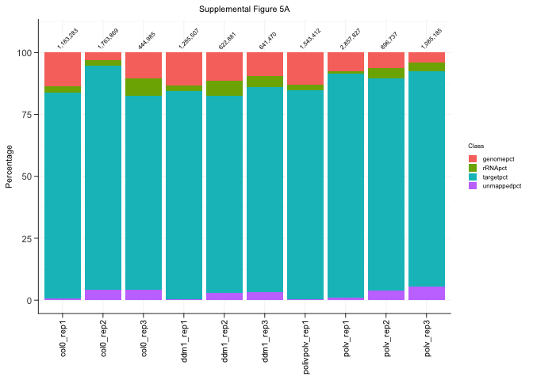
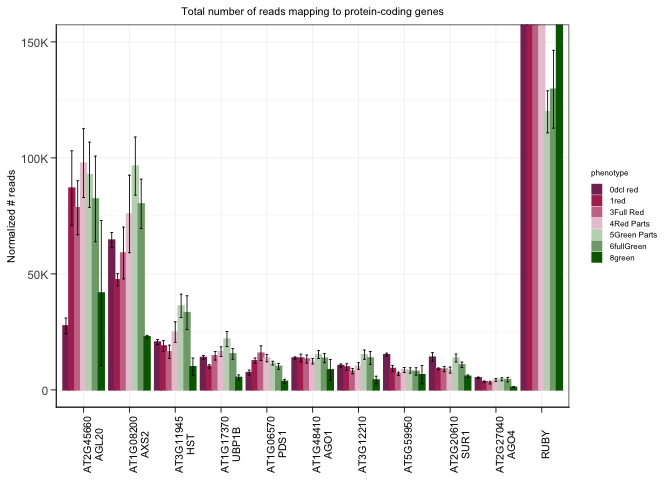
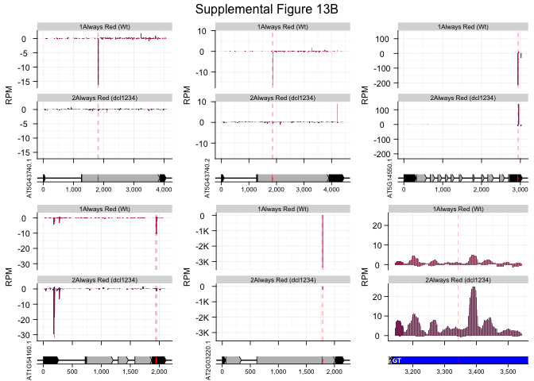

Supplemental_Figures
================

This is an [R Markdown](http://rmarkdown.rstudio.com) Notebook. When you
execute code within the notebook, the results appear beneath the code.

``` r
library(tidyverse)
```

    ## ── Attaching core tidyverse packages ──────────────────────── tidyverse 2.0.0 ──
    ## ✔ dplyr     1.1.4     ✔ readr     2.1.5
    ## ✔ forcats   1.0.0     ✔ stringr   1.5.1
    ## ✔ ggplot2   3.5.1     ✔ tibble    3.2.1
    ## ✔ lubridate 1.9.3     ✔ tidyr     1.3.1
    ## ✔ purrr     1.0.2     
    ## ── Conflicts ────────────────────────────────────────── tidyverse_conflicts() ──
    ## ✖ dplyr::filter() masks stats::filter()
    ## ✖ dplyr::lag()    masks stats::lag()
    ## ℹ Use the conflicted package (<http://conflicted.r-lib.org/>) to force all conflicts to become errors

``` r
library(ggrepel)
```

    ## Warning: package 'ggrepel' was built under R version 4.3.3

``` r
library(ggpubr)
library(RColorBrewer)
library(patchwork)
```

    ## Warning: package 'patchwork' was built under R version 4.3.3

``` r
library("ggsci")
```

    ## Warning: package 'ggsci' was built under R version 4.3.3

``` r
library("scales")
```

    ## 
    ## Attaching package: 'scales'
    ## 
    ## The following object is masked from 'package:purrr':
    ## 
    ##     discard
    ## 
    ## The following object is masked from 'package:readr':
    ## 
    ##     col_factor

``` r
library(ggh4x)
```

    ## 
    ## Attaching package: 'ggh4x'
    ## 
    ## The following object is masked from 'package:ggplot2':
    ## 
    ##     guide_axis_logticks

``` r
library("readxl")
library(Biostrings)
```

    ## Warning: package 'Biostrings' was built under R version 4.3.3

    ## Loading required package: BiocGenerics
    ## 
    ## Attaching package: 'BiocGenerics'
    ## 
    ## The following objects are masked from 'package:lubridate':
    ## 
    ##     intersect, setdiff, union
    ## 
    ## The following objects are masked from 'package:dplyr':
    ## 
    ##     combine, intersect, setdiff, union
    ## 
    ## The following objects are masked from 'package:stats':
    ## 
    ##     IQR, mad, sd, var, xtabs
    ## 
    ## The following objects are masked from 'package:base':
    ## 
    ##     anyDuplicated, aperm, append, as.data.frame, basename, cbind,
    ##     colnames, dirname, do.call, duplicated, eval, evalq, Filter, Find,
    ##     get, grep, grepl, intersect, is.unsorted, lapply, Map, mapply,
    ##     match, mget, order, paste, pmax, pmax.int, pmin, pmin.int,
    ##     Position, rank, rbind, Reduce, rownames, sapply, setdiff, sort,
    ##     table, tapply, union, unique, unsplit, which.max, which.min
    ## 
    ## Loading required package: S4Vectors
    ## Loading required package: stats4
    ## 
    ## Attaching package: 'S4Vectors'
    ## 
    ## The following objects are masked from 'package:lubridate':
    ## 
    ##     second, second<-
    ## 
    ## The following objects are masked from 'package:dplyr':
    ## 
    ##     first, rename
    ## 
    ## The following object is masked from 'package:tidyr':
    ## 
    ##     expand
    ## 
    ## The following object is masked from 'package:utils':
    ## 
    ##     findMatches
    ## 
    ## The following objects are masked from 'package:base':
    ## 
    ##     expand.grid, I, unname
    ## 
    ## Loading required package: IRanges
    ## 
    ## Attaching package: 'IRanges'
    ## 
    ## The following object is masked from 'package:lubridate':
    ## 
    ##     %within%
    ## 
    ## The following objects are masked from 'package:dplyr':
    ## 
    ##     collapse, desc, slice
    ## 
    ## The following object is masked from 'package:purrr':
    ## 
    ##     reduce
    ## 
    ## Loading required package: XVector
    ## 
    ## Attaching package: 'XVector'
    ## 
    ## The following object is masked from 'package:purrr':
    ## 
    ##     compact
    ## 
    ## Loading required package: GenomeInfoDb

    ## Warning: package 'GenomeInfoDb' was built under R version 4.3.3

    ## 
    ## Attaching package: 'Biostrings'
    ## 
    ## The following object is masked from 'package:base':
    ## 
    ##     strsplit

``` r
library(zoo)
```

    ## 
    ## Attaching package: 'zoo'
    ## 
    ## The following objects are masked from 'package:base':
    ## 
    ##     as.Date, as.Date.numeric

``` r
library(ggforce)
```

## Supplemental Figure 2G - dPCR copy number

``` r
themes <- theme(plot.title = element_text(size=8,color='black',hjust = 0.5),
                axis.text = element_text(size=8,color = 'black'),
                axis.title.x = element_blank(),
                axis.title.y = element_text(color = "black",size=8),
                strip.text = element_text(color = "black",size=8),
                legend.position = 'top',
                legend.key.size= unit(0.3,"cm"),
                legend.text = element_text(color = "black",size=6),
                legend.title = element_text(color = "black",size=6),
                line = element_line(color = 'black',linewidth=0.3,lineend="round"),
                axis.line=element_line(color='black',linewidth=0.3,lineend="round"),
                axis.ticks.length=unit(0.0516,"in"),
                axis.ticks=element_line(color='black',linewidth=0.3,lineend="round"),
                panel.background = element_blank(),
                panel.grid.major = element_line(color = 'grey95'),
                panel.grid.minor = element_line(color = 'grey95'))

inFile <- read_excel("/Users/mariannekramer/Google Drive/Kramer_et_al_AIO/Figures/ruby_dPCR/RUBY_concatenated.xlsx",sheet="Sheet2",range="A1:C22")

data <- inFile %>% dplyr::mutate(Copy_num = replace_na(Copy_num, 0),CNV_95DeltaLCI = replace_na(CNV_95DeltaLCI, 0)) %>% 
  filter(grepl("35S",Sample)) %>%
  separate(Sample,into=c("Event","Promoter","Phenotype"),sep="[.]") %>% 
  mutate(Event = str_replace(Event,"MK0",""),Event = str_replace(Event,"_","\n"),Event = str_replace(Event,"rep","Rep ")) %>% 
  mutate(Phenotype = case_when(Phenotype == "1reddish" ~ "1red", TRUE ~ Phenotype), 
         background= case_when(Promoter == "35S"~"Wild-type",Promoter == "35S_dcl1234" ~ "dcl1234"))

bottom <- data  %>% 
  ggplot(aes(x=Event,y=Copy_num,fill=Phenotype)) +
  geom_col(position=position_dodge(0.9)) +
  geom_errorbar(aes(ymin=Copy_num-CNV_95DeltaLCI, ymax=Copy_num+CNV_95DeltaLCI), width=0.2,position=position_dodge(0.9),lineend="round")+
  facet_grid(~factor(background,levels=c("Wild-type","dcl1234")),space='free',scales = 'free') + theme_bw() + themes + theme(legend.position='none')+
  scale_fill_manual(values=c("#853061","#B03060","#C97795","#7FA779","#006400","black"))+
  coord_cartesian(ylim=c(0,2.25))


top <- data  %>% 
  ggplot(aes(x=Event,y=Copy_num,fill=Phenotype)) +
  geom_col(position=position_dodge(0.9)) +
  geom_errorbar(aes(ymin=Copy_num-CNV_95DeltaLCI, ymax=Copy_num+CNV_95DeltaLCI), width=0.2,position=position_dodge(0.9),lineend="round")+
  facet_grid(~factor(background,levels=c("Wild-type","dcl1234")),space='free',scales = 'free') + theme_bw() + 
  themes + theme(legend.position='top',axis.ticks.x = element_blank())+
  scale_fill_manual(values=c("#853061","#B03060","#C97795","#7FA779","#006400","black"))+
  ggtitle("Supplemental Figure 2G: Copy number for each event, as measured by dPCR") + coord_cartesian(ylim=c(12.5,14.5))

ggarrange(top+ rremove("x.text"),bottom, heights=c(0.6,1),nrow=2,align="hv")
```

<!-- -->

## Supplemental Figure 3 - sRNA levels in each replicate

``` r
library(tidyverse)
library(ggplot2)
library(dplyr)
library(ggh4x)
library(scales)
library(patchwork)

inWt <- read.table("/Users/mariannekramer/Google Drive/Kramer_et_al_AIO/Figures/ruby_srna/all_samples.ruby_round1_2.total_sRNA_counts.perSize.txt", col.names = c("count","target","size","strand", "sample","phenotype"), as.is = T)
inNorm.R25 <- read.table("/Users/mariannekramer/Google Drive/Kramer_et_al_AIO/Figures/ruby_srna/number_mapped_reads.R25.txt", header=T, as.is = T)

indcl <- read.table("/Users/mariannekramer/Google Drive/Kramer_et_al_AIO/Figures/ruby_srna/all_samples.ruby_round5.total_sRNA_counts.perSize.txt",col.names=c("count","target","size","strand","sample","phenotype"))
inNorm.R26 <- read.table("/Users/mariannekramer/Google Drive/Slotkin_lab_projects/R26/number_mapped_reads.R26.txt",header=T)

themes <- theme(plot.title = element_text(hjust = 0.5),
                axis.text.x = element_text(angle = 90, vjust = 1, hjust=1),
                axis.title.x = element_blank(),
                line = element_line(color = 'black',linewidth=0.3,lineend="round"),
                axis.title.y = element_text(color = "black"),
                axis.title.y.right = element_text(color = "black"),
                strip.text.x = element_text(color = "black",size=8),
                legend.position = 'right')

inNorm.R25 <- inNorm.R25 %>% separate(Sample, into=c("Sample"),sep="[.]")
```

    ## Warning: Expected 1 pieces. Additional pieces discarded in 61 rows [8, 9, 10, 11, 12,
    ## 13, 14, 15, 16, 17, 18, 19, 20, 21, 22, 23, 24, 25, 26, 27, ...].

``` r
inWt.mod <- inWt %>% mutate(sample=case_when(sample=="R1S02_MK017R_BR1"~"R1S02_MK017_BR1",
                                             sample=="R1S22_MK010R_BR1"~"R1S22_MK010_BR1",
                                             grepl("MK041A",sample) ~ str_replace(sample, "MK041A","MK041"),
                                             grepl("MK034R",sample) ~ str_replace(sample, "MK034R","MK034"), TRUE ~ sample)) %>% 
  left_join(inNorm.R25, by=c("sample"="Sample")) %>% 
  mutate(sample = str_replace(sample,"BR","rep"),
         background="Wt",phenotype = case_when(phenotype == "total_sRNA_counts"~ "0no_tg",TRUE ~ phenotype)) %>%
  mutate(sample = str_replace(sample,"R[0-9]S[0-9][0-9]_",""), phenotype = case_when(phenotype == "2reddish" ~ "1red",TRUE ~ phenotype))


inNorm.R26 <- inNorm.R26 %>% separate(Sample, into=c("Sample"),sep="[.]")
```

    ## Warning: Expected 1 pieces. Additional pieces discarded in 58 rows [1, 2, 3, 4, 5, 6, 7,
    ## 8, 9, 16, 17, 18, 19, 20, 21, 22, 23, 24, 25, 26, ...].

``` r
indcl.mod <- indcl %>% left_join(inNorm.R26, by=c("sample"="Sample"))  %>% filter(!grepl("MK016",sample)) %>% 
  mutate(background = case_when(grepl("wt",sample) ~ "Wt",TRUE ~ "dcl1234"), 
         phenotype = case_when(phenotype == "perSize" ~ "0no_tg",TRUE ~ phenotype))

inFile <- rbind(inWt.mod,indcl.mod)

## Calculate the number of sRNAs in each class for each event and phenotype -- merge bioreps
allEvents.allSizes <- inFile %>% mutate(RPM = (count/Num_Mapped_Reads)*1000000) %>%
  group_by(phenotype,background) %>% mutate(phenoTotal = sum(RPM))  %>%
  separate(sample, into=c("genotype","rep"),sep="_") %>%
  group_by(phenotype,size,strand,phenoTotal,background,genotype) %>%
  dplyr::summarize(RPM.mean = mean(RPM),N=n())   %>% filter(phenotype != "0no_tg") %>%
  mutate(class = case_when(phenotype == "8green" ~ "Always Green", phenotype == "1red" ~ "Always Red", TRUE ~ "Red-to-Green"),
    phenotype = case_when(phenotype == "5fullRed" ~ "2fullRed",background=="dcl1234" ~"0red",TRUE ~phenotype),
    RPM.mean = case_when(strand == "-" ~ RPM.mean * -1, TRUE ~ RPM.mean),
    size = size * -1) 
```

    ## Warning: Expected 2 pieces. Additional pieces discarded in 81 rows [1335, 1336, 1337,
    ## 1338, 1339, 1340, 1341, 1342, 1343, 1344, 1345, 1346, 1347, 1348, 1349, 1350,
    ## 1351, 1352, 1353, 1354, ...].

    ## `summarise()` has grouped output by 'phenotype', 'size', 'strand',
    ## 'phenoTotal', 'background'. You can override using the `.groups` argument.

``` r
allEvents.allSizes.mergeSize <- allEvents.allSizes %>% group_by(phenotype,strand,background,genotype,N,class) %>%
  dplyr::summarize(phenoSum = sum(RPM.mean)) %>% mutate(genotype = str_replace(genotype,"MK0",""))
```

    ## `summarise()` has grouped output by 'phenotype', 'strand', 'background',
    ## 'genotype', 'N'. You can override using the `.groups` argument.

``` r
toLabel4 <- allEvents.allSizes %>% group_by(genotype)  %>% select(class,genotype,background,N) %>% distinct() %>% 
  mutate(phenotype = case_when((class == "Always Red" & background == "Wt") ~ "1red",
                               (class == "Always Red" & background == "dcl1234") ~ "0red",
                           class == "Always Green" ~ "8green",TRUE ~ "3redParts")) %>% 
  group_by(class,phenotype,background,genotype) %>% dplyr::summarize(N=max(N))%>% mutate(genotype = str_replace(genotype,"MK0",""))
```

    ## `summarise()` has grouped output by 'class', 'phenotype', 'background'. You can
    ## override using the `.groups` argument.

``` r
ggplot(allEvents.allSizes.mergeSize, aes(x=phenotype,y=phenoSum)) + 
  geom_col(aes(fill=phenotype),color=NA) +
  facet_nested(~factor(class,levels=c("Always Red","Red-to-Green","Always Green"))+background+genotype,scales="free_x",space='free',labeller=label_wrap_gen(width = 5, multi_line = TRUE)) +
  theme_bw()+ themes + ylab("Average RPM")+
  scale_y_continuous(limits=c(-60000,60000),labels=scales::label_number(scale_cut = cut_short_scale()))+ 
  ggtitle("Supplemental Figure 3: RPM of sRNAs (18-28nt) Mapping to 35S RUBY") + scale_fill_manual(values=c( "#853061","#B03060","#C97795","#E8C8D4","#C2D5C0","#7FA779","#006400"))+
  theme(panel.spacing = unit(0.1,"lines") ) +
  geom_text(data=toLabel4,y=-65000,aes(x=phenotype,label = paste("N = ",N,sep="")),size=3,vjust=-0.5)+theme(legend.position = "top")+
  guides(fill = guide_legend(nrow = 1))
```

<!-- -->

## Supplemental Figure 5- AIO stats

``` r
## Supplemental Figure 5A
library(tidyverse)
library(ggplot2)
library(ggrepel)
library(ggpubr)

inFile.rnd2 <- read.table("/Users/mariannekramer/Google Drive/Kramer_et_al_AIO/Figures/mapping_percentages/number_reads_mapped.round2.txt",header=T, as.is=T)
inFile.rnd3 <- read.table("/Users/mariannekramer/Google Drive/Kramer_et_al_AIO/Figures/mapping_percentages/number_reads_mapped.round3.txt",header=T, as.is=T)
themes <- theme(plot.title = element_text(size=8,color='black',hjust = 0.5),
                axis.text.x = element_text(size=8,color = 'black',angle=90, vjust = 0.5, hjust=1),
                axis.title.x = element_blank(),
                axis.title.y = element_text(color = "black",size=8),
                strip.text = element_text(color = "black",size=8),
                legend.position = 'right',
                legend.key.size= unit(0.3,"cm"),
                legend.text = element_text(color = "black",size=6),
                legend.title = element_text(color = "black",size=6),
                line = element_line(color = 'black',linewidth=0.3,lineend="round"),
                axis.line=element_line(color='black',linewidth=0.3,lineend="round"),
                axis.ticks.length=unit(0.0516,"in"),
                axis.ticks=element_line(color='black',linewidth=0.3,lineend="round"),
                panel.background = element_blank(),
                panel.grid.major = element_line(color = 'grey95'),
                panel.grid.minor = element_line(color = 'grey95'))

toPlot.rnd2 <- inFile.rnd2 %>% 
  rowwise() %>%
  mutate(sum=sum(c(rRNA,Targets,Non.targets,unmapped))) %>%
  separate(sample, c("name"),"[.]",extra="drop") %>%
  dplyr::mutate(name, 
            rRNApct =rRNA/sum*100, 
            targetpct =Targets/sum*100,
            genomepct =Non.targets/sum*100,
            unmappedpct =unmapped/sum*100) %>% 
  pivot_longer(c(rRNApct,targetpct,genomepct,unmappedpct),names_to = "Class") %>%
  transmute(name, Class, value, sum,reads =value * sum/100) %>%
  mutate(across(value,round,2),
         name = case_when(name == "4_poliv_polv" ~ "4_polivpolv_rep1", TRUE ~ paste(name,"rep1",sep="_"))) 
```

    ## Warning: There was 1 warning in `mutate()`.
    ## ℹ In argument: `across(value, round, 2)`.
    ## Caused by warning:
    ## ! The `...` argument of `across()` is deprecated as of dplyr 1.1.0.
    ## Supply arguments directly to `.fns` through an anonymous function instead.
    ## 
    ##   # Previously
    ##   across(a:b, mean, na.rm = TRUE)
    ## 
    ##   # Now
    ##   across(a:b, \(x) mean(x, na.rm = TRUE))

``` r
toPlot.rnd3 <- inFile.rnd3 %>% 
  rowwise() %>%
  mutate(sum=sum(c(rRNA,Targets,Non.targets,unmapped))) %>%
  separate(sample, c("name"),"[.]",extra="drop") %>%
  dplyr::mutate(name, 
         rRNApct =rRNA/sum*100, 
         targetpct =Targets/sum*100,
         genomepct =Non.targets/sum*100,
         unmappedpct =unmapped/sum*100) %>% 
  pivot_longer(c(rRNApct,targetpct,genomepct,unmappedpct),names_to = "Class") %>%
  transmute(name, Class, value, sum,reads =value * sum/100) %>%
  mutate(across(value,round,2)) 

toPlot.merge <- rbind(toPlot.rnd2,toPlot.rnd3) %>% 
  filter(grepl("polv",name,ignore.case=TRUE) | grepl("ddm1",name,ignore.case=TRUE) | grepl("col",name,ignore.case=TRUE)) %>%
  separate(name,into=c("num","name"),extra="merge")

toLabel <- toPlot.merge %>% select(name,sum) %>% distinct()

toPlot.merge %>% 
  ggplot(aes(x=name,y=value,fill=Class)) + 
  geom_col()+
  geom_text(data=toLabel,aes(x=name, label = prettyNum(sum,big.mark=",",scientific=F)),y=100, 
            position = position_stack(),size=2,inherit.aes = F,angle=45,vjust=-1,hjust=0)+ 
  themes + ggtitle("Supplemental Figure 5A") + ylab("Percentage")+scale_y_continuous(limits=c(0,108),breaks=c(0,25,50,75,100))
```

    ## Warning: Stacking requires either the ymin and ymax or the y aesthetics
    ## ℹ Maybe you want `position = "identity"`?

<!-- -->

## Supplemental Figure 5B: Demultiplexing efficiency

``` r
data1 <- read.table("/Users/mariannekramer/Google Drive/Kramer_et_al_AIO/Figures/Demultiplexing_efficiency/number_reads_gus_egfp.ruby_round1.demulti.trimmed.txt", header = T, as.is=T)

## Calculate the percentage of reads mapping to GFP or GUS
pct1 <- data1 %>% 
  rowwise() %>%
  mutate(sample,pctGFP = gfp/total*100,pctGUS = gus/total*100, pctGOther = (total-gfp-gus)/total*100) %>%
  pivot_longer(cols=c(pctGFP, pctGUS,pctGOther),names_to="Class")%>%
  transmute(sample, Class, value, total,reads =value * total/100) %>% separate(sample,into = c("sample","Geno","Rep")) %>%
  mutate(across(value, \(x) round(x, 2))) %>%
  mutate(reads_label = if_else(!is.na(reads), label_comma()(reads), NA_character_))
```

    ## Warning: Expected 3 pieces. Additional pieces discarded in 66 rows [1, 2, 3, 4, 5, 6, 7,
    ## 8, 9, 10, 11, 12, 13, 14, 15, 16, 17, 18, 19, 20, ...].

``` r
## Create themes for plotting image preferences
themes <- theme(legend.position = "right", 
                axis.ticks.length=unit(0.0516,"in"),
                line = element_line(color = 'black',linewidth=0.3,lineend="round"),
                plot.title=element_text(hjust=0.5, color = 'black', size = 8), 
                axis.title.x= element_blank(), 
                axis.text.x=element_text(color = 'black',size = 8), 
                axis.line=element_line(color = 'black'), 
                axis.text.y= element_text(color = 'black',size = 8),
                axis.title.y= element_text(color = 'black',size = 8),
                legend.text=element_text(color = 'black',size = 6),
                legend.key.size= unit(0.3,"cm"),
                legend.title = element_text(color = 'black',size = 8),
                strip.text=element_text(color='black',size=8),
                panel.background = element_blank())

## Plot
ggplot(pct1,aes(x=sample,y=value,fill=Class,label=reads)) + 
  geom_col()+
  geom_text(aes(label = reads_label), position = position_stack(vjust = 0.5),size=3)+ 
  themes + ggtitle("Supplemental Figure 5B: Percent Reads mapping to each spike-in") + ylab("Percentage") + 
  scale_fill_manual(values=c("green","gray","steelblue2"))
```

<!-- -->

## Supplemental Figure 5C: GFP Coverage plot

``` r
library(tidyverse)
library(gggenes)
library(ggpubr)

## plot non_pA
themes<-theme(axis.ticks.length=unit(0.0516,"in"),
               axis.title.x=element_blank(),
               axis.text.x= element_blank(),
               axis.text.y= element_text(color = 'black',size = 8,hjust=0.5), 
               axis.line.x=element_line(color='black'),axis.line.y=element_line(color='black'),
               axis.title.y=element_text(color = 'black',size = 8),
              panel.background = element_blank(),
              panel.grid.major = element_line(color = 'grey95'),
               panel.grid.minor = element_line(color = 'grey95'))


## Get file name, extract transgene and sample number
fileName1 <-"/Users/mariannekramer/Google Drive/Kramer_et_al_AIO/Figures/gfp_gus_coverage_plots/02_MK017_rep1.35S.8green.non_pA.filtered.rRNA_free.mapped_to_targets" #"01_MK001_rep1.35S.7green.mapped_to_targets"  #
fileName2 <-"/Users/mariannekramer/Google Drive/Kramer_et_al_AIO/Figures/gfp_gus_coverage_plots/05_poliv_rep1.non_pA.filtered.rRNA_free.mapped_to_targets" #"01_col0_rep2.mapped_to_targets" #
target <- "eGFP" 

## non_pA
coverage1 <- read.table(paste(fileName1,".bed12",sep=""),col.names = c("name","start", "stop","name2","foo","strand","blockStart","blockStop","food2","blockNum","blockLen","relStart","scores"))
fivep1 <- read.table(paste(fileName1,".5p.bed12",sep=""),col.names = c("name","start", "stop","name2","foo","strand","blockStart","blockStop","food2","blockNum","blockLen","relStart","scores"))
threep1 <- read.table(paste(fileName1,".3p.bed12",sep=""),col.names = c("name","start", "stop","name2","foo","strand","blockStart","blockStop","food2","blockNum","blockLen","relStart","scores"))

coverage2 <- read.table(paste(fileName2,".bed12",sep=""),col.names = c("name","start", "stop","name2","foo","strand","blockStart","blockStop","food2","blockNum","blockLen","relStart","scores"))
fivep2 <- read.table(paste(fileName2,".5p.bed12",sep=""),col.names = c("name","start", "stop","name2","foo","strand","blockStart","blockStop","food2","blockNum","blockLen","relStart","scores"))
threep2 <- read.table(paste(fileName2,".3p.bed12",sep=""),col.names = c("name","start", "stop","name2","foo","strand","blockStart","blockStop","food2","blockNum","blockLen","relStart","scores"))

##### Filter bed12 to only contain gene of interest, and convert score list to lsit of integers
## Convert to file to plot, 3 rows, txt, nt, and score
covScores1 <- tibble(coverage1 %>% filter(grepl(target,name))) %>% mutate(scores = lapply(str_split(scores,","),as.integer))%>% rowwise() %>% mutate(nts = list(seq.int(start,stop-1))) %>% select(name,nts,scores) %>% unnest_longer(c(scores,nts))
fivepScores1 <- tibble(fivep1 %>% filter(grepl(target,name))) %>% mutate(scores = lapply(str_split(scores,","),as.integer))%>% rowwise() %>% mutate(nts = list(seq.int(start,stop-1))) %>% select(name,nts,scores) %>% unnest_longer(c(scores,nts))
threepScores1 <- tibble(threep1 %>% filter(grepl(target,name))) %>% mutate(scores = lapply(str_split(scores,","),as.integer))%>% rowwise() %>% mutate(nts = list(seq.int(start,stop-1))) %>% select(name,nts,scores) %>% unnest_longer(c(scores,nts))

covScores2 <- tibble(coverage2 %>% filter(grepl(target,name))) %>% mutate(scores = lapply(str_split(scores,","),as.integer))%>% rowwise() %>% mutate(nts = list(seq.int(start,stop-1))) %>% select(name,nts,scores) %>% unnest_longer(c(scores,nts))
fivepScores2 <- tibble(fivep2 %>% filter(grepl(target,name))) %>% mutate(scores = lapply(str_split(scores,","),as.integer))%>% rowwise() %>% mutate(nts = list(seq.int(start,stop-1))) %>% select(name,nts,scores) %>% unnest_longer(c(scores,nts))
threepScores2 <- tibble(threep2 %>% filter(grepl(target,name))) %>% mutate(scores = lapply(str_split(scores,","),as.integer))%>% rowwise() %>% mutate(nts = list(seq.int(start,stop-1))) %>% select(name,nts,scores) %>% unnest_longer(c(scores,nts))

maxCov1 <- max(covScores1$scores)
maxfiveP1 <- max(fivepScores1$scores)
maxthreeP1 <- max(threepScores1$scores)

maxCov2 <- max(covScores2$scores)
maxfiveP2 <- max(fivepScores2$scores)
maxthreeP2 <- max(threepScores2$scores)

## Merge samples
covScoresMerge <- covScores1 %>% left_join(covScores2,by=c("name","nts")) %>% mutate(scores= scores.x+scores.y) 
maxcovScoresMerge <- max(covScoresMerge$scores, na.rm = T)

fivepScoresMerge <- fivepScores1 %>% left_join(fivepScores2,by=c("name","nts")) %>% mutate(scores=scores.x+scores.y) 
maxfivepScoresMerge <- max(fivepScoresMerge$scores, na.rm = T)

threepScoresMerge <- threepScores1 %>% left_join(threepScores2,by=c("name","nts")) %>% mutate(scores=scores.x+scores.y)
maxthreepScoresMerge <- max(threepScoresMerge$scores, na.rm = T)


covPlot.merge<- ggplot(covScoresMerge, aes(x=nts,y=scores))+ geom_area(stat="identity",color="blue",fill="blue") + ylab("\nTotal")+
  themes + 
  scale_y_continuous(breaks=seq(0,maxcovScoresMerge,maxcovScoresMerge),labels = scales::label_number(scale_cut = cut_short_scale()))

fivepPlot.merge <-ggplot(fivepScoresMerge, aes(x=nts,y=scores))+ geom_area(stat="identity",color="blue",fill="blue")+ ylab("5'\nends")+
  themes+ 
  scale_y_continuous(breaks=seq(0,maxfivepScoresMerge,maxfivepScoresMerge),labels=scales::label_number(scale_cut = cut_short_scale()))

threepPlot.merge <-ggplot(threepScoresMerge, aes(x=nts,y=scores))+ geom_area(stat="identity",color="blue",fill="blue")+ ylab("3'\nends")+
  themes+
  scale_y_continuous(breaks=seq(0,maxthreepScoresMerge,maxthreepScoresMerge),labels=scales::label_number(scale_cut = cut_short_scale()))

## Make file and image for eGFP
len <- nrow(covScores1)
t<- data.frame(molecule = "GFP",Start=1, End=len, orientation=1, Name="GFP")

tg <- ggplot(t,aes(xmin = Start, xmax = End, y = molecule,forward=orientation,label=Name)) +
  geom_gene_arrow(arrow_body_height = grid::unit(4, "mm"),arrowhead_height = unit(4, "mm"), arrowhead_width = unit(1, "mm"),
                  fill = "green",
                  color = "black") + 
  xlab("Relative position along transgene")+
  geom_gene_label(fontface="bold", padding.y = grid::unit(0.01,"mm"), padding.x = grid::unit(0.2,"mm"),grow=TRUE,align = "left") +
  theme(axis.ticks.y=element_blank(), axis.text.y= element_blank(),axis.text.x= element_text(color = 'black',size = 8, face = 'bold'),axis.title.y= element_blank(), axis.title.x= element_text(color = 'black',size = 8, face = 'bold'), axis.line.x=element_line(color = 'black'),panel.background = element_blank(),plot.title= element_text(color = 'black',size = 16, face = 'bold',hjust=0.5))+
  theme(axis.title.x=element_blank())

ggarrange(covPlot.merge,fivepPlot.merge,threepPlot.merge,tg,ncol=1,nrow=4,heights=c(1,1,1,0.5),align="v") %>% annotate_figure(top = "Supplemental Figure 5C")
```

<!-- -->

## Supplemental Figure 6A - Percent of protein coding genes that are polyA+

``` r
## Set themes
themes <- theme(plot.title = element_text(size=8,color='black',hjust = 0.5),
                axis.text = element_text(size=8,color = 'black'),
                axis.title.x = element_blank(),
                axis.title.y = element_text(color = "black",size=8),
                strip.text = element_text(color = "black",size=8),
                legend.position = 'top',
                legend.key.size= unit(0.3,"in"),
                legend.text = element_text(color = "black",size=6),
                legend.title = element_text(color = "black",size=6),
                line = element_line(color = 'black',linewidth=0.3,lineend="round"),
                axis.line=element_line(color='black',linewidth=0.3,lineend="round"),
                axis.ticks.length=unit(0.0516,"in"),
                axis.ticks=element_line(color='black',linewidth=0.3,lineend="round"),
                panel.background = element_blank(),
                panel.grid.major = element_line(color = 'grey95'),
                panel.grid.minor = element_line(color = 'grey95'))
# Read in data
## Read in files from two independent experiments for the total amount of reads mapping to each target
round2.all <- read.table("/Users/mariannekramer/Google Drive/Kramer_et_al_AIO/Figures/at_mutants/all.combined_numReads_mapped_to_targets.strandedness.perpA.at_round2.txt", header = T, as.is = T)
round3.all <- read.table("/Users/mariannekramer/Google Drive/Kramer_et_al_AIO/Figures/at_mutants/all.combined_numReads_mapped_to_targets.strandedness.perpA.at_round3.txt", header = T, as.is = T)

## Read in file with number of mapped reads per sample for normalization
inNorm <- read.table("/Users/mariannekramer/Google Drive/Kramer_et_al_AIO/Figures/at_mutants/number_reads_mapped.at_round2_3.txt",header = TRUE)
norm <- inNorm %>% transmute(sample, MapTotal = rRNA+Targets+Non.targets) 

# Combine all genotypes
mergeFile.all <- rbind(round2.all,round3.all) %>%
  tidyr::unite(Gene,c(Gene,Name,Class),sep="__") %>% 
  complete(Gene,Sample,fill=list(Sense_non_pA=0,Anti_non_pA=0,Sense_pA=0,Anti_pA=0,Total=0)) %>% 
  separate(Gene,into=c("Gene","Name","Class"),sep="__") 

# Normalize by sample size
norm.All <- norm %>% left_join(mergeFile.all,by=c("sample"="Sample")) %>% 
  transmute(Gene,Name,Class,sample,
            normSense_nonpA= (Sense_non_pA/MapTotal)*1000000,normAnti_nonpA= (Anti_non_pA/MapTotal)*1000000,
            normSense_pA= (Sense_pA/MapTotal)*1000000,normAnti_pA= (Anti_pA/MapTotal)*1000000) %>% 
  rowwise() %>% 
  mutate(normTotal=normSense_nonpA+normAnti_nonpA+normSense_pA+normAnti_pA) %>% 
  mutate(Name = case_when(Gene==Name ~ "", TRUE~ Name),
         pctSensepA = (normSense_pA/normTotal)*100, pctAntipA = (normAnti_pA/normTotal)*100,
         pctSensenonpA = (normSense_nonpA/normTotal)*100, pctAntinonpA = (normAnti_nonpA/normTotal)*100) %>%
  mutate_if(is.numeric, ~replace(.,is.nan(.), 0)) %>% 
  tidyr::unite(Name,c(Gene,Name),sep="\n") %>% 
  mutate(sample = case_when(sample =="1_col0" ~ "1_col0_rep1" ,
                            sample == "3_polv" ~ "3_polv_rep1", 
                            sample == "4_poliv_polv" ~ "4_polivpolv_rep1",
                            sample == "9_ddm1" ~ "9_ddm1_rep1", TRUE ~ sample))


#############
## Look at percent of reads that are polyA+ for protein-coding genes
#############
all.pcg <- norm.All %>% filter(Class == "Protein-coding" & grepl("col0",sample) & !grepl("TE",Name) & Name != "AT1G07590\n") %>% select(Name:normTotal) %>%   group_by(Name,sample,Class) %>%  dplyr::summarize(normSense_nonpA=sum(normSense_nonpA),normAnti_nonpA=sum(normAnti_nonpA),normSense_pA=sum(normSense_pA), normAnti_pA=sum(normAnti_pA)) %>% rowwise() %>% mutate(normTotal=normSense_nonpA+normAnti_nonpA+normSense_pA+normAnti_pA,Sample = "All")  %>% separate(sample,into=c("num","Genotype","rep"))
```

    ## `summarise()` has grouped output by 'Name', 'sample'. You can override using
    ## the `.groups` argument.

``` r
pctpA.all.pcg <- all.pcg %>% mutate(pctpA = normSense_pA / (normSense_pA+normSense_nonpA)*100) %>% filter(!grepl("AT1G07590",Name))  %>% 
  mutate(Gene = Name) %>% select(Gene, Genotype,pctpA,Name )

pctpA.all.pcg.avg <- all.pcg %>% mutate(pctpA = normSense_pA / (normSense_pA+normSense_nonpA)*100) %>% filter(!grepl("AT1G07590",Name)) %>%
  group_by(Name, Genotype) %>% dplyr::summarize(pctpA = mean(pctpA,na.rm=T)) %>% dplyr::rename("Gene"=Name) %>% mutate(Name = "All Genes")
```

    ## `summarise()` has grouped output by 'Name'. You can override using the
    ## `.groups` argument.

``` r
x <- rbind(pctpA.all.pcg,pctpA.all.pcg.avg) %>% mutate(Name = factor(Name, levels = c("All Genes", setdiff(Name[order(pctpA, decreasing = TRUE)], "All Genes"))))

ggbarplot(data = x, x="Name",y="pctpA",fill="Name",color="Genotype",ylab = "Percentage of reads that are polyA+", xlab= FALSE,
          position=position_dodge(0.75),sort.val="desc",
          palette=c("gray50","red","red","red","red","red","red","red","red","red","red","red"),
          add = c("mean_se","jitter"),
          title = "Supplemental Figure 6A: Percentage of reads that are polyA+",x.text.angle=90,ggtheme=theme_bw(),font.tickslab = c(12,'black'),add.params = list(width = 0.3)) +
  scale_color_manual(values = c(col0 = "black")) + scale_y_continuous(labels=scales::label_number(scale_cut = cut_short_scale())) + themes+
  theme(axis.ticks.length=unit(0.0516,"in"),legend.position='none')
```

    ## Scale for colour is already present.
    ## Adding another scale for colour, which will replace the existing scale.

<!-- -->

## NOTE: For Supplemental Figure 6B-E, see Figure_4.Rmd and change input gene to gene in title of plots

## Supplemental Figure 6F – 3’ ends at splice sites

``` r
## Read in files
inss3 <- read.table("/Users/mariannekramer/Google Drive/Kramer_et_al_AIO/Figures/threep_ends_at_splicesites/col0_rep123.non_pA.filtered.rRNA_free.mapped_to_targets.cat.pcg.3pends_at_3pss.readCount.txt",col.names = c("chr","covStart","covStop","count","strand","ssStart","ssStop","exon","transcript","ss"))

inss5 <- read.table("/Users/mariannekramer/Google Drive/Kramer_et_al_AIO/Figures/threep_ends_at_splicesites/col0_rep123.non_pA.filtered.rRNA_free.mapped_to_targets.cat.pcg.3pends_at_5pss.readCount.txt",col.names = c("chr","covStart","covStop","count","strand","ssStart","ssStop","exon","transcript","ss"))

## pull out the last exon information 
lastExon <- inss3 %>% select(exon,transcript) %>% separate(exon,into=c("exon","num")) %>% group_by(transcript) %>% dplyr::summarize(lastExon = max(num)) %>% mutate(lastExon = paste("exon",lastExon, sep="_"))

## Calculate relative location, remove information about the last exon
a <- inss3 %>% mutate(relStart = covStart-ss,site="2ss3") %>% left_join(lastExon,by="transcript") %>% filter (exon != lastExon) %>% select(relStart,count,transcript,site) %>% complete(relStart,transcript,site, fill=list(count=0),explicit = F)
b <- inss5 %>% mutate(relStart = covStart-ss,site="1ss5") %>% left_join(lastExon,by="transcript") %>% filter (exon != lastExon) %>% select(relStart,count,transcript,site) %>% complete(relStart,transcript,site, fill=list(count=0),explicit = F)


c <- rbind(a,b) %>% group_by(relStart,site) %>% dplyr::summarize(count=sum(count))
```

    ## `summarise()` has grouped output by 'relStart'. You can override using the
    ## `.groups` argument.

``` r
themes <- theme(plot.title = element_text(hjust = 0.5,face = 'bold',size=8),
                axis.text = element_text(color = "black",size=8),
                axis.title = element_text(color = "black",size=8),
                line = element_line(color = 'black',linewidth=0.3,lineend="round"),
                strip.text.x = element_text(color = "black",size=6),
                legend.position = 'right')
geneModel <-data.frame(
  site = c("1ss5","2ss3"),
  xmin = c(-25,0),
  xmax = c(0,25))
intronLines <-data.frame(
  site = c("1ss5","2ss3"),
  xmin = c(0,-25),
  xmax = c(25,0))

ggplot(c,aes(x=relStart,y=count)) + geom_col(fill="blue") + 
  facet_grid(~site)+ theme_bw()+themes+scale_y_continuous(labels=scales::label_number(scale_cut = cut_short_scale()))+ xlab("Position relative") +scale_x_continuous(breaks=c(-25,0,25)) + ggtitle("Supplemental Figure 6F: Enrichment of 3' ends of polyA- reads at 5' and 3' splice sites") + ylab("Number of reads") +
  geom_rect(data=geneModel,ymin=-3000,ymax=-1000, aes(xmin=xmin,xmax=xmax),color='black',fill=NA,inherit.aes = F) +
  geom_segment(data=intronLines,y=-2000,aes(x=xmin,xend=xmax))
```

<!-- -->

## Supplemental Figure 6G: Number of reads mapping to each intron

``` r
## Set themes
themes <- theme(plot.title = element_text(size=8,color='black',hjust = 0.5),
                axis.text.x = element_text(size=8,color = 'black'),
                axis.title.x = element_blank(),
                axis.title.y = element_text(color = "black",size=8),
                strip.text = element_text(color = "black",size=8),
                legend.position = 'right',
                legend.key.size= unit(0.3,"cm"),
                legend.text = element_text(color = "black",size=6),
                legend.title = element_text(color = "black",size=6),
                line = element_line(color = 'black',linewidth=0.3,lineend="round"),
                axis.line=element_line(color='black',linewidth=0.3,lineend="round"),
                axis.ticks.length=unit(0.0516,"in"),
                axis.ticks=element_line(color='black',linewidth=0.3,lineend="round"),
                panel.background = element_blank(),
                panel.grid.major = element_line(color = 'grey95'),
                panel.grid.minor = element_line(color = 'grey95'))

inIntron <- read.table("/Users/mariannekramer/Google Drive/Kramer_et_al_AIO/Figures/reads_over_introns/col0_rep123.non_pA.filtered.rRNA_free.mapped_to_targets.cat.pcg.introns.readCount.txt",
                    col.names = c("chr","covStart","covStop","count","strand","intStart","intStop","transcript","intron"))
totalCount <- inIntron %>% separate(transcript, into = c("Gene","txtN"),remove = F) %>% group_by(Gene) %>% dplyr::summarize(total = sum(count))

toPlot <- inIntron %>% separate(transcript, into = c("Gene","txtN"),remove = F) %>% group_by(Gene,intron) %>% 
  dplyr::summarize(totalCount = sum(count)) %>% left_join(totalCount, by="Gene") %>% mutate(normCount = totalCount/total) %>%
  separate(intron,into=c("intron","num")) %>% mutate(num=as.integer(num))%>% 
  group_by(Gene) %>% dplyr::mutate(N = n(),Gene = paste(Gene," (",N," introns)",sep=""))
```

    ## `summarise()` has grouped output by 'Gene'. You can override using the
    ## `.groups` argument.

``` r
intronMeans <- toPlot %>% group_by(num) %>% dplyr::summarize(N = n())

mycolors<-colorRampPalette(brewer.pal(8, "Set2"))(12)

ggplot(toPlot, aes(x=as.factor(num),y=normCount,color=Gene)) + geom_line(aes(group=Gene)) + theme_bw() + themes + geom_point()+
  scale_y_continuous(labels=scales::label_number(scale_cut = cut_short_scale()))  + scale_color_manual(values=mycolors) + 
  ylab("Number of polyA- reads mapping in introns\n normalized to the total number of reads within introns per transcripts") +
  ggtitle("Supplemental Figure 6G: Number of polyA- reads mapping in introns\n normalized to the total number of reads within introns per transcripts") +
  xlab("Intron number") +stat_summary(fun=mean, geom="line", aes(group=1),color="red",linewidth=1)  + 
  stat_summary(fun=mean, aes(shape=""),geom="point",color="red",size=3)+scale_shape_manual("mean", values= 18)
```

<!-- -->

## Supplemental Figure 7 - reads mapping to protein coding genes in RUBY samples

``` r
## Input file with number of reads mapping per sample for normalization
inNorm <- read.table("/Users/mariannekramer/Google Drive/Kramer_et_al_AIO/Figures/ruby_aio_read_Count/number_reads_mapped.ruby_rounds1235.txt",header = TRUE)
norm <- inNorm %>% transmute(sample, MapTotal = rRNA+Targets+Non_targets)

## Read in file with classes for each target
classes <- "/Users/mariannekramer/Google Drive/Kramer_et_al_AIO/Figures/ruby_aio_read_Count/At_array.v2.Arabidopsis_thaliana.TAIR10.56.Araport11_transposable_element.current.targetChr.construct.transgenes.targets_class.txt"
inClass <- read.table(classes, col.names = c("FaName","Gene","Class"), as.is = T)
inClass <- inClass %>% separate(FaName, into = c("faName"),sep="_") %>% 
  mutate(faName = case_when(grepl("RUBY",Gene)~ Gene, TRUE ~faName ))
```

    ## Warning: Expected 1 pieces. Additional pieces discarded in 79 rows [1, 2, 3, 4, 5, 6, 7,
    ## 8, 9, 10, 11, 12, 13, 14, 15, 16, 17, 18, 19, 20, ...].

``` r
## Read in files of all reads mapping to RUBY for each sample, across three different experiments
round1.all <- read.table("/Users/mariannekramer/Google Drive/Kramer_et_al_AIO/Figures/ruby_aio_read_Count/all.combined_numReads_mapped_to_targets.strandedness.perpA.round1.txt", header = T, as.is = T)
round2.all <- read.table("/Users/mariannekramer/Google Drive/Kramer_et_al_AIO/Figures/ruby_aio_read_Count/all.combined_numReads_mapped_to_targets.strandedness.perpA.round2.txt", header = T, as.is = T)
round5.all <- read.table("/Users/mariannekramer/Google Drive/Kramer_et_al_AIO/Figures/ruby_aio_read_Count/all.combined_numReads_mapped_to_targets.strandedness.perpA.round5.txt", header = T, as.is = T)


# Combine all rounds
mergeFile.all <- rbind(round1.all,round2.all,round5.all) %>% 
  mutate(Name = case_when(grepl("RUBY",Gene) ~ "RUBY", TRUE ~ Name),
         Gene = case_when(grepl("RUBY",Gene) ~ "RUBY", TRUE ~ Gene)) %>%
  tidyr::unite(tmp,c(Gene,Name,Class),sep="__") %>% 
  complete(tmp,Sample,fill=list(Sense_non_pA=0,Anti_non_pA=0,Sense_pA=0,Anti_pA=0,Total=0)) %>% 
  separate(tmp,into=c("Gene","Name","Class"),sep="__") 

# Normalize by sample size
norm.All <- mergeFile.all %>% left_join(norm,by=c("Sample"="sample")) %>% 
  transmute(Gene,Name,Class,Sample,
            normSense_nonpA= round((Sense_non_pA/MapTotal)*1000000,2),
            normAnti_nonpA= round((Anti_non_pA/MapTotal)*1000000,2),
            normSense_pA= round((Sense_pA/MapTotal)*1000000,2),normAnti_pA= round((Anti_pA/MapTotal)*1000000,2)) %>% 
  rowwise() %>% 
  mutate(normTotal=normSense_nonpA+normAnti_nonpA+normSense_pA+normAnti_pA) %>% 
  mutate(Name = case_when(Gene==Name ~ "", TRUE~ Name),
         pctSensepA = round((normSense_pA/normTotal)*100,2), 
         pctAntipA = round((normAnti_pA/normTotal)*100,2),
         pctSensenonpA = round((normSense_nonpA/normTotal)*100,2), 
         pctAntinonpA = round((normAnti_nonpA/normTotal)*100,2)) %>% 
  mutate_if(is.numeric, ~replace(.,is.nan(.), 0)) %>% 
  tidyr::unite(Name,c(Gene,Name),sep="\n") %>% separate(Sample,into=c("genotype","promoter","phenotype"),sep="[.]") %>% 
  separate(genotype,into=c("num","plant","rep"),sep="_") %>% tidyr::unite(genotype, c(plant,rep),sep="_")


phenoColors <- c("#853061","#B03060","#C97795","#E8C8D4","#C2D5C0","#7FA779","#006400")

all.pcg <- norm.All %>% filter((Class == "Protein-coding" | Class == "transgene")&grepl("35S",promoter)) %>% mutate(phenotype = case_when(phenotype == "3redParts" ~ "4Red Parts",phenotype == "4greenParts" ~ "5Green Parts",phenotype == "5fullRed" ~ "3Full Red",phenotype == "7fullGreen" ~ "7greenRedCotyledons",phenotype == "2reddish" ~ "1red",phenotype == "7green" ~ "0col",TRUE ~ phenotype)) %>%   separate(genotype,into=c("Genotype","Rep")) %>% mutate(Genotype = case_when(Genotype == "MK041A" ~ "MK041", TRUE ~ Genotype),class = case_when(phenotype == "1red" ~ "Always Red", phenotype == "8green" ~ "Always Green",phenotype=="0col"~"No transgene",TRUE~ "Red-to-Green")) %>% mutate(Genotype = str_replace(Genotype,"MK0",""),Rep = str_replace(Rep,"rep","Rep ")) %>%   mutate(background=case_when(promoter!="35S"~"dcl1234",TRUE ~ "Wt"),phenotype=case_when(promoter== "35S_dcl1234" ~ "0red",TRUE ~ phenotype))

all.pcg2 <- all.pcg %>% mutate(phenotype=case_when(promoter=="35S_dcl1234" ~ "0dcl red", TRUE ~ phenotype)) %>% filter(phenotype != "0col") 

all.pcg2%>% filter(Class =="transgene")
```

    ## # A tibble: 69 × 18
    ##    Name     Class     num   Genotype Rep   promoter    phenotype normSense_nonpA
    ##    <chr>    <chr>     <chr> <chr>    <chr> <chr>       <chr>               <dbl>
    ##  1 "RUBY\n" transgene 01    41       Rep 1 35S         4Red Par…          82936.
    ##  2 "RUBY\n" transgene 01    72       Rep 1 35S_dcl1234 0dcl red          219651.
    ##  3 "RUBY\n" transgene 02    17       Rep 1 35S         8green            139026.
    ##  4 "RUBY\n" transgene 02    41       Rep 1 35S         5Green P…          58607.
    ##  5 "RUBY\n" transgene 02    72       Rep 2 35S_dcl1234 0dcl red          222029.
    ##  6 "RUBY\n" transgene 03    16       Rep 1 35S         1red               49364.
    ##  7 "RUBY\n" transgene 03    41       Rep 1 35S         3Full Red          92028.
    ##  8 "RUBY\n" transgene 03    72       Rep 3 35S_dcl1234 0dcl red          237905.
    ##  9 "RUBY\n" transgene 04    16       Rep 2 35S         1red               82121.
    ## 10 "RUBY\n" transgene 04    41       Rep 2 35S         4Red Par…          74394.
    ## # ℹ 59 more rows
    ## # ℹ 10 more variables: normAnti_nonpA <dbl>, normSense_pA <dbl>,
    ## #   normAnti_pA <dbl>, normTotal <dbl>, pctSensepA <dbl>, pctAntipA <dbl>,
    ## #   pctSensenonpA <dbl>, pctAntinonpA <dbl>, class <chr>, background <chr>

``` r
all.pcg2 %>% group_by(phenotype,class,promoter,Name) %>% 
  dplyr::summarize(avg = mean(normTotal), numBR = n(), sem = sd(normTotal)/sqrt(n()))  %>% 
  group_by(Name) %>% dplyr::mutate(superAvg = mean(avg)) %>% ungroup() %>%
  arrange(desc(superAvg)) %>%
  slice_head(n = 77) %>% mutate(Name = factor(Name, levels = c(setdiff(Name[order(avg, decreasing = TRUE)], "RUBY\n"),"RUBY\n"))) %>%
  ggplot(aes(x=Name,y=avg,fill=phenotype)) + 
  geom_col(position=position_dodge(0.9),aes(color=phenotype))+ 
  scale_y_continuous(labels=scales::label_number(scale_cut = cut_short_scale())) +
  geom_errorbar(aes(ymin=avg-sem, ymax=avg+sem),color='black', width=0.3,position=position_dodge(0.9),linewidth=0.3,lineend="round")+
  theme_bw() + themes + scale_fill_manual(values=c(phenoColors)) + scale_color_manual(values=c(phenoColors)) + 
  ggtitle("Total number of reads mapping to protein-coding genes") + ylab("Normalized # reads") +
  theme(axis.text.x = element_text(color="black",size=8,angle=90)) +
  coord_cartesian(ylim=c(0,150000))
```

    ## `summarise()` has grouped output by 'phenotype', 'class', 'promoter'. You can
    ## override using the `.groups` argument.

<!-- -->

## For Supplemental Figure 8-10 - See Figure_5.Rmd for code

## Supplemental Figure 12 - - compare the number of reads ending at GTc.171 and sRNA levels

``` r
## Read files with the number of reads ending at GTc.171 or not
round1.3343.all <- read.table("/Users/mariannekramer/Google Drive/Kramer_et_al_AIO/Figures/ruby_aio_read_Count/end_at_3343/all.non_pA.filtered.rRNA_free.mapped_to_targets.RUBY_end_at_3343.counts.ruby_round1.final.txt", col.names=c("Count","Gene","Sample"), as.is = T)
round2.3343.all <- read.table("/Users/mariannekramer/Google Drive/Kramer_et_al_AIO/Figures/ruby_aio_read_Count/end_at_3343/all.non_pA.filtered.rRNA_free.mapped_to_targets.RUBY_end_at_3343.counts.ruby_round2.final.txt", col.names=c("Count","Gene","Sample"), as.is = T)
round5.3343.all <- read.table("/Users/mariannekramer/Google Drive/Kramer_et_al_AIO/Figures/ruby_aio_read_Count/end_at_3343/all.non_pA.filtered.rRNA_free.mapped_to_targets.RUBY_end_at_3343.counts.ruby_round5.final.txt", col.names=c("Count","Gene","Sample"), as.is = T)

round1.not3343.all <- read.table("/Users/mariannekramer/Google Drive/Kramer_et_al_AIO/Figures/ruby_aio_read_Count/end_at_3343/all.non_pA.filtered.rRNA_free.mapped_to_targets.RUBY_not_end_at_3343.counts.ruby_round1.final.txt", col.names=c("Count","Gene","Sample"), as.is = T)
round2.not3343.all <- read.table("/Users/mariannekramer/Google Drive/Kramer_et_al_AIO/Figures/ruby_aio_read_Count/end_at_3343/all.non_pA.filtered.rRNA_free.mapped_to_targets.RUBY_not_end_at_3343.counts.ruby_round2.final.txt", col.names=c("Count","Gene","Sample"), as.is = T)
round5.not3343.all <- read.table("/Users/mariannekramer/Google Drive/Kramer_et_al_AIO/Figures/ruby_aio_read_Count/end_at_3343/all.non_pA.filtered.rRNA_free.mapped_to_targets.RUBY_not_end_at_3343.counts.ruby_round5.final.txt", col.names=c("Count","Gene","Sample"), as.is = T)

## Add Round to df
round1.3343.all <- round1.3343.all %>% mutate(Round = "Round 1")
round2.3343.all <- round2.3343.all %>% mutate(Round = "Round 2")
round5.3343.all <- round5.3343.all %>% mutate(Round = "Round 5")

round1.not3343.all <- round1.not3343.all %>% mutate(Round = "Round 1")
round2.not3343.all <- round2.not3343.all %>% mutate(Round = "Round 2")
round5.not3343.all <- round5.not3343.all %>% mutate(Round = "Round 5")

## Combine rounds and normalize 
norm.merge.3343 <- rbind(round1.3343.all,round2.3343.all,round5.3343.all)  %>% 
  left_join(norm,by=c("Sample"="sample")) %>%
  transmute(Gene,Sample,Round, normCount = round(Count / MapTotal*1000000,2)) %>%
  separate(Sample, into=c("Genotype","Promoter","Phenotype"),sep="[.]") %>% 
  filter(Phenotype != "7green" ) %>% 
  mutate(Phenotype = case_when(Phenotype == "2reddish" ~ "1red", TRUE ~ Phenotype)) %>%
  separate(Genotype, into=c("Num","Event","Rep"),sep="_") %>% 
  mutate(background = case_when(Promoter == "35S_dcl1234" ~ "dcl1234", TRUE ~ "Wt")) %>%
  mutate(Event = str_replace(Event,"MK0",""),Rep = str_replace(Rep,"rep","Rep ")) %>% select(!Num) %>%
  mutate(Phenotype = case_when(background == "dcl1234" ~ "0red_dcl",Phenotype == "5fullRed" ~"2fullRed", TRUE ~ Phenotype),
         class = "GTc.171")

norm.merge.not3343 <- rbind(round1.not3343.all,round2.not3343.all,round5.not3343.all)  %>% left_join(norm,by=c("Sample"="sample")) %>%
  transmute(Gene,Sample, Round,normCount = round(Count / MapTotal*1000000,2)) %>%
  separate(Sample, into=c("Genotype","Promoter","Phenotype"),sep="[.]") %>% 
  filter(Phenotype != "7green" ) %>%
  mutate(Phenotype = case_when(Phenotype == "2reddish" ~ "1red", TRUE ~ Phenotype)) %>%
  separate(Genotype, into=c("Num","Event","Rep"),sep="_") %>% 
  mutate(background = case_when(Promoter == "35S_dcl1234" ~ "dcl1234", TRUE ~ "Wt")) %>%
  mutate(Event = str_replace(Event,"MK0",""),Rep = str_replace(Rep,"rep","Rep ")) %>% select(!Num) %>%
  mutate(Phenotype = case_when(background == "dcl1234" ~ "0red_dcl",Phenotype == "5fullRed" ~"2fullRed", TRUE ~ Phenotype),
         class = "other")

## Read in sRNA data
# Wt samples
inWt <- read.table("/Users/mariannekramer/Google Drive/Kramer_et_al_AIO/Figures/ruby_srna/all_samples.ruby_round1_2.total_sRNA_counts.perSize.txt", col.names = c("count","target","size","strand", "sample","phenotype"), as.is = T)
# Read files to normalize sRNA data and format
inNorm.R25 <- read.table("/Users/mariannekramer/Google Drive/Kramer_et_al_AIO/Figures/ruby_srna/number_mapped_reads.R25.txt", 
                         header=T, as.is = T)
inNorm.R25 <- inNorm.R25 %>% separate(Sample, into=c("Sample"),sep="[.]")
```

    ## Warning: Expected 1 pieces. Additional pieces discarded in 61 rows [8, 9, 10, 11, 12,
    ## 13, 14, 15, 16, 17, 18, 19, 20, 21, 22, 23, 24, 25, 26, 27, ...].

``` r
# dcl1234 samples
indcl <- read.table("/Users/mariannekramer/Google Drive/Kramer_et_al_AIO/Figures/ruby_srna/all_samples.ruby_round5.total_sRNA_counts.perSize.txt",col.names=c("count","target","size","strand","sample","phenotype"))
# Read files to normalize sRNA data and format
inNorm.R26 <- read.table("/Users/mariannekramer/Google Drive/Slotkin_lab_projects/R26/number_mapped_reads.R26.txt",header=T)
inNorm.R26 <- inNorm.R26 %>% separate(Sample, into=c("Sample"),sep="[.]")
```

    ## Warning: Expected 1 pieces. Additional pieces discarded in 58 rows [1, 2, 3, 4, 5, 6, 7,
    ## 8, 9, 16, 17, 18, 19, 20, 21, 22, 23, 24, 25, 26, ...].

``` r
## Format wt samples
inWt.mod <- inWt %>% mutate(sample=case_when(sample=="R1S02_MK017R_BR1"~"R1S02_MK017_BR1",
                                             sample=="R1S22_MK010R_BR1"~"R1S22_MK010_BR1",
                                             grepl("MK041A",sample) ~ str_replace(sample, "MK041A","MK041"),
                                             grepl("MK034R",sample) ~ str_replace(sample, "MK034R","MK034"),TRUE ~ sample)) %>% 
  left_join(inNorm.R25, by=c("sample"="Sample")) %>% 
  mutate(sample = str_replace(sample,"BR","rep"),
         background="Wt",phenotype = case_when(phenotype == "total_sRNA_counts"~ "0no_tg",TRUE ~ phenotype)) %>%
  separate(sample,into=c("foo","geno","rep")) %>% tidyr::unite("sample",geno:rep,sep="_") %>% select(!foo)
```

    ## Warning: Expected 3 pieces. Additional pieces discarded in 21 rows [1335, 1336, 1337,
    ## 1338, 1339, 1340, 1341, 1342, 1343, 1344, 1345, 1346, 1347, 1348, 1349, 1350,
    ## 1351, 1352, 1353, 1354, ...].

``` r
## Format dcl samples
indcl.mod <- indcl %>% left_join(inNorm.R26, by=c("sample"="Sample"))  %>% filter(!grepl("MK016",sample)) %>% 
  mutate(background = case_when(grepl("wt",sample) ~ "Wt",TRUE ~ "dcl1234"), 
         phenotype = case_when(phenotype == "perSize" ~ "0no_tg",TRUE ~ phenotype))

## Combine wt and dcl data and normalize
data.srna <- rbind(inWt.mod,indcl.mod) %>% tidyr::unite("sample",c(sample:phenotype),sep=".")%>% 
  group_by(target,sample,strand,Num_Mapped_Reads,background) %>% dplyr::summarize(sRNA.Count = sum(count)) %>%
  mutate(normsRNA = (sRNA.Count / Num_Mapped_Reads)*1000000) %>% filter(grepl("MK",sample))
```

    ## `summarise()` has grouped output by 'target', 'sample', 'strand',
    ## 'Num_Mapped_Reads'. You can override using the `.groups` argument.

``` r
# Merge 3343 reads and other reads
# Modify df so I can merge with sRNA
data.aio.norm <- rbind(norm.merge.3343,norm.merge.not3343) %>% 
  mutate(Event = paste("MK0",Event,sep=""),Rep = str_replace(Rep,"Rep ","rep"),
         Phenotype = case_when(Phenotype == "0red_dcl"~ "1red",
                               Phenotype=="2fullRed"~"5fullRed",grepl("MK034",Event)~"2reddish",TRUE ~ Phenotype)) %>%
  mutate(Event = str_replace(Event,"MK041A","MK041")) %>% 
  tidyr::unite("sample",Event:Rep,sep="_") %>% tidyr::unite("sample",c(sample,Phenotype),sep=".") 

## Combine sRNA df and AIO df
sRNA.3343 <- data.srna   %>%
  left_join(data.aio.norm,by=c("sample","background","target"="Gene"),relationship = "many-to-many") %>%
  separate(sample, into=c("genotype","phenotype"), sep = "[.]") %>% filter(phenotype!="0no_tg") %>% 
  mutate(phenotype = case_when(background=="dcl1234"~"0red_dcl",phenotype == "5fullRed"~"2fullRed",
                               phenotype=="2reddish"~"1red",TRUE ~ phenotype))

### Calculate R2 value and generate df to add to plot
# Extracting the linear model
lm_model.plus.3343 <- lm(normCount ~ log(sRNA.Count), data = filter(sRNA.3343,strand =="+" & class == "GTc.171"))
lm_model.minus.3343 <- lm(normCount ~ log(sRNA.Count), data = filter(sRNA.3343,strand =="-"& class == "GTc.171"))
lm_model.plus.not3343 <- lm(normCount ~ log(sRNA.Count), data = filter(sRNA.3343,strand =="+"& class == "other"))
lm_model.minus.not3343 <- lm(normCount ~ log(sRNA.Count), data = filter(sRNA.3343,strand =="-"& class == "other"))

# Extracting R-squared value
rsquared.plus.3343 <- summary(lm_model.plus.3343)$r.squared
rsquared.minus.3343  <- summary(lm_model.minus.3343)$r.squared
rsquared.plus.not3343 <- summary(lm_model.plus.not3343)$r.squared
rsquared.minus.not3343  <- summary(lm_model.minus.not3343)$r.squared

# Extracting p-value value
pval.plus.3343 <- summary(lm_model.plus.3343)$fstatistic
pval.plus.3343 <- pf(pval.plus.3343[1], pval.plus.3343[2], pval.plus.3343[3], lower.tail = FALSE)

pval.minus.3343 <- summary(lm_model.minus.3343)$fstatistic
pval.minus.3343 <- pf(pval.minus.3343[1], pval.minus.3343[2], pval.minus.3343[3], lower.tail = FALSE)

pval.plus.not3343 <- summary(lm_model.plus.not3343)$fstatistic
pval.plus.not3343 <- pf(pval.plus.not3343[1], pval.plus.not3343[2], pval.plus.not3343[3], lower.tail = FALSE)

pval.minus.not3343 <- summary(lm_model.minus.not3343)$fstatistic
pval.minus.not3343 <- pf(pval.minus.not3343[1], pval.minus.not3343[2], pval.minus.not3343[3], lower.tail = FALSE)

# Get val
yval.plus.3343 <- max(filter(sRNA.3343,strand == "+"& class == "GTc.171")$normCount)
yval.minus.3343 <-  max(filter(sRNA.3343,strand == "-"& class == "GTc.171")$normCount)
yval.plus.not3343 <- max(filter(sRNA.3343,strand == "+"& class == "other")$normCount)
yval.minus.not3343 <-  max(filter(sRNA.3343,strand == "-"& class == "other")$normCount)

## Create table for Rsquared facets
rsquared.labels = data.frame(
  strand = c("-","+","-","+"),
  class = c("GTc.171","GTc.171","other","other"),
  rsquared = c(rsquared.minus.3343,rsquared.plus.3343,rsquared.minus.not3343,rsquared.plus.not3343),
  yval = c(yval.minus.3343,yval.plus.3343,yval.minus.not3343,yval.plus.not3343),
  pval=c(pval.minus.3343,round(pval.plus.3343,7),round(pval.minus.not3343,4),round(pval.plus.not3343,4)))

rsquared.labels<- rsquared.labels %>% 
  mutate(x_pos = case_when(class=="GTc.171"~ max(sRNA.3343$sRNA.Count)*0.1,
                           class=="other"~ min(sRNA.3343$sRNA.Count)*3000),
         y_pos = yval*0.8)%>% 
  filter(class=="GTc.171" & strand == "+")

A<-sRNA.3343 %>% filter(class=="GTc.171" & strand == "+") %>% 
  ggplot(aes(y=normCount,x=sRNA.Count)) + geom_point(aes(color=phenotype)) + 
  geom_smooth(method="lm",formula = y ~ log(x),linetype="dashed",linewidth=0.5,lineend="round")+
  geom_text(inherit.aes = F, data =rsquared.labels, 
            aes(x=x_pos,y=y_pos,label=paste("R-squared= ", round(rsquared,2),"\n","p-value = ",round(pval,10),sep="")),size=2)+
  scale_x_log10() + scale_y_log10()+
  scale_color_manual(values=phenoColors)+ 
  ylab("Non-GTc.171 RPM (log10)") + xlab("Sense small RNA RPM (18-28nt) (log10)")+
  theme_bw()+themes+
  ggtitle("Supplemental Figure Figure 12A - Sense small RNA abundance vs\n RUBY Transcript - GTc.171")+
  guides(color = guide_legend(ncol = 1))

## Supp Fig 12B
rsquared.labels = data.frame(
  strand = c("-","+","-","+"),
  class = c("GTc.171","GTc.171","other","other"),
  rsquared = c(rsquared.minus.3343,rsquared.plus.3343,rsquared.minus.not3343,rsquared.plus.not3343),
  yval = c(yval.minus.3343,yval.plus.3343,yval.minus.not3343,yval.plus.not3343),
  pval=c(pval.minus.3343,round(pval.plus.3343,7),round(pval.minus.not3343,4),round(pval.plus.not3343,4)))

rsquared.labels<- rsquared.labels %>% 
  mutate(x_pos = case_when(class=="GTc.171"~ max(sRNA.3343$sRNA.Count)*0.1,
                           class=="other"~ min(sRNA.3343$sRNA.Count)*3000),
         y_pos = yval*0.8)%>% 
  filter(class=="other")

B<-sRNA.3343 %>% filter(class=="other") %>% 
  ggplot(aes(y=normCount,x=sRNA.Count)) + geom_point(aes(color=phenotype)) + 
  geom_smooth(method="lm",formula = y ~ log(x),linetype="dashed",linewidth=0.5,lineend="round")+
  geom_text(inherit.aes = F, data =rsquared.labels, 
            aes(x=x_pos,y=y_pos,label=paste("R-squared= ", round(rsquared,2),"\n","p-value = ",round(pval,10),sep="")),size=2)+
  scale_x_log10() + scale_y_log10()+
  scale_color_manual(values=phenoColors)+ 
  ylab("Non-GTc.171 RPM (log10)") + xlab("Sense small RNA RPM (18-28nt) (log10)")+
  theme_bw()+themes+facet_grid(~strand,scales='free')+
  ggtitle("Supplemental Figure Figure 12B - Antisense/Sense small RNA abundance vs\n RUBY Transcript - Non-GTc.171")+
  guides(color = guide_legend(ncol = 1))

ggarrange(A,B,common.legend = T,legend = "right",widths = c(0.5,1))
```

<!-- -->

## Supplemental Figure 13A - number of reads beginning before/after GTc.171

``` r
## Set themes
themes <- theme(plot.title = element_text(size=8,color='black',hjust = 0.5),
                axis.text = element_text(size=8,color = 'black'),
                axis.title.x = element_blank(),
                axis.title.y = element_text(color = "black",size=8),
                strip.text = element_text(color = "black",size=8),
                legend.position = 'top',
                legend.key.size= unit(0.3,"cm"),
                legend.text = element_text(color = "black",size=6),
                legend.title = element_text(color = "black",size=6),
                line = element_line(color = 'black',linewidth=0.3,lineend="round"),
                axis.line=element_line(color='black',linewidth=0.3,lineend="round"),
                axis.ticks.length=unit(0.0516,"in"),
                axis.ticks=element_line(color='black',linewidth=0.3,lineend="round"),
                panel.background = element_blank(),
                panel.grid.major = element_line(color = 'grey95'),
                panel.grid.minor = element_line(color = 'grey95'))


inNorm <- read.table("/Users/mariannekramer/Google Drive/Kramer_et_al_AIO/Figures/ruby_aio_read_Count/number_reads_mapped.ruby_rounds1235.txt",header = TRUE)
norm <- inNorm %>% transmute(sample, MapTotal = rRNA+Targets+Non_targets) 

## Read in data
inFile.round1 <- read.table("/Users/mariannekramer/Google Drive/Kramer_et_al_AIO/Figures/ruby_5p_counts_around_3343/all_samples.ruby_round1.reads_up_dnstream_3343.txt",col.names=c("Count","Sample","ReadType","Location"))
inFile.round2 <- read.table("/Users/mariannekramer/Google Drive/Kramer_et_al_AIO/Figures/ruby_5p_counts_around_3343/all_samples.ruby_round2.reads_up_dnstream_3343.txt",col.names=c("Count","Sample","ReadType","Location"))
inFile.round5 <- read.table("/Users/mariannekramer/Google Drive/Kramer_et_al_AIO/Figures/ruby_5p_counts_around_3343/all_samples.ruby_round5.reads_up_dnstream_3343.txt",col.names=c("Count","Sample","ReadType","Location"))


toPlot <- rbind(inFile.round1,inFile.round2,inFile.round5) %>% left_join(norm,by=c("Sample"="sample")) %>%
  mutate(normCount = case_when(Location == "dnstream"~ (Count / (MapTotal*1338))*1000000, Location == "upstream" ~ (Count / (MapTotal*2618))*1000000)) %>%
  separate(Sample, into=c("Genotype","Promoter","Phenotype"),sep="[.]") %>% filter(Phenotype != "7green") %>%
  mutate(Phenotype = case_when(Promoter == "35S_dcl1234" ~ "0red",Phenotype == "2reddish" ~ "1red", Phenotype == "5fullRed" ~ "2fullRed", TRUE ~ Phenotype),
         Location = case_when(Location=="upstream" ~ "1upstream",TRUE ~ "2dnstream")) 

toPlot.pA<-toPlot %>% filter(ReadType =="pA") %>% mutate(ReadType="polyA+")
toPlot.nonpA<-toPlot %>% filter(ReadType =="non_pA")%>% mutate(ReadType="polyA-")

# Function to perform t-tests between normCount in 2dnstream and 1upstream for each ReadType and Phenotype
perform_t_tests <- function(data) {
  # Group the data by ReadType and Phenotype
  results <- data %>%
    group_by(ReadType, Phenotype) %>%
    do({
      # Subset the data for 2dnstream and 1upstream locations
      upstream <- filter(., Location == "1upstream")$normCount
      downstream <- filter(., Location == "2dnstream")$normCount
      
      # Perform t-test
      t_test_result <- t.test(upstream, downstream)
      
      # Return the test statistics
      data.frame(
        ReadType = unique(.$ReadType),
        Phenotype = unique(.$Phenotype),
        Location1="1upstream",
        Location2="2dnstream",
        t_statistic = t_test_result$statistic,
        p_value = t_test_result$p.value,
        mean_upstream = mean(upstream, na.rm = TRUE),
        mean_downstream = mean(downstream, na.rm = TRUE)
      )
    })
  
  return(results)
}

# Calculate t-tests for each pair
t_test_results <- perform_t_tests(toPlot)
print(t_test_results)
```

    ## # A tibble: 14 × 8
    ## # Groups:   ReadType, Phenotype [14]
    ##    ReadType Phenotype   Location1 Location2 t_statistic    p_value mean_upstream
    ##    <chr>    <chr>       <chr>     <chr>           <dbl>      <dbl>         <dbl>
    ##  1 non_pA   0red        1upstream 2dnstream     -0.0377    9.71e-1       28.1   
    ##  2 non_pA   1red        1upstream 2dnstream     -4.55      7.22e-4        7.51  
    ##  3 non_pA   2fullRed    1upstream 2dnstream     -5.12      5.34e-5       11.5   
    ##  4 non_pA   3redParts   1upstream 2dnstream     -6.19      2.50e-6       10.1   
    ##  5 non_pA   4greenParts 1upstream 2dnstream     -1.17      2.58e-1       13.8   
    ##  6 non_pA   6fullGreen  1upstream 2dnstream      1.01      3.38e-1       19.5   
    ##  7 non_pA   8green      1upstream 2dnstream      0.816     5.06e-1       42.9   
    ##  8 pA       0red        1upstream 2dnstream    -14.5       1.69e-6        4.40  
    ##  9 pA       1red        1upstream 2dnstream    -13.5       9.31e-8        0.540 
    ## 10 pA       2fullRed    1upstream 2dnstream    -11.4       8.38e-8        1.26  
    ## 11 pA       3redParts   1upstream 2dnstream    -11.8       5.98e-8        0.974 
    ## 12 pA       4greenParts 1upstream 2dnstream     -9.80      4.46e-7        0.0880
    ## 13 pA       6fullGreen  1upstream 2dnstream    -10.8       4.83e-6        0.0827
    ## 14 pA       8green      1upstream 2dnstream     -2.07      2.87e-1        0.201 
    ## # ℹ 1 more variable: mean_downstream <dbl>

``` r
sigBars <- t_test_results %>% group_by(ReadType) %>% 
  dplyr::mutate(row_num = row_number(),ypos=pmax(mean_upstream,mean_downstream)+20,xmin=row_num-0.2,xmax=row_num+0.2,
                sig = case_when(p_value <= 0.05 & p_value >0.01~"*",
                                p_value <= 0.01 & p_value >0.001~"**",
                                p_value <= 0.001~"***",
                                TRUE~"NS"))
sigBars.pA <- sigBars %>%  filter(ReadType =="pA") %>% mutate(ReadType="polyA+")
sigBars.nonpA <- sigBars %>%filter(ReadType =="non_pA") %>% mutate(ReadType="polyA-")

plot.pa<-toPlot.pA %>%
  group_by(Phenotype,ReadType,Location) %>% dplyr::summarize(avg = mean(normCount),sem = sd(normCount)/sqrt(n())) %>%
  ggplot(aes(x=Phenotype,y=avg)) + geom_col(aes(fill = Location),position=position_dodge(0.9)) + 
  geom_errorbar(aes(ymin=avg-sem,ymax=avg+sem,group=Location),width=0.4,position=position_dodge(0.9),lineend='round',color='black')+
  geom_jitter(data = toPlot.pA, aes(x=Phenotype,y=normCount,fill=Location),position=position_jitterdodge(0.9,jitter.width=0.1),inherit.aes = F,size=1)+
  scale_fill_manual(values=c("#E99F45","#0078A4")) + theme_bw() + themes + 
  ylab("Number of reads (RPKM)") + 
  facet_grid(ReadType~.,scales='free')+
  geom_signif(y_position = sigBars.pA$ypos, xmin = sigBars.pA$xmin, 
              xmax = sigBars.pA$xmax, annotation = sigBars.pA$sig,
              tip_length = 0,textsize = 3)
```

    ## `summarise()` has grouped output by 'Phenotype', 'ReadType'. You can override
    ## using the `.groups` argument.

``` r
plot.nonpa<-toPlot.nonpA %>%
  group_by(Phenotype,ReadType,Location) %>% dplyr::summarize(avg = mean(normCount),sem = sd(normCount)/sqrt(n())) %>%
  ggplot(aes(x=Phenotype,y=avg)) + geom_col(aes(fill = Location),position=position_dodge(0.9)) + 
  geom_errorbar(aes(ymin=avg-sem,ymax=avg+sem,group=Location),width=0.4,position=position_dodge(0.9),lineend='round',color='black')+
  geom_jitter(data = toPlot.nonpA, aes(x=Phenotype,y=normCount,fill=Location),position=position_jitterdodge(0.9,jitter.width=0.1),inherit.aes = F,size=1)+
  scale_fill_manual(values=c("#E99F45","#0078A4")) + theme_bw() + themes + 
  ylab("Number of Reads (RPKM)") + 
  facet_grid(ReadType~.,scales='free')+
  geom_signif(y_position = sigBars.nonpA$ypos, xmin = sigBars.nonpA$xmin, 
              xmax = sigBars.nonpA$xmax, annotation = sigBars.nonpA$sig,
              tip_length = 0,textsize = 3)
```

    ## `summarise()` has grouped output by 'Phenotype', 'ReadType'. You can override
    ## using the `.groups` argument.

``` r
annotate_figure(ggarrange(plot.pa+ rremove("x.text"),plot.nonpa,common.legend = T,ncol=1,align='v',legend='top'),top="Supplemental Figure 13A: Number of pA+ and pA- reasd that start up- and downstream of GTc.171")
```

<!-- -->

## Supplemental Figure 13B - small RNAs at miRNAs

``` r
themes<-theme(axis.ticks.length=unit(0.0516,"in"),
              axis.title.x=element_blank(),
              axis.text.x= element_blank(),
              axis.text.y= element_text(color = 'black',size = 8,hjust=0.5),
              axis.ticks=element_line(color='black',linewidth=0.3,lineend="round"),
              axis.line=element_line(color='black',linewidth=0.3,lineend="round"),
              line = element_line(color = 'black',linewidth=0.3,lineend="round"),
              axis.title.y = element_text(color = 'black',size = 8),
              panel.background = element_blank(),
              panel.grid.major = element_line(color = 'grey95'),
              panel.grid.minor = element_line(color = 'grey95'),
              strip.text=element_text(color = 'black',size = 6, margin = margin(1, 1, 1, 1)))

## Get lists of good targets to create coverage plots from
targetCounts <- c(list.files(path = "/Users/mariannekramer/Google Drive/Kramer_et_al_AIO/Figures/ruby_mirna_search", 
                            pattern = "*1red.sRNA.miRNA_search.counts.txt",full.names=T))

targetCounts.df <- targetCounts %>% 
  map(~read.table(.,col.names = c("count","target", "mirna"))) %>%
  purrr::reduce(left_join, by = c("target","mirna")) %>%
  mutate_if(is.numeric,coalesce,0) %>% dplyr::rename("count.mk16" ="count.x")%>% dplyr::rename("count.dcl72" ="count.y")%>% dplyr::rename("count.dcl73" ="count")

target_list <- targetCounts.df %>%
  mutate(count.dcl = count.dcl72 + count.dcl73) %>%
  select(-count.dcl72, -count.dcl73) %>%
  relocate(target, mirna, count.mk16, count.dcl) %>%
  mutate(dcl_rel_wt = count.dcl / (count.mk16 + count.dcl)) %>%
  filter((count.mk16 + count.dcl) > 200 & dcl_rel_wt < 0.1) %>%
  arrange(dcl_rel_wt) %>%  # Arrange by dcl_rel_wt in ascending order
  slice_head(n = 6) %>%
  
  select(target) %>%
  distinct() %>%
  pull(target)

## Get information for gene models
geneInfo <- read.table("/Users/mariannekramer/Google Drive/Kramer_et_al_AIO/Figures/ruby_mirna_search/Araport11_genes.201606.transcript.miRNA_targets.pcg_v2.35S_RUBY.gtf",sep="\t",col.names=c("Gene","Araport","Class","Start","Stop","foo","strand","foo2","info"))
in_miRNA <- read.table("/Users/mariannekramer/Google Drive/Kramer_et_al_AIO/Figures/ruby_mirna_search/ath.deg.mirna_coord_in_targets.bed",sep="\t",col.names=c("Gene","Start","Stop","miRNA","foo","strand")) %>% separate(miRNA,into=c("miRNA","target"),sep="-AT") %>% 
  select(!target) %>% distinct() %>%  mutate(Strand = ifelse(strand=="+","forward","reverse"),length=(Stop-Start)+1,orientation=ifelse(strand=="+",1,-1))
```

    ## Warning: Expected 2 pieces. Missing pieces filled with `NA` in 13 rows [5, 419, 420,
    ## 422, 423, 424, 425, 426, 427, 429, 596, 597, 788].

``` r
## Read in dcl samples
inDCL.plus <- read.table("/Users/mariannekramer/Google Drive/Kramer_et_al_AIO/Figures/ruby_mirna_search/MK072_rep123.35S_dcl1234.1red.sRNA.miRNA_search.plus.bed12",sep="\t",col.names = c("name","start", "stop","txt","gene","strand","blockStart","blockStop","food2","blockNum","blockLen","relStart","scores"))
inDCL.minus <- read.table("/Users/mariannekramer/Google Drive/Kramer_et_al_AIO/Figures/ruby_mirna_search/MK072_rep123.35S_dcl1234.1red.sRNA.miRNA_search.minus.bed12",sep="\t",col.names = c("name","start", "stop","txt","gene","strand","blockStart","blockStop","food2","blockNum","blockLen","relStart","scores"))

## Read in Wt red samples
inWtRed.plus <- read.table("/Users/mariannekramer/Google Drive/Kramer_et_al_AIO/Figures/ruby_mirna_search/MK016_rep12.35S.1red.sRNA.miRNA_search.plus.bed12",sep="\t",col.names = c("name","start", "stop","txt","gene","strand","blockStart","blockStop","food2","blockNum","blockLen","relStart","scores"))
inWtRed.minus <- read.table("/Users/mariannekramer/Google Drive/Kramer_et_al_AIO/Figures/ruby_mirna_search/MK016_rep12.35S.1red.sRNA.miRNA_search.minus.bed12",sep="\t",col.names = c("name","start", "stop","txt","gene","strand","blockStart","blockStop","food2","blockNum","blockLen","relStart","scores"))

# Initialize a list to store all outPlot objects
all_plots <- list()

for (target in target_list) {
  # Filter and mutate geneInfo for the current target
  x <- geneInfo %>%
    filter(Gene == target & Class != "exon" & Class != "mRNA") %>%
    mutate(Strand = ifelse(strand == "+", "forward", "reverse"),
           length = (Stop - Start) + 1,
           orientation = ifelse(strand == "+", 1, -1))
  
  # Filter miRNA data for the current target
  miRNA_toPlot <- in_miRNA %>% filter(Gene == target)
  
  # Generate gene diagram
  geneDiagram <- ggplot(x, aes(xmin = Start, xmax = Stop, y = Gene, forward = orientation)) +
    geom_hline(yintercept = 1) + 
    geom_gene_arrow(arrow_body_height = grid::unit(4, "mm"),
                    arrowhead_height = unit(4, "mm"),
                    arrowhead_width = unit(1, "mm"),
                    fill = dplyr::case_when(x$Class == "CDS" ~ "gray", 
                                            grepl("UTR", x$Class) ~ "black",
                                            TRUE ~ "white"),
                    color = "black") + 
    xlab("Relative position along gene") +  
    theme(axis.ticks.y = element_blank(), 
          axis.text.y = element_text(color = 'black', size = 6, angle = 90, hjust = 0.5),
          axis.text.x = element_text(color = 'black', size = 6),
          axis.title.y = element_blank(),
          axis.line.x = element_line(color = 'black', linewidth = 0.3, lineend = "round"),
          panel.background = element_blank(),
          axis.title.x = element_blank(),
          axis.ticks.x = element_line(color = 'black', linewidth = 0.3, lineend = "round")) +
    scale_x_continuous(labels = scales::label_comma()) +
    geom_subgene_arrow(data = miRNA_toPlot,
                       aes(xmin = Start, xmax = Stop, y = Gene, xsubmin = Start, xsubmax = Stop, forward = orientation),
                       fill = "red", color = NA, alpha = 1) +
    geom_feature_label(data = miRNA_toPlot, aes(x = Start, y = Gene, label = miRNA, forward = orientation),size=3) +
    geom_vline(data = miRNA_toPlot, aes(xintercept = Start), color = 'red', linetype = 'dashed', linewidth = 0.1) +
    geom_vline(data = miRNA_toPlot, aes(xintercept = Stop), color = 'red', linetype = 'dashed', linewidth = 0.1)
  
  # Process scores for plots
  inDCL.plusScores <- tibble(inDCL.plus %>% filter(grepl(target, name))) %>%
    mutate(scores = lapply(str_split(scores, ","), as.integer)) %>%
    rowwise() %>%
    mutate(nts = list(seq.int(start, stop - 1))) %>%
    select(name, nts, scores) %>%
    unnest_longer(c(scores, nts)) %>%
    mutate(sample = "2Always Red (dcl1234)",scores=scores/1000)
  
  inDCL.minusScores <- tibble(inDCL.minus %>% filter(grepl(target, name))) %>%
    mutate(scores = lapply(str_split(scores, ","), as.integer)) %>%
    rowwise() %>%
    mutate(nts = list(seq.int(start, stop - 1))) %>%
    select(name, nts, scores) %>%
    unnest_longer(c(scores, nts)) %>%
    mutate(sample = "2Always Red (dcl1234)",scores=scores/1000*-1)
  
  inWtRed.plusScores <- tibble(inWtRed.plus %>% filter(grepl(target, name))) %>%
    mutate(scores = lapply(str_split(scores, ","), as.integer)) %>%
    rowwise() %>%
    mutate(nts = list(seq.int(start, stop - 1))) %>%
    select(name, nts, scores) %>%
    unnest_longer(c(scores, nts)) %>%
    mutate(sample = "1Always Red (Wt)",scores=scores/1000)
  
  inWtRed.minusScores <- tibble(inWtRed.minus %>% filter(grepl(target, name))) %>%
    mutate(scores = lapply(str_split(scores, ","), as.integer)) %>%
    rowwise() %>%
    mutate(nts = list(seq.int(start, stop - 1))) %>%
    select(name, nts, scores) %>%
    unnest_longer(c(scores, nts)) %>%
    mutate(sample = "1Always Red (Wt)",scores=scores/1000*-1) 
  
  toPlot <- rbind(inDCL.plusScores, inDCL.minusScores, inWtRed.plusScores, inWtRed.minusScores)
  
  max <- max(toPlot$scores)
  min <- min(toPlot$scores)
  
  # Generate sRNA plot
  sRNAplot <- ggplot(toPlot, aes(x = nts, y = scores)) +
    geom_vline(data = miRNA_toPlot, aes(xintercept = Start), color = 'red', linetype = 'dashed', linewidth = 0.1) +
    geom_vline(data = miRNA_toPlot, aes(xintercept = Stop), color = 'red', linetype = 'dashed', linewidth = 0.1) +
    geom_col(linewidth = 0.5, aes(fill = sample)) +
    facet_wrap(~sample, ncol = 1) +
    ylab("RPM") + 
    themes +
    scale_y_continuous(limits = c(min, max), labels = scales::label_number(scale_cut = cut_short_scale())) +
    scale_fill_manual(values = c("#B03060","#853061")) +
    theme(legend.position = 'none') 
  
  # Arrange and save the plots
  outPlot <- ggarrange(sRNAplot, geneDiagram, heights = c(1, 0.2), ncol = 1, align = "v")
  #ggsave(outPlot, filename = paste("miRNA_coverage.wt_red.dcl.", target, ".pdf", sep = ""))
  
  # Add the outPlot to the list
  all_plots[[target]] <- outPlot
}

## Create plot for RUBY, zoomed in near GTc.171
# Filter and mutate geneInfo for the RUBY
target="35S_RUBY_transgene"
t <- geneInfo %>%
  filter(Gene == target & Class != "exon" & Class != "mRNA") %>%
  mutate(Strand = ifelse(strand == "+", "forward", "reverse"),
         length = (Stop - Start) + 1,
         orientation = ifelse(strand == "+", 1, -1)) %>%
  separate(info,into=c("foo","Name"), sep="Feature ") %>% select(!foo) %>%
   mutate(Name = case_when(Name == "Glycosyltransferase" ~ "GT",TRUE~Name))

# Generate gene diagram
tg <- ggplot(t,aes(xmin = Start, xmax = Stop, y = Gene,forward=orientation,label=Name)) +
  geom_gene_arrow(arrow_body_height = grid::unit(4, "mm"),arrowhead_height = unit(4, "mm"), arrowhead_width = unit(1, "mm"),
                  fill = dplyr::case_when(t$Class=="terminator"~ "red",
                                          t$Class=="promoter"~ "green",
                                          t$Name=="P2A"~ "gray",
                                          t$Name=="CYP76AD1"~ "yellow",
                                          t$Name=="DODA"~ "cyan1",
                                          t$Name=="GT"~ "blue",TRUE ~ "white"),
                  color = "black") + 
  xlab("Relative position along transgene")+coord_cartesian(xlim = c(3143,3543))+scale_x_continuous(label=scales::label_comma())+
  geom_gene_label(fontface="bold", padding.y = grid::unit(0.01,"mm"), padding.x = grid::unit(0.2,"mm"),align = "left",
                  color=c("black","black","black","black","black","white","black"),grow=F,size=6) +
  theme(axis.ticks.y=element_blank(), axis.text.y= element_blank(),
        axis.text.x= element_text(color = 'black',size = 6),
        axis.title.y= element_blank(), 
        axis.line.x=element_line(color = 'black',linewidth=0.3,lineend="round"),panel.background = element_blank(),
        axis.title.x=element_blank(),axis.ticks.x=element_line(color='black',linewidth=0.3,lineend="round"))+
  annotate(geom="text",x=2240,y=1.5,label="P2A",size=2)+annotate(geom="text",x=3130,y=1.5,label="P2A",size=2)+annotate(geom="text",x=4780,y=1.5,label="HSP18.2",size=2)+ 
  geom_vline(xintercept = 3343, color = 'red', linetype = 'dashed', linewidth = 0.1) 

# Process scores for plots
inDCL.plusScores <- tibble(inDCL.plus %>% filter(grepl(target, name))) %>%
  mutate(scores = lapply(str_split(scores, ","), as.integer)) %>%
  rowwise() %>%
  mutate(nts = list(seq.int(start, stop - 1))) %>%
  select(name, nts, scores) %>%
  unnest_longer(c(scores, nts)) %>%
  mutate(sample = "2Always Red (dcl1234)",scores=scores/1000)

inDCL.minusScores <- tibble(inDCL.minus %>% filter(grepl(target, name))) %>%
  mutate(scores = lapply(str_split(scores, ","), as.integer)) %>%
  rowwise() %>%
  mutate(nts = list(seq.int(start, stop - 1))) %>%
  select(name, nts, scores) %>%
  unnest_longer(c(scores, nts)) %>%
  mutate(sample = "2Always Red (dcl1234)",scores=scores/1000*-1)

inWtRed.plusScores <- tibble(inWtRed.plus %>% filter(grepl(target, name))) %>%
  mutate(scores = lapply(str_split(scores, ","), as.integer)) %>%
  rowwise() %>%
  mutate(nts = list(seq.int(start, stop - 1))) %>%
  select(name, nts, scores) %>%
  unnest_longer(c(scores, nts)) %>%
  mutate(sample = "1Always Red (Wt)",scores=scores/1000)

inWtRed.minusScores <- tibble(inWtRed.minus %>% filter(grepl(target, name))) %>%
  mutate(scores = lapply(str_split(scores, ","), as.integer)) %>%
  rowwise() %>%
  mutate(nts = list(seq.int(start, stop - 1))) %>%
  select(name, nts, scores) %>%
  unnest_longer(c(scores, nts)) %>%
  mutate(scores = scores/1000 * -1, sample = "1Always Red (Wt)")

toPlot <- rbind(inDCL.plusScores, inDCL.minusScores, inWtRed.plusScores, inWtRed.minusScores)

max <- max(toPlot$scores)
min <- min(toPlot$scores)

# Generate sRNA plot
sRNAplot.ruby <- ggplot(toPlot, aes(x = nts, y = scores)) +
  geom_vline(xintercept = 3343, color = 'red', linetype = 'dashed', linewidth = 0.1) +
  geom_col(linewidth = 0.5, aes(fill = sample)) +
  facet_wrap(~sample, ncol = 1) +
  ylab("RPM") + xlim(c(3143,3543))+
  themes +
  scale_y_continuous( labels = scales::label_number(scale_cut = cut_short_scale())) +
  scale_fill_manual(values = c("#B03060","#853061")) +
  theme(legend.position = 'none') 

# Arrange and save the plots
outPlot <- ggarrange(sRNAplot.ruby, tg, heights = c(1, 0.2), ncol = 1, align = "v")
```

    ## Warning: Removed 18520 rows containing missing values or values outside the scale range
    ## (`geom_col()`).

``` r
# Add the outPlot to the list
all_plots[[target]] <- outPlot

# Combine all plots into one single plot using ggarrange
annotate_figure(ggarrange(plotlist = all_plots,  align = "hv"),top="Supplemental Figure 13B")
```

<!-- -->

## Supplemental Figure 13C - codon usage

``` r
## Define themes
themes <- theme(plot.title = element_text(size=8,color='black',hjust = 0.5),
                axis.text = element_text(size=8,color = 'black'),
                axis.title.x = element_text(color = "black",size=8),
                axis.title.y = element_text(color = "black",size=8),
                strip.text = element_text(color = "black",size=8),
                legend.position = 'top',
                legend.key.size= unit(0.3,"cm"),
                legend.text = element_text(color = "black",size=6),
                legend.title = element_text(color = "black",size=6),
                line = element_line(color = 'black',linewidth=0.3,lineend="round"),
                axis.line=element_line(color='black',linewidth=0.3,lineend="round"),
                axis.ticks.length=unit(0.0516,"in"),
                axis.ticks=element_line(color='black',linewidth=0.3,lineend="round"),
                panel.background = element_blank(),
                panel.grid.major = element_line(color = 'grey95'),
                panel.grid.minor = element_line(color = 'grey95'))
## Read in data
inFile <- read.table("/Users/mariannekramer/Google Drive/Kramer_et_al_AIO/Figures/ruby_codon_usage/35S_RUBY_transgene.codon_usage.txt",header=T)
At_codon_table <- read.table("/Users/mariannekramer/Google Drive/Kramer_et_al_AIO/Figures/ruby_codon_usage/At_codon_table.txt",header=T)
At_codon_table <- At_codon_table %>% arrange(desc(FrequencyperThousand)) %>% dplyr::mutate(rank = row_number())

## Format
data <- inFile %>% separate(Position,into=c("Start","Stop"),sep="_") %>% 
  mutate(chr = "35S_RUBY_transgene",Start = as.integer(Start),Stop = as.integer(Stop),txt="35S_RUBY_transgene",strand = "+") %>%
  relocate(chr,Start,Stop,Codon,txt,strand,Fraction,FrequencyperThousand,Number)
plot_ind_codons <- data %>% 
  left_join(At_codon_table,by=c("Fraction", "FrequencyperThousand", "Number", "Amino_acid","Codon"="Triplet") )  %>% 
  mutate(class = case_when(Start < 3341 ~ "Upstream", Start > 3343 ~ "Downstream",TRUE ~ "GTc.171" )) %>%
  
  tidyr::unite("Codon",c("Amino_acid","Codon"),sep="-") %>% tidyr::unite("Codon",c("Start","Codon"),sep="\n")  %>%
  mutate(num_part = as.numeric(sub("\n.*", "", Codon))) %>%
  arrange(num_part)


min_val <- min(plot_ind_codons$FrequencyperThousand, na.rm = TRUE)
max_val <- max(plot_ind_codons$FrequencyperThousand, na.rm = TRUE)

fullHeatMap <- plot_ind_codons %>%
  ggplot(aes(x=reorder(Codon,num_part),y=0,fill=FrequencyperThousand)) + 
  geom_tile()+
  scale_fill_gradientn(
    colors = c("navy", "white", "red"),  # Colors for bottom, middle, top
    values = rescale(c(min_val, 
                       min_val + 0.25 * (max_val - min_val), 
                       min_val + 0.75 * (max_val - min_val), 
                       max_val)),  # Break points at 20%, 80%
    limits = c(min_val, max_val))  +
  theme_bw() + themes +theme(axis.text.x = element_blank(),panel.grid.major = element_blank(),axis.ticks.x = element_blank(),legend.position="right")+ geom_vline(xintercept = 852)+ geom_vline(xintercept = 894)

  
zoomHeatMap <- plot_ind_codons %>%
  ggplot(aes(x=reorder(Codon,num_part),y=0,fill=FrequencyperThousand)) + 
  geom_tile()+
  scale_fill_gradientn(
    colors = c("navy", "white", "red"),  # Colors for bottom, middle, top
    values = rescale(c(min_val, 
                       min_val + 0.25 * (max_val - min_val), 
                       min_val + 0.75 * (max_val - min_val), 
                       max_val)),  # Break points at 20%, 80%
    limits = c(min_val, max_val))  +
  theme_bw() + themes +theme(axis.text.x=element_blank(),legend.position="right") +
  coord_cartesian(xlim=c(852,894)) +

  geom_segment(aes(x= 873.3,y=-0.75,yend=-0.5),color = 'cyan',arrow=arrow(ends="last",type="open",length = unit(0.1,"in"))) +

  geom_ellipse(aes(x0 = 873+5, y0 = -0.7, a = 4.5, b = 0.05, angle = 0),fill='tan',color='black')+
  geom_ellipse(aes(x0 = 873+5, y0 = -0.6, a = 4.5, b = 0.1, angle = 0),fill='tan',color='black')+
  geom_text(aes(label=sub("-", "\n",sub(".*\n", "", Codon)),y=-0.4),size=2,vjust=0)+
 
  geom_rect(aes(xmin=873+4.5,xmax=873+5.5,ymin=-0.7,ymax=-0.51),color='black',fill=NA)+geom_text(aes(x=873+5,y=-0.55,label="E"),color='black')+
  geom_rect(aes(xmin=873+5.5,xmax=873+6.5,ymin=-0.7,ymax=-0.51),color='black',fill=NA)+geom_text(aes(x=873+6,y=-0.55,label="P"),color='black')+
  geom_rect(aes(xmin=873+6.5,xmax=873+7.5,ymin=-0.7,ymax=-0.51),color='black',fill=NA)+geom_text(aes(x=873+7,y=-0.55,label="A"),color='black')+
  geom_ellipse(aes(x0 = 873-5, y0 = -0.7, a = 4.5, b = 0.05, angle = 0),fill='tan',color='black')+
  geom_ellipse(aes(x0 = 873-5, y0 = -0.6, a = 4.5, b = 0.1, angle = 0),fill='tan',color='black')+ 
  geom_rect(aes(xmin=873-5.5,xmax=873-6.5,ymin=-0.7,ymax=-0.51),color='black',fill=NA)+geom_text(aes(x=873-6,y=-0.55,label="E"),color='black')+
  geom_rect(aes(xmin=873-4.5,xmax=873-5.5,ymin=-0.7,ymax=-0.51),color='black',fill=NA)+geom_text(aes(x=873-5,y=-0.55,label="P"),color='black')+
  geom_rect(aes(xmin=873-3.5,xmax=873-4.5,ymin=-0.7,ymax=-0.51),color='black',fill=NA)+geom_text(aes(x=873-4,y=-0.55,label="A"),color='black')

annotate_figure(ggarrange(fullHeatMap+rremove("x.title"),zoomHeatMap+rremove("x.title"),ncol=1,heights=c(0.85,1),common.legend = T,legend='right'),top="Supplemental Figure 13C: Arabidopsis codon frequency")
```

<!-- -->

## Supplemental Figure 13D: relationship between At and Ls

``` r
## Read in 2AA txt files
inAt.2 <- read.table("/Users/mariannekramer/Google Drive/Kramer_et_al_AIO/Figures/ruby_codon_usage/Arabidopsis_thaliana.TAIR10.pep.all.2AA.txt",header=T, na.strings = c(""))
inLt.2 <- read.table("/Users/mariannekramer/Google Drive/Kramer_et_al_AIO/Figures/ruby_codon_usage/Lsat_Salinas_v11_protein.2AA.txt",header=T, na.strings = c(""))

## combine and plot relationship between At, Lt and Bv
merged.2 <- inAt.2 %>% full_join(inLt.2,by="amino_acid",suffix=c(".at",".lt")) 

### Calculate R2 value and generate df to add to plot
# Extracting the linear model
lm_model.lt_at <- lm(Freq.at ~ Freq.lt, data = merged.2)
# Extracting R-squared value
rsquared.lt_at <- summary(lm_model.lt_at)$r.squared

toLabel <- merged.2 %>% filter(amino_acid=="HH" | amino_acid=="SS" | amino_acid=="LL" | amino_acid=="RH")


ggplot(merged.2,aes(x=Freq.lt,y=Freq.at)) + geom_point() + geom_smooth(method='lm') + ggtitle("Supplemental Figure 13D: Amino Acid Pair Frequency in Lettuce vs Arabidopsis")+themes+theme(axis.title.x = element_text(color = 'black',size = 8))+
  annotate("text", x = min(merged.2$Freq.lt, na.rm = TRUE) + 50000, y = max(merged.2$Freq.at, na.rm = TRUE), size=3, label = paste("R-squared = ", round(rsquared.lt_at, 2), sep = "")) +
  geom_point(data=toLabel,aes(x=Freq.lt,y=Freq.at),color='red') + ylab("AA Pair Frequency in Arabidopsis")+ xlab("AA Pair Frequency in Lettuce")+
  geom_text_repel(data=toLabel,aes(x=Freq.lt,y=Freq.at,label=amino_acid),color='red', nudge_y=20000,size=3)
```

    ## `geom_smooth()` using formula = 'y ~ x'

    ## Warning: Removed 33 rows containing non-finite outside the scale range
    ## (`stat_smooth()`).

    ## Warning: Removed 33 rows containing missing values or values outside the scale range
    ## (`geom_point()`).

<!-- -->

## Supplemental Figure 13E - Amino acid pairs in lettuce

``` r
# Function to get N-amino acids from a single sequence
get_amino_acids <- function(sequence,N) {
  # Split the sequence into overlapping regions
  amino_acid <- substring(sequence, 1:(nchar(sequence)-(N-1)), N:nchar(sequence))
  # Return the triplet counts as a data frame
  as.data.frame(table(amino_acid))
}

# Function to process a FASTA file and count tri-amino acids across all entries
count_amino_acids <- function(fasta_file) {
  # Initialize an empty data frame for storing results
  total_counts <- data.frame(amino_acid = character(), Freq = numeric())
  
  # Loop through each sequence in the FASTA file
  for (i in seq_along(fasta_file)) {
    sequence <- as.character(fasta_file[i])
    
    # Get tri-amino acid counts for the current sequence
    counts <- get_amino_acids(sequence,N)
    
    # Aggregate counts with the total counts
    total_counts <- total_counts %>%
      full_join(counts, by = "amino_acid") %>%
      mutate(Freq = coalesce(Freq.x, 0) + coalesce(Freq.y, 0)) %>%
      select(amino_acid, Freq)
  }
  
  return(total_counts)
}

## Input Lsat peptide file
fasta_file <- readAAStringSet("/Users/mariannekramer/Downloads/GCF_002870075.4_Lsat_Salinas_v11_protein.faa")
## get all di-AA and count prevalence
N=2
#proteome_counts <- count_amino_acids(fasta_file)
## Write to output file
#write.table(proteome_counts,file="Lsat_Salinas_v11_protein.2AA.txt",quote=F,row.names = F,col.names = T,sep="\t")

inLt.2 <- read.table("/Users/mariannekramer/Google Drive/Kramer_et_al_AIO/Figures/ruby_codon_usage/Lsat_Salinas_v11_protein.2AA.txt",header=T, na.strings = c(""))

## Get Di nts for RUBY
cyp <- "MDHATLAMILAIWFISFHFIKLLFSQQTTKLLPPGPKPLPIIGNILEVGKKPHRSFANLAKIHGPLISLRLGSVTTIVVSSADVAKEMFLKKDHPLSNRTIPNSVTAGDHHKLTMSWLPVSPKWRNFRKITAVHLLSPQRLDACQTFRHAKVQQLYEYVQECAQKGQAVDIGKAAFTTSLNLLSKLFFSVELAHHKSHTSQEFKELIWNIMEDIGKPNYADYFPILGCVDPSGIRRRLACSFDKLIAVFQGIICERLAPDSSTTTTTTTDDVLDVLLQLFKQNELTMGEINHLLVDIFDAGTDTTSSTFEWVMTELIRNPEMMEKAQEEIKQVLGKDKQIQESDIINLPYLQAIIKETLRLHPPTVFLLPRKADTDVELYGYIVPKDAQILVNLWAIGRDPNAWQNADIFSPERFIGCEIDVKGRDFGLLPFGAGRRICPGMNLAIRMLTLMLATLLQFFNWKLEGDISPKDLDMDEKFGIALQKTKPLKLIPIPRY"
p2a1<-"ATNFSLLKQAGDVEENPGP"
doda <- "MKMMNGEDANDQMIKESFFITHGNPILTVEDTHPLRPFFETWREKIFSKKPKAILIISGHWETVKPTVNAVHINDTIHDFDDYPAAMYQFKYPAPGEPELARKVEEILKKSGFETAETDQKRGLDHGAWVPLMLMYPEADIPVCQLSVQPHLDGTYHYNLGRALAPLKNDGVLIIGSGSATHPLDETPHYFDGVAPWAAAFDSWLRKALINGRFEEVNIYESKAPNWKLAHPFPEHFYPLHVVLGAAGEKWKAELIHSSWDHGTLCHGSYKFTSA"
p2a2<-"ATNFSLLKQAGDVEENPGP"
glyc<-"MTAIKMNTNGEGETQHILMIPFMAQGHLRPFLELAMFLYKRSHVIITLLTTPLNAGFLRHLLHHHSYSSSGIRIVELPFNSTNHGLPPGIENTDKLTLPLVVSLFHSTISLDPHLRDYISRHFSPARPPLCVIHDVFLGWVDQVAKDVGSTGVVFTTGGAYGTSAYVSIWNDLPHQNYSDDQEFPLPGFPENHKFRRSQLHRFLRYADGSDDWSKYFQPQLRQSMKSFGWLCNSVEEIETLGFSILRNYTKLPIWGIGPLIASPVQHSSSDNNSTGAEFVQWLSLKEPDSVLYISFGSQNTISPTQMMELAAGLESSEKPFLWVIRAPFGFDINEEMRPEWLPEGFEERMKVKKQGKLVYKLGPQLEILNHESIGGFLTHCGWNSILESLREGVPMLGWPLAAEQAYNLKYLEDEMGVAVELARGLEGEISKEKVKRIVEMILERNEGSKGWEMKNRAVEMGKKLKDAVNEEKELKGSSVKAIDDFLDAVMQAKLEPSLQ***"
full_cds <- paste(cyp,p2a1,doda,p2a2,glyc,sep="")

full_cds.di <- substring(full_cds, 1:(nchar(full_cds)-(2-1)), 2:nchar(full_cds))
full_cds.di.df <- data.frame(Amino_acid = unlist(full_cds.di)) 
full_cds.di.df$Group <- rep(c("Window 0", "Di-AA\nWindow +1"), length.out = nrow(full_cds.di.df))

# Look at occurrence in RUBY - Lt
total_inLt.2 <- sum(inLt.2$Freq[!grepl("X", inLt.2$amino_acid)])
inLt.2_freq <- inLt.2 %>% mutate(frequency = Freq/total_inLt.2) %>% filter(!grepl("X",amino_acid)) %>% arrange(desc(Freq)) %>%
  dplyr::mutate(rank = row_number()) #%>% dplyr::slice(c(1:80, (n() - 79):n()))

frame1.2AA <- full_cds.di.df %>% filter(Group == "Window 0") %>% left_join(inLt.2_freq, by=c("Amino_acid"="amino_acid")) %>% 
  separate(Amino_acid,into=c("x","aa1","aa2"),sep="") %>% select(!x ) %>%
  pivot_longer(cols=c(aa1:aa2),values_to = "AA") %>% rownames_to_column('num') %>% mutate(AAx = paste(num,AA,sep="\n"))
frame2.2AA <- full_cds.di.df %>% filter(Group == "Di-AA\nWindow +1") %>% left_join(inLt.2_freq, by=c("Amino_acid"="amino_acid")) %>% 
  separate(Amino_acid,into=c("x","aa1","aa2"),sep="") %>% select(!x) %>%
  pivot_longer(cols=c(aa1:aa2),values_to = "AA") %>% rownames_to_column('num') %>% mutate(num=as.integer(num)+1,AAx = paste(num,AA,sep="\n"))

toPlot.Lt.2AA <- rbind(frame1.2AA,frame2.2AA)%>%
  mutate(num_part = as.numeric(sub("\n.*", "", AAx))) %>%
  arrange(num_part) %>% mutate(organism="Lt")

# Set levels of AA to unique values in the sorted order
toPlot.Lt.2AA$AAx <- factor(toPlot.Lt.2AA$AAx, levels = unique(toPlot.Lt.2AA$AAx))
toPlot.Lt.2AA$Group <- factor(toPlot.Lt.2AA$Group, levels = c("Window 0","Di-AA\nWindow +1"))
min_val <- min(toPlot.Lt.2AA$frequency, na.rm = TRUE)
max_val <- max(toPlot.Lt.2AA$frequency, na.rm = TRUE)

# Define color breaks for the bottom 10%,20% middle 60%, and top 10% and 20%

zoomIn <- ggplot() + geom_tile(data=toPlot.Lt.2AA,aes(x=AAx,y=Group,fill=frequency)) + geom_text(data=toPlot.Lt.2AA,aes(x=AAx,y=Group,label=AA),size=2)+
  scale_fill_gradientn(
    colors = c("navy","lightblue", "white","pink", "red"),  # Colors for bottom, middle, top
    values = rescale(c(min_val, 
                       min_val + 0.10 * (max_val - min_val),
                       min_val + 0.20 * (max_val - min_val), 
                       min_val + 0.80 * (max_val - min_val),  
                       min_val + 0.90 * (max_val - min_val),
                       max_val)), 
    limits = c(min_val, max_val))  +
  theme_bw()+themes +
  theme(axis.text.x = element_blank(),panel.grid.major = element_blank(),axis.ticks.x = element_blank(),axis.title.y=element_blank())+
  coord_cartesian(xlim=c(846,888))  +
  geom_ellipse(aes(x0 = 846+26, y0 = 0.01, a = 5, b = 0.10, angle = 0),fill='tan',color='black')+
  geom_ellipse(aes(x0 = 846+26, y0 = 0.25, a = 5, b = 0.25, angle = 0),fill='tan',color='black') +
  geom_rect(aes(xmin=846+25.5,xmax=846+26.5,ymin=-0.1,ymax=0.5),color='black',fill=NA)+geom_text(aes(x=846+26,y=0.3,label="E"),color='black',size=2)+
  geom_rect(aes(xmin=846+26.5,xmax=846+27.5,ymin=-0.1,ymax=0.5),color='black',fill=NA)+geom_text(aes(x=846+27,y=0.3,label="P"),color='black',size=2)+
  geom_rect(aes(xmin=846+27.5,xmax=846+28.5,ymin=-0.1,ymax=0.5),color='black',fill=NA)+geom_text(aes(x=846+28,y=0.3,label="A"),color='black',size=2)+
  geom_ellipse(aes(x0 = 846+16, y0 = 0.01, a = 5, b = 0.10, angle = 0),fill='tan',color='black')+
  geom_ellipse(aes(x0 = 846+16, y0 = 0.25, a = 5, b = 0.25, angle = 0),fill='tan',color='black') +
  geom_rect(aes(xmin=846+15.5,xmax=846+16.5,ymin=-0.1,ymax=0.5),color='black',fill=NA)+geom_text(aes(x=846+16,y=0.3,label="E"),color='black',size=2)+
  geom_rect(aes(xmin=846+16.5,xmax=846+17.5,ymin=-0.1,ymax=0.5),color='black',fill=NA)+geom_text(aes(x=846+17,y=0.3,label="P"),color='black',size=2)+
  geom_rect(aes(xmin=846+17.5,xmax=846+18.5,ymin=-0.1,ymax=0.5),color='black',fill=NA)+geom_text(aes(x=846+18,y=0.3,label="A"),color='black',size=2)+
  geom_segment(aes(x= 846+21,y=0,yend=0.5),color = 'cyan',arrow=arrow(ends="last",type="open",length = unit(0.1,"in"))) 

fullCDSplot<- ggplot() + geom_tile(data=toPlot.Lt.2AA,aes(x=AAx,y=Group,fill=frequency)) +
  scale_fill_gradientn(
    colors = c("navy","lightblue", "white","pink", "red"),  # Colors for bottom, middle, top
    values = rescale(c(min_val, 
                       min_val + 0.10 * (max_val - min_val),
                       min_val + 0.20 * (max_val - min_val), 
                       min_val + 0.80 * (max_val - min_val),  
                       min_val + 0.90 * (max_val - min_val),
                       max_val)), 
    limits = c(min_val, max_val))  +
  theme_bw()+themes+
  theme(axis.text.x = element_blank(),panel.grid.major = element_blank(),axis.ticks.x = element_blank(),axis.title.y=element_blank())+
  ggtitle("Supplemental Figure 13E: Frequency of Amino Acid pairs in Lettuce near GTc.171 ") + geom_vline(xintercept = 846)+ geom_vline(xintercept = 888)+
  geom_rect(aes(xmin=1,xmax=497,ymin=2.55,ymax=2.7),fill='yellow')+
  geom_rect(aes(xmin=498,xmax=516,ymin=2.55,ymax=2.7),fill='gray')+
  geom_rect(aes(xmin=517,xmax=791,ymin=2.55,ymax=2.7),fill='cyan')+
  geom_rect(aes(xmin=792,xmax=810,ymin=2.55,ymax=2.7),fill='gray')+
  geom_rect(aes(xmin=811,xmax=1310,ymin=2.55,ymax=2.7),fill='blue')

  
ggarrange(fullCDSplot+rremove("x.title"),zoomIn+rremove("x.title"),ncol=1,heights = c(0.3,0.6),common.legend = T,legend = 'right')
```

<!-- -->
